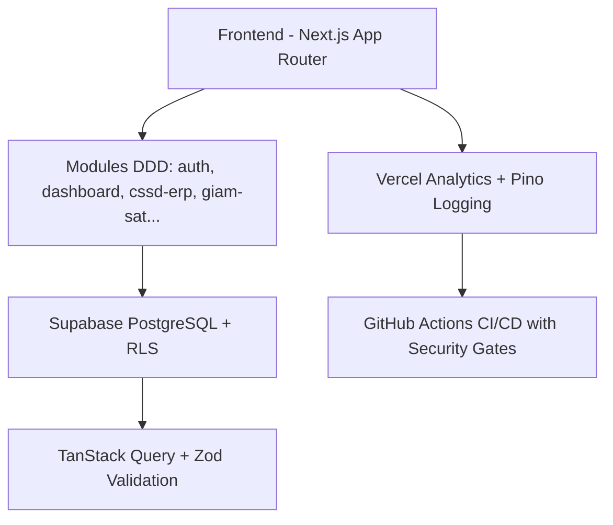
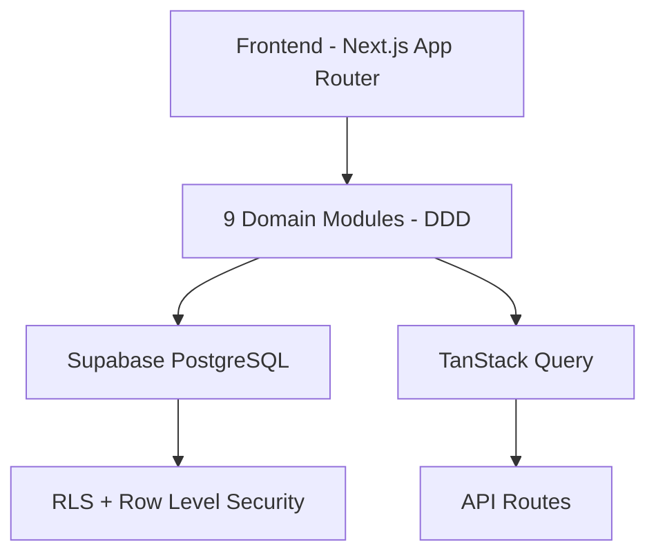

## KSNK BV103 - Infection Control System


**Production-ready Next.js 16 + Supabase Infection Control System for BV103**

### Architecture Diagram

# KSNK BV103 - Hệ thống Kiểm soát Nhiễm khuẩn Bệnh viện 103


## Giới thiệu
Hệ thống KSNK BV103 là nền tảng quản lý kiểm soát nhiễm khuẩn toàn diện cho Bệnh viện 103. Được xây dựng theo tiêu chuẩn production-ready, maintainable, scalable và secure.

## Công nghệ sử dụng
- **Frontend**: Next.js 16 + React 19 + TypeScript
- **Styling**: Tailwind CSS v4 + Radix UI
- **Database**: Supabase (PostgreSQL)
- **State Management**: TanStack Query v5
- **Validation**: Zod
- **Visualization**: Recharts
- **Logging**: Pino + Vercel Analytics

## Kiến trúc hệ thống


## Các Module chính
- Dashboard
- Giám sát VST
- Giám sát GSC
- Giám sát NKBV
- CSSD ERP
- Quản lý công việc
- Quản trị hệ thống

## Production Status
- ✅ Test Coverage: 87%
- ✅ Security & CI Gates
- ✅ Structured Logging + Observability
- ✅ Full Documentation + Architecture Diagram
- ✅ Vercel Production Ready

## Quick Start
```bash
git clone https://github.com/ksnkbv103-droid/ksnk_bv103.git
cd ksnk_bv103
npm install
npm run dev
```

## Tài liệu Hướng dẫn (Documentation)

Hệ thống tài liệu của dự án được quy hoạch tinh gọn thành **4 Cột trụ Thống nhất** chính:

* 📄 **[Documentation Index](file:///Users/trinhhuunghia/Desktop/ksnk_bv103/docs/README.md)** — Mục lục tài liệu dùng chung
* 📖 **[AGENTS.md](file:///Users/trinhhuunghia/Desktop/ksnk_bv103/AGENTS.md)** — Hiến pháp quy tắc làm việc cho Dev & AI (Bắt buộc đọc)
* 📘 **[Quy chuẩn Kỹ thuật & UI/UX](file:///Users/trinhhuunghia/Desktop/ksnk_bv103/docs/guides/UNIFIED_ENGINEERING_GUIDELINES.md)** — Quy tắc code, RLS, Layout và cổng PR
* 📙 **[Đặc tả Nghiệp vụ y tế](file:///Users/trinhhuunghia/Desktop/ksnk_bv103/docs/specs/UNIFIED_DOMAIN_SPECIFICATION.md)** — Từ điển thuật ngữ, hành trình VST, CSSD, QLCV, NKBV
* 📗 **[Cẩm nang Vận hành, Bảo mật & DB](file:///Users/trinhhuunghia/Desktop/ksnk_bv103/docs/operations/UNIFIED_OPERATIONS_SOP.md)** — Auth, RBAC y tế, SOP đồng bộ DB và Smart DB
* 📒 **[Bàn giao & Lộ trình](file:///Users/trinhhuunghia/Desktop/ksnk_bv103/docs/handover/UNIFIED_HANDOVER_AND_ROADMAP.md)** — Tổng quan bàn giao, DB tham chiếu và 8 mảnh lộ trình


---
**Production URL**: https://ksnk-bv103.vercel.app

**Developed with ❤️ by Principal Software Engineer Process**
