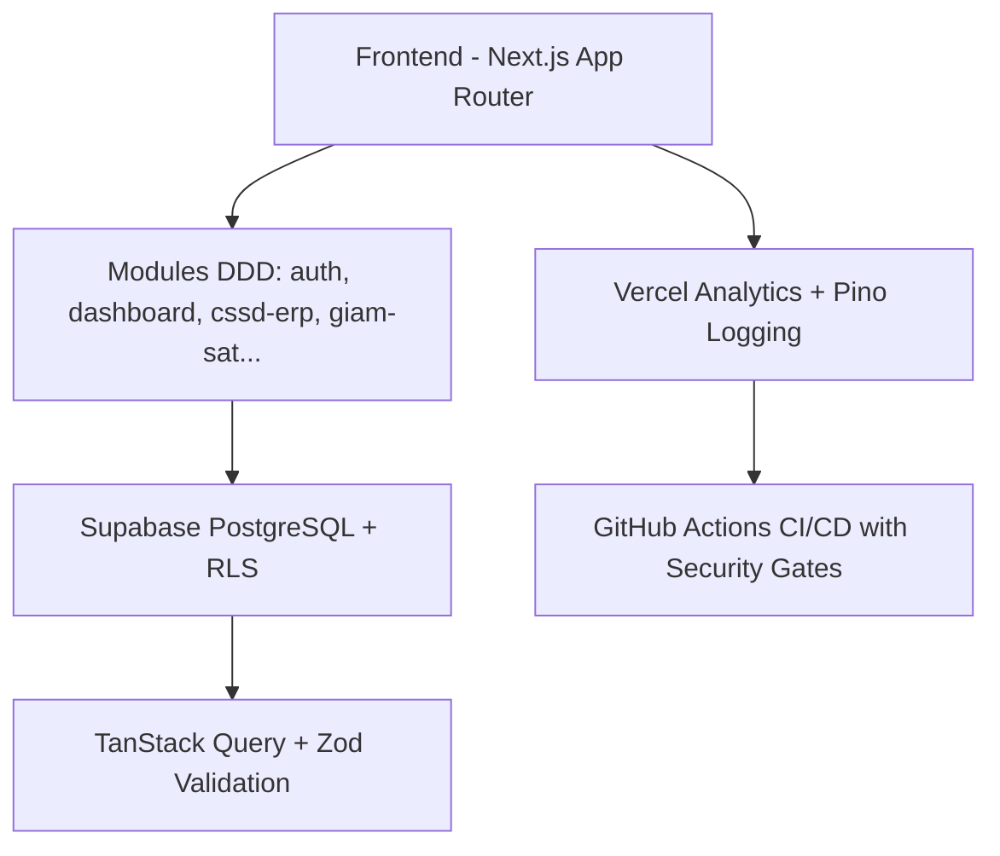

## KSNK BV103 - Infection Control System

**Production-ready Next.js 16 + Supabase Infection Control System for BV103**

### Architecture Diagram

```mermaid
graph TD
    A[Frontend - Next.js App Router] --> B[Modules DDD: auth, dashboard, cssd-erp, giam-sat...]
    B --> C[Supabase PostgreSQL + RLS]
    C --> D[TanStack Query + Zod Validation]
    A --> E[Vercel Analytics + Pino Logging]
    E --> F[GitHub Actions CI/CD with Security Gates]
```