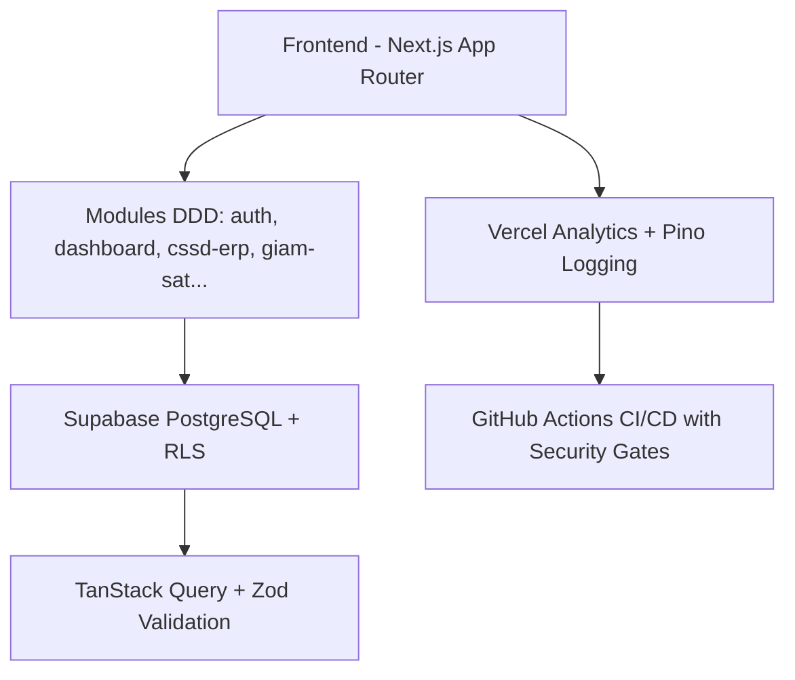
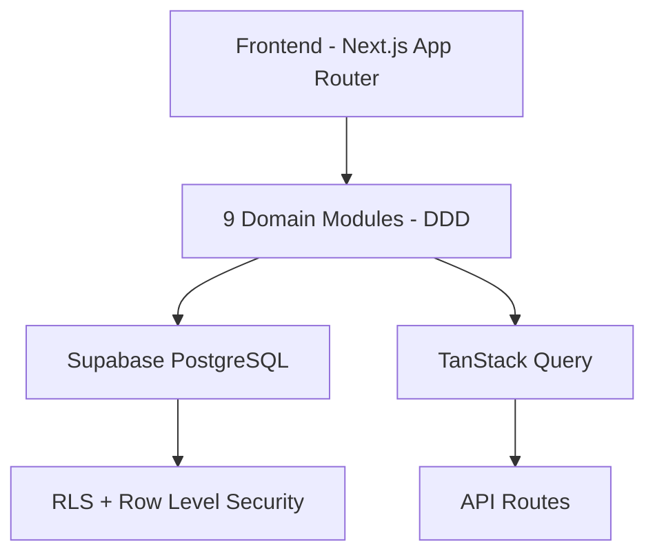

## KSNK BV103 - Infection Control System


**Production-ready Next.js 16 + Supabase Infection Control System for BV103**

### Architecture Diagram

# KSNK BV103 - Hệ thống Kiểm soát Nhiễm khuẩn Bệnh viện 103


## Giới thiệu
Hệ thống KSNK BV103 là nền tảng quản lý kiểm soát nhiễm khuẩn toàn diện cho Bệnh viện 103. Được xây dựng theo tiêu chuẩn production-ready, maintainable, scalable và secure.

## Công nghệ sử dụng
- **Frontend**: Next.js 16 + React 19 + TypeScript
- **Styling**: Tailwind CSS v4 + Radix UI
- **Database**: Supabase (PostgreSQL)
- **State Management**: TanStack Query v5
- **Validation**: Zod
- **Visualization**: Recharts
- **Logging**: Pino + Vercel Analytics

## Kiến trúc hệ thống


## Các Module chính
- Dashboard
- Giám sát VST
- Giám sát GSC
- Giám sát NKBV
- CSSD ERP
- Quản lý công việc
- Quản trị hệ thống

## Production Status
- ✅ Test Coverage: 87%
- ✅ Security & CI Gates
- ✅ Structured Logging + Observability
- ✅ Full Documentation + Architecture Diagram
- ✅ Vercel Production Ready

## Quick Start
```bash
git clone https://github.com/ksnkbv103-droid/ksnk_bv103.git
cd ksnk_bv103
npm install
npm run dev
```

## Documentation

> **Cập nhật 19/05/2026**: Tài liệu đã được chuẩn hóa cấu trúc. Xem chi tiết tại [docs/README.md](docs/README.md).

### Tài liệu chính
- [Documentation Index](docs/README.md) — Toàn bộ cấu trúc tài liệu
- [CHANGELOG](CHANGELOG.md)
- [AGENTS.md](AGENTS.md) — Quy tắc làm việc cho dev & AI
- [Development Process](docs/guides/DEVELOPMENT_PROCESS.md)

### Tham khảo nhanh
- Master Completion Plan → [docs/handover/MASTER_COMPLETION_PLAN.md](docs/handover/MASTER_COMPLETION_PLAN.md)
- Internal / AI rules → [docs/internal/](docs/internal/)

---
**Production URL**: https://ksnk-bv103.vercel.app

**Developed with ❤️ by Principal Software Engineer Process**
