# Domain SSOT — Giám sát nhiễm khuẩn bệnh viện (NKBV / HAI) bán tự động

> **Đã thay:** thuật toán canonical từ 2026-08-27 là [`hai-surveillance-domain-ssot-20260827.md`](hai-surveillance-domain-ssot-20260827.md) (v3.2, HAI lâm sàng người lớn + Phụ lục E). File này giữ **lịch sử v2.0**.

> **Phiên bản:** 2.0 · **Ngày:** 2026-08-04  
> **Chuẩn tham chiếu:** Sổ tay Giám sát An toàn Người bệnh NHSN/CDC 2025  
> **Loại tài liệu:** Đặc tả logic domain độc lập (Single Source of Truth cho thuật toán & thực thể)  
> **Nguồn ưu tiên:** `docs/modules/nkbv/All domain_NKBV` (hợp nhất + khử trùng)  
> **Đối tượng đọc:** Product Owner / Bác sĩ KSNK (IP Doc) / Dev Rule Engine & Schema / Analytics UI

---

## 0. Meta

### 0.1. Phạm vi

Tài liệu này hợp nhất và **khử trùng** toàn bộ nội dung đặc tả logic từ gói nguồn `All domain_NKBV` (~6.100 dòng) — bao gồm các chương đã có ở v1.0 và các chương bổ sung — thành **một** đặc tả domain khoa học, đầy đủ, không trùng lặp cho giám sát nhiễm khuẩn bệnh viện bán tự động.

Bao gồm:

| Nhóm | Nội dung |
|------|----------|
| Shared core | Schema nền, patient/device days, state machine, workflow, thuật toán thời gian Chương 2, Secondary BSI, metrics & form động |
| Outcome HAI | CLABSI/LCBI/MBI · UTI/CAUTI · VAE (adult) · **PedVAE** · PNEU/PedVAP/Non-VAP · SSI · **IAB/BONE/PJI** · **ENDO** |
| LabID / MDRO | MRSA, VRE, CephR-Klebsiella, CRE, CDI LabID + Infection Surveillance + Process Measures |
| Process / stewardship | CLIP · **AU Option** (DOT, Days Present, SAAR, AU-CAD) |
| Location / Analytics UI | **CDC Location Mapping** · **Surveillance Dashboard SIR/SUR** |

### 0.2. Quan hệ với tài liệu cũ (độc lập)

| Tài liệu | Vai trò | Quan hệ với SSOT này |
|----------|---------|----------------------|
| `domain-specification.md` | Spec app/pilot BV103 hiện tại | **Không thay thế** |
| `clinical-forms.md` | Thiết kế UI form lâm sàng BV103 | Độc lập |
| `pilot-clinical-checklist-*` / ADR / product-strategy | UAT & quyết định sản phẩm | Độc lập |
| `All domain_NKBV` | Nguồn thô đầy đủ (ưu tiên v2.0) | Giữ nguyên; SSOT là bản hợp nhất |
| 8 file `Domain *` (không extension) | Archive lịch sử v1.0 | Tham chiếu phụ |

### 0.3. Nguyên tắc biên soạn

1. Mỗi khái niệm chỉ định nghĩa **một lần** (canonical) tại Shared; hội chứng chỉ giữ **delta**.
2. Tách rõ các nghĩa khác nhau của cửa sổ thời gian (xem §0.4) — **không** copy IWP 7 ngày vào PedVAE / ENDO / SSI / LabID / AU.
3. VAE adult → §8; PedVAE → §9; PedVAP/Non-VAP lâm sàng → §10.
4. CLIP (§15) = giám sát **quy trình đặt**; AU (§16) = giám sát **dùng kháng sinh**; Location (§17) = ánh xạ CDC trước khi báo cáo.
5. Không cải tiến thuật toán CDC ngoài nguồn; nếu nguồn mâu thuẫn nội bộ → ghi `[PO cần xác nhận]`.

### 0.4. Từ điển thời gian (tránh nhầm)

| Nhãn trong SSOT | Nghĩa | Áp dụng |
|-----------------|-------|---------|
| **IWP lâm sàng (±3 / 7 ngày)** | Index Date ± 3 | CLABSI, UTI, PNEU, IAB/BONE/PJI (trừ ENDO) |
| **ENDO Extended IWP (21 ngày)** | Index Date ± 10 | **Chỉ ENDO** (§13) |
| **RIT lâm sàng (14 ngày)** | Repeat Infection Timeframe từ DOE | CLABSI, UTI, PNEU, IAB/BONE/PJI |
| **ENDO RIT = hết admission** | Không tạo ca ENDO mới trong cùng đợt nằm viện | **Chỉ ENDO** |
| **ENDO SBAP = hết admission** | Secondary BSI chỉ khi match loài/chi chặt | **Chỉ ENDO** |
| **SSI Surveillance Period 30/90** | Cửa sổ sau mổ theo OPS code | SSI (§11) |
| **SBAP lâm sàng (IWP ∪ RIT)** | `[Index − 3, DOE + 13]` — **14–17 ngày** (tùy DOE so với Index) | UTI, PNEU, CLABSI nhận Secondary từ các site đó |
| **SSI SBAP cố định 17 ngày** | `[DOE−3, DOE+13]` — **không** dùng Index | SSI Secondary BSI |
| **Lab isolate invasive 14-day** | De-dup mẫu cấy xâm lấn trước lưu DB | Lab Isolate HAI |
| **LabID location 14-day** | De-dup LabID theo từng khoa | MDRO/CDI LabID |
| **VAE / PedVAE 14-day Event Period** | Khóa gộp biến cố từ DOE | VAE §8, PedVAE §9 |
| **CDI Incident >56 / Recurrent 15–56 / Dup ≤14** | Chu kỳ CDI LabID | CDI |
| **AU Days Present** | Ngày có mặt tại location / FacWideIN | AU (§16) — **không** = Patient Days thuần |
| **PedVAE Event Period** | 14 ngày từ DOE PedVAE | PedVAE (§9) |

### 0.5. Mục lục

1. [Shared — Schema nền](#1-shared--schema-nền)
2. [Shared — State machine & workflow](#2-shared--state-machine--workflow-bán-tự-động)
3. [Shared — Thuật toán thời gian Chương 2](#3-shared--thuật-toán-thời-gian-chương-2)
4. [Shared — Secondary BSI Attribution](#4-shared--secondary-bsi-attribution)
5. [Shared — Metrics & phiếu điều tra động](#5-shared--metrics--phiếu-điều-tra-động)
6. [CLABSI / LCBI / MBI-LCBI](#6-clabsi--lcbi--mbi-lcbi-chương-4)
7. [UTI / CAUTI](#7-uti--cauti-chương-7)
8. [VAE adult](#8-vae-vac--ivac--pvap-chương-10)
9. [PedVAE](#9-pedvae-chương-11)
10. [PNEU / PedVAP / Non-VAP](#10-pneu--pedvap--non-vap-chương-6)
11. [SSI](#11-ssi-chương-9)
12. [Specific Sites — IAB / BONE / PJI](#12-specific-sites-chương-17--iab-bone-pji)
13. [ENDO](#13-endo-chương-17--viêm-nội-tâm-mạc)
14. [LabID / MDRO / CDI](#14-labid--mdro--cdi-chương-12)
15. [CLIP](#15-clip--tuân-thủ-đặt-cvc-chương-5)
16. [AU Option](#16-au-option-chương-14--sử-dụng-kháng-sinh)
17. [CDC Location Mapping](#17-cdc-location-mapping-chương-15)
18. [Surveillance Dashboard SIR/SUR](#18-surveillance-dashboard-sirsur-ui)
- [Appendix A — Catalog JSON](#appendix-a--catalog-json-entity-đã-khử-trùng)
- [Appendix B — Ma trận chọn thuật toán](#appendix-b--ma-trận-chọn-thuật-toán-theo-loại-sự-kiện)
- [Appendix C — Crosswalk All domain_NKBV](#appendix-c--crosswalk-all-domain_nkbv--section-ssot)

---

## 1. Shared — Schema nền

> Schema skeleton dùng chung. Hội chứng mở rộng field tại §6–§18; **không** copy lại Admission/Device/Lab đầy đủ ở mỗi chương.

### 1.1. Patient & Admission

Ghi nhận từ ADT (nhập thủ công hoặc import Excel danh sách bệnh nhân vào khoa hàng ngày).

```json
{
  "PatientID": "string (Primary Key)",
  "AdmissionID": "string (Primary Key)",
  "FullName": "string",
  "BirthDate": "date [YYYY-MM-DD]",
  "Sex": "enum [M, F]",
  "AdmissionDate": "date [YYYY-MM-DD] (Hospital Day 1)",
  "DischargeDate": "date [YYYY-MM-DD] or null",
  "CurrentLocation": "string (CDC Location Code)",
  "IsObservationPatient": "boolean",
  "IsAdmittedToInpatient": "boolean",
  "LastInpatientDischargeDate": "date [YYYY-MM-DD] or null"
}
```

*Lưu ý dịch tễ:* Ngày nhập viện = **Hospital Day 1 (HD 1)**. Toàn bộ ngày nằm viện của Observation Patient tại khoa nội trú phải vào mẫu số. Với LabID, `LastInpatientDischargeDate` phục vụ CO-HCFA (xem §14).

### 1.2. Device Registry (skeleton)

Theo dõi dọc can thiệp xâm lấn. Ngày đặt = **Device Day 1**.

```json
{
  "DeviceRegistryID": "string (Primary Key)",
  "AdmissionID": "string (Foreign Key)",
  "DeviceType": "enum [CENTRAL_LINE, FOLEY, VENTILATOR]",
  "InsertionDate": "date [YYYY-MM-DD] (Device Day 1)",
  "RemovalDate": "date [YYYY-MM-DD] or null",
  "InsertionLocation": "string (CDC Location Code)",
  "CLIP_EventID": "string or null (FK → §15 CLIP; không nhúng checklist tại đây)"
}
```

Mở rộng theo loại dụng cụ:

| DeviceType | Schema mở rộng | Chương |
|------------|----------------|--------|
| CENTRAL_LINE | LineType TEMPORARY/PERMANENT/UMBILICAL; FirstAccessDateTime; IsAccessedInpatient | §6, §15 |
| FOLEY (IUC) | Chỉ Foley lưu; không condom/straight/nephrostomy đơn thuần | §7 |
| VENTILATOR | Intubation/Extubation; HFV/ECMO/APRV flags | §8, §9, §10 |

### 1.3. Trigger Event

```json
{
  "TriggerID": "string (Primary Key)",
  "AdmissionID": "string (Foreign Key)",
  "TriggerType": "enum [VI_SINH, KHANG_SINH_MOI, DU_ONG_THONG, X_QUANG_PHOI, LAM_SANG, VAE_WORSENING]",
  "TriggerDate": "date [YYYY-MM-DD] (Index Date)",
  "Metadata": {
    "AntibioticName": "string or null",
    "PEEP_Worsening": "boolean or null",
    "FiO2_Worsening": "boolean or null",
    "PusAtSite": "boolean or null"
  }
}
```

### 1.4. Lab Isolate Record (HAI clinical)

Dữ liệu Excel/CSV từ LIS hàng ngày. Áp dụng de-duplication cùng ngày và **Lab isolate invasive 14-day** trước khi lưu.

```json
{
  "IsolateID": "string (Primary Key)",
  "PatientID": "string (Foreign Key)",
  "AdmissionID": "string (Foreign Key)",
  "SpecimenCollectionDate": "date [YYYY-MM-DD]",
  "SpecimenSource": "enum [BLOOD, CSF, URINE, LRT, SKIN_SOFT_TISSUE, WOUND, MUSCULOSKELETAL, STOOL, OTHER]",
  "OrganismCode": "string (SNOMED-CT mapped to CDC Pathogen List)",
  "SusceptibilityResults": [
    {
      "Antimicrobial": "string (LOINC Code)",
      "TestType": "enum [MIC, ETEST, KIRBY_BAUER]",
      "Sign": "enum [<, <=, =, >=, >]",
      "Value": "float",
      "Interpretation": "enum [S, S-DD, I, R, NS, NT]"
    }
  ]
}
```

LabID MRSA/CDI dùng biến thể isolate riêng (§14.1) — **CẤM** nạp AST/ASC (Active Surveillance Testing).

### 1.5. Daily Longitudinal Flowsheet (common + extension points)

Mỗi ngày lịch = một bản ghi. Trường chung:

```json
{
  "FlowsheetID": "string (Primary Key)",
  "AdmissionID": "string (Foreign Key)",
  "CalendarDate": "date [YYYY-MM-DD]",
  "HospitalDay": "integer (AdmissionDate = Day 1)",
  "DailyMaxTempC": "float or null",
  "DailyMinTempC": "float or null"
}
```

Extension theo hội chứng (không trùng định nghĩa ở đây):

| Nhóm field | Dùng cho |
|------------|----------|
| Chills, Hypotension, Apnea, Bradycardia, ANC/WBC, GI-GVHD, diarrhea volume | CLABSI / MBI (§6) |
| SuprapubicTenderness, CVA_Pain, Urgency/Frequency/Dysuria, Lethargy, Vomiting | UTI (§7) |
| DailyMinPEEP, DailyMinFiO2, VentilatorDay, AntimicrobialsAdministered | VAE (§8) |
| DailyMinMAP, DailyMinFiO2 (ped) | PedVAE (§9) |
| Abdominal / bone / synovial markers | IAB/BONE/PJI (§12); ENDO imaging (§13) |
| Purulent sputum, dyspnea, imaging correlation, immunocompromised flags | PNEU (§10) |

### 1.6. Monthly Reporting Plan & Location attribution

- Bệnh nhân / sự kiện chỉ vào tử số / mẫu số khi **Location** thuộc Monthly Reporting Plan (in-plan). Off-plan được lưu theo dõi nội bộ nhưng không đẩy SIR chính thức.
- **Location of Attribution** = CDC Location Code tại thời điểm sự kiện (hoặc theo Transfer Rule của hội chứng).

### 1.7. Quy tắc đếm Patient Days & Device Days (denominator)

> Nguồn: Dashboard / Reporting rules trong `All domain_NKBV`. Dùng chung mọi hội chứng device-associated và FacWide.

**Patient / Inpatient day counts**

- Mỗi bệnh nhân **hiện diện vật lý** tại giường khoa nội trú tại thời điểm chốt số liệu hàng ngày (ví dụ 23:59) được đếm **1 patient-day** tại location đó.
- Observation patient nằm tại khoa nội trú **vẫn vào mẫu số** của khoa đó.
- Một bệnh nhân chuyển khoa trong ngày có thể đóng góp patient-day ở **nhiều location** (theo thực tế hiện diện).

**Device day counts**

| Thiết bị | Ngày bắt đầu đếm (Day 1) | Ghi chú |
|----------|--------------------------|---------|
| Foley / Ventilator (CAUTI, VAE/PedVAE, VAP) | Ngày **đặt / đặt ống** đầu tiên | Đếm mỗi calendar day thiết bị còn tại chỗ |
| Central Line (CLABSI) | Ngày **đầu tiên được tiếp cận (Accessed)** tại nội trú | Các ngày sau **không** phụ thuộc trạng thái accessed |

Không nhầm với **AU Days Present** (§16) — đó là mẫu số kháng sinh, không phải patient-day thuần.


---

## 2. Shared — State machine & workflow bán tự động

### 2.1. State machine (States 0–5)

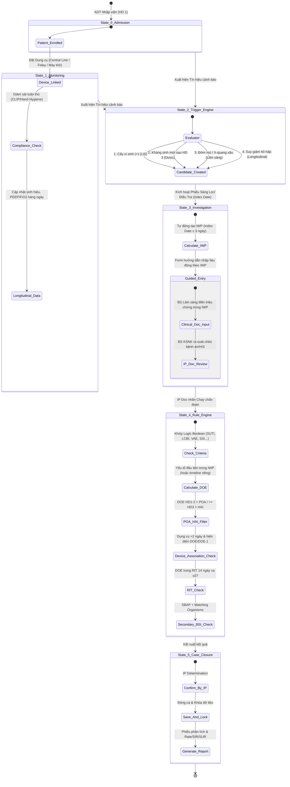

> **Lưu ý:** Nhánh Rule Engine ở State 4 mô tả chuỗi **mặc định Chương 2**. VAE / SSI / LabID thay thế một số bước theo ma trận §3.6 và Appendix B.

### 2.2. Bước 1 — ADT & Device Insertion Registry

1. **ADT Enrollment:** Import/nhập danh sách BN vào khoa; gán ngày vào khoa; hiển thị danh sách BN tại khoa.
2. **Device Insertion Registry:** Tại giường, ĐD chọn BN → “Đăng ký đặt dụng cụ” (loại + ngày đặt = Device Day 1). Với CENTRAL_LINE: mở form CLIP (§15).
3. **Longitudinal Daily Form:** UI chính = danh sách BN “Đang lưu dụng cụ”. Tick nhanh sốt >38°C, đờm mủ, đau hạ vị…; với vent: bắt buộc **PEEP tối thiểu** và **FiO2 tối thiểu**/ngày → Flowsheet baseline VAE.

### 2.3. Bước 2 — LIS Excel Ingestion & Lab Sieve

1. IP Doc import Excel cấy dương tính từ LIS mỗi sáng.
2. **Scenario A:** BN đã có trong Device Registry → map isolate vào hồ sơ theo dõi dọc.
3. **Scenario B:** BN chưa có registry → tạo Admission mới; đánh giá Non-associated HAI hoặc SSI.

### 2.4. Bước 3 — Dynamic Trigger & Candidate Event

Kích hoạt Candidate → Worklist IP khi:

- Cấy dương tính tác nhân thuộc danh mục CDC.
- VAE: tăng PEEP ≥ 3 cmH₂O hoặc FiO2 ≥ 0.20 liên tục ≥ 2 ngày (§8).
- Lâm sàng: “Vết mổ chảy mủ” trên form hàng ngày.
- Kháng sinh mới thuộc danh mục NHSN sau HD 3.

### 2.5. Bước 4 — IWP & Collaborative Form

1. Index Date = ngày Trigger → **IWP = Index ± 3 ngày** (7 ngày cố định) — chỉ hội chứng dùng Chương 2.
2. Form động: **CHỈ** hiện trường cần cho tiêu chuẩn; triệu chứng dương tính **BẮT BUỘC** có ngày trong IWP.
3. **RBAC:** BS lâm sàng điền triệu chứng giường; IP Doc Verify / chạy Rule Engine.

### 2.6. Bước 5–6 — Rule Engine → Approve & Lock → Báo cáo

Chuỗi engine mặc định: Criteria → DOE → POA/HAI → Device-association → RIT → Secondary BSI (§4).

IP xem audit trail (IWP/RIT/SBAP) → **Approve & Lock** → kích hoạt RIT 14 ngày tương lai từ DOE → đẩy Numerator; tổng hợp Denominator từ Device Registry → Rate / SIR / SUR.

---

## 3. Shared — Thuật toán thời gian Chương 2

> Áp dụng cho hội chứng lâm sàng dùng IWP: **CLABSI, UTI/CAUTI, PNEU**.  
> **Không áp dụng** cho SSI, LabID, VAE (xem §3.6).

### 3.1. Index Date & IWP

$$\text{IWP} = [\text{Index Date} - 3,\ \text{Index Date} + 3]$$

Index Date thường = ngày mẫu chẩn đoán dương tính đầu tiên dùng để thỏa tiêu chuẩn (chi tiết DOE theo hội chứng ở §6–§13).

### 3.2. Date of Event (DOE)

DOE = ngày sớm nhất xuất hiện **bất kỳ yếu tố đầu tiên** cấu thành tiêu chuẩn trong IWP. Không nhất thiết = Index Date (trừ một số nhánh như LCBI 1 — xem §6.3).

### 3.3. POA vs HAI

| Nhãn | Điều kiện |
|------|-----------|
| **POA** | DOE trên HD 1 hoặc HD 2 |
| **HAI** | DOE từ HD 3 trở đi |

Tương đương: \(\text{DOE} - \text{AdmissionDate} \le 1\) → POA; \(\ge 2\) → HAI (AdmissionDate = HD 1).

### 3.4. Repeat Infection Timeframe (RIT)

- RIT **14 ngày** kể từ DOE (DOE = Ngày 1 của RIT).
- Không báo cáo ca mới **cùng major type** trong RIT; tác nhân mới trong RIT được **add** vào ca gốc.
- PNEU: RIT theo **Major Type PNEU** (PNU1/2/3 cùng nhóm).

### 3.4a. Secondary BSI Attribution Period (SBAP lâm sàng)

Với hội chứng dùng IWP Chương 2 (UTI, PNEU, và site nguồn Secondary cho CLABSI):

$$\text{SBAP} = [\text{Index Date} - 3,\ \text{DOE} + 13]$$

Tương đương IWP ∪ RIT. Độ dài **14–17 ngày lịch** khi DOE ∈ [Index−3, Index] (DOE = Index → 17 ngày; DOE = Index−3 → 14 ngày).  
**Sai:** neo cố định `[DOE−3, DOE+13]` cho UTI/PNEU.  
**SSI:** giữ SBAP riêng `[DOE−3, DOE+13]` = 17 ngày cố định (§0.4, §11) — không dùng Index.

### 3.5. Device-association

Dụng cụ đủ điều kiện liên quan khi **đồng thời**:

1. Đặt / truy cập liên tục **> 2 ngày lịch** tính đến DOE (Day 1 = ngày đặt/truy cập đầu; đủ điều kiện từ Day 3).
2. Hiện diện vào **DOE** hoặc rút vào **DOE − 1**.

Áp dụng CL (CLABSI), IUC (CAUTI), Vent (VAP theo PNEU). VAE dùng ngưỡng ≥ 4 vent days + sliding window riêng (§8).

### 3.6. Ma trận NON-APPLICABILITY

| Khái niệm Chương 2 | CLABSI | UTI | PNEU | VAE | PedVAE | SSI | IAB/BONE/PJI | ENDO | LabID | AU | CLIP |
|--------------------|:------:|:---:|:----:|:---:|:------:|:---:|:------------:|:----:|:-----:|:--:|:----:|
| IWP (±3) | Có | Có | Có | **Không** | **Không** | **Không** | Có (Organ/Space) | **Không** — IWP 21d | **Không** | **Không** | **Không** |
| DOE lâm sàng (trong IWP) | Có | Có | Có | DOE=D3 worsen | DOE=D3 MAP/FiO2 | DOE trong SP | Có | DOE trong Ext IWP | Onset specimen | N/A | Insertion date |
| POA HD1–2 / HAI ≥HD3 | Có | Có | Có | VAC HD≥3 | Theo vent window | **Không** | Có nếu dùng Ch.2 | Có nếu dùng Ch.2 | CO/HO/CO-HCFA | N/A | N/A |
| RIT 14 lâm sàng | Có | Có | Có | **Không** — Event Period | **Không** — Event Period | **Không** | Có | **Không** — hết admission | Loc 14d / CDI 56d | N/A | N/A |
| Device >2d + DOE/DOE−1 | CL | IUC | vent→VAP | ≥4 vent + baseline | ≥4 vent + MAP/FiO2 | N/A | N/A | N/A | N/A | N/A | N/A |
| SBAP (clinical Index−3…DOE+13 / SSI 17d) | Nhận | Nguồn | Nguồn | Chỉ PVAP | **CẤM** Secondary BSI | SBAP 17d cố định DOE | Có (vd IAB 3b) | SBAP = hết admission | **Không** | **Không** | **Không** |

---

## 4. Shared — Secondary BSI Attribution

> Canonical engine. Hội chứng chỉ bổ sung **delta** (SSI 17 ngày; VAE chỉ PVAP; PedVAE cấm SBSI; ENDO SBAP = admission; UTI cấm yeast).

### 4.1. Luồng Cross-check Engine

```
[BỆNH NHÂN CÓ CẤY MÁU DƯƠNG TÍNH (BSI)]
                   │
                   ▼
1. TÌM TẤT CẢ CA NHIỄM KHUẨN NGUYÊN PHÁT ĐANG HOẠT ĐỘNG
   (UTI, PNEU, SSI, IAB, SKIN, ST, PVAP...)
                   │
                   ▼
2. VẼ SBAP CHO TỪNG CA NGUYÊN PHÁT
   (Clinical: [Index−3, DOE+13] = 14–17 ngày; SSI: [DOE−3, DOE+13] = 17 ngày cố định — không Index)
                   │
                   ▼
3. Ngày lấy mẫu máu ∈ SBAP?
   ├── NO  → Primary BSI / đánh giá CLABSI độc lập
   └── YES → Bước 4
                   │
                   ▼
4. MATCHING ORGANISM?
   ├── YES → Secondary BSI = YES (gắn ca gốc; không báo cáo CLABSI trùng)
   └── NO  → Scenario 2: máu là yếu tố cấu thành tiêu chí nguyên phát?
              ├── YES → Secondary BSI
              └── NO  → Primary BSI / CLABSI độc lập
```

### 4.2. Matching Organism Rules

1. **Khớp loài:** Cả hai định danh đến loài → phải giống hệt (*E. coli* / *E. coli* = MATCH; *E. aerogenes* / *E. cloacae* = NO MATCH).
2. **Khớp chi:** Một bên chỉ tới genus → khớp ở chi (*Pseudomonas species* / *P. aeruginosa* = MATCH).
3. **Yeast NOS:** “yeast” / “yeast NOS” từ vết mổ/mô khớp mọi loài nấm men cụ thể trong máu (*C. albicans*).

### 4.3. Exclusion sinh học (canonical)

| Quy tắc | Hành vi bắt buộc |
|---------|------------------|
| *Candida*, *Enterococcus*, CoNS từ máu sau **PNEU/PVAP** | **CẤM** Secondary BSI trừ khi phân lập từ **mô phổi** hoặc **dịch màng phổi** (≤24h đầu đặt ống ngực) → nếu không: đánh giá CLABSI/Primary |
| Yeast/*Candida* sau **UTI** | Yeast **không** thuộc định nghĩa UTI → máu yeast trong SBAP của UTI **CẤM** Secondary → Primary BSI/CLABSI |
| UTI luôn là site nguyên phát | UTI không bao giờ là Secondary sau site khác |

### 4.4. Scenario 2

Khi máu là **yếu tố cấu thành** tiêu chuẩn site nguyên phát (vd. IAB 3b, một số Organ/Space SSI Chương 17, PNU2 cần cấy máu) → quy kết Secondary BSI kể cả khi dịch tại chỗ khác loài hoặc không cấy được.

### 4.5. Delta theo hội chứng (pointer)

| Hội chứng | Delta Secondary BSI |
|-----------|---------------------|
| CAUTI/UTI | §7.6 — yeast ban |
| VAE | §8.5 — chỉ PVAP; máu trong 14-day Event Period |
| PedVAE | §9.6 — **CẤM tuyệt đối** Secondary BSI |
| PNEU | §10.5 — SBAP IWP+RIT; Candida/CoNS/Enterococcus ban |
| SSI | §11.5 — SBAP cố định 17 ngày; Scenario 2 Organ/Space |
| IAB / BONE / PJI | §12 — IAB 3b = Scenario 2 điển hình; hierarchy Deepest site |
| ENDO | §13.4 — SBAP = hết admission; **chỉ** Matching Organism chặt (không Scenario 2 lỏng) |
| CLABSI | Secondary gate **trước** khi dán nhãn CLABSI (§6) |
| LabID | **Không** dùng Secondary BSI lâm sàng (§14) |

### 4.6. Exclusion bổ sung từ nguồn v2

| Quy tắc | Hành vi |
|---------|---------|
| PedVAE | Không bao giờ là site nguyên phát để quy kết Secondary BSI |
| ENDO | Máu chỉ Secondary khi **match** chi/loài với tác nhân ENDO đã chốt; SBAP dài → cấm suy luận Scenario 2 “máu là yếu tố cấu thành” kiểu lỏng |
| IAB 3b | Triệu chứng + hình ảnh + cấy máu MBI → Scenario 2 (máu cấu thành tiêu chuẩn) |

---

## 5. Shared — Metrics & phiếu điều tra động

### 5.1. Denominator & chỉ số

| Chỉ số | Tử số | Mẫu số |
|--------|-------|--------|
| Rate / 1000 device-days | Ca HAI liên quan dụng cụ đã lock | Device-days từ Device Registry (+ observation patient-days khi áp dụng) |
| SIR | Observed infections | Expected từ baseline CDC (§18) |
| SUR | Observed device days | Predicted device days (§18) |
| SAAR / AU-CAD | Observed antimicrobial days | Predicted × target (§16) |
| Days Present (AU) | — | eMAR denominator (§16) — ≠ FacWide sum locations |
| SUR | Device utilization | Patient-days / expected utilization |
| CLIP Adherence % | Bundle-Compliant attempts | All reported insertion attempts (§12) |

### 5.2. Envelope phiếu chốt ca (output)

Mọi phiếu HAI (sau Approve & Lock) tối thiểu gồm:

- Mã ca · Hành chính (BN, HD 1, Location)
- Index Date · IWP (nếu có) · DOE · POA/HAI (nếu có)
- Triệu chứng / lab trong cửa sổ
- Device-association (nếu có)
- Secondary BSI (nếu có)
- CLIP adherence (nếu CLABSI + có CLIP event)

Ví dụ đầy đủ: CAUTI/CLABSI (§7 / §6 mock); PedVAP/PNU3 (§10.6); LabID (§14); CLIP (§15.5).

### 5.3. Nguyên tắc Dynamic Form UI

1. Trigger quyết định mẫu phiếu (BSI / UTI / VAE…).
2. Chỉ render trường cần cho tiêu chuẩn đang xét.
3. Triệu chứng dương tính phải gắn **ngày ∈ IWP** (hoặc VAE Window / Surveillance Period tương ứng).
4. Prefill device days / active-on-DOE từ Device Registry — không bắt user nhập lại nếu đã có registry.
5. Cấm field mâu thuẫn (vd. urgency/frequency/dysuria khi Foley tại chỗ — §7).

#### Mẫu phiếu 1 — BSI / CLABSI / MBI-LCBI (tóm tắt UI)

| Nhóm | Trường | Ràng buộc |
|------|--------|-----------|
| Hành chính | Admission Date; Location CDC | POA/HAI; attribution |
| Dụng cụ | Có CL? CL >2 ngày? Hiện diện DOE/DOE−1? | Prefill registry |
| Lâm sàng | Sốt >38; Chills; Hypotension | Trong IWP; cần cho LCBI 2 |
| ≤1 tuổi | Hạ thân nhiệt / Apnea / Bradycardia | LCBI 3 |
| Vi sinh | Organism; Is MBI? | Auto từ pathogen list |
| MBI | HSCT/GVHD; ANC/WBC <500 ≥2 ngày trong IWP | MBI-LCBI |

#### Mẫu phiếu 2 — UTI / CAUTI (tóm tắt UI)

| Nhóm | Trường | Ràng buộc |
|------|--------|-----------|
| Dụng cụ | Foley? >2 ngày? Hiện diện DOE/DOE−1? | Prefill |
| Lâm sàng | Sốt; đau trên xương mu; CVA pain | IWP |
| Không Foley | Urgency / Frequency / Dysuria | **CẤM** nếu Foley tại chỗ |
| ≤1 tuổi | Sốt/Hạ thân nhiệt/Apnea/Bradycardia/Lethargy/Vomiting | SUTI 2 |
| Vi sinh | Số loài; CFU/ml | ≤2 loài; ≥10⁵ bacterial; cấm mixed flora ≥3 |

#### Mẫu phiếu 3 — VAE / PVAP (tóm tắt UI)

| Nhóm | Trường | Ràng buộc |
|------|--------|-----------|
| Oxy hóa | Worsening Day; PEEP≥3 hoặc FiO2≥0.20 × ≥2 ngày | DOE VAE; VAC |
| Nhiễm trùng | Sốt/Hạ thân nhiệt OR WBC bất thường | Trong VAE Window |
| Kháng sinh | New ABX; ≥4 QAD | IVAC |
| Vi sinh | Gram đờm mủ; CFU ETA/BAL/PSB | PVAP Criteria 1–3 |

### 5.4. Chiến lược sản phẩm (nudge vận hành)

1. **Chủ động (JCI):** theo dõi dọc dụng cụ + CLIP từ lúc đặt.
2. **Tránh quá tải:** lâm sàng nhập có mục tiêu khi có Trigger, giới hạn cửa sổ thời gian.
3. **Cộng tác:** lâm sàng điền giường; IP duyệt và vận hành engine CDC.

---

## 6. CLABSI / LCBI / MBI-LCBI (Chương 4)

> Dùng thuật toán thời gian §3. Secondary BSI gate (§4) **trước** khi dán nhãn CLABSI.

### 6.1. Schema mở rộng

**Central Line Registry**

```json
{
  "CentralLineRegistryID": "string",
  "AdmissionID": "string",
  "LineType": "enum [TEMPORARY, PERMANENT, UMBILICAL]",
  "FirstAccessDateTime": "datetime",
  "RemovalDateTime": "datetime or null",
  "LocationCode": "string",
  "IsAccessedInpatient": "boolean"
}
```

- `TEMPORARY`: không đường hầm, không cấy ghép.
- `PERMANENT`: tunneled / implanted ports.
- `UMBILICAL`: catheter ĐM/TM rốn (luôn là CL).

**Blood Culture Record**

```json
{
  "BloodCultureID": "string",
  "AdmissionID": "string",
  "CollectionDateTime": "datetime",
  "SpecimenNumber": "string",
  "IsNCT": "boolean",
  "OrganismCode": "string",
  "OrganismName": "string",
  "IsCommonCommensal": "boolean"
}
```

**Flowsheet MBI/LCBI:** DailyMax/MinTempC, HasChills, HasHypotension, HasApnea, HasBradycardia, DailyMinANC, DailyMinWBC, HasGIGVHD, DailyDiarrheaVolume.

### 6.2. Gatekeepers

1. Location thuộc Monthly Reporting Plan.
2. **Eligible CL:** đặt & truy cập liên tục **> 2 ngày lịch** đến DOE (CL Day 1 = first inpatient access; đủ điều kiện từ CL Day 3).
3. CL hiện diện DOE **hoặc** rút DOE−1.

### 6.3. Nuances DOE / NCT

| Tiêu chuẩn | DOE |
|------------|-----|
| LCBI 1 (pathogen) | = ngày cấy máu dương tính đầu tiên trong IWP |
| LCBI 2 / 3 (commensal) | Ngày đầu tiên của triệu chứng **hoặc** cấy máu (+) trong IWP |

**NCT:** Nếu có cấy máu trong [NCT−2d, NCT+1d] → bỏ NCT, dùng culture. Nếu không có culture trong cửa sổ → NCT (+) chấp nhận như culture.

### 6.4. Logic trees — LCBI

#### LCBI 1 (mọi tuổi)
IF pathogen từ ≥1 máu **không** thuộc Common Commensal list  
AND không phải Secondary BSI  
THEN LCBI 1 → xét MBI-LCBI 1.

#### LCBI 2 (mọi tuổi — commensal)
IF trong IWP: sốt >38°C OR chills OR hypotension  
AND cùng loài commensal từ ≥2 máu riêng biệt cùng ngày hoặc 2 ngày lịch liên tiếp  
AND không Secondary BSI  
THEN LCBI 2 → xét MBI-LCBI 2.

#### LCBI 3 (≤1 tuổi)
IF trong IWP: sốt >38 OR hạ thân nhiệt <36 OR apnea OR bradycardia  
AND cùng commensal ≥2 máu riêng biệt (như LCBI 2)  
AND không Secondary BSI  
THEN LCBI 3 → xét MBI-LCBI 3.

### 6.5. Logic trees — MBI-LCBI

*Điều kiện tiên quyết: đã đạt LCBI tương ứng.*

#### MBI-LCBI 1
IF LCBI 1  
AND máu **chỉ** MBI organisms (vd. *Candida*, Enterobacteriaceae, *Saccharomyces*)  
AND (HSCT **hoặc** Neutropenia):

- **HSCT:** allogeneic HSCT trong 1 năm + trong đợt nằm viện: GI GVHD III/IV **OR** tiêu chảy ≥1 L/24h (≥20 mL/kg/24h nếu <18 tuổi) khởi phát trong 7 ngày trước ngày máu (+).
- **Neutropenia:** ≥2 ngày lịch riêng ANC hoặc WBC <500 cells/mm³ trong cửa sổ ngày cấy ±3 ngày.  
  \(\text{ANC} = \text{WBC} \times (\%Seg + \%Bands) / 100\)

#### MBI-LCBI 2 / 3
IF LCBI 2 (hoặc LCBI 3 nếu <1 tuổi)  
AND máu **chỉ** Viridans Group Streptococcus và/hoặc *Rothia* spp.  
AND HSCT hoặc Neutropenia như trên  
THEN MBI-LCBI 2 hoặc 3.

### 6.6. Device label sau LCBI

IF LCBI/MBI đạt AND Eligible CL (§6.2) → **CLABSI** / **MBI-CLABSI**.  
ELSE → **Primary BSI** (không device-associated).

### 6.7. Flowchart

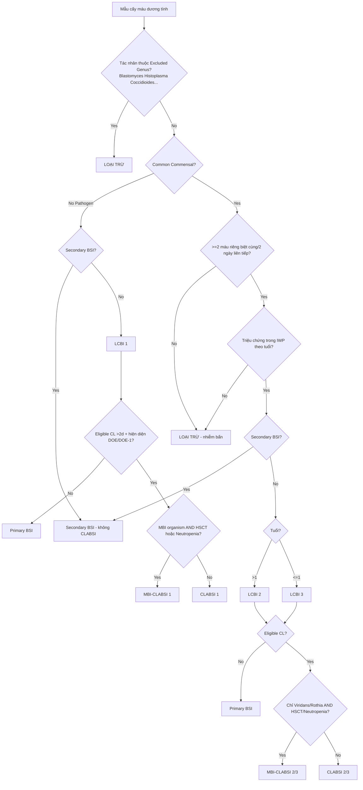

### 6.8. Exclusions & SIR carve-outs

**Mark Yes — vẫn báo NHSN nhưng loại khỏi SIR:**

| Flag | Điều kiện |
|------|-----------|
| ECMO | ECMO/ECLS >2 ngày đến DOE + hiện diện DOE/DOE−1 |
| VAD | tương tự |
| Patient Injection | Quan sát/nghi ngờ tự tiêm vào IV trong IWP (chỉ “injection”) |
| EB | Epidermolysis bullosa trong đợt điều trị |
| MSBP/FDIA | Munchausen by proxy |
| Pus at vascular access site | Mủ tại access **không** phải CL + culture match máu trong IWP |

**MBI-RIT:** Nếu trong RIT của MBI-LCBI xuất hiện tác nhân **không** MBI → edit thành LCBI thường + add organism — **trừ khi** organism mới là Secondary BSI của site khác (giữ MBI).

**Khác:**

- GBS ở sơ sinh trong **6 ngày đầu đời** → không báo CLABSI; vẫn tạo RIT 14 ngày.
- Excluded fungi tuyệt đối: *Blastomyces, Histoplasma, Coccidioides, Paracoccidioides, Cryptococcus, Pneumocystis*.
- Không báo cáo là **sole pathogen** Primary BSI: *Campylobacter, Salmonella, Shigella, Listeria, Vibrio, Yersinia, C. difficile*, E. coli đường ruột — vẫn dùng cho Secondary attribution.

### 6.9. Ví dụ phiếu chốt ca CLABSI

- **Mã:** `CLABSI-2026-0102` · BN Trần Thị B · HD1 2026-07-25 · Hồi sức ngoại  
- Index 2026-07-30 · IWP 07-27→08-02 · DOE 07-30 (LCBI 1) · **HAI** (HD6)  
- Máu: *S. aureus* · Không primary site khác trong SBAP → Primary BSI  
- PICC từ 07-26 (Device Day 5 tại DOE, tại chỗ) → **CLABSI**  
- CLIP: 5/5 MSB + CHG khô → Adherence 100%

---

## 7. UTI / CAUTI (Chương 7)

> Dùng §3. Secondary BSI delta §7.6 + canonical §4.

### 7.1. Schema mở rộng

**IUC Registry:** Insertion/Removal DateTime, LocationCode. Chỉ Foley lưu. Không condom, straight, nephrostomy/suprapubic/ileoconduit trừ khi đồng thời có Foley.

**UrineCulture:** Organisms[] với CFU_Count, IsBacterium/IsYeast/IsFungi/IsParasite. Tối đa **2 loài** định danh; “Mixed flora” = không hợp lệ.

**Flowsheet UTI:** SuprapubicTenderness, CVA_Pain, Urgency, Frequency, Dysuria, Lethargy, Vomiting, Apnea, Bradycardia, temp max/min.

### 7.2. Gatekeepers

1. Location in-plan (NICU chỉ off-plan).
2. Eligible IUC cho CAUTI: >2 ngày lịch đến DOE (IUC Day 1 = ngày đặt; nếu đặt trước nhập viện → Admission = IUC Day 1).
3. Hiện diện DOE hoặc rút DOE−1; nếu đã rút, DOE = ngày rút hoặc ngày tiếp theo.

### 7.3. DOE nuance

DOE = ngày đầu tiên của triệu chứng **hoặc** urine culture (+) hợp lệ trong IWP (Index = culture ngày dùng cho tiêu chuẩn).

### 7.4. Logic trees

#### SUTI 1a (CAUTI) — >1 tuổi
IF Eligible IUC tại DOE  
AND ≥1 triệu chứng IWP: sốt >38; đau/căng trên xương mu (không nguyên nhân khác); CVA pain (không nguyên nhân khác) — **CẤM** urgency/frequency/dysuria khi IUC tại chỗ  
AND urine: ≤2 loài + ≥1 bacterial ≥10⁵ CFU/ml (cấm yeast/fungi/parasite làm pathogen)  
THEN **SUTI 1a CAUTI**.

#### SUTI 1b (Non-CAUTI) — >1 tuổi
IF không Eligible IUC  
AND ≥1 triệu chứng (bao gồm urgency/frequency/dysuria khi không IUC)  
AND urine như trên  
THEN **SUTI 1b**.

#### SUTI 2 — ≤1 tuổi
IF tuổi ≤1  
AND ≥1 triệu chứng: sốt/hạ thân nhiệt; apnea; bradycardia; lethargy; vomiting; đau trên xương mu (các dấu không do nguyên nhân khác)  
AND urine như trên  
THEN SUTI 2 + nhãn CAUTI nếu Eligible IUC else Non-CAUTI.

#### ABUTI — mọi tuổi
IF **không** triệu chứng SUTI 1/2 trong IWP  
AND urine bacterial hợp lệ  
AND máu trong IWP match bacterial urine (≥10⁵) — nếu urine commensal thì máu phải đạt LCBI 2 (không sốt) với ≥2 máu  
THEN ABUTI + CAUTI/Non-CAUTI theo Eligible IUC.

### 7.5. Flowchart

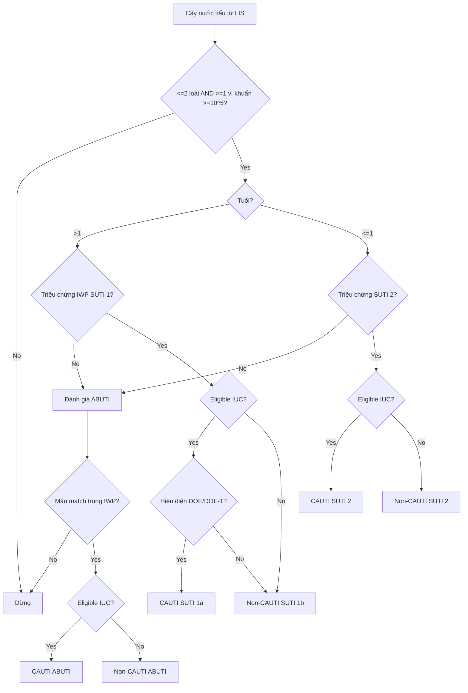

### 7.6. Exclusions & edge cases

1. **Pathogen:** cấm yeast/molds/dimorphic/parasites làm UTI pathogen. Mẫu có yeast + đúng 1 bacterial ≥10⁵ → bỏ yeast, chạy bacterial.
2. **Mixed flora:** invalid; mixed flora + thêm loài → ≥3 → invalid.
3. **IUC gaps:** rút rồi đặt lại trước khi hết 1 full calendar day → đếm liên tục; ≥1 full calendar day không IUC → reset IUC Day 1.
4. **Secondary BSI từ UTI:** SBAP = IWP+RIT (14–17d) + match bacterial → Secondary; **yeast máu trong SBAP UTI → Primary/CLABSI** (không Secondary).

### 7.7. Ví dụ phiếu CAUTI

`CAUTI-2026-0089` · Nguyễn Văn A · HD1 2026-07-28 · ICU NL · Index 08-01 · IWP 07-29→08-04 · DOE sốt 07-31 · **HAI** HD4 · *E. coli* ≥10⁵ · Foley từ 07-28 Device Day 4 · máu 08-02 *E. coli* trong SBAP → Secondary BSI = YES.

---

## 8. VAE (VAC → IVAC → PVAP) (Chương 10)

> **KHÔNG dùng §3 IWP/RIT.** Dùng sliding window, VAE Window, 14-day Event Period.

### 8.1. Schema mở rộng

**Ventilator Registry:** Intubation/Extubation, LocationCode, IsHighFrequencyVent, IsECMO_ECLS, IsPronePosition, IsAPRVMode.

**Flowsheet VAE:** VentilatorDay, DailyMinPEEP, DailyMinFiO2 (0.21–1.0, duy trì >1 giờ), temp, WBC, AntimicrobialsAdministered[{DrugID RXNORM, Route}].

**MicroLab VAE:** SpecimenSource ETA/BAL/PSB/SPUTUM/PLEURAL/LUNG_TISSUE; QuantitativeValue; IsPurulentSecretions (≥25 PMN AND ≤10 squamous/LPF); histopathology; Legionella; respiratory virus; OrganismsIsolated[].

### 8.2. Gatekeepers

1. **Adult locations only** (Pediatric/Neonatal → PedVAE §9 hoặc PedVAP/PNEU §10).
2. Thở máy liên tục **≥ 4 ngày lịch** (intubation = Day 1).
3. Ngày dùng HFV / ECMO-ECLS / VAD **trọn calendar day** → loại khỏi tính toán.
4. APRV (hoặc tương đương) cả ngày → chỉ dùng **FiO2**, bỏ PEEP.

### 8.3. Timeline riêng

**DailyMinPEEP:** min PEEP duy trì >1 giờ; **Equivalency:** PEEP thực 0–5 → quy về **5** cmH₂O.

**Sliding VAC:**

1. Baseline 2 ngày: PEEP_D2 ≤ PEEP_D1 **OR** FiO2_D2 ≤ FiO2_D1.  
2. Worsening 2 ngày D3–D4 so với D1:  
   - PEEP (không APRV): PEEP_D3 ≥ PEEP_D1+3 **AND** PEEP_D4 ≥ PEEP_D1+3  
   - FiO2: FiO2_D3 ≥ FiO2_D1+0.20 **AND** FiO2_D4 ≥ FiO2_D1+0.20  
3. **DOE = D3**.

**VAE Window:** [DOE−2, DOE+2]. Ngoại lệ: Vent Day 3 → [DOE, DOE+2]; Vent Day 4 → [DOE−1, DOE+2].

**14-day Event Period:** từ DOE đến DOE+13 — gộp mọi biến động; cấm VAE mới.

### 8.4. Logic trees

#### VAC
IF worsening PEEP≥3 OR FiO2≥0.20 × ≥2 ngày sau baseline  
AND Hospital Day tại DOE ≥ 3  
THEN **VAC**.

#### IVAC
IF VAC  
AND trong VAE Window: (T>38 OR T<36) OR (WBC≥12000 OR ≤4000)  
AND New antimicrobial (không có trong 2 ngày trước ngày bắt đầu) bắt đầu trong Window  
AND duy trì **≥ 4 QAD** (gap tối đa 1 calendar day cùng DrugID; gap giữa 2 thuốc khác nhau không tính QAD)  
THEN **IVAC**.

#### PVAP (sau IVAC) — một trong 3 nhóm trong Window

**Criterion 1 — định lượng:** ETA ≥10⁵ (hoặc semi-quant Nhiều/3+/4+); BAL/PBAL ≥10⁴; PSB ≥10³; lung tissue ≥10⁴ CFU/g.

**Criterion 2 — đờm mủ + culture:** PMN≥25 AND squamous≤10/LPF **AND** bacteria từ sputum/ETA/BAL/PSB/lung.

**Criterion 3 — đặc hiệu:** pleural (≤24h chest tube); histopath (+); Legionella Ag/PCR; respiratory virus PCR chỉ định.

THEN **PVAP**.

### 8.5. Secondary BSI / Transfer / Exclusions

- Secondary BSI **chỉ PVAP** (không VAC/IVAC); LRT culture trong DOE±2; máu trong 14-day Event Period; Matching Organisms; **CẤM** Candida/Enterococcus/CoNS secondary trừ lung tissue/pleural.
- **Transfer Rule:** DOE ngày chuyển hoặc ngày sau → quy kết **khoa chuyển đi**.
- PVAP organism exclusions từ sputum/ETA/BAL/PSB: normal/mixed oral flora; Candida/yeast; CoNS; Enterococcus — trừ lung tissue/pleural.

### 8.6. Flowchart

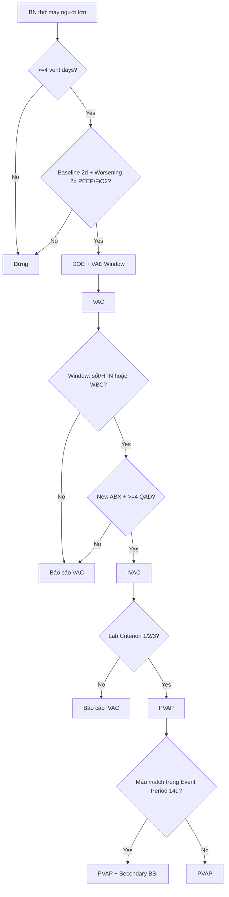

---

## 9. PedVAE (Chương 11)

> Pediatric / Neonatal Ventilator-Associated Event. **Một bậc duy nhất** (không VAC/IVAC/PVAP).  
> **Không** áp dụng IWP / RIT / SBAP Chương 2. Secondary BSI: **CẤM**.

### 9.1. Schema mở rộng

```json
{
  "AgeAtEventDays": "integer",
  "VentilatorDay": "integer or null",
  "DailyMinMAP": "float (cmH2O) — thấp nhất trong ngày lịch",
  "DailyMinFiO2": "float (0.21–1.0) — thấp nhất duy trì >1 giờ",
  "IsECMO_ECLS_FullDay": "boolean"
}
```

Location: chỉ **NICU / Pediatric**. Adult location → chuyển sang VAE §8.

### 9.2. Gatekeepers

1. Location Neonatal hoặc Pediatric (không Adult).
2. Thở máy liên tục **≥ 4** calendar days (ngày đặt = Vent Day 1).
3. Loại trừ mọi calendar day **ECMO/ECLS trọn ngày** (00:00–23:59) khỏi thuật toán.

### 9.3. MAP rounding & equivalence

**Rounding:** DailyMinMAP → số nguyên gần nhất (`.00–.49` xuống; `.50–.99` lên).

**Equivalence theo tuổi tại ngày số liệu:**

| Tuổi | MAP thực 0…X quy đổi thành |
|------|----------------------------|
| < 30 ngày | mọi MAP 0–8 → **8** |
| ≥ 30 ngày | mọi MAP 0–10 → **10** |

**DailyMinFiO2:** FiO₂ thấp nhất được set và duy trì **> 1 giờ**; nếu không chứng minh >1 giờ → lấy thấp nhất ghi nhận trong ngày.

### 9.4. Sliding window (Baseline → Worsening)

```
[2 ngày Baseline ổn định/giảm] → [2 ngày Worsening duy trì]
MAP* hoặc FiO2 ổn định/giảm       MAP* tăng ≥ +4  HOẶC  FiO2 tăng ≥ +0.25
                                   so với Baseline Day 1
                                   → Ngày thứ 3 của chuỗi 4 ngày = DOE
```

Điều kiện formal (sau quy đổi MAP*):

- Baseline \(D_1, D_2\): \(\mathrm{MAP}^*_{D2} \le \mathrm{MAP}^*_{D1}\) **OR** \(\mathrm{FiO2}_{D2} \le \mathrm{FiO2}_{D1}\)
- Worsening \(D_3, D_4\):  
  - MAP: \(\mathrm{MAP}^*_{D3} \ge \mathrm{MAP}^*_{D1}+4\) **AND** \(\mathrm{MAP}^*_{D4} \ge \mathrm{MAP}^*_{D1}+4\)  
  - **HOẶC** FiO2: \(\mathrm{FiO2}_{D3} \ge \mathrm{FiO2}_{D1}+0.25\) **AND** \(\mathrm{FiO2}_{D4} \ge \mathrm{FiO2}_{D1}+0.25\)

### 9.5. 14-day Event Period

Từ DOE (= Day 1) khóa **14 calendar days**: không tạo PedVAE mới chồng lên; dữ liệu lâm sàng tùy chọn trong cửa sổ chỉ phục vụ mô tả, **không** tạo bậc IVAC/PVAP.

### 9.6. Exclusions & optional clinical data

- **CẤM Secondary BSI** dưới mọi hình thức: máu dương **không** quy kết về PedVAE; đánh giá độc lập Primary BSI/CLABSI hoặc Secondary từ site khác (UTI, SSI…).
- ECMO/ECLS full-day không tham gia baseline/worsening.
- Không dùng IWP 7 ngày Chương 2.
- **Optional (dịch tễ, không tạo bậc PVAP):** kháng sinh bắt đầu trong DOE ±2 ngày; vi sinh hô hấp trong DOE ±2; cấy máu từ DOE−2 đến DOE+13 (chỉ ghi nhận — không Secondary).

### 9.7. Flowchart (đầy đủ)

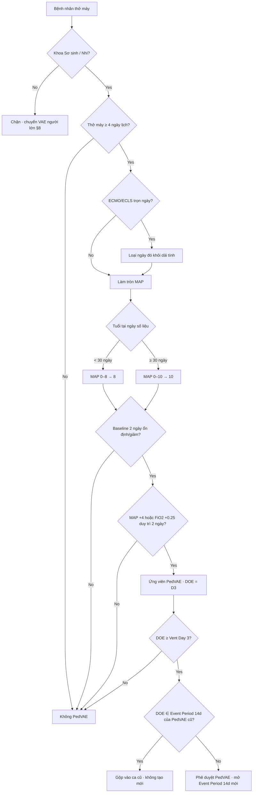

### 9.8. Ví dụ phiếu chốt ca (mockup)

| Trường | Giá trị |
|--------|---------|
| Mã ca | `PEDVAE-2026-0034` |
| BN | Trần Hoàng K · **25 ngày tuổi** tại DOE · NICU Level III |
| HD 1 | 2026-07-28 · Intubation 2026-07-28 10:00 (Vent Day 1) |
| Baseline | 2026-07-29 (VD2) & 2026-07-30 (VD3) |
| Worsening | 2026-07-31 (VD4) & 2026-08-01 (VD5) |
| **DOE** | **2026-07-31** (≥ Vent Day 3) |
| Equivalence | <30 ngày → MAP thực 0–8 quy về **8** |

**Rule Engine log (rút gọn):**

| Ngày | Vent | MAP thực | MAP* | FiO₂ | Trạng thái |
|------|------|----------|------|------|------------|
| 2026-07-29 | D2 | 7.3 → làm tròn 7 → **8** | 8 | 0.35 | Baseline D1 (mốc) |
| 2026-07-30 | D3 | 8.1 → 8 | 8 | 0.35 | Baseline D2 (ổn định) |
| 2026-07-31 | D4 | … | ≥ MAP*₊₄ **hoặc** FiO₂₊₀.₂₅ | … | Worsening D1 = **DOE** |
| 2026-08-01 | D5 | … | duy trì ngưỡng | … | Worsening D2 |

Khóa: Event Period 14 ngày từ DOE; **không** gắn Secondary BSI nếu máu dương.

---

## 10. PNEU / PedVAP / Non-VAP (Chương 6)

> Dùng §3 (IWP/DOE/POA-HAI/RIT). **Adult vent in-plan → bắt buộc module VAE §8**, không dùng PNEU cho adult vent.

### 10.1. Schema mở rộng

**Admission + underlying cardiopulmonary disease** (quyết định 1 vs ≥2 phim imaging): RDS, BPD, pulmonary edema, COPD, CHF, ILD.

**Ventilator Registry (PNEU):** chỉ đường thở nhân tạo (ETT/trach). Không CPAP/BiPAP/mask PEEP.

**Flowsheet PNEU:** temp, WBC, %bands, AMS, purulent/sputum change, dyspnea/tachypnea, cough, rales/bronchial, gas exchange, PaO2/FiO2, immunocompromised criteria (neutropenia, leukemia/lymphoma, HIV CD4<200, splenectomy, transplant, chemo, steroid >14d).

**Imaging Record:** CHEST_XRAY/CT/MRI; Infiltrate/Consolidation/Cavitation/Pneumatoceles (≤1y); IsEquivocal; HasClinicalCorrelation.

**Micro/Pathology:** sputum/ETA/BAL/PBAL/PSB/pleural/lung/blood/urine Ag; Gram stain PMN/squamous; CFU; semi-quant; histopath; organism flags (normal flora, Candida, CoNS, Enterococcus).

### 10.2. Gatekeepers

1. **In-plan PedVAP:** chỉ Pediatric locations (không Neonatal). Adult vent → §8 VAE. NICU/Peds/Adult có thể off-plan PNEU.
2. **VAP association:** vent xâm lấn >2 ngày lịch đến DOE + hiện diện DOE/DOE−1.
3. **Break Rule:** cai máy ≥1 full calendar day → reset Vent Day 1 khi đặt lại.

### 10.3. Index / imaging trong IWP

- Index = ngày lab/imaging dương tính đầu dùng cho tiêu chuẩn; PNU1 không lab → ngày triệu chứng khu trú đầu.
- Phim thâm nhiễm đầu phải ∈ IWP; mọi tiêu chí khác đồng thời trong 7 ngày IWP.

### 10.4. Logic trees

#### Imaging (mọi PNU)
- Không bệnh nền tim phổi → ≥1 phim new/progressive infiltrate, consolidation, cavitation, (pneumatoceles nếu ≤1y).
- Có bệnh nền → ≥2 phim serial trong 7 ngày chứng minh persistence/progression; equivocal + phim sau rõ = OK; không phim sau → cần clinical correlation.

#### PNU1 — Nhánh A (mọi tuổi)
Imaging + ≥1 toàn thân (sốt >38; WBC ≤4000 hoặc ≥12000; AMS nếu ≥70 tuổi không nguyên nhân khác)  
+ ≥2 hô hấp khác dòng: đờm mủ/đổi tính chất/tăng hút; dyspnea/tachypnea (>25 NL; >30 trẻ >1y); ho mới/xấu; rales/bronchial; worsening gas exchange (P/F≤240 hoặc tăng O2/vent).

#### PNU1 — Nhánh B (≤1 tuổi)
Imaging + worsening gas exchange (SpO2<94% hoặc tăng O2/vent) + ≥3 triệu chứng khác dòng (temp instability; WBC≤4000 hoặc ≥15000 + bands≥10%; đờm; apnea/tachypnea theo ngưỡng tuần thai/tháng tuổi / nasal flaring / grunting; wheeze/rhonchi/rales; cough; brady <100 hoặc tachy >170).

#### PNU1 — Nhánh C (>1 đến ≤12 tuổi)
Imaging + ≥3 triệu chứng khác dòng (sốt/hạ thân nhiệt; WBC≤4000 hoặc ≥15000; đờm; dyspnea/apnea/tachypnea>30/ho; rales/bronchial; gas exchange SpO2<94% hoặc tăng O2/vent).

#### PNU2
Imaging + ≥1 toàn thân + ≥1 hô hấp + (≥1 Table2 **hoặc** Table3):

**Table 2:** máu (+); pleural (+); LRT minimally contaminated đạt ngưỡng (BAL/PBAL≥10⁴; PSB≥10³; ETA≥10⁵ nếu vent; semi-quant Moderate/Heavy/2–4+); ≥5% BAL intracellular bacteria; lung tissue ≥10⁴ CFU/g; histopath abscess/PMN hoặc fungal invasion.

**Table 3:** virus/Bordetella/Legionella/Chlamydia/Mycoplasma từ LRT; IgG ×4; Legionella IFA ×4 ≥1:128; urine Ag Legionella.

#### PNU3 (immunocompromised)
IsImmunocompromised theo Footnote 10 + Imaging + ≥1 triệu chứng (sốt, AMS≥70, cough/dyspnea/tachypnea, rales/bronchial, gas exchange, hemoptysis, pleuritic pain)  
+ (≥1): matching Candida máu **và** LRT trong IWP; **hoặc** nấm không-Candida từ LRT minimally contaminated; **hoặc** bất kỳ lab PNU2.

#### Nhãn VAP vs Non-VAP
Sau PNU1/2/3: nếu Eligible vent (§10.2) → **VAP**; else → **Non-ventilator PNEU**.

### 10.5. Exclusions / Secondary / Transfer

- Cấm “normal/mixed oral/respiratory flora” cho PNU2/3.
- Candida/yeast NOS, CoNS, Enterococcus từ sputum/ETA/BAL/PSB **cấm** cho PNU2/3 trừ lung tissue/pleural (≤24h chest tube); **ngoại lệ PNU3:** matching Candida máu+LRT trong IWP.
- Secondary BSI: SBAP = IWP+RIT; Matching; cấm Candida/CoNS/Enterococcus secondary trừ lung/pleural.
- Transfer Rule: DOE ngày chuyển hoặc Day+1 → khoa chuyển đi; nhiều khoa trong 24h trước DOE → khoa đầu ngày trước DOE.
- **CẤM** chốt PNEU chỉ dựa physician diagnosis alone.

### 10.6. Flowchart & ví dụ

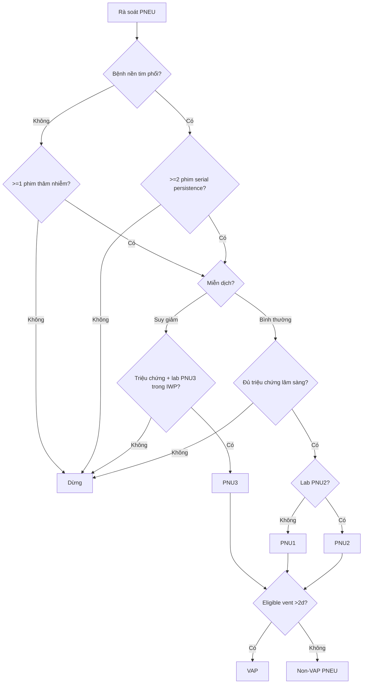

**Ví dụ PedVAP PNU2:** `VAP-2026-0045` · 8 tuổi · ICU Nhi · Index BAL 07-30 · IWP 07-27→08-02 · DOE sốt 07-29 · HAI HD5 · XQ thâm nhiễm · *P. aeruginosa* BAL ≥10⁴ · vent từ 07-25 → VAP-PNU2.

**Ví dụ PNU3 + Secondary BSI:** `PNEU-2026-0052` · hóa chất · Index ETA 07-22 · DOE WBC 07-21 · HAI · CT thâm nhiễm · *K. pneumoniae* ETA · máu 07-23 match trong SBAP → Secondary BSI = YES.

---

## 11. SSI (Chương 9)

> **KHÔNG dùng §3 IWP / POA / RIT / SBAP Chương 2.** Dùng Surveillance Period 30/90 + SSI-SBAP 17 ngày.

### 11.1. Schema

**Procedure Denominator**

```json
{
  "ProcedureID": "string",
  "PatientID": "string",
  "AdmissionID": "string",
  "ProcedureDate": "date (Day 1 Surveillance Period)",
  "NHSNProcedureCode": "string",
  "OR_IncisionStartTime": "datetime",
  "OR_IncisionFinishTime": "datetime",
  "ProcedureDurationMinutes": "integer",
  "ASA_Class": "integer",
  "WoundClass": "enum [C, CC, CO, D]",
  "ClosureTechnique": "enum [PRIMARY, NON_PRIMARY]",
  "IsEmergency": "boolean",
  "IsGeneralAnesthesia": "boolean",
  "IsScopeUsed": "boolean",
  "IsTrauma": "boolean",
  "PatientHeightMeters": "float",
  "PatientWeightKg": "float",
  "PatientAgeYears": "integer",
  "PriorInfectionAtIndexJoint": "boolean"
}
```

- **CẤM WoundClass = Clean (C)** cho: APPY, BILI, CHOL, COLO, REC, SB, VHYS → loại khỏi denominator + cảnh báo.
- ASA chỉ 1–5; ASA 6 loại trừ.

**SSI Event Numerator:** DateOfEvent, SSIDepth (SUPERFICIAL_PRIMARY/SECONDARY, DEEP_PRIMARY/SECONDARY, ORGAN_SPACE), SpecificOrganSpaceSite (Ch.17), PATOS, DetectionMethod, IsSecondaryBSIPresent, CultureResults[].

### 11.2. Gatekeepers

1. NHSN procedure: mã ICD-10-PCS/CPT map; có đường rạch; thực hiện trong OR hợp lệ (kể cả C-section / cath lab mạch).
2. Duration ≥5 phút và ≤ IQR5; <5 phút → loại denominator.
3. NON_PRIMARY closure: loại khỏi SIR baseline cũ BS1 2006–2008; vẫn tính baseline mới.

### 11.3. Timeline SSI

**30-day SP** — mọi Superficial; Deep/Organ của: AAA, AMP, APPY, AVSD, BILI, CEA, CHOL, COLO, CSEC, GAST, HTP, HYST, KTP, LAM, LTP, NECK, NEPH, OVRY, PRST, REC, SB, SPLE, THOR, THYR, VHYS, XLAP. Secondary incisional luôn ≤30 ngày kể cả khi primary 90 ngày.

**90-day SP** — Deep/Organ của: BRST, CARD, CBGB, CBGC, CRAN, FUSN, FX, HER, HPRO, KPRO, PACE, PVBY, VSHN.

**DOE:** ngày yếu tố đầu thỏa tiêu chuẩn trong SP.

**Surveillance Reset:**

- A: NHSN procedure mới qua cùng vết → SP cũ chấm dứt; SP mới từ mổ mới.
- B: Non-NHSN qua cả 3 lớp → SP cũ chấm dứt; chỉ một số lớp → SP cũ tiếp tục lớp không xâm lấn; không SP mới cho non-NHSN.

### 11.4. Logic trees (độ sâu nhất thắng)

> Organ/Space chi tiết IAB/BONE/PJI: §12; ENDO: §13.


#### Superficial (DOE ≤30d; da/mô dưới da)
≥1: (a) purulent drainage; (b) organism từ specimen vô khuẩn; (c) deliberately opened + không culture + ≥1 symptom (pain/tenderness, swelling, erythema, heat); (d) diagnosis bởi MD/IP.  
**CẤM:** stitch abscess; stab/pin site; cellulitis đơn thuần.

#### Deep (30 hoặc 90d; fascia/muscle)
≥1: (a) purulent deep; (b) opened/dehisces + (culture (+) **hoặc** không culture) — culture (−) **không** đủ — + sốt >38 hoặc localized pain; (c) abscess/evidence deep qua exam/path/imaging.

#### Organ/Space (30 hoặc 90d)
≥1: (a) purulent từ drain vô khuẩn vào organ/space; (b) organism từ fluid/tissue; (c) abscess/evidence (equivocal imaging OK nếu ABX phù hợp)  
**AND** ≥1 tiêu chuẩn Ch.17 site (IAB, EMET, VCUF, OREP…).

### 11.5. PATOS / 24h OR / Secondary BSI / Manipulation

**PATOS:** Yes chỉ khi độ sâu nhiễm lúc mổ = độ sâu SSI sau; bằng chứng visualized trong Operative Note (không dùng path/imaging trước mổ đơn thuần).

**24h return to OR:** một denominator record (original); cộng thời gian; ASA/WoundClass lấy xấu nhất; SP bắt đầu từ kết thúc mổ 2.

**SSI-SBAP:** cố định \([\text{DOE}-3,\ \text{DOE}+13]\) = 17 ngày. Scenario 1: máu trong SBAP + match. Scenario 2 Organ/Space: máu là criterion Ch.17 → Secondary mặc định.

**Invasive Manipulation Exclusion:** không nghi ngờ nhiễm trước + can thiệp xâm lấn vào vết vì chẩn đoán/điều trị + nhiễm sau đúng lớp → không tính cho procedure gốc (không áp dụng closed reduction / thay băng thông thường).

### 11.6. Flowchart

```mermaid
graph TD
    A[Phẫu thuật NHSN] --> B{DOE trong SP?}
    B -- No --> C[Dừng]
    B -- Yes --> D{Lớp sâu nhất?}
    D -- Nông --> E{Mủ|Cấy+|MD dx|Mở+triệu chứng?}
    E -- Yes --> F{Loại trừ stitch/pin/cellulitis?}
    F -- No --> G[Superficial SSI]
    D -- Sâu --> H{Mủ sâu|Áp xe|Mở+sốt/đau+cấy+/không cấy?}
    H -- Yes --> I[Deep SSI]
    D -- Organ --> K{Drain mủ|Cấy+|Áp xe?}
    K -- Yes --> L{Ch.17 site?}
    L -- Yes --> M[Organ/Space SSI]
    M --> N{Máu trong SBAP 17d + match hoặc Scenario 2?}
    N -- Yes --> O[SSI + Secondary BSI]
```

---

## 12. Specific Sites (Chương 17) — IAB, BONE, PJI

> Tiêu chuẩn Organ/Space đặc hiệu — dùng khi xác định SSI Organ/Space **hoặc** site nguyên phát cho Secondary BSI.  
> Hierarchy **Deepest infection** thắng khi nhiều site cùng lúc: **BONE > PJI/JNT** (và sâu hơn Superficial/Deep SSI khi mapping SSI).

### 12.1. Schema mở rộng (clinical + lab markers)

Fields tối thiểu ngoài Shared:

| Nhóm | Fields |
|------|--------|
| IAB clinical | DailyMaxTempC, HasHypotension, Nausea/Vomiting, AbdominalPain/Tenderness, Jaundice, IsTransaminaseElevated |
| BONE clinical | BoneSwelling, BonePain/Tenderness, BoneHeat, BoneDrainage |
| PJI / synovial | SerumCRP, SerumESR, SynovialFluidWBC, SynovialFluidPMN_Percent, LeukocyteEsteraseStrip |
| Micro / path | Culture from sterile site / drainage / tissue; histopathology; imaging reports trong IWP |

IWP / RIT / POA-HAI: **theo Chương 2** (IWP ±3, RIT 14) — **không** dùng ENDO Extended IWP.

### 12.2. IAB — logic trees (tóm tắt)

| Nhánh | Điều kiện cốt lõi |
|-------|-------------------|
| **IAB 1** | Vi sinh trực tiếp từ ổ bụng / dịch mật / dịch ổ phúc mạc vô khuẩn (không qua dẫn lưu nhiễm) |
| **IAB 2a** | Đại thể / giải phẫu bệnh áp xe hoặc viêm phúc mạc |
| **IAB 2b** | Giải phẫu bệnh + cấy máu MBI-eligible trong IWP |
| **IAB 3a** | ≥2 triệu chứng lâm sàng (sốt/hạ HA/nôn/đau bụng/vàng da…) + vi sinh từ dịch dẫn lưu |
| **IAB 3b** | ≥2 triệu chứng + **hình ảnh** gợi ý nhiễm + **cấy máu** (MBI rules) → **Scenario 2 Secondary BSI** điển hình |

### 12.3. BONE — logic trees (tóm tắt)

BONE (osteomyelitis) khi có **một** trong các nhánh trong IWP:

1. Vi sinh từ xương / xương tủy (không contamination).
2. Evidence đại thể / surgical / histopathology viêm xương-tủy.
3. ≥2 dấu hiệu tại chỗ (sưng/đau/nóng/dịch) + lab viêm (CRP/ESR) + imaging phù hợp **hoặc** máu dương cùng loài khi đủ tiêu chuẩn NHSN BONE.

Khi cùng lúc có PJI: ưu tiên gán **BONE** nếu tiêu chuẩn xương đủ (deepest).

### 12.4. PJI — logic trees (tóm tắt)

PJI (khớp nhân tạo) — tiêu chuẩn intraop / synovial trong IWP (không copy đầy đủ bảng CRP/ESR cut-off vào Shared):

- Cấy từ khớp / quanh implant dương tính phù hợp; **hoặc**
- Tế bào dịch khớp / leukocyte esterase / CRP+ESR theo ngưỡng protocol NHSN; **hoặc**
- Mủ đại thể / mô bệnh học viêm khớp giả.

Không thỏa → xét JNT (khớp tự nhiên) theo Chương 17 nếu trong scope thủ thuật / infection site.

### 12.5. Deepest hierarchy & Secondary BSI

```
IF nhiều specific site cùng admission/IWP:
  chọn site SÂU NHẤT theo protocol NHSN
  (BONE thắng PJI khi cả hai đủ tiêu chuẩn xương vs khớp giả)
```

- IAB 3b / một số nhánh Organ/Space: máu là thành phần tiêu chuẩn → Secondary BSI Scenario 2 (§4.4).
- Matching Organism: theo §4.2.

### 12.6. Flowchart (tóm tắt)

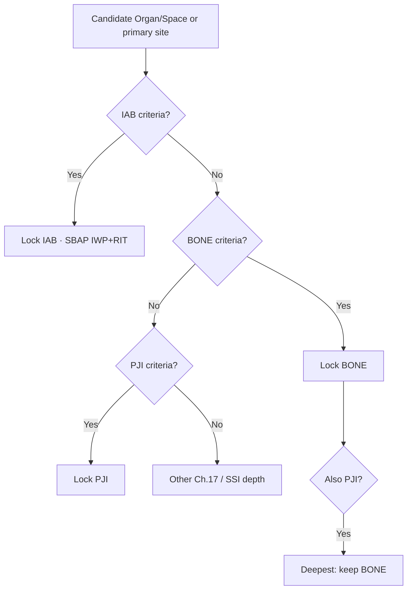

---

## 13. ENDO (Chương 17) — Viêm nội tâm mạc

> Timeline **đặc biệt** — không dùng IWP 7 ngày / RIT 14 / SBAP 14–17 ngày thông thường.

### 13.1. Schema mở rộng

- Imaging: Echo/TEE, CT tim, PET/CT — ngày trong Extended IWP.
- Blood cultures serial; organism identity đến loài khi có.
- Clinical minor criteria (sốt, yếu tố nguy cơ van nhân tạo / IVDU, hiện tượng mạch / miễn dịch…) — một số **tiền sử** được chấp nhận **cả admission**, không bắt buộc ∈ IWP.

### 13.2. Gatekeepers

- Không lẫn với SSI superficial của vết mổ unrelated.
- Index Date thường = ngày mẫu máu dương tính đầu tiên dùng để thỏa tiêu chuẩn (hoặc imaging nếu là yếu tố đầu).

### 13.3. Timeline đặc biệt (bắt buộc)

| Khái niệm | ENDO | So với Chương 2 |
|-----------|------|-----------------|
| **Extended IWP** | \([\text{Index}-10,\ \text{Index}+10]\) = **21 ngày** | Không phải ±3 |
| **RIT** | Từ DOE đến **hết đợt nằm viện hiện tại** | Không phải 14 ngày |
| **SBAP** | Extended IWP ∪ mọi ngày còn lại của admission | Không phải IWP+RIT 14–17 |

Trong RIT/admission: **cấm** tạo ca ENDO mới cùng bệnh nhân/admission.

### 13.4. Matching & Secondary BSI

Do SBAP rất dài: Secondary BSI **chỉ** khi Matching Organism **chặt** (chi + loài theo §4.2).  
**Không** suy diễn Scenario 2 lỏng kiểu “máu là yếu tố cấu thành” nếu không match organism với ổ ENDO đã chốt.

### 13.5. Logic trees — ENDO 1…7

**Nhánh trực tiếp (ENDO 1–3)**

| Mã | Điều kiện |
|----|-----------|
| **ENDO 1** | Cấy (+) từ sùi / mô tim / van (loại trừ nấm deep: Blastomyces, Cryptococcus… theo list NHSN) |
| **ENDO 2** | Mô bệnh học viêm nội tâm mạc trên mẫu phẫu thuật / tử thiết |
| **ENDO 3** | Phẫu thuật viên quan sát đại thể viêm nội tâm mạc rõ trong biên bản mổ tim |

**Nhánh hình ảnh + vi sinh (ENDO 4)** — imaging điển hình ∈ Ext IWP **VÀ** ≥1 nhánh máu ∈ Ext IWP:

| Nhánh máu | Ngưỡng mẫu | Tác nhân (tóm tắt) |
|-----------|------------|-------------------|
| **a Typical** | ≥2 mẫu ≤1 ngày lịch | *S. aureus*, *S. lugdunensis*, *E. faecalis*, streptococci (trừ *S. pneumoniae* / *S. pyogenes*), *Granulicatella*, *Abiotrophia*… |
| **b Prosthetic** | ≥2 mẫu ≤1 ngày | CoNS, *C. striatum* / *jeikeium*, *S. marcescens*, *P. aeruginosa*, *C. acnes*, Candida… trên nền prosthetic |
| **c Non-typical** | ≥3 mẫu ≤1 ngày lịch | Tác nhân ngoài typical |
| **d–f Đặc biệt** | Theo protocol | *Coxiella* Phase I IgG >1:800 / PCR; *Bartonella* IgG ≥1:800; *T. whipplei* PCR |

**Nhánh minor (ENDO 5–7)**

| Mã | Điều kiện |
|----|-----------|
| **ENDO 5** | ≥3 yếu tố phụ (tiền sử*, sốt >38°C, tiếng thổi mới, vascular, immunologic) + máu đạt a–f như ENDO 4. *Tiền sử chấp nhận **cả admission** |
| **ENDO 6** | Imaging điển hình + ≥3 phụ (tiền sử / sốt / vascular / immunologic — **không** dùng “tiếng thổi mới” cho nhánh này) + máu “thông thường” (1 pathogen **hoặc** ≥2 commensals cùng loài) |
| **ENDO 7** | Đồng thời cả 6 yếu tố phụ (bao gồm tiếng thổi + máu thông thường) trong Ext IWP |

**Edge — imaging / PET**

- Ascending aortic graft: chỉ khi có sùi/thủng/hở mới / PET uptake bất thường tại van chủ (prosthetic >3 tháng) hoặc quan sát mổ.
- PET prosthetic: chỉ intense / focal–multifocal / heterogeneous; native valve & CIED leads: mọi abnormal uptake.

### 13.6. Flowchart (đầy đủ)

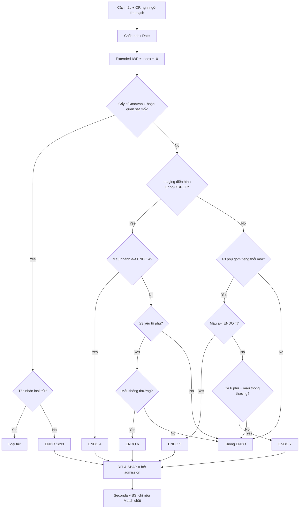

### 13.7. Ví dụ phiếu chốt ca ENDO 4 (mockup)

| Trường | Giá trị |
|--------|---------|
| Mã ca | `ENDO-2026-0012` |
| BN | Lê Minh H · 54 tuổi · Khoa Phẫu thuật tim mạch |
| HD 1 | 2026-07-20 · Van hai lá sinh học (2024) — `HasProstheticValve = True` |
| Index Date | 2026-07-25 (TEE thấy sùi) |
| **Extended IWP** | **2026-07-15 → 2026-08-04** (Index ±10) |
| **DOE** | **2026-07-22** (cấy máu (+) đầu tiên ∈ Ext IWP) |
| Phân loại | **HAI** (DOE = HD 3) |
| Imaging | TEE 2026-07-25: sùi di động 12×8 mm trên van nhân tạo |
| Máu | Hai mẫu 2026-07-22 (09:00 & 14:00, vị trí khác) — *S. epidermidis* → nhánh **b** prosthetic |
| Kết luận | **ENDO 4 (HAI)** |
| Khóa | RIT = hết admission; SBAP = hết admission cho *S. epidermidis* (Secondary chỉ khi Match) |

---

## 14. LabID / MDRO / CDI (Chương 12)

> LabID Event **không** dùng IWP/DOE/RIT/SBAP Chương 2.  
> Hai engine song song: **LabID Event** và **Infection Surveillance**; thêm **Prevention Process Measures**.

### 14.1. Schema

Lab isolate LabID (+ cấm AST/ASC vào tử số LabID) — giống skeleton §1.4 với:

- `StoolConsistency` (CDI: chỉ UNFORMED)
- `IsActiveSurveillanceTest` (True → **không** tạo LabID Event; có thể vào Process Measures)
- Prevention observations: HandHygiene / ContactPrecautions / AST_ADHERENCE

### 14.2. Gatekeepers

1. `IsActiveSurveillanceTest == True` → hủy LabID Event (giữ cho process).
2. CDI: stool phải UNFORMED.
3. CDI: loại NICU / SCN / LDRP-PP / well-baby.
4. IRF / ED / Observation: **Blood specimens only** cho MDRO LabID; khoa nội trú khác: **All specimens**.

### 14.3. Onset & CDI cycle

| Nhãn | Điều kiện |
|------|-----------|
| **CO** | ED/Obs/Outpatient **hoặc** inpatient HD 1–3 |
| **HO** | Inpatient từ HD 4 |
| **CO-HCFA** (chỉ CDI) | CO **và** xuất viện nội trú cùng CS trong ≤28 ngày trước specimen |
| **Incident CDI** | >56 ngày từ CDI LabID trước **hoặc** lần đầu |
| **Recurrent CDI** | 15–56 ngày sau CDI trước |
| **Duplicate** | ≤14 ngày → không gán `cdiAssay` |

**Location-specific 14-day:** de-dup độc lập từng khoa; chuyển khoa → reset; specimen đầu ở khoa mới = event mới (Day 1).

### 14.4. Phenotype algorithms (LabID)

| Phenotype | Rule |
|-----------|------|
| **MRSA** | *S. aureus* + R Oxacillin/Cefoxitin/Methicillin **OR** mec/PBP2a (+) |
| **VRE** | *E. faecalis* / *E. faecium* / Enterococcus spp. + R Vancomycin |
| **CephR-Klebsiella** | *K. oxytoca* / *K. pneumoniae* + NS (R hoặc I) với ≥1 cephalosporin nhóm list NHSN (Ceftazidime, Cefotaxime, Ceftriaxone, Cefepime, CZA, C/T…) |
| **CRE** | *E. coli* / Klebsiella spp. liệt kê / Enterobacter spp. + R ≥1 carbapenem (list NHSN) **OR** carbapenemase gene (+) |
| **CDI** | Unformed stool + toxin/NAAT theo multi-step: quyết định theo **timestamp cuối** trong ngày; GDH+/Toxin− → NAAT quyết định |

### 14.5. Infection Surveillance Option

Khi location chọn Infection Surveillance (không chỉ LabID):

```
IF thỏa đầy đủ tiêu chuẩn lâm sàng HAI (SUTI, LCBI, …)
AND organism phenotype ∈ {MRSA, VRE, CephR-Klebsiella, CRE} hoặc CDI lâm sàng
THEN tạo MDRO/CDI Infection Event
```

CDI biến chứng (trong 30 ngày): form ghi nhận ICU admission / colectomy / death liên quan (JCI).

### 14.6. Process Measures

Observational measures (HH, Contact Precautions, AST adherence) **tách** khỏi LabID numerator. AST/ASC chỉ phục vụ compliance screening — **không** đếm LabID.

### 14.7. De-dup & Virtual Location transfers

- Không tạo LabID trùng trong 14 ngày cùng location + cùng phenotype family.
- Virtual Location (§17): chuyển giữa phân hệ ảo có thể reset theo quy tắc location-specific — cấu hình map trước khi đếm.

### 14.8. Flowchart (LabID MDRO máu — ví dụ)

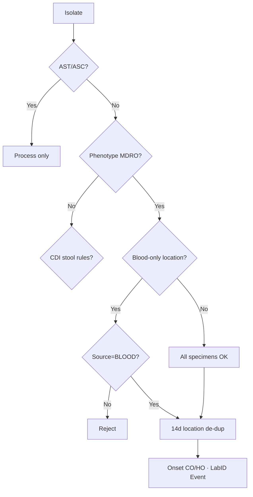

---

## 15. CLIP — Tuân thủ đặt CVC (Chương 5)

> Process quality (CDC form 57.125). Device Registry (§1.2) chỉ lưu `CLIP_EventID` — **không** nhúng lại checklist.

### 15.1. Schema

**CLIP Event:** CLIP_EventID, PatientID, AdmissionID, LocationCode, PatientAgeDays.

**Procedure & Inserter:** InsertionDateTime, IsSuccessfulAttempt, IsNewSitePrepPerformed, InserterID/Type, ReasonForInsertion, IsGuidewireUsed, LineType, IsAntimicrobialCoated, InsertionSite.

**Aseptic checklist:** HandHygienePerformed; MaximalSterileBarriers {Gloves, Gown, Cap, Mask, LargeSterileDrape}; SkinPrep {AgentUsed, IsCHGContraindicated, IsCompletelyDriedBeforeIncision}.

### 15.2. Gatekeepers / ingestion

1. Mọi location có đặt CL (IP, OP, OR, ED, cath lab).
2. Đơn vị = **mỗi insertion attempt**; unsuccessful trước → bản ghi mới chỉ khi `IsNewSitePrepPerformed == true`.
3. Thu thập tại giường (inserter hoặc observer); hồi cứu chỉ khi mọi field CLIP bắt buộc trong quy trình đặt chuẩn BV.

### 15.3. Bundle-Compliant = AND của 4 điều kiện

1. **Hand Hygiene:** `HandHygienePerformed == true`.
2. **Skin prep theo tuổi:**
   - ≥60 ngày: bắt buộc CHG; chất khác chỉ đạt nếu `IsCHGContraindicated`.
   - <60 ngày: chấp nhận CHG / Povidone / Alcohol / OTHER; cảnh báo FDA thận trọng CHG với sinh non / <2 tháng.
3. **Dry time:** `IsCompletelyDriedBeforeIncision == true`.
4. **All 5 MSB:** Gloves + Gown + Cap + Mask + LargeSterileDrape đều true.

### 15.4. Adherence Rate

$$\text{CLIP Bundle Adherence \%} = \frac{\text{Bundle-Compliant attempts}}{\text{All reported attempts trong tháng}} \times 100$$

Aggregation: Location-specific; Inserter-specific.

### 15.5. Flowchart & ví dụ

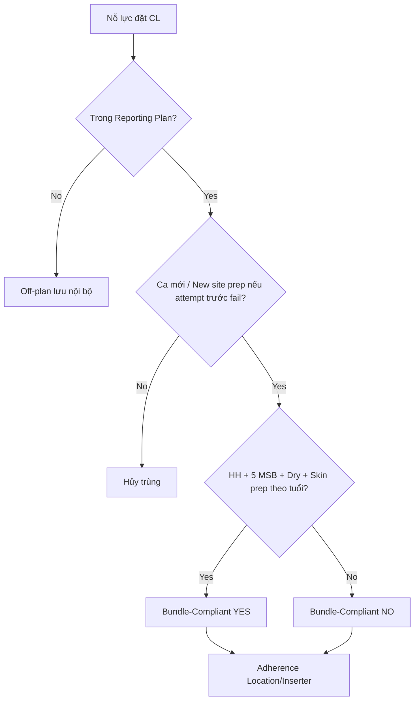

**Compliant:** `CLIP-2026-00412` · ICU-SURG · Attending · Subclavian Temporary · HH+5/5 MSB+CHG khô → **YES**.

**Non-compliant:** `CLIP-2026-00413` · ED · Resident · Femoral · thiếu large drape + Povidone chưa khô → **NO**.

---

## 16. AU Option (Chương 14) — Sử dụng kháng sinh

> **CẤM manual entry.** Numerator chỉ từ **eMAR / BCMA** điện tử.  
> Không dùng IWP/RIT Chương 2.

### 16.1. Schema

```json
{
  "AdministrationID": "string",
  "PatientID": "string",
  "EncounterID": "string",
  "RxNormCode": "string (NHSN AU drug list)",
  "AdministrationDateTime": "datetime",
  "RouteOfAdministration": "enum [INTRAVENOUS, INTRAMUSCULAR, DIGESTIVE, RESPIRATORY]",
  "LocationCode": "string (CDC Location)"
}
```

Denominator monthly:

```json
{
  "LocationCode": "string",
  "YearMonth": "YYYY-MM",
  "DaysPresent": "integer",
  "Admissions": "integer"
}
```

### 16.2. Gatekeepers

1. Chỉ 4 route NHSN; loại irrigations / otic / ophthalmic / antibiotic lock…
2. Drug phải map RxNorm → NHSN AU list; ngoài list → loại.
3. Thiếu Days Present / Admissions bắt buộc → **không** xuất CDA (không để trống field để “né” SAAR).

### 16.3. Antimicrobial Days (DOT-style numerator)

- Một bệnh nhân + một ngày lịch + một thuốc (agent) + một location = tối đa **1 Antimicrobial Day** cho agent đó (dù nhiều lần dùng trong ngày).
- Nhiều agent cùng ngày → cộng dồn theo agent (multi-agent days).

### 16.4. Days Present (denominator)

**Location-specific:** bệnh nhân có mặt bất kỳ phần nào của calendar day tại location → 1 Day Present; **chuyển khoa trong ngày** → có thể đếm cho **cả hai** location.

**FacWideIN:**

- Bệnh nhân có mặt tại **bất kỳ** khoa nội trú trong ngày → tối đa **1** FacWideIN Day Present / ngày.
- **CẢNH BÁO:**

$$\text{FacWideIN Days Present} < \sum(\text{Location-specific Days Present})$$

**CẤM** lấy tổng location-specific làm FacWideIN.

### 16.5. Rate, SAAR, AU-CAD

$$
\text{Rate} = \frac{\text{Drug-specific Antimicrobial Days}}{\text{Days Present}} \times 1000
$$

$$
\text{SAAR} = \frac{\text{Observed Antimicrobial Days}}{\text{Predicted Antimicrobial Days}}
$$

$$
\text{AU-CAD} = \text{Observed} - (\text{Predicted} \times \text{SAAR Target})
$$

(ví dụ target 0.95 — cấu hình theo kế hoạch viện).

| Giá trị | Ý nghĩa vận hành |
|---------|------------------|
| SAAR > 1 (có TT) | Dùng nhiều hơn dự đoán |
| SAAR < 1 (có TT) | Dùng ít hơn dự đoán |
| **0** | Observed = 0 có dữ liệu hợp lệ |
| **NA** | Không đủ mẫu / không áp dụng model — **khác** 0 |

### 16.6. Flowchart

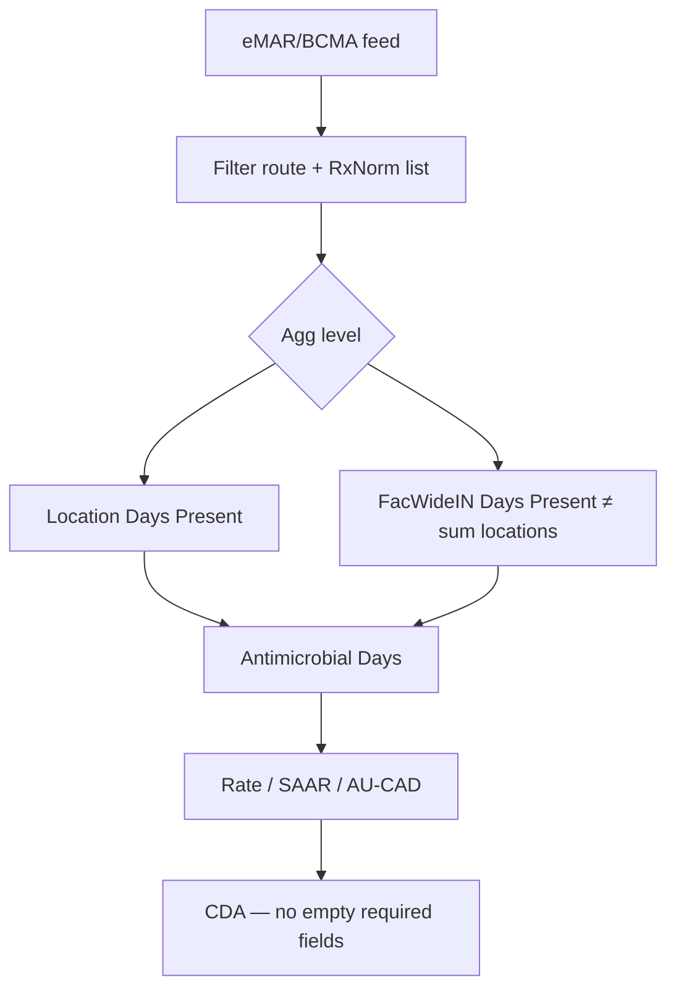

---

## 17. CDC Location Mapping (Chương 15)

> Ánh xạ khoa vật lý bệnh viện → **CDC Location Code** trước khi vào Monthly Plan / SIR / LabID / AU.

### 17.1. Schema

```json
{
  "PhysicalLocationID": "string",
  "YourCode": "string",
  "YourLabel": "string",
  "ReportedBeds": "integer",
  "Status": "enum [ACTIVE, INACTIVE]",
  "MappedCDC_LocationCode": "string"
}
```

Utilization history (tối thiểu **1 năm**, hoặc **≥3 tháng** nếu khoa mới):

- DaysSpentInLocation, AcuityBillingCode, PrimaryServiceType, PatientAgeDays.

Đổi tên/mã nội bộ nhưng cùng nhân lực & đối tượng bệnh nhân → **giữ** CDC code đã map (không tạo location mới trừ khi thật sự đổi acuity/service).

### 17.2. Gatekeepers

1. Chỉ `Status == ACTIVE`.
2. Inpatient validation: ngày giường inpatient **≥ 51%** tổng ngày giường → cho phép map nhóm Inpatient; observation tại location inpatient **vẫn** vào mẫu số location đó.

### 17.3. Bước 1 — 80% Acuity Rule

$$\text{AcuityShare}_X = \frac{\text{Bed-days acuity } X}{\text{Total bed-days}} \times 100$$

- Nếu một acuity \(X \ge 80\%\) → Acuity Level = \(X\) → sang Bước 2.
- Nếu không:
  - Có thể tách **Virtual Locations** (khu địa lý / giường cố định + thu thập denominator riêng) → map từng phân hệ;
  - Else (adult): gắn **Mixed Acuity Unit** (cảnh báo IP ưu tiên Virtual Location thay vì Mixed).

### 17.4. Bước 2 — Service Rule

**General Medical / Surgical:**

| Điều kiện | Nhãn |
|-----------|------|
| Medical bed-days **> 60%** | Medical (M) |
| Surgical bed-days **> 60%** | Surgical (S) |
| Cả hai trong khoảng **40–60%** | Medical/Surgical (MS) |

**Specialty services:** chuyên khoa đặc hiệu \(Y \ge 80\%\) → map specialty; nếu \(< 80\%\) → xét Virtual Location; không tách được → fallback general M/S/MS theo ngưỡng trên.

Pediatric / Neonatal: dùng bảng tuổi + service NHSN (không lẫn Adult Mixed).

### 17.5. Khuyến cáo vận hành

Luôn ưu tiên **Virtual Location** để tách ICU vs Ward thay vì để Mixed Acuity làm nhiễu SIR.

### 17.6. Flowchart

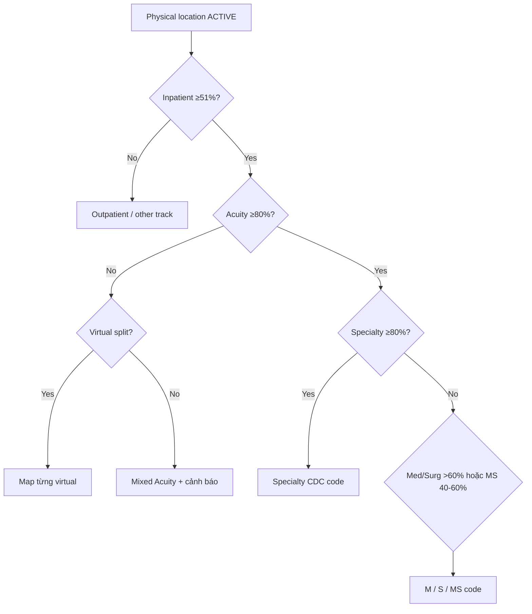

---

## 18. Surveillance Dashboard SIR/SUR UI

> Blueprint UI/UX + system rules xuất báo cáo — không thay thuật toán hội chứng.

### 18.1. Layout 3 vùng

1. **Global Filters:** Temporal (tháng/quý/năm/custom) · Aggregation (`FacWideIN` / `FacWideOUT` / location) · Baseline set · (SSI) model selector khi cần.
2. **KPI Cards:** Total SIR · Total SUR · AUR AU-CAD · CLIP Adherence %.
3. **Tabs + Grid + Export.**

### 18.2. Baseline reference

| Baseline | Chỉ số / module |
|----------|-----------------|
| **2015** | CLABSI, CAUTI, VAE, MRSA, CDI |
| **2017** | AU, PedVAE |
| **2018** | Neonatal models |
| **2019** | AR (khi bật) |

### 18.3. Tabs

| Tab | Nội dung lưới |
|-----|----------------|
| **1 DA HAI** | Location × Device: Patient Days, Device Days, Observed, Predicted, SIR (95% CI), SUR (95% CI), Rate, DUR — CLABSI/CAUTI/VAE/PedVAE |
| **2 SSI** | Procedure category / code: Observed, Predicted, SIR; cột PATOS; model selector |
| **3 MDRO/CDI** | LabID rates / SIR theo phenotype (MRSA, VRE, CephR, CRE, CDI) |
| **4 CLIP/AUR** | CLIP bundle adherence; SAAR Dot Plot (7 nhóm adult / 8 nhóm pediatric); AU-CAD |

### 18.4. System rules (bắt buộc)

**Secondary BSI sync:** Máu trong SBAP của site nguyên phát + Match → **không** đếm vào grid CLABSI; cộng organism vào ca gốc (§4).

**Patient/Device day:** theo §1.7.

**Suppression `numPred < 1`:**

```
IF predicted infections < 1
THEN SIR cell = "Lấy mẫu mỏng (numPred < 1)" / blank — KHÔNG in SIR số
```

**PATOS vs baseline set:**

```
IF baseline ≠ BS1 (baseline set 1)
THEN loại mọi ca PATOS=YES khỏi cả tử số và mẫu số SIR SSI
```

(BS1: theo cấu hình NHSN — không tự ý đổi rule.)

### 18.5. Export

| Định dạng | Mục đích |
|-----------|----------|
| **HL7 CDA** | Nén tháng → cổng NHSN |
| **Excel/PDF** | Hội đồng / JCI — highlight SIR/SUR ngoài kỳ vọng |

AU CDA: **không** để trống field bắt buộc của drug categories (0 vs NA đúng nghĩa §16.5).

### 18.6. Wireframe logic

```
┌─ Global Filters (FacWideIN/OUT · Baseline · Period) ─┐
├─ KPI: SIR | SUR | AU-CAD | CLIP %                     │
├─ Tabs: DA HAI | SSI | MDRO/CDI | CLIP/AUR             │
└─ Data Grid + Export CDA/Excel                          ┘
```

---

## Appendix A — Catalog JSON entity đã khử trùng

| Entity | Định nghĩa canonical | Mở rộng tại |
|--------|---------------------|-------------|
| Patient / Admission | §1.1 | LabID onset §14; ENDO admission-RIT §13 |
| Device Registry | §1.2 | CL §6; Foley §7; Vent §8–§10 |
| Trigger Event | §1.3 | VAE/PedVAE worsening meta |
| Lab Isolate (HAI) | §1.4 | |
| Lab Isolate (LabID) | §14.1 | Phenotypes §14.4 |
| Daily Flowsheet | §1.5 | MAP/FiO2 PedVAE §9; PEEP/FiO2 VAE §8 |
| Patient/Device day rules | §1.7 | Dashboard §18 |
| Specific-site clinical/lab | §12.1 | |
| eMAR / BCMA + Days Present | §16.1 | |
| Physical Location + billing history | §17.1 | |
| Prevention Process Measures | §14.1 / §14.6 | |
| CLIP Insertion Event | §15 | |

---

## Appendix B — Ma trận chọn thuật toán theo loại sự kiện

| Sự kiện đầu vào | Engine | Ghi chú |
|-----------------|--------|---------|
| Cấy máu + central line | CLABSI §6 sau Secondary gate §4 | |
| Nước tiểu + Foley | CAUTI §7 | Yeast → không UTI |
| Adult vent PEEP/FiO2 | VAE §8 | |
| Ped/NICU vent MAP/FiO2 | PedVAE §9 | Cấm Secondary BSI |
| Imaging phổi + lâm sàng | PNEU §10 | |
| Procedure + vết mổ | SSI §11 → Organ/Space có thể §12 | |
| Nghi ngờ ổ bụng / xương / khớp giả | §12 | Deepest hierarchy |
| Nghi ngờ viêm nội tâm mạc | ENDO §13 | IWP 21d |
| Isolate MDRO/CDI | LabID §14 (± Infection Surveillance) | |
| Quan sát đặt CVC | CLIP §15 | |
| eMAR kháng sinh | AU §16 | Cấm manual |
| Khoa mới / đổi mã | Location §17 | 80%/60% rules |
| Báo cáo tháng SIR/SUR | Dashboard §18 | numPred & PATOS rules |

---

## Appendix C — Crosswalk All domain_NKBV → section SSOT

### C.1 Checklist zero-orphan (mọi khối tiêu đề lớn)

| Khối trong `All domain_NKBV` (approx line) | Section SSOT |
|--------------------------------------------|--------------|
| SIR/SUR Dashboard layout + filters + KPI (L1–67) | §18.1–§18.2 |
| Tab 1 DA HAI (L69+) | §18.3 |
| Tab 2 SSI + PATOS (L180+) | §18.3–§18.4 |
| Tab 3 MDRO/CDI LabID (L251+) | §18.3 + §14 |
| Tab 4 CLIP/AUR + SAAR (L355+) | §18.3 + §15 + §16 |
| System rules Secondary BSI + day counts (L434–456) | §4 + §1.7 + §18.4 |
| Export CDA/Excel (L458–465) | §18.5 |
| Ch.17 IAB / BONE / PJI (L469+) | §12 |
| Ch.15 CDC Location Mapping (L786+) | §17 |
| Ch.14 AU Option (L1181+) | §16 |
| Ch.12 MDRO/CDI đầy đủ phenotypes + Infection + Process (L1513+) | §14 |
| Ch.17 ENDO (L1925+) | §13 |
| Ch.11 PedVAE (L2385+) | §9 |
| CLIP continuation / bundle (≈L2700–2941) | §15 |
| Ch.6 PNEU (L3313+) | §10 |
| Ch.9 SSI (L3973+) | §11 |
| Ch.7 UTI/CAUTI (L4313+) | §7 |
| Ch.4 CLABSI (L4744+) | §6 |
| Ch.10 VAE (L5112+) | §8 |
| Shared schema / state / workflow / forms / Secondary BSI / nudge (L5522–6109) | §1–§5 |

### C.2 Archive `Domain *` (v1.0)

Tám file `Domain *` không extension vẫn là archive; nội dung đã được cuốn vào §1–§8, §10–§11, §14 (MRSA/CDI cơ bản), §15. Không cần map lại từng dòng — ưu tiên bảng C.1.

### C.3 Verify biên soạn v2.0

- [x] Không còn ghi PedVAE là out-of-scope.
- [x] Không copy IWP ±3 vào PedVAE / ENDO / SSI / LabID / AU.
- [x] Từ điển §0.4 có ENDO 21d, PedVAE Event Period, AU Days Present.
- [x] Ma trận §3.6 phủ PedVAE/ENDO/AU/Location-related engines.
- [x] MDRO gồm VRE / CephR-Klebsiella / CRE + Infection Surveillance + Process Measures.

---

*Hết Domain SSOT v2.0 — nguồn ưu tiên `All domain_NKBV`; không ghi đè `domain-specification.md` / `clinical-forms.md`.*
