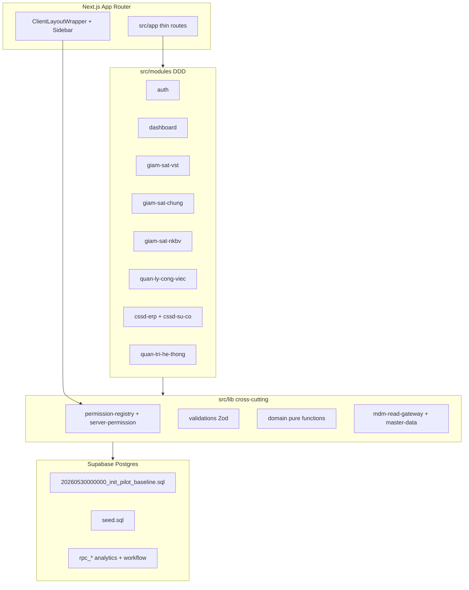
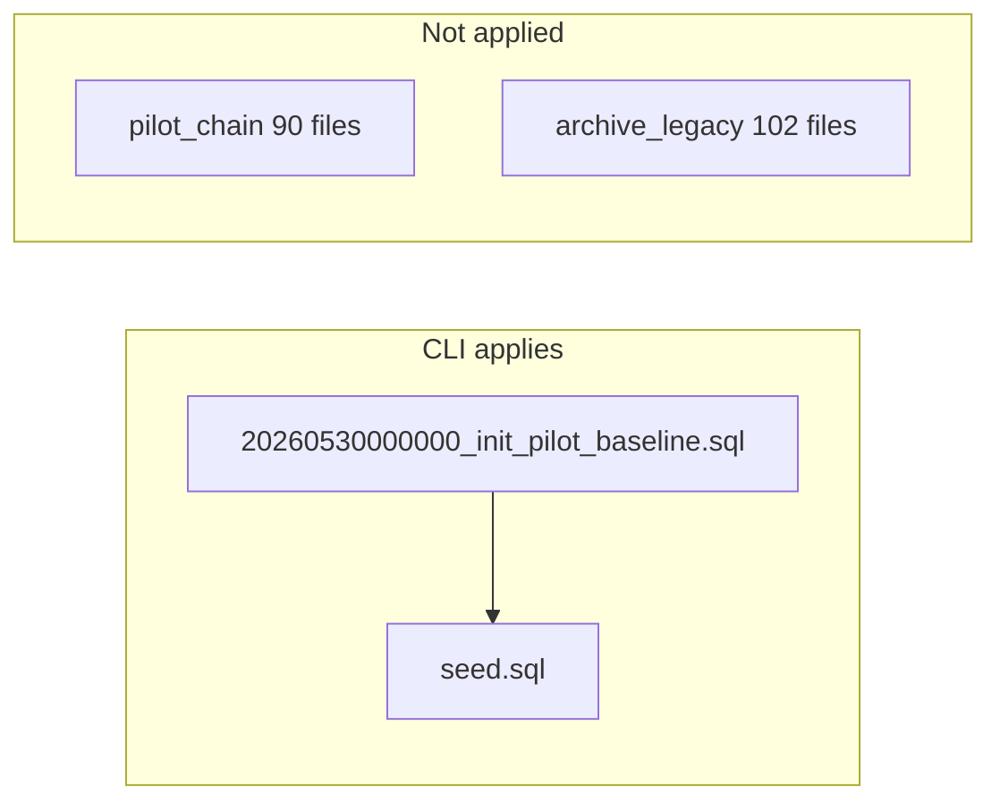
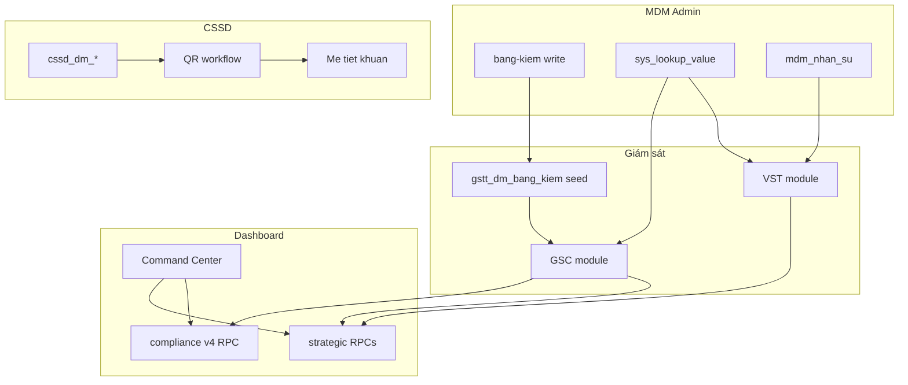

# BV103 — Rà soát kiến trúc toàn diện & lộ trình phát triển

> **Mục đích:** Một lần xem lại toàn bộ để lên kế hoạch phát triển tiếp.  
> **SSOT kỹ thuật:** [docs/core/implementation-mapping.md](docs/core/implementation-mapping.md) + Postgres thực tế.  
> **SSOT nghiệp vụ:** [docs/core/domain-specification.md](docs/core/domain-specification.md) (cần cập nhật tên bảng prefix mới).

---

## A. Tổng quan hệ thống

BV103 là **ERP KSNK (Kiểm soát nhiễm khuẩn)** cho Bệnh viện 103: giám sát lâm sàng (VST, GSC, NKBV), vận hành CSSD, quản lý công việc nội bộ KSNK, và quản trị master data + RBAC.



**Stack:** Next.js 16 (App Router), React 19, Server Actions, Supabase (Auth + Postgres + RLS), TanStack Query, Zod.

**Nguyên tắc kiến trúc (đang áp dụng):**
- Route mỏng → View/Context trong module → Server Action → DB (RPC hoặc query có phân trang).
- RBAC: `verifyPermission()` trên mọi mutation/read nhạy cảm; client gate qua `usePermission` + nav gates.
- Ranh giới **CSSD vận hành** vs **MDM danh mục**: catalog/inventory ở `/cssd-*`; CRUD master ở `/quan-tri-he-thong/danh-muc/*`.
- Domain thuần ở `src/lib/domain/` — không import Supabase/React.

---

## B. Domain nghiệp vụ — viết lại đầy đủ

### B1. Hệ thống & Quản trị (`auth`, `quan-tri-he-thong`)

| Domain | Người dùng | Chức năng chính | Route | Module code |
|--------|------------|-----------------|-------|-------------|
| **Auth nhân sự** | NVYT | Đăng nhập staff, quên/đổi mậ khẩu, liên kết tài khoản | `/login`, `/tai-khoan` | [src/modules/auth](src/modules/auth) |
| **RBAC** | Admin KSNK | Ma trận quyền module×action, đồng bộ registry | `/quan-tri-he-thong` tab phân quyền | [phan-quyen/actions/rbac.actions.ts](src/modules/quan-tri-he-thong/phan-quyen/actions/rbac.actions.ts) |
| **MDM Hub** | Admin | Danh mục khoa, nhân sự, thiết bị, hóa chất, dụng cụ, registry động | `/quan-tri-he-thong/danh-muc/*` | [danh-muc/](src/modules/quan-tri-he-thong/danh-muc/) |
| **Bảng kiểm MDM** | Admin KSNK | Template checklist 36 mẫu canonical, tiêu chí JSONB | `/quan-tri-he-thong/bang-kiem` | [bang-kiem/](src/modules/quan-tri-he-thong/bang-kiem/) |
| **Audit trail** | Admin | Nhật ký thay đổi `sys_audit_log` | tab audit | [views/AuditTrailView.tsx](src/modules/quan-tri-he-thong/views/AuditTrailView.tsx) |
| **MDM governance** | Admin | Registry field, gợi ý, smart import Excel | tab governance | [mdm-governance.actions.ts](src/modules/quan-tri-he-thong/danh-muc/actions/mdm-governance.actions.ts) |

**Thực thể DB (physical):** `sys_*` (lookup, RBAC, audit, registry, module locks), `mdm_nhan_su`, `mdm_dm_khoa_phong`.  
**Compat reads:** `dm_khoa_phong`, `v_auth_user_permissions`, hàng chục view `dm_*` lọc từ `sys_lookup_value`.

---

### B2. Giám sát — VST (Vệ sinh tay WHO)

| Khái niệm | Ý nghĩa |
|-----------|---------|
| **Phiên VST** | Một lần giám sát tại khoa/khu vực trong ngày |
| **Quan sát** | Một NVYT được quan sát nhiều **cơ hội** (5 moments) |
| **Cơ hội** | Moment + hành động (rửa tay/chà cồn/bỏ sót) + đánh giá kỹ thuật |

**Luồng:** Form multi-person → `vst-write-save-session` → `gstt_fact_vst_sessions` + `gstt_fact_vst` (compat `fact_giam_sat_vst_*`).  
**Analytics:** Tab Thống kê module → `rpc_dashboard_vst_strategic_analytics`.  
**Route:** `/giam-sat-vst` (tab `?tab=history|analytics|form`); `/giam-sat-vst/lich-su` redirect → `?tab=history`.  
**Quyền:** `GIAM_SAT_VST` (VIEW/CREATE/EDIT/DELETE/IMPORT).  
**Constants SSOT:** [src/modules/giam-sat-vst/lib/vst-constants.ts](src/modules/giam-sat-vst/lib/vst-constants.ts).

**Khóa dữ liệu:** `sys_module_locks` module `VST` — không sửa phiên đã khóa ngày.

---

### B3. Giám sát chung — GSC (Checklist động)

| Khái niệm | Ý nghĩa |
|-----------|---------|
| **Bảng kiểm** | Template từ `gstt_dm_bang_kiem` (36 mẫu seed) |
| **Phiên GSC** | Một lần giám sát theo template + ngữ cảnh (khoa, hình thức, cách thức) |
| **Kết quả** | `results_jsonb` inline (đã bỏ EAV `fact_giam_sat_chung_results`) |
| **Loại giám sát** | `TUAN_THU`, `NHAT_KY_VAN_HANH`, `DANH_GIA_HE_THONG` — route slice |

**Routes (cùng view, filter khác):**
- `/giam-sat-chung` — mặc định
- `/giam-sat-chung/tuan-thu` — tuân thủ IPAC
- `/giam-sat-chung/nhat-ky` — nhật ký vận hành
- `/giam-sat-chung/he-thong` — đánh giá hệ thống

**Scoring:** [src/lib/domain/giam-sat-scoring.ts](src/lib/domain/giam-sat-scoring.ts), [giam-sat-chung.domain.ts](src/lib/domain/giam-sat-chung.domain.ts) — TY_LE, TRON_GOI, DAT_KHONG_DAT.  
**Dashboard tuân thủ:** Command Center widget + `rpc_get_compliance_dashboard_v4` (IPAC slim, không Pareto RCA/ACT cũ).  
**Strategic tab:** `rpc_dashboard_gsc_strategic_analytics`.

**Reform 2026-05-29:** Đã DROP cột Phần 3–4 trên fact (`phieu_phan_tich_jsonb`, VST RCA fields) — app không còn workflow RCA ticket.

---

### B4. Giám sát NKBV / HAI

| Khái niệm | Ý nghĩa |
|-----------|---------|
| **Stay-centric** | Mọi sự kiện gắn lượt nằm viện / bệnh án |
| **Ca NKBV** | Sự kiện nhiễm khuẩn (UTI, BSI, PNEU, SSI, VAE…) |
| **Vi sinh** | Kết quả CKS, MDRO |
| **Mẫu số** | Báo cáo định kỳ (daily, phẫu thuật) |

**DB:** `nkbv_fact_*`, `nkbv_dm_cdc_baseline`; compat views `fact_nkbv_*`, `dm_loai_nkbv`.  
**Route:** `/giam-sat-nkbv`.  
**Trạng thái:** MVP mở rộng — clinical sub-forms (BSI, PNEU, SSI, UTI, VAE), adjudication, rules engine ([nkbv-rules-engine.ts](src/modules/giam-sat-nkbv/lib/nkbv-rules-engine.ts)).  
**Chưa có:** Tích hợp HIS/LIS realtime (roadmap FHIR trong UNIFIED_DOMAIN_SPEC).

---

### B5. CSSD — Tái xử lý dụng cụ

**6 trạm QR workflow:** Tiếp nhận → Làm sạch → Đóng gói → Tiệt khuẩn → Kho → Phát trả.

| Surface | Route | Context entrypoint |
|---------|-------|------------------|
| Quy trình + QR | `/cssd-quy-trinh` | `processing-lifecycle` |
| Mẻ tiệt khuẩn | `/cssd-erp/batch` | `sterilization-batch` |
| Kho dụng cụ | tab kho / `/cssd-dung-cu` | `inventory-instrument`, `instrument-catalog` |
| Hóa chất | `/cssd-hoa-chat` | `inventory-chemical` |
| Thiết bị + bảo trì | `/cssd-thiet-bi` | `maintenance` |
| Báo cáo | `/cssd-erp/report` | `reporting` |
| Sự cố | `/cssd-su-co` | `cssd-su-co` module |

**DB prefix:** `cssd_dm_*`, `cssd_fact_*` (15 bảng physical).  
**RPC chính:** `rpc_scan_workflow_station`.  
**Legacy redirects:** 9 route `/cssd-erp/*`, `/cssd-tiep-nhan` → canonical ([cssd-routes.ts](src/lib/cssd-routes.ts)).

**QLDCPT gaps (P0–P3)** — xem [reform-plan.md](docs/modules/cssd/reform-plan.md): thiếu Digital BOM tại trạm Đóng gói, Spaulding engine, facade CSSD↔MDM, trace NKBV↔CSSD.

---

### B6. Quản lý công việc — QLCV (Track B)

| Khái niệm | Ý nghĩa |
|-----------|---------|
| **Công việc** | Task nội bộ KSNK, 7 trạng thái |
| **Định kỳ** | Rule spawn hàng ngày/tuần |
| **Đề xuất / Hoạt động** | Workflow phụ |

**DB:** `qlcv_fact_cong_viec`, `qlcv_fact_cong_viec_dinh_ky`, `qlcv_fact_cong_viec_hoat_dong`, `qlcv_fact_danh_gia_thang`.  
**RPC:** `fn_fact_cong_viec_spawn_dinh_ky_hom_nay`, `fn_qlcv_tong_hop_thang`.  
**RLS:** Cô lập theo khoa.  
**Route:** `/quan-ly-cong-viec`.

---

### B7. Dashboard — Command Center (hybrid reform)

**Thiết kế hiện tại (post-reform):**
- **Command Center (`/`):** Shell mỏng — filter chung, widget cards, lazy load.
- **RPC hot path:** `rpc_dashboard_vst_strategic_analytics`, `rpc_dashboard_gsc_strategic_analytics`, `rpc_get_compliance_dashboard_v4`, `rpc_get_dashboard_ksnk_staff_supervision_stats`.
- **Analytics sâu:** Tab Thống kê trong module VST/GSC — không còn stack dashboard v1/v2/v3 UI cũ.

**Pre-aggregation (legacy, vẫn trong baseline):** `gstt_fact_*_summary` + trigger sync — song song với RPC v4 đọc `results_jsonb`. Cần quyết định dần deprecate summary path nếu v4 đủ nhanh.

---

## C. Cấu trúc App (code)

### C1. Lớp routing — [src/app/](src/app/)

43 `page.tsx`: pattern **import dynamic view từ module**, metadata tối thiểu. Không business logic trong route.

**Nhóm route:**
- Auth: `(auth)/login/*`
- Dashboard: `/` (ssr: false)
- Giám sát: `giam-sat-*`
- CSSD: `cssd-*` + redirects
- Admin: `quan-tri-he-thong/*`
- QLCV: `(dashboard)/quan-ly-cong-viec`

### C2. Modules — [src/modules/](src/modules/) (9 module)

| Module | ~actions | Pattern |
|--------|----------|---------|
| `cssd-erp` | 22+ | DDD contexts + workflow state engine |
| `quan-tri-he-thong` | 30+ | Nested danh-muc/bang-kiem/rbac |
| `giam-sat-chung` | 11 | Session read/write + compliance v4 |
| `quan-ly-cong-viec` | 9 | Workflow + monthly analytics |
| `giam-sat-vst` | 6 | Form handlers + strategic RPC |
| `giam-sat-nkbv` | 5+ | Clinical expansion |
| `dashboard` | 2 | Command center orchestration |
| `cssd-su-co` | 2 | Incident domain/application split |
| `auth` | 3 | Staff session |

### C3. Shared lib — [src/lib/](src/lib/)

| Nhóm | File quan trọng |
|------|-----------------|
| Security | `server-permission.ts`, `permission-registry.ts`, `actor-ksnk-scope-server.ts` |
| Validation | `validations/*.validations.ts` |
| Domain | `domain/giam-sat-*.ts` |
| MDM | `mdm-read-gateway.ts`, `master-data/repository.ts` |
| CSSD cross | `cssd-routes.ts`, `cssd-server-gates.ts` |
| Offline | `offline-sync.ts`, `offline-pending-supervision-save.ts` |
| Analytics | `analytics/filter-helpers.ts`, `bv103-analytics-default-range.ts` |
| Nav | `nav/ksnk-nav-gates.ts` |

### C4. UI shell — [src/components/shared/](src/components/shared/)

- `Sidebar.tsx` — nav gates OR semantics
- `ClientLayoutWrapper` — auth gate (client-side, **không middleware.ts**)
- Layout primitives: [layout-primitives.md](docs/modules/giam-sat/layout-primitives.md)

### C5. RBAC model

4 nhóm module (`SYSTEM`, `MASTER_DATA`, `CSSD`, `SUPERVISION`) × actions (`VIEW`, `CREATE`, `EDIT`, `DELETE`, `IMPORT`, `EXPORT`, `APPROVE`, `QC`, `LOCK`).  
DB SSOT: `sys_permissions`, `sys_roles`, `sys_user_roles`, `sys_role_permissions`.  
Read cache: view `v_auth_user_permissions`.

---

## D. Cấu trúc Database (Supabase)

### D1. Trạng thái migration sau squash (commit `8a8a1ed`)



| Thành phần | Chi tiết |
|------------|----------|
| **Apply** | 1 migration (~435 KB schema) + seed (~167 KB) |
| **Archive** | 192 file SQL — audit only |
| **Local reset** | `npx supabase db reset --local` (~30s) |
| **Seed có data** | `sys_lookup_value`, `gstt_dm_bang_kiem` (36 templates) |
| **Seed KHÔNG có** | RBAC roles, nhân sự, CSSD inventory, fact giám sát |

### D2. Prefix bounded context (46 bảng physical)

| Prefix | Count | Vai trò |
|--------|-------|---------|
| `cssd_` | 15 | Dụng cụ, quy trình, kho, mẻ TK, sự cố |
| `sys_` | 10 | Lookup SSOT, RBAC, audit, registry, locks |
| `gstt_` | 9 | Giám sát + dashboard summary tables |
| `qlcv_` | 4 | Công việc nội bộ |
| `nkbv_` | 6 | HAI surveillance |
| `mdm_` | 2 | Khoa phòng, nhân sự |

**~100 compat views** (`dm_*`, `fact_*`, `v_*`) — `security_invoker=true`, đọc qua app hiện tại.

### D3. RPC analytics (app đang gọi)

| RPC | Consumer |
|-----|----------|
| `rpc_dashboard_vst_strategic_analytics` | VST strategic tab |
| `rpc_dashboard_gsc_strategic_analytics` | GSC strategic tab |
| `rpc_get_compliance_dashboard_v4` | Command Center compliance |
| `rpc_get_dashboard_ksnk_staff_supervision_stats` | Command Center staff |
| `rpc_get_registry_options` | RegistrySelect, forms |
| `rpc_scan_workflow_station` | CSSD QR scan |

**Legacy RPC vẫn trong baseline** (v2, multi_v1/v2, vst_dashboard) — app không gọi; candidate DROP sau audit.

### D4. RLS & audit

- Admin core: RLS additive (12+ bảng), defense-in-depth khi chuyển user client.
- CSSD facts: RLS SELECT/ALL theo module permission (một số policy legacy `authenticated` — deferred hardening).
- Audit: `sys_audit_log` + trigger `fn_sys_audit_row` trên fact quan trọng.
- Module lock: VST/GSC không sửa phiên đã khóa ngày.

---

## E. Cách vận hành phần mềm

### E1. Vòng đời request (typical)

1. User mở route → `ClientLayoutWrapper` kiểm tra session Supabase Auth.
2. `Sidebar` ẩn/hiện menu theo `usePermission` + nav gates.
3. View load → Server Action hoặc client fetch (TanStack Query).
4. Action → `verifyPermission(module, action)` → Supabase user client hoặc service role (bootstrap RBAC only).
5. Mutation → optional `revalidateTag` master data / module cache.
6. Offline (VST/GSC): queue local → sync khi online ([offline-sync.ts](src/lib/offline-sync.ts)).

### E2. Vòng đời dữ liệu pilot

```bash
# Local fresh (chấp nhận mất data)
npx supabase db reset --local
npm run trial:db:precheck:local
npm run verify:mdm:local

# Dev app
npm run dev

# Trước push/ship
npm run verify:full   # lint + layout + cssd + engineering + build
npm run pilot:ship  # + migrate linked + precheck
```

### E3. Governance pipeline

- Schema change → `supabase migration new` → root migrations only → changelog mapping doc.
- Không SQL nóng trên remote ([operations-sop.md](docs/core/operations-sop.md)).
- Một vertical slice / PR ([lean-execution.md](docs/core/lean-execution.md)).

---

## F. Tương tác giữa các cấu phần



**Coupling quan trọng:**
- GSC **phụ thuộc** seed bảng kiểm — không seed = form trống.
- Dashboard **phụ thuộc** RPC DB — không fallback app-side aggregation (đúng hướng Smart DB).
- CSSD catalog page **OR gate** `CSSD_KHO_DUNGCU` + `DANH_MUC` VIEW.
- NKBV clinical rules **độc lập** domain layer — có thể test thuần.

---

## G. Ảnh hưởng migration squash — trả lời trực tiếp

| Câu hỏi | Trả lời |
|---------|---------|
| **App code có đổi contract?** | **Không** — baseline = end state của 90 migration; RPC/tên bảng compat giữ nguyên. |
| **Local dev** | **Phải** `db reset --local` (không incremental từ chain cũ). Mất toàn bộ data local. |
| **Seed bắt buộc** | **Có** — 36 bảng kiểm + lookup; thiếu seed = GSC không chạy pilot. |
| **RBAC / nhân sự local** | **Trống** sau reset — cần script UAT seed admin ([scripts/seed-uat-medical-record.ts](scripts/seed-uat-medical-record.ts)) hoặc manual. |
| **Remote linked đã apply 90 file** | **Không push** baseline mới blindly — `schema_migrations` mismatch. Cần DB mới hoặc `migration repair` + maintenance window. |
| **Precheck** | Đã cập nhật: `fact_gsc_results_ok` → kiểm `gstt_fact_chung_sessions.results_jsonb`; thêm `unaccent` trong baseline. |
| **Archive 192 file** | Chỉ tra cứu lịch sử — **không** apply. |
| **Migration mới sau squash** | File timestamp mới trong root — bình thường. |

**Rủi ro cần theo dõi:**
- Baseline pg_dump có thể chứa RPC legacy + view alias thừa → tăng surface audit.
- `seed.sql` không có `sys_roles`/`sys_permissions` — pilot UAT cần bước bootstrap riêng.
- CI không chạy full `verify:cssd` / `verify:mdm` — local gate nghiêm hơn CI.

---

## H. Nợ kỹ thuật (debt register)

### H1. P0 — ảnh hưởng nghiệp vụ / data integrity

| ID | Mô tả | Vị trí |
|----|-------|--------|
| D-01 | Digital BOM checklist trạm Đóng gói chưa có — `so_luong_thuc_te` không cập nhật | QLDCPT B1 |
| D-02 | Ledger bypass `assertLedgerDuChoCapPhat` khi không có ledger | CSSD workflow |
| D-03 | Remote migration history vs squash baseline — chưa có runbook prod cutover | ops |
| D-04 | Local reset thiếu RBAC/nhân sự seed — login pilot khó | seed/bootstrap |

### H2. P1 — kiến trúc / maintainability

| ID | Mô tả | Vị trí |
|----|-------|--------|
| D-05 | ~40 file app vẫn query view alias cũ (`v_fact_*`, `v_dm_*`) — Step 2 view rename chưa xong | [view-rename-mapping-20260526.md](docs/archive/baselines/view-rename-mapping-20260526.md) |
| D-06 | Dashboard naming drift: `strategic-dashboard-v3.types.ts` chứa V4 payload | dashboard module |
| D-07 | Dual dashboard data path: summary tables vs RPC v4 unnest | DB + docs |
| D-08 | 9 legacy CSSD redirect routes — giữ compat URL | src/app/cssd-* |
| D-09 | Auth gate client-only — không Next.js middleware | security posture |
| D-10 | UNIFIED_DOMAIN_SPEC dùng tên bảng cũ (`fact_*`) — lệch mapping | docs |

### H3. P2 — chất lượng / perf / CI

| ID | Mô tả | Vị trí |
|----|-------|--------|
| D-11 | CSSD RLS legacy `authenticated` chưa module-scoped | cssd-perf-baseline |
| D-12 | CI thiếu `verify:cssd`, `layout:drift-check` | .github/workflows/ci.yml |
| D-13 | Legacy RPC trong baseline chưa DROP | baseline SQL |
| D-14 | NKBV clinical forms — spec đầy đủ, implementation partial | giam-sat-nkbv |
| D-15 | Large unstaged feature diff (~370 files) — chưa commit vertical slices | git |

### H4. P3 — roadmap / deferred

| ID | Mô tả |
|----|-------|
| D-16 | Spaulding/heat domain engine (QLDCPT B2) |
| D-17 | CSSD↔MDM facade replenish (B3) |
| D-18 | NKBV↔CSSD trace `quy_trinh_id` (B5) |
| D-19 | Cycle QR vs permanent set QR (B7) |
| D-20 | HIS/LIS FHIR integration |

**Ghi chú:** Inline `TODO/FIXME` trong `src/modules` ≈ **0** — nợ nằm ở compat layers và working plans, không ở comment.

---

## I. Đề xuất cải tiến toàn diện (phased roadmap)

### Phase 0 — Ổn định nền (1–2 tuần)

1. **Bootstrap seed pack:** `supabase/seeds/00-rbac.sql` + `01-pilot-nhan-su.sql` (tách khỏi migration; optional profile `minimal` vs `uat`).
2. **Runbook remote squash:** Document + script `migration repair` cho staging/linked.
3. **Commit vertical slices** còn unstaged (NKBV, GSC scoring, VST import fix) — tách PR theo module.
4. **Cập nhật UNIFIED_DOMAIN_SPEC** — đồng bộ prefix + bỏ RCA/part34 đã drop.
5. **Align CI** với `verify:cssd` + `docs:links:check`.

### Phase 1 — Dọn compat & contract (2–4 tuần)

1. **View rename Step 2:** grep `v_fact_`/`v_dm_` → chuyển sang `v_gstt_`/`v_cssd_` → DROP alias views (1 migration).
2. **Dashboard cleanup:** rename types file v4; document single RPC path; benchmark summary tables vs v4 → quyết định deprecate triggers nếu latency OK.
3. **DROP legacy RPC** không app reference (migration additive-safe: comment DEPRECATED trước, DROP sau 1 sprint).
4. **Middleware auth pilot:** evaluate Next.js middleware cho `/quan-tri-he-thong`, `/cssd-*` (defense in depth).

### Phase 2 — CSSD QLDCPT P0 (4–6 tuần)

1. Digital Checklist Panel tại trạm Đóng gói ([DigitalChecklistPanel.tsx](src/modules/cssd-erp/components/workflow/DigitalChecklistPanel.tsx) — wire đầy đủ).
2. Ledger gate cứng — bỏ bypass "no ledger = skip".
3. CSSD catalog permission facade — một entry permission cho replenish.
4. Perf baseline CSSD kho realtime view.

### Phase 3 — NKBV clinical depth (6–10 tuần)

1. Hoàn thiện sub-forms + rules engine theo [clinical-forms.md](docs/modules/nkbv/clinical-forms.md).
2. Adjudication workflow + CDC metrics panel production-ready.
3. Vi sinh import portal + mẫu số daily.
4. Chuẩn bị hook `quy_trinh_id` cho SSI trace (QLDCPT B5).

### Phase 4 — UX & observability (song song)

1. Layout drift CI + BV103_LAYOUT_PRIMITIVES enforcement.
2. `pg_stat_statements` review top 10 slow RPC — EXPLAIN hybrid script định kỳ.
3. E2E pilot smoke: login → VST session → GSC session → CSSD scan (Playwright).
4. Offline sync hardening tests.

### Phase 5 — Integration (dài hạn)

HIS/LIS FHIR, environmental/laundry modules — chỉ sau Phase 1–3 ổn định.

---

## J. Deliverable đề xuất (tài liệu cần viết)

Sau khi approve plan này, triển khai **một SSOT mới** (không scatter):

| Doc | Nội dung |
|-----|----------|
| **`docs/reference/architecture/system-overview.md`** | Sections A–F của plan này (domain + app + DB + flows) |
| **`docs/reference/architecture/interaction-matrix.md`** | Bảng module×module dependency + sequence diagrams |
| **`docs/reference/architecture/debt-register.md`** | H1–H4 với owner, priority, exit criteria |
| **`docs/reference/architecture/roadmap-2026h2.md`** | Phase 0–5 với DoD mỗi phase |
| **Cập nhật** `implementation-mapping.md` | Squash note + view alias status |
| **Cập nhật** `domain-specification.md` | Prefix names, bỏ entities dropped |

Diagram tools: mermaid trong markdown; giữ sync với code qua `docs:links:check`.

---

## K. Tiêu chí “khoa học & tối ưu”

| Trục | Nguyên tắc BV103 |
|------|------------------|
| **Domain** | Bounded context rõ (`cssd_`, `gstt_`, `nkbv_`, `qlcv_`, `sys_`); không thêm nguồn lookup song song |
| **Database** | Smart DB: RPC push-down, pagination, index FK; không pre-agg mới không đo được |
| **App** | Vertical slice, Server Actions, verifyPermission mọi path |
| **UI** | Thin Command Center + module analytics; layout primitives; không card lồng card |
| **Ops** | Migration in git only; local reset + seed; remote có runbook |

**Không nên làm ngay:** rewrite toàn repo; thêm microservices; thêm summary tables; xóa archive migration (cần audit trail).
