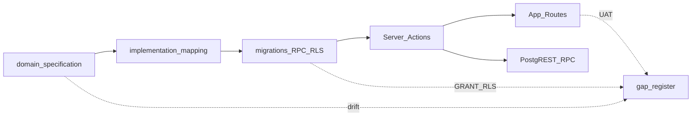

# Comprehensive review

Một chuỗi. Mục trên cùng là bản cuối.

## 2026-07-09

# Rà soát tổng thể hệ thống KSNK BV103 — 2026-07-09

> **Phạm vi:** Chương trình rà soát toàn diện (1B báo cáo trước / 2A Domain→DB→BE→UI→Features)  
> **Repo head:** `1c8e057` · working tree có thay đổi cleanup dead-code (không thuộc audit này)  
> **Phương pháp:** Ground-truth — code + migrations + gate tĩnh. **Không** copy kết luận audit 06/2026.  
> **Evidence:** [audit-evidence-pack.md#2026-07-09](./audit-evidence-pack.md#2026-07-09)  
> **Gap:** [gap-register.md#2026-07-09](./gap-register.md#2026-07-09)

---

## 1. Executive summary

Hệ thống **KSNK BV103** (Next.js 16 / React 19 / Supabase Postgres) sau cải tổ pilot 06–07/2026 đạt **gate engineering/CSSD/pilot PASS**, legacy table guard sạch, **0 unused view**. Debt-register trước đó ghi P0/P1 = 0 — **audit này mở lại một số P0/P1 có bằng chứng mới** (NKBV Day-3 server, QLCV checklist RPC GRANT, CSSD BOM auto-stamp, GSC RPC chưa harden như VST).

**Top findings (có bằng chứng):**

| ID | Mức | Finding |
|----|-----|---------|
| DOM-07 / FEAT-NKBV-01 | **P0** | Import vi sinh: UI tính Day-3 (`isHaiSuspect`) nhưng server tạo `nkbv_fact_su_kien` cho **mọi** dòng — ca POA lọt giám sát HAI |
| BE-RPC-01 | **P0** | `fn_qlcv_update_checklist` SECURITY DEFINER + `GRANT authenticated`, không check quyền trong RPC |
| DOM-04 | **P1** | CSSD Trạm Đóng gói: quét QR tự ghi `bom_kiem_dem_at` không qua checkpoint cấu phần |
| DOM-08 / FEAT-NKBV-02 | **P1** | NKBV UAT lâm sàng 4/5 kịch bản tay chưa ký; trạng thái auto-case `DANG_GHI_NHAN` ≠ checklist `CHO_XAC_MINH` |
| BE-RPC-02 | **P1** | GSC analytics RPC chưa parity harden VST (`fn_require_gstt_analytics_access`) |
| OPS-01 | **P1** | Docker/local golden **Blocked** trong session audit — không xác nhận parity DB live |
| UI-01 | **P2** | `layout:drift-check` 2 adoption (QrCameraModal, IncidentReportModal) |
| BE-ORPHAN-01 | **P3** | 5 file Pilot W3 latent (dead-code WARN) |

**Rubric tổng hợp (1–5):**

| Dimension | Điểm | Ghi chú |
|-----------|------|---------|
| Domain accuracy | **3.5** | VST/GSC/Dashboard tốt; NKBV Day-3 + CSSD BOM yếu |
| Structural clarity | **4** | Module DDD rõ; orphan W3 + dual analytics path nhỏ |
| DB discipline | **3.5** | Prefix SSOT; RLS fact GSTT/CSSD workflow Done; summary/NKBV/GSC RPC residual |
| UI coherence | **4** | Typography OK; 2 panel chrome adoption |
| Operability | **2.5** | Engineering PASS; local Docker blocked session này |
| Security depth | **3** | `proxy.ts` session OK; RPC GRANT authenticated còn lỗ |

---

## 2. Phương pháp & phạm vi

### Thứ bậc nguồn sự thật

1. `src/`, `supabase/migrations/`, `scripts/` trên HEAD  
2. Gate npm (engineering, cssd, pilot, audit:views/rpc, layout)  
3. SSOT docs — chỉ phát hiện **drift**  
4. Live Postgres — **Blocked** (Docker)

### Out of scope (theo plan)

- Không sửa code ứng dụng trong đợt rà soát  
- Không nâng ưu tiên roadmap D-15…D-20 trừ finding mới  
- Không đo perf staging (token/env)

---

## 3. Domain nghiệp vụ

| Context | Điểm | Verdict ngắn |
|---------|------|--------------|
| VST/GSC | 4 | Schema + RPC + routes reform khớp; spec §2.1 còn nhắc trigger summary cũ (DOM-01) |
| CSSD | 3 | 6 trạm OK; BOM auto-stamp (DOM-04); ledger soft-warning khớp spec nhưng lệch changelog hard-gate (DOM-05) |
| QLCV | 4 | Spawn + checklist RPC hoạt động; CHECK còn mã legacy (DOM-10) |
| NKBV | 3 | Rules engine + forms OK; **Day-3 server gap P0**; UAT chưa ký |
| Dashboard | 4 | V4 DROP; strategic RPC; 1 action đọc summary VIEW trực tiếp (DOM-02) |
| MDM/RBAC | 4 | Registry + master-crud OK; auth session qua `proxy.ts` (không cần middleware.ts — Next 16) |

Chi tiết gap: `DOM-*` trong [gap-register.md#2026-07-09](./gap-register.md#2026-07-09).

---

## 4. Database

- **92** migrations · head `20260704120000`  
- Views: 0 unused · 16 sql-only (KEEP; 2 CANDIDATE_REVIEW)  
- RLS: GSTT 3 fact phiên hardened (`20260703100000`); CSSD workflow (`20260603160000`); residual summary views / CSSD kho-bảo trì / NKBV `USING(true)`  
- G-11 trong gap-register-0703 ghi backlog nhưng migration đã apply → **doc drift** (DB-01)  
- Dual naming `fact_*_summary` ↔ `gstt_fact_*_summary` (compat alias) — DB-05  

Chi tiết: `DB-*`.

---

## 5. Backend

- Auth L1: [`src/proxy.ts`](../../../src/proxy.ts) — session JWT trước RSC (đúng Next 16; **không** thiếu middleware)  
- Auth residual: guest path / inactive staff chủ yếu client; prefetch skip `getUser`  
- Mutation actions: không thấy insert/update không guard (đa pattern `verifyPermission` / `verifyCssd*` / `ensureQlcv*`)  
- **P0:** `fn_qlcv_update_checklist` GRANT authenticated không permission check  
- **P1:** GSC + CSSD SECURITY DEFINER RPC còn GRANT rộng so với VST  

Chi tiết: `BE-*`.

---

## 6. UI / UX

| Gate | Kết quả |
|------|---------|
| Typography | PASS |
| Layout drift | FAIL 2 adoption-warn (modal QR + sự cố CSSD) |
| Touch | Form giám sát chính có `h-11` / `touch-manipulation` — chấp nhận pilot |
| Perf | Kế thừa [perf-audit-20260703.md](./perf-audit-20260703.md) — exceljs lazy Done; không regression mới đo được |

Chi tiết: `UI-*`.

---

## 7. Tính năng 7 khối pilot

| Khối | Gate session này | Checklist tay PO |
|------|------------------|------------------|
| MDM / Quản trị | engineering + danh-mục (không re-run full admin) | ☐ |
| GSC + VST | test:pilot + engineering PASS; smoke local **Blocked** | ☐ |
| QLCV | engineering PASS; RPC checklist **P0 risk** | ☐ |
| CSSD | verify:cssd **49 PASS** | ☐ |
| Dashboard | test:pilot **24 PASS** | ☐ |
| NKBV | rules engine (prior); import Day-3 **P0** | ☐ UAT 2–5 |
| Auth/RBAC | proxy + trial auth **Blocked** Docker | ☐ |

Nguồn checklist: [pilot-module-automated-gates-20260703.md](./pilot-module-automated-gates-20260703.md) + NKBV clinical checklist.

---

## 8. Liên thông domain → cấu phần



Điểm gãy chính: **spec/checklist NKBV ↔ import action**; **changelog CSSD hard-gate ↔ code soft**; **VST RPC harden ↔ GSC chưa**; **gap-register G-11 ↔ migration đã Done**.

---

## 9. Verdict

| Câu hỏi | Trả lời |
|---------|---------|
| Rườm rà? | Trung bình — orphan W3 + compat summary alias còn, không chặn pilot |
| Chồng chéo? | Thấp — dual path analytics TGS + QLCV dashboard latent |
| Khoa học / SSOT? | Tốt về prefix + gate; **yếu** ở enforce Day-3 server và RPC GRANT |
| Sẵn go-live? | **Chưa** nếu bật NKBV import LIS production; core GSC/VST/QLCV/CSSD engineering sẵn hơn — cần mở Docker + đóng P0 |

---

## 10. Remediation (tóm tắt)

Xem hàng đợi đầy đủ trong [gap-register.md#2026-07-09](./gap-register.md#2026-07-09) § Hàng đợi implement.

**Ưu tiên chat tiếp theo (1 gap / chat):**

1. `DOM-07` — Day-3 server-side import NKBV  
2. `BE-RPC-01` — revoke/harden `fn_qlcv_update_checklist`  
3. `DOM-04` — bỏ auto `bom_kiem_dem_at` khi quét  
4. `BE-RPC-02` — harden GSC analytics RPC như VST  
5. `OPS-01` — PO mở Docker → re-run golden + cập nhật evidence  

**Không implement trong chat rà soát này** (theo quyết định 1B).

## 2026-06-03

# Rà soát tổng thể hệ thống KSNK BV103

> **Ngày rà soát:** 2026-06-03  
> **Phạm vi:** Project HEAD (`refactor/dashboard-hybrid-reform`, commit `11eb574…`, working tree dirty)  
> **Phương pháp:** Ground-truth — code + migrations + DB local/staging + automated gates. **Không** copy báo cáo 2026-05-30.  
> **Evidence pack:** [audit-evidence-pack.md#2026-06-03](./audit-evidence-pack.md#2026-06-03)

---

## Mục lục

1. [Executive summary](#1-executive-summary)
2. [Phương pháp & phạm vi](#2-phương-pháp--phạm-vi)
3. [Domain nghiệp vụ](#3-domain-nghiệp-vụ)
4. [Kiến trúc ứng dụng](#4-kiến-trúc-ứng-dụng)
5. [Database](#5-database)
6. [UI / UX shell](#6-ui--ux-shell)
7. [Chất lượng codebase](#7-chất-lượng-codebase)
8. [Liên thông & traceability](#8-liên-thông--traceability)
9. [Verdict: rườm rà, chồng chéo, khoa học](#9-verdict-rườm-rà-chồng-chéo-khoa-học)
10. [Phụ lục lịch sử (so với 30/05)](#10-phụ-lục-lịch-sử-so-với-3005)
11. [Remediation](#11-remediation)

---

## 1. Executive summary

Hệ thống **KSNK BV103** là ERP giám sát nhiễm khuẩn + CSSD trên **Next.js 16 / React 19 / Supabase Postgres**, tổ chức theo **8 bounded context** trong `src/modules/`. Sau đợt reform tháng 5–6/2026, **runtime app đã chuẩn hóa prefix module** (`gstt_`, `cssd_`, `nkbv_`, …) và `legacy:guard` **pass** — đây là tiến bộ khoa học rõ so với báo cáo 30/05.

**Top findings (có bằng chứng):**

| ID | Mức | Finding |
|----|-----|---------|
| F-01 | **P0** | **Drift môi trường DB:** local chỉ 2 migration applied; staging 26/29; repo có tới `20260603140000`. Audit local EXPLAIN/size **không đại diện**. |
| F-02 | **P1** | **Không có `middleware.ts`** — auth redirect chỉ client (`ClientLayoutWrapper` + `onAuthStateChange`). |
| F-03 | **P1** | **Dashboard đa luồng:** RPC strategic V4 + bảng `gstt_fact_*_summary` (trigger) + báo cáo tổng hợp compose client — cần benchmark trước khi dọn summary. |
| F-04 | **P1** | **`quan-tri-he-thong` 137 file** — hub MDM/RBAC/danh mục chiếm ~28% module code; ranh giới CSSD↔MDM dễ lẫn. **Mitigation lộ trình (2026-07-17):** UX hub Lớp 3 sau khi Master CSSD ổn — không big-bang tách module; xem [`../../modules/mdm/improvement-roadmap-20260717.md`](../module-history/mdm/improvement-roadmap-20260717.md). |
| F-05 | **P2** | **Doc drift:** `implementation-mapping` vẫn nhắc compat view `v_fact_*`; `debt-register` D-05 **obsolete** (guard pass). |
| F-06 | **P2** | **Layout drift:** 22 chỗ radius tùy ý (`rounded-[32px]`/`[40px]`) vs `bv103LayoutChrome`. |
| F-07 | **P2** | **Ledger cấp phát:** `assertLedgerDuChoCapPhat` — thiếu BOM digital → **warning**, không chặn cứng. |
| F-08 | **P3** | **7 views sql-only** (dashboard hotpath) — hợp lệ nhưng cần catalog RPC. |
| F-09 | **Positive** | Digital BOM panel, GSC lock, NKBV↔CSSD trace, `bao-cao-tong-hop` có core spec — pilot maturity tăng. |
| F-10 | **Positive** | `verify:engineering` pass: 165 `verifyPermission`, 0 legacy `.from(fact_*)` trong `src/`. |

**Rubric tổng hợp (1–5):**

| Dimension | Điểm | Ghi chú |
|-----------|------|---------|
| Domain accuracy | **3.5** | Rules engine NKBV/VST/CSSD có test; một số KPI chỉ trong RPC/trigger |
| Structural clarity | **3** | DDD module rõ; dashboard + MDM hub nặng |
| DB discipline | **3** | Prefix SSOT tốt; **env drift** trừ điểm |
| UI coherence | **2.5** | Shell thống nhất; CSSD/NKBV/report lệch primitive |
| Operability | **2** | Local DB không đủ migration; staging thiếu 03/06 |

---

## 2. Phương pháp & phạm vi

### Thứ bậc nguồn sự thật

1. `src/`, `supabase/migrations/`, `scripts/` trên HEAD  
2. Postgres linked **staging** + **local** (introspection)  
3. SSOT docs — chỉ để phát hiện **drift**  
4. Báo cáo 2026-05-30 — **không** dùng làm nguồn kết luận

### Snapshot kỹ thuật

- **29** migration files; **87** Server Action files; **35** routes; **46** spec files trong `src/`
- Gates: `legacy:guard` PASS, `verify:engineering` PASS, `docs:links:check` PASS
- Chi tiết: [audit-evidence-pack.md#2026-06-03](./audit-evidence-pack.md#2026-06-03)

---

## 3. Domain nghiệp vụ

Đánh giá theo thứ tự **code/RPC → DB trigger → đối chiếu spec**.

### 3.1 VST (WHO 5 moments)

| Khía cạnh | Thực tế trên project | Fidelity |
|-----------|----------------------|----------|
| Phiên + quan sát | `gstt_fact_vst_sessions`, `gstt_fact_vst` | 4/5 |
| KPI % tuân thủ | RPC `rpc_dashboard_vst_strategic_analytics` + summary tables qua trigger (`20260530120000`) | 4/5 |
| UI | `VSTPage`, multi-person form, `/giam-sat-vst/lich-su` | 4/5 |

**Doc:** [`domain-specification.md`](../../core/domain-specification.md) đã map prefix `gstt_*`; cột legacy trong bảng chỉ là tham chiếu lịch sử — **chấp nhận được**.

### 3.2 GSC (checklist động)

| Khía cạnh | Thực tế | Fidelity |
|-----------|---------|----------|
| `results_jsonb` | `gstt_fact_chung_sessions` — không EAV | 5/5 |
| Scoring | `gsc-score-display.ts` + migration `20260602000000` backfill `cach_tinh_diem` | 4/5 |
| Module lock | `sys_module_locks` + `GscModuleLockBanner` — **mới**, ít doc module | 3/5 doc |

### 3.3 NKBV (HAI)

| Khía cạnh | Thực tế | Fidelity |
|-----------|---------|----------|
| Day-3 / rules | `nkbv-rules-engine.ts` + spec 400+ dòng | 4/5 |
| Clinical forms | BSI/UTI/VAP/SSI subforms trong `NkbvClinicalChecklistModal` | 3.5/5 — pilot đủ case chính |
| CSSD trace | `CssdTraceLink`, migration `20260602150000` | 4/5 — liên thông mới tốt |

### 3.4 CSSD (6 trạm)

| Khía cạnh | Thực tế | Fidelity |
|-----------|---------|----------|
| State machine | `cssd-state-engine.spec.ts`, `cssd-workflow-application.ts` | 4/5 |
| Digital BOM | `DigitalChecklistPanel.tsx` — load BOM, thiếu/thừa dụng cụ | **4/5** (D-01 **partial done**) |
| Mẻ tiệt khuẩn | `me-tiet-khuan-batch-heat.ts` + banner UI — batch heat pilot | 3.5/5 |
| Ledger | `assertLedgerDuChoCapPhat` — có `KIEM_DEM_BOM`; chưa qua checklist → **warning** | 3/5 (D-02 **softened**) |

### 3.5 QLCV

Lean workflow migrations (`20260531100000`…); đọc `v_qlcv_*`, fact `qlcv_fact_cong_viec`. Spawn cron `20260530082000`. **Fidelity 4/5.** TEXT+CHECK (D-QLCV-01) **Done 2026-06-04**; sync overdue modernized **2026-06-06**.

### 3.6 MDM / RBAC

- MDM gateway trong `quan-tri-he-thong` + `src/lib/master-data/`
- RBAC: migrations `20260602190000`, `20260603120000`, `20260603140000` (repo) — staging chưa có 03/06
- **Ranh giới CSSD vs MDM:** replenish qua `requestReplenishFromReserveAction` — đúng facade; risk khi import trực tiếp `v_cssd_*_summary` từ DM actions

### Domain fidelity tổng: **3.6 / 5**

---

## 4. Kiến trúc ứng dụng

### 4.1 Cấu trúc thư mục (thực tế)

```
src/app/          → 35 route mỏng (re-export views)
src/modules/      → 9 domain folders (DDD)
src/lib/          → RBAC, master-data, validations, analytics cross-cut
src/components/   → Shell shared (Sidebar, ClientLayoutWrapper, …)
```

### 4.2 Luồng chuẩn (verified sample)

`UI → *.actions.ts → verifyPermission → Supabase .from / .rpc`

Engineering scan: **165** `verifyPermission`, **16** `.rpc()`, **0** full-table fact reads flagged.

### 4.3 Module dependency (grep `@/modules`)

- **Dashboard** import type/action từ `giam-sat-vst`, `giam-sat-chung`, `giam-sat-nkbv`, `quan-ly-cong-viec` — **hub đọc chéo** (chấp nhận cho Command Center / báo cáo tổng hợp).
- **cssd-erp** ↔ **cssd-su-co** — incident modal, contracts schema.
- **cssd-erp** → MDM replenish — đúng pattern facade.

[`interaction-matrix.md`](../../reference/architecture/interaction-matrix.md) **còn đúng hướng** nhưng thiếu: GSC lock, `bao-cao-tong-hop`, NKBV trace, RBAC 03/06.

### 4.4 Anti-patterns (re-verify debt cũ)

| Debt cũ | Trạng thái 2026-06-03 | Bằng chứng |
|---------|------------------------|------------|
| D-05 view alias `v_fact_*` | **Obsolete** | `legacy:guard` PASS |
| D-09 middleware auth | **Open** | Không có `middleware.ts` |
| D-02 ledger bypass | **Revised** | Warning-only nếu chưa `KIEM_DEM_BOM` — `cssd-asset-ledger.ts:107-111` |
| D-01 Digital BOM | **Partial done** | `DigitalChecklistPanel.tsx` hoạt động |
| D-07 dual dashboard path | **Open** | Summary tables trong baseline + RPC v4 + `bao-cao-tong-hop-core` compose |

### 4.5 Độ phức tạp module

| Module | Files | Nhận xét |
|--------|-------|----------|
| quan-tri-he-thong | 137 | MDM + RBAC + nhiều danh mục — **cao nhất** |
| cssd-erp | 116 | Workflow + kho + batch — phức tạp hợp lý nghiệp vụ |
| dashboard | 30 | Tăng nhanh (bao-cao-tong-hop) — cần giữ pure logic trong `lib/` |

---

## 5. Database

### 5.1 Naming & SSOT

Migration `20260602180000_module_ssot_drop_legacy_compat_views.sql`: DROP compat `dm_*`/`fact_*` ở DB (mục tiêu). App guard cấm gọi lại.

**Views đọc app:** 36 view có reference trong `src/`; **0** orphan unused; **7** sql-only (dashboard/RPC nội bộ) — xem evidence pack.

### 5.2 Drift môi trường (F-01)

| | Count | Latest migration |
|--|-------|------------------|
| Repo files | 29 | `20260603140000` |
| Staging | 26 | `20260602190000` |
| Local | **2** | `20260602190000` |

**Khuyến nghị vận hành:** `npm run mdm:migrate:local` + `trial:prep` trước dev; apply `20260603120000`–`140000` lên staging có runbook.

### 5.3 Summary / pre-aggregation

Baseline chứa `gstt_fact_vst_*_summary`, `gstt_fact_gsc_*_summary` + trigger sync. App dashboard ưu tiên **RPC v4 / strategic** (`rpc_get_compliance_dashboard_v4`, `rpc_dashboard_*`). **Chưa đo** latency để khuyến nghị DROP summary — tuân thủ AGENTS (cần số liệu).

### 5.4 RLS & security

- Engineering gate: permission trên actions tốt.
- RLS CSSD vẫn thường `authenticated`-level trên pilot (debt D-11) — **cần probe** `admin-rbac-probe.sql` trên staging khi có quyền.
- Không chạy EXPLAIN đầy đủ: staging volume + local DB không đủ schema.

---

## 6. UI / UX shell

### 6.1 Shell

- `Sidebar` + `ClientLayoutWrapper` + `KsnkPageShell` phase-1 — **nhất quán** cho giám sát/CSSD chính.
- Nav mới: **Báo cáo tổng hợp KSNK** (`/bao-cao-tong-hop`).

### 6.2 Layout drift (F-06)

`layout:drift-check`: **22** matches — tập trung CSSD report, NKBV import portal, `tai-khoan/page.tsx`.

### 6.3 UI consistency matrix (rút gọn)

| Module | List screen | Form phức tạp | Primitive |
|--------|-------------|---------------|-----------|
| VST | `VSTPage` | Multi-person assessment | Phase-1 shell OK |
| GSC | History + form | `GiamSatChungForm` + lock banner | OK |
| NKBV | Dashboard panel | `NkbvClinicalChecklistModal` | Custom radius |
| CSSD | `CSSDERPPage` | Workflow + QR | Mixed |
| Dashboard | Command center | `bao-cao-tong-hop-page` | Comprehensive components |
| QLCV | Kanban/table | `CongViecForm` | OK |

---

## 7. Chất lượng codebase

| Metric | Value |
|--------|-------|
| `*.actions.ts` | 87 |
| `*.spec.ts` (src) | 46 |
| Legacy table guard | PASS |
| Engineering contract | PASS |

**Test gaps (domain thuần có spec tốt):** NKBV rules, CSSD state engine, `bao-cao-tong-hop-core`, GSC score. **Thiếu:** nhiều actions chỉ integration tay; GSC lock chưa spec.

**Rườm rà (code):** không thấy layer wrapper >5% rõ ràng; phức tạp chủ yếu do **nghiệp vụ y tế** (NKBV forms, CSSD workflow) — chấp nhận pilot nếu doc/runbook đủ.

---

## 8. Liên thông & traceability

Ma trận 25 luồng: [traceability-matrix-20260702.md](traceability-matrix-20260702.md) (SSOT; thay `traceability-matrix-20260603` đã archive)

**Gap chính:**

- Doc module chưa cập nhật tính năng 06/2026 (lock, báo cáo tổng hợp, heat batch).
- `implementation-mapping` changelog dài nhưng vẫn reference compat view ở vài dòng — gây hiểu nhầm cho agent/dev mới.

---

## 9. Verdict: rườm rà, chồng chéo, khoa học

### Có quá rườm rà không?

**Ở mức pilot: trung bình–hơi nặng, nhưng có lý do.**

- Nặng nhất: **MDM hub** (137 files) + **CSSD** (116 files) — đúng scope bệnh viện.
- Không nên thêm abstraction mới; nên **tách PR theo vertical slice** và giữ `lib/*-core.ts` thuần.

### Chồng chéo ở đâu?

1. **Dashboard analytics:** RPC v4 + summary tables + compose báo cáo tổng hợp — **chồng nguồn KPI** (F-03).
2. **Doc vs code:** mapping/wiki chậm hơn migration 06/02 (F-05).
3. **Môi trường dev:** local DB ≠ staging ≠ repo migrations (F-01) — chồng “sự thật” vận hành.

### Thiếu khoa học ở đâu?

1. **Ops reproducibility** — local 2/29 migration là thiếu kỷ luật vận hành, không phải thiếu kiến trúc app.
2. **Auth defense-in-depth** — chỉ client gate (F-02).
3. **Ledger/BOM** — cảnh báo mềm thay vì invariant cứng trước cấp phát (F-07) — tradeoff pilot vs an toàn.
4. **Chưa benchmark** trước khi đề xuất bỏ summary DB — đúng kỷ luật AGENTS.

### Điểm mạnh khoa học

- Prefix module + `legacy:guard` + engineering contract.
- Rules engine & state machine có test.
- Traceability matrix end-to-end khả thi.

---

## 10. Phụ lục lịch sử (so với 30/05)

| Hạng mục | 30/05 (báo cáo cũ) | 03/06/2026 (project) |
|----------|-------------------|----------------------|
| View alias `v_fact_*` trong app | ~40 file (D-05) | **0** — guard pass |
| Module SSOT DB | Kế hoạch Phase 1 | **Done** migrations 06/02 |
| Digital BOM | Khung (D-01) | Panel + checkpoint actions |
| Báo cáo tổng hợp | Không | `/bao-cao-tong-hop` + core spec |
| GSC lock | Không | `sys_module_locks` |
| RBAC | rel_* compat | DROP + repair migrations 03/06 |
| Audit log UI | Có | DROP `sys_audit_log` 06/02 |

*Báo cáo 30/05 archived — không supersede findings; chỉ timeline.*

---

## 11. Remediation

Kế hoạch chi tiết đồng bộ: [remediation-plan-2026h2-sync.md](../plans/architecture/remediation-plan-2026h2-sync.md)

Cập nhật debt (re-verify): [debt-register.md](../plans/architecture/debt-register.md#audit-2026-06-03-re-verification)

## 2026-05-30

"# RÀ SOÁT TỔNG THỂ HỆ THỐNG KSNK BV103

> **Ngày rà soát:** 2026-05-30 | **Phạm vi:** Toàn bộ app, DB, domain, migration  
> **Phương pháp:** Phân tích tĩnh code + schema migration baseline (444KB, 11.747 dòng SQL)

---

## MỤC LỤC

1. [Tổng quan hệ thống](#1-tổng-quan-hệ-thống)
2. [Bản đồ Domain nghiệp vụ](#2-bản-đồ-domain-nghiệp-vụ)
3. [Cấu trúc Database chi tiết](#3-cấu-trúc-database-chi-tiết)
4. [Cấu trúc App & Code](#4-cấu-trúc-app--code)
5. [Cách thức vận hành & tương tác cấu phần](#5-cách-thức-vận-hành--tương-tác-cấu-phần)
6. [Phân tích Migration gần đây](#6-phân-tích-migration-gần-đây)
7. [Kiểm toán nợ kỹ thuật](#7-kiểm-toán-nợ-kỹ-thuật)
8. [Đề xuất cải tiến toàn diện](#8-đề-xuất-cải-tiến-toàn-diện)
9. [Kết luận & lộ trình ưu tiên](#9-kết-luận--lộ-trình-ưu-tiên)

---

## 1. Tổng quan hệ thống

### 1.1 Mục đích
**KSNK BV103** (Kiểm soát Nhiễm khuẩn — Bệnh viện Quân y 103) là hệ thống quản lý chất lượng kiểm soát nhiễm khuẩn bệnh viện, bao gồm:
- Giám sát tuân thủ vệ sinh tay (WHO 5 thời điểm)
- Giám sát tuân thủ bảng kiểm KSNK tổng quát
- Giám sát nhiễm khuẩn bệnh viện (HAI/NKBV) theo chuẩn CDC/NHSN
- Quản lý quy trình CSSD (Central Sterile Supply Department)
- Quản lý công việc KSNK
- Dashboard phân tích chiến lược

### 1.2 Tech Stack

| Thành phần | Công nghệ | Phiên bản |
|:--|:--|:--|
| Framework | Next.js (App Router) | 16.2.6 |
| UI | React + TailwindCSS 4 | React 19.2.6 |
| Database | Supabase (PostgreSQL) | supabase-js 2.106 |
| Auth | Supabase Auth + SSR | @supabase/ssr 0.10 |
| State | TanStack React Query | 5.100 |
| Forms | React Hook Form + Zod | RHF 7.66 + Zod 4.4 |
| Charts | Recharts | 3.8 |
| Testing | Vitest + Playwright | Vitest 4.1, Playwright 1.57 |
| Deploy | V
<truncated 42570 bytes>
