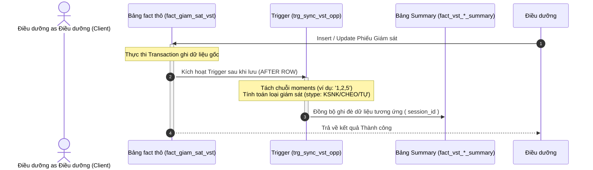

# DASHBOARD PRE-AGGREGATION DATA DICTIONARY

> **Phiên bản:** 1.0.0  
> **Ngày cập nhật:** 22/05/2026  
> **Trạng thái:** **STALE / DEPRECATED** — thay bằng live views + RPC-only path (D-07, migration `20260604100000` + `20260604140000`, ADR [adr-dashboard-kpi-path-20260603.md](../architecture/adr-dashboard-kpi-path-20260603.md)). **Không** dùng làm SSOT vận hành.  
> **Mục tiêu (lịch sử):** Cung cấp tài liệu SSOT về cấu trúc trigger-based pre-aggregation (đã DROP physical summary tables).

---

## 1. Tổng quan Kiến trúc & Sự đánh đổi Hiệu năng (Performance Tradeoffs)

Để phục vụ hiển thị Dashboard Trung tâm Chỉ huy KSNK BV103 với thời gian phản hồi gần như tức thì (<50ms) dưới tải dữ liệu lớn, hệ thống áp dụng chiến lược **Pre-aggregation tại thời điểm ghi (Write-time Pre-computation)** thông qua các Database Triggers nguyên tử.

### So sánh Phương án Thiết kế:

| Chỉ số so sánh | Phương án Truy vấn Thô (Read-time execution) | Phương án Pre-aggregation (Write-time trigger) |
| :--- | :--- | :--- |
| **Độ trễ tải Dashboard** | **3,000ms - 5,000ms** (Rất chậm, nghẽn luồng) | **<50ms** (Gần như tức thời) |
| **Tải CPU Database** | Rất cao (Do liên tục chạy hàm tách chuỗi động `regexp_split_to_table` cho mỗi lượt xem) | Cực kỳ thấp (Chỉ tốn chi phí tách chuỗi 1 lần duy nhất khi Lưu phiếu) |
| **Chi phí vật lý lưu trữ** | 0 MB (Không tốn thêm bảng) | **~25 MB** (Mức dung lượng không đáng kể đối với hạ tầng ổ cứng máy chủ) |
| **Tính nhất quán dữ liệu** | Tuyệt đối (Real-time thô) | Tuyệt đối (Đồng bộ nguyên tử thông qua trigger giao dịch và nightly cron job) |

---

## 2. Kích thước Vật lý Thực tế (Table Sizing Statistics)

Được đo đạc trực tiếp trên máy chủ cơ sở dữ liệu:

*   `fact_giam_sat_vst` (Bảng gốc thô cơ sở): **9.2 MB**
*   `fact_vst_opportunities_summary`: **11 MB** (~21,940 dòng)
*   `fact_vst_moments_summary`: **13 MB** (~21,999 dòng)
*   *Tổng dung lượng Pre-aggregation VST:* **~25 MB** (Hiệu quả tối ưu hóa tốc độ đạt gấp 100 lần).

---

## 3. Chi tiết Cấu trúc các Bảng Tổng hợp (Data Dictionary)

### 3.1. Bảng `public.fact_gsc_dashboard_summary`
*   **Mục đích:** Tổng hợp cấp phiên cho phân hệ Giám sát chung (GSC), hỗ trợ thống kê tỷ lệ tuân thủ chung.
*   **Khóa chính:** `session_id`

| Tên cột | Kiểu dữ liệu | Cho phép NULL | Giá trị mặc định | Giải thích nghiệp vụ |
| :--- | :--- | :--- | :--- | :--- |
| `session_id` | `uuid` | NO | | Liên kết khóa ngoại trỏ về ID phiên giám sát chung |
| `ngay_giam_sat` | `date` | NO | | Ngày thực hiện giám sát (hỗ trợ filter khoảng thời gian) |
| `bang_kiem_id` | `uuid` | NO | | ID bảng kiểm áp dụng |
| `khoa_id` | `uuid` | YES | | ID khoa/phòng được giám sát |
| `khu_vuc_id` | `uuid` | YES | | ID khu vực giám sát (sảnh, buồng bệnh, hành lang...) |
| `nghe_nghiep_id` | `uuid` | YES | | ID ngành nghề của đối tượng được giám sát |
| `stype` | `text` | NO | | Loại giám sát: `KSNK` (chuyên trách), `TU_GIAM_SAT`, `CHEO` |
| `nguoi_giam_sat_id` | `uuid` | YES | | ID nhân sự thực hiện giám sát |
| `tong_phien` | `bigint` | NO | `1` | Số lượng phiên (luôn là 1 trên mỗi dòng session) |
| `tong_quan_sat` | `bigint` | NO | `0` | Tổng số lượt quan sát tiêu chí trong phiên này |
| `tong_dat` | `bigint` | NO | `0` | Số lượt quan sát đạt tiêu chuẩn |
| `tong_vi_pham` | `bigint` | NO | `0` | Số lượt quan sát không đạt tiêu chuẩn |
| `created_at` | `timestamptz`| NO | `now()` | Thời điểm tạo dòng dữ liệu |

---

### 3.2. Bảng `public.fact_gsc_violations_summary`
*   **Mục đích:** Thống kê chi tiết số lượt vi phạm theo từng tiêu chí (criterion) cụ thể trong bảng kiểm GSC để vẽ biểu đồ Pareto lỗi.
*   **Khóa chính:** `(session_id, criterion_id)`

| Tên cột | Kiểu dữ liệu | Cho phép NULL | Giá trị mặc định | Giải thích nghiệp vụ |
| :--- | :--- | :--- | :--- | :--- |
| `session_id` | `uuid` | NO | | ID phiên giám sát chung |
| `criterion_id` | `uuid` | NO | | ID tiêu chí đánh giá trong bảng kiểm |
| `ngay_giam_sat` | `date` | NO | | Ngày thực hiện giám sát |
| `bang_kiem_id` | `uuid` | NO | | ID bảng kiểm áp dụng |
| `khoa_id` | `uuid` | YES | | ID khoa/phòng được giám sát |
| `khu_vuc_id` | `uuid` | YES | | ID khu vực giám sát |
| `nghe_nghiep_id` | `uuid` | YES | | ID ngành nghề của đối tượng |
| `stype` | `text` | NO | | Loại giám sát: `KSNK`, `TU_GIAM_SAT`, `CHEO` |
| `nguoi_giam_sat_id` | `uuid` | YES | | ID nhân sự giám sát |
| `tong_quan_sat` | `bigint` | NO | `0` | Tổng số lượt đánh giá tiêu chí này trong phiên |
| `tong_vi_pham` | `bigint` | NO | `0` | Số lượt đánh giá KHÔNG ĐẠT đối với tiêu chí này |
| `created_at` | `timestamptz`| NO | `now()` | Thời điểm tạo dòng |

---

### 3.3. Bảng `public.fact_vst_sessions_summary`
*   **Mục đích:** Quản lý tổng số phiên giám sát vệ sinh tay (VST) phục vụ tính toán tần suất và KPI giám sát của từng khoa.
*   **Khóa chính:** `session_id`

| Tên cột | Kiểu dữ liệu | Cho phép NULL | Giá trị mặc định | Giải thích nghiệp vụ |
| :--- | :--- | :--- | :--- | :--- |
| `session_id` | `uuid` | NO | | ID phiên giám sát vệ sinh tay gốc |
| `ngay_giam_sat` | `date` | NO | | Ngày giám sát |
| `khoa_id` | `uuid` | YES | | ID khoa được giám sát |
| `khu_vuc_id` | `uuid` | YES | | ID khu vực giám sát |
| `stype` | `text` | NO | | Loại giám sát: `KSNK`, `TU_GIAM_SAT`, `CHEO` |
| `nguoi_giam_sat_id` | `uuid` | YES | | ID nhân sự giám sát |
| `tong_phien` | `bigint` | NO | `1` | Đếm số lượng phiên (luôn mặc định là 1) |
| `created_at` | `timestamptz`| NO | `now()` | Thời điểm tạo |

---

### 3.4. Bảng `public.fact_vst_opportunities_summary`
*   **Mục đích:** Phân rã chi tiết từng Cơ hội Vệ sinh tay (Opportunity). Mỗi dòng đại diện cho một cơ hội cụ thể, chứa đầy đủ các phân tích lỗi kỹ thuật/thời gian/lạm dụng găng tay.
*   **Khóa chính:** `opportunity_id`

| Tên cột | Kiểu dữ liệu | Cho phép NULL | Giá trị mặc định | Giải thích nghiệp vụ |
| :--- | :--- | :--- | :--- | :--- |
| `opportunity_id` | `uuid` | NO | | Trỏ trực tiếp đến `id` của bảng thô `fact_giam_sat_vst` |
| `session_id` | `uuid` | NO | | ID phiên chứa cơ hội này |
| `ngay_giam_sat` | `date` | NO | | Ngày giám sát |
| `khoa_id` | `uuid` | YES | | ID khoa |
| `khu_vuc_id` | `uuid` | YES | | ID khu vực |
| `nghe_nghiep_id` | `uuid` | YES | | ID nghề nghiệp đối tượng thực hiện cơ hội này |
| `stype` | `text` | NO | | Loại giám sát (`KSNK`, `TU_GIAM_SAT`, `CHEO`) |
| `nguoi_giam_sat_id` | `uuid` | YES | | ID người giám sát |
| `is_tuan_thu` | `boolean` | NO | | `true` nếu hành động là rửa tay/chà cồn; `false` nếu bỏ sót |
| `dung_ky_thuat` | `boolean` | YES | | Trạng thái đúng kỹ thuật (6 bước) |
| `du_thoi_gian` | `boolean` | YES | | Đảm bảo đủ thời gian khuyến cáo (>=20s cồn, >=30s nước) |
| `co_deo_gang` | `boolean` | YES | | Có mang găng tay khi thực hiện cơ hội hay không |
| `so_co_hoi` | `bigint` | NO | `1` | Trọng số đếm cơ hội (luôn là 1) |
| `da_tuan_thu` | `bigint` | NO | `0` | Đếm số cơ hội đã tuân thủ (1 = Tuân thủ, 0 = Bỏ sót) |
| `bo_sot` | `bigint` | NO | `0` | Đếm số cơ hội bị bỏ sót (1 = Bỏ sót, 0 = Tuân thủ) |
| `loi_ky_thuat` | `bigint` | NO | `0` | Số cơ hội có tuân thủ nhưng sai kỹ thuật (1 = Sai kỹ thuật) |
| `loi_thoi_gian` | `bigint` | NO | `0` | Số cơ hội có tuân thủ nhưng không đủ thời gian |
| `lam_dung_gang` | `bigint` | NO | `0` | Số cơ hội không tuân thủ vệ sinh tay nhưng có đeo găng |
| `created_at` | `timestamptz`| NO | `now()` | Thời điểm tạo |

---

### 3.5. Bảng `public.fact_vst_moments_summary`
*   **Mục đích:** Lưu trữ phân rã của 5 Thời điểm Vệ sinh tay WHO. Cột `thoi_diem` thô dạng chuỗi (ví dụ: `'1,2'`) sẽ được Trigger tự động tách ra thành nhiều dòng tương ứng trong bảng này tại thời điểm ghi để hỗ trợ vẽ biểu đồ radar/tỷ lệ tuân thủ theo thời điểm cực nhanh.
*   **Khóa chính:** `(opportunity_id, moment_label)`

| Tên cột | Kiểu dữ liệu | Cho phép NULL | Giá trị mặc định | Giải thích nghiệp vụ |
| :--- | :--- | :--- | :--- | :--- |
| `opportunity_id` | `uuid` | NO | | ID cơ hội vệ sinh tay gốc |
| `moment_label` | `text` | NO | | Nhãn thời điểm (Ví dụ: `'Trước khi tiếp xúc người bệnh'`, `'Trước khi làm thủ thuật vô khuẩn'`) |
| `session_id` | `uuid` | NO | | ID phiên giám sát |
| `ngay_giam_sat` | `date` | NO | | Ngày giám sát |
| `khoa_id` | `uuid` | YES | | ID khoa |
| `khu_vuc_id` | `uuid` | YES | | ID khu vực |
| `nghe_nghiep_id` | `uuid` | YES | | ID nghề nghiệp |
| `stype` | `text` | NO | | Loại giám sát |
| `nguoi_giam_sat_id` | `uuid` | YES | | ID người giám sát |
| `is_tuan_thu` | `boolean` | NO | | Trạng thái tuân thủ chung |
| `co_deo_gang` | `boolean` | YES | | Trạng thái đeo găng |
| `so_quan_sat` | `bigint` | NO | `1` | Đếm lượt quan sát thời điểm này (luôn là 1) |
| `created_at` | `timestamptz`| NO | `now()` | Thời điểm tạo |

---

## 4. Cơ chế Đồng bộ & Triggers

Hệ thống bảo đảm tính toàn vẹn dữ liệu qua 4 Trigger liên kết chặt chẽ:

1.  **`trg_sync_gsc_session`** (AFTER INSERT/UPDATE/DELETE trên `fact_giam_sat_chung_sessions`):
    *   Kích hoạt hàm `public.fn_trigger_sync_gsc_session_row()`.
    *   Tự động tính toán lại toàn bộ `fact_gsc_dashboard_summary` và `fact_gsc_violations_summary` của phiên đó.
2.  **`trg_sync_gsc_result`** (AFTER INSERT/UPDATE/DELETE trên `fact_giam_sat_chung_results`):
    *   Kích hoạt hàm `public.fn_trigger_sync_gsc_result_row()`.
    *   Đồng bộ hóa các thay đổi về câu trả lời/tiêu chí của phiên tương ứng.
3.  **`trg_sync_vst_session`** (AFTER INSERT/UPDATE/DELETE trên `fact_giam_sat_vst_sessions`):
    *   Kích hoạt hàm `public.fn_trigger_sync_vst_session_row()`.
    *   Tự động tính toán lại `fact_vst_sessions_summary`, `fact_vst_opportunities_summary`, và `fact_vst_moments_summary` của phiên.
4.  **`trg_sync_vst_opp`** (AFTER INSERT/UPDATE/DELETE trên `fact_giam_sat_vst`):
    *   Kích hoạt hàm `public.fn_trigger_sync_vst_opp_row()`.
    *   Cắt chuỗi `thoi_diem` thô bằng Regex nguyên tử và cập nhật các bảng cơ hội/thời điểm vệ sinh tay của phiên đó.

### 4.1. Cơ chế bù đắp ban đêm (Nightly Reconciliation Cron Job)
Để phòng tránh tối đa các trường hợp mất đồng bộ ngoài ý muốn (race conditions hoặc lỗi hạ tầng mạng), một tiến trình nền chạy định kỳ bằng `pg_cron` được thiết lập:

*   **Thời điểm thực thi:** `01:30 AM` hàng đêm.
*   **Hàm gọi:** `SELECT public.fn_sync_dashboard_pre_aggregates()`.
*   **Logic hoạt động:** Thực hiện `TRUNCATE` toàn bộ các bảng summary và tính toán nén lại toàn bộ dữ liệu thô (`is_active = true`) sạch sẽ, bảo đảm dữ liệu sang ngày mới hoàn toàn chính xác 100%.
