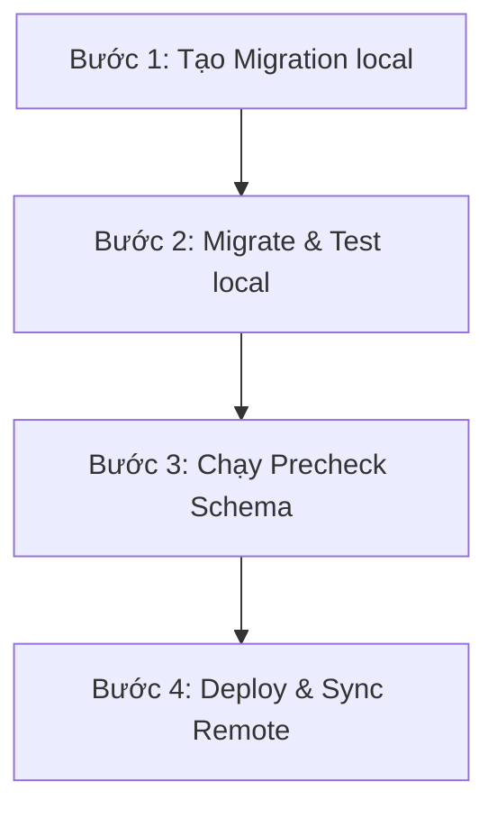

# SOP ĐỒNG BỘ CƠ SỞ DỮ LIỆU & KIỂM SOÁT SCHEMA

> **Phiên bản:** 1.0 (20/05/2026)  
> **Áp dụng cho:** Toàn bộ đội ngũ phát triển và vận hành hệ thống KSNK BV103  
> **Mục tiêu:** Ngăn chặn hoàn toàn lỗi crash runtime do lệch cấu trúc bảng (schema drift), thiếu RPC hoặc View giữa các môi trường (Local ↔ Staging ↔ Pilot).

---

## 1. Nguyên tắc "3 KHÔNG" Cốt lõi
1. **KHÔNG can thiệp SQL "nóng" bằng tay** trực tiếp trên database remote (Staging, Pilot/Production) mà không có file migration lưu vết trong git. Mọi thay đổi cấu trúc DB bắt buộc phải bắt đầu bằng một file migration.
2. **KHÔNG merge Pull Request đụng đến cơ sở dữ liệu** khi chưa chạy thành công script precheck kiểm tra tính toàn vẹn dữ liệu.
3. **KHÔNG coi tài liệu tĩnh làm Single Source of Truth (SSOT)**. Tài liệu ERD hay thiết kế chỉ là tài liệu tham khảo. SSOT thực tế của cấu trúc dữ liệu chính là **mã nguồn file Migration trong thư mục `supabase/migrations/`** và cấu trúc thực tế trên database đích.

---

## 2. Quy trình 4 Bước Phát triển & Đồng bộ DB (Chuẩn P0)

Mọi thay đổi dữ liệu phải tuân thủ nghiêm ngặt quy trình 4 bước sau:



### Bước 1: Tạo tệp Migration Cục bộ
Khi cần thay đổi cấu trúc bảng, thêm cột, thay đổi RPC hoặc View, lập trình viên sử dụng Supabase CLI để tạo file migration mới:
```bash
npx supabase migration new <ten_thay_doi_nghiep_vu>
```
*Lưu ý đặt tên rõ ràng, ví dụ: `npx supabase migration new support_qlcv_monthly_kpi`.* Viết các câu lệnh SQL an toàn (sử dụng `CREATE OR REPLACE` cho view/RPC, `IF NOT EXISTS` khi tạo bảng/cột).

### Bước 2: Apply Migration và Kiểm thử cục bộ
Chạy lệnh migrate lên database local để đảm bảo mã SQL không bị lỗi cú pháp:
```bash
npm run mdm:migrate:local
```
Sau khi migrate thành công, chạy toàn bộ unit test để đảm bảo các thay đổi không phá vỡ logic nghiệp vụ hiện tại:
```bash
npm run test:cssd
npm run test:pilot
```

### Bước 3: Chạy Script Precheck Schema
Để đảm bảo tất cả thực thể dữ liệu mới đáp ứng đầy đủ yêu cầu cho module hoạt động, chạy script kiểm tra tính toàn vẹn cục bộ:
```bash
npm run trial:db:precheck:local
```
*(Đối với môi trường liên kết remote trước khi ship, chạy: `npm run trial:db:precheck`)*. Nếu script báo lỗi hoặc thiếu bảng/RPC/FK, tuyệt đối không gửi PR mà phải bổ sung migration đầy đủ.

### Bước 4: Deploy & Sync lên Môi trường Remote (Staging/Pilot)
Khi mã nguồn được merge vào nhánh chính (`main`/`release`), tiến trình CI/CD hoặc người vận hành sẽ thực hiện push migration lên database remote:
```bash
npm run mdm:migrate
```
Sau khi push thành công, chạy kiểm tra hậu migration (post-check) để đảm bảo không có lỗi tham chiếu khóa ngoại:
```bash
npm run mdm:postcheck:sql
npm run mdm:postcheck:fk
```

---

## 3. Hướng dẫn xử lý Sự cố Lệch Môi trường (Troubleshooting)

### Trường hợp 1: Lỗi lệch lịch sử migration (`migration history mismatch`)
* **Nguyên nhân:** Do database remote đã được chạy trực tiếp một số câu lệnh SQL (hoặc migration bị xóa/thay đổi thủ công) dẫn đến lệch mã băm (checksum) của Supabase.
* **Cách khắc phục:**
  1. Kiểm tra trạng thái migration trên môi trường remote:
     ```bash
     npx supabase db status --linked
     ```
  2. Nếu có file migration bị thiếu trên remote nhưng local đã khớp, chạy lệnh push bỏ qua lịch sử cũ (chỉ dùng khi chắc chắn cấu trúc an toàn):
     ```bash
     npx supabase db push --linked --accept-missing
     ```
  3. Nếu lịch sử lệch quá nặng, bắt buộc phải export cấu trúc DB remote về so khớp và thực hiện "repair" lại trạng thái migration:
     ```bash
     npx supabase migration repair --linked <migration_id> applied
     ```

### Trường hợp 2: Thiếu RPC hoặc View sau khi Deploy
* **Nguyên nhân:** File migration chứa lệnh tạo RPC/View có lỗi hoặc bị ghi đè bởi một file migration cũ chạy sau.
* **Cách khắc phục:**
  1. Chạy phân tích giải trình (explain) RPC Dashboard bằng lệnh:
     ```bash
     npm run pilot:dashboard:explain:linked
     ```
  2. Xác định RPC bị chậm hoặc lỗi, sửa đổi trực tiếp trong file migration mới nhất và deploy lại.
  3. Cập nhật ngay file [10-bv103-implementation-mapping.md](file:///Users/trinhhuunghia/Desktop/ksnk_bv103/docs/specs/10-bv103-implementation-mapping.md) để đồng bộ hóa tài liệu nghiệp vụ.

---

## 4. Trách nhiệm Vận hành (Governance)
* **Lập trình viên:** Chịu trách nhiệm viết SQL an toàn, chạy precheck cục bộ và cập nhật mapping document trong mỗi PR.
* **Reviewer (Người duyệt code):** Từ chối duyệt (Block) bất kỳ PR nào đụng đến DB mà không có file migration đi kèm hoặc không tích chọn phần **Alignment Check** trong PR Template.
