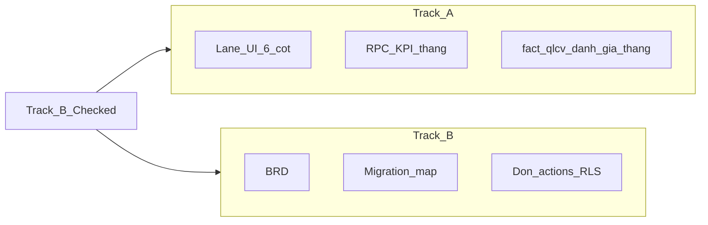

# Kế hoạch phát triển module — Quản lý công việc (QLCV) BV103

**Phiên bản:** 2.2  
**Ngày cập nhật:** 15/05/2026  
**SSOT duy nhất:** toàn bộ kế hoạch / vấn đề / tái cấu trúc QLCV trong repo **chỉ còn file này** trong `docs/specs/working/`.

**Đọc thêm (không thay thế file này):** [`10-bv103-implementation-mapping.md`](../10-bv103-implementation-mapping.md), [`GOVERNANCE_PIPELINE.md`](../GOVERNANCE_PIPELINE.md), [`SUPABASE_ADMIN_CLIENT_AUDIT_BV103.md`](./SUPABASE_ADMIN_CLIENT_AUDIT_BV103.md), [`AGENTS.md`](../../../AGENTS.md).

---

## 1. Tóm tắt điều hành (1 trang)

| Mục | Nội dung |
|-----|----------|
| **Vấn đề** | Nhiều mã `trang_thai` + legacy (`is_active`, cổng 3 bước) khiến UI rối; KPI gắn list client không ổn định thống kê; tài liệu trước đây tách nhiều file gây khó tra. |
| **Chiến lược** | **Track A** (lane + filter + KPI tháng server + `fact_qlcv_danh_gia_thang`) và **Track B** (CHECK 7 mã `trang_thai` + backfill + RPC spawn `MOI`) **đã triển khai trong repo** (`20260716004`, `20260716005`). Tài liệu này mô tả hành vi chuẩn; rollback DB theo `GOVERNANCE_PIPELINE`. |
| **Chốt kỹ thuật** | Cha–con: đã có `cong_viec_cha_id`. **KPI tháng:** mặc định **chỉ phiếu gốc**; subtask không vào `on_time`/`completion` của điểm nhân viên. **`DA_HUY`** (đóng/hủy) **không** gộp với `TU_CHOI` (từ chối nghiệm thu = làm lại). |
| **Đo lường** | §9 — success metrics pilot; không dùng phần trăm “giảm rối” trừ khi có baseline cụ thể. |
| **Module khác** | Giám sát VST **không** thuộc tài liệu này — xem module `giam-sat-vst`. |

### 1.1. Bản tóm tắt cho lãnh đạo / stakeholder (in trước khi họp)

- **Phạm vi:** công việc nội bộ Khoa KSNK; một file kế hoạch duy nhất làm SSOT.  
- **Cách làm:** **Track A** (lane + filter + KPI server) rồi **Track B** (chuẩn mã DB) — **cả hai đã có trong code**; pilot chỉ cần UAT + baseline §9.1.  
- **Đã chốt:** KPI tháng chỉ trên **phiếu gốc**; **hủy** và **từ chối nghiệm thu (làm lại)** là hai nghĩa khác trên UI/DB.  
- **Kỳ vọng:** giảm rối cho người dùng + có số đo pilot (§9); chi phí rủi ro thấp hơn so với “đổi hết trạng thái” ngay.

---

## 2. Phạm vi & SSOT kỹ thuật

| Hạng mục | Nội dung |
|----------|----------|
| **Code** | [`src/modules/quan-ly-cong-viec/`](../../../src/modules/quan-ly-cong-viec/) |
| **Bảng** | `fact_cong_viec`, `fact_cong_viec_hoat_dong`, `fact_cong_viec_dinh_ky`, RPC `fn_fact_cong_viec_spawn_dinh_ky_hom_nay()` |
| **View list** | `v_fact_cong_viec_full` — mọi cột `select` phải khớp view (bài học: không select cột không tồn tại, vd. `loai_ket_thuc`). |
| **Nhân sự** | `nguoi_*_id` → `mdm_nhan_su` (UUID), không dùng bảng `users` generic. |
| **Quyền** | `CONG_VIEC` trong [`permission-registry`](../../../src/lib/permission-registry.ts). |
| **Verify** | Sau thay đổi Server Action / `fact_*`: `npm run verify:engineering` (hoặc `verify:full` trước push). |

---

## 3. Hiện trạng & vấn đề cần xử

**Điểm mạnh:** Kanban, lọc, nhóm trạng thái/pie, hero, xử lý lỗi list/view, mapping `fact_*`, timeline `fact_cong_viec_hoat_dong`, định kỳ + spawn.

**Điểm yếu / nợ (còn theo dõi):**  
- Pilot: baseline §9.1 + quiz nhãn cột; export KPI theo tháng nếu cần.  
- `qlcv-workflow-display.ts` vẫn nhận diện **mã legacy** (cache / bản sao cũ) song song mã Track B — có thể gỡ sau khi không còn môi trường pre-B.

**Đã xử / không còn:** nhiều mã rối trên DB chính (đã Track B); panel đề xuất trùng (đã gỡ component không dùng); định kỳ có preview lịch sinh (`qlcv-dinh-ky-schedule.ts`).

**UX đã hướng xử (tiếp tục trong code):** thẻ Kanban không lặp nhãn cột; ưu tiên có dấu (`qlcv-labels`); thẻ thống kê bấm được + focus cột; một thanh lọc + chip; header/eyebrow gọn; chi tiết + `HoatDongForm` đóng về list; không panel đề xuất trùng lặp.

---

## 4. Chiến lược Track A / Track B

| Track | Mô tả | Khi chọn |
|-------|--------|----------|
| **A** | Lane UI + filter + RPC KPI + bảng điểm; **không** đổi cột `trang_thai` | Pilot, mặc định |
| **B** | Chuẩn mã mới + map + rewrite action | **Đã deploy** migration `20260716005_qlcv_track_b_trang_thai_codes.sql` |

**Khuyến nghị:** ~~hoàn tất A trước; mở B khi…~~ → **Đã làm:** A + B trong repo; vận hành prod = backup + `db push` theo pipeline.

### 4.1. Sáu mã mục tiêu (Track B — ASCII)

| STT | Mã DB | Nhãn UI (gợi ý) | Ý nghĩa |
|-----|--------|------------------|---------|
| 1 | `MOI` | Mới | Theo BRD (có thể gom chờ nhận / chưa bắt đầu) |
| 2 | `DANG_LAM` | Đang thực hiện | Đang làm |
| 3 | `CHO_DUYET` | Chờ duyệt | Chờ nghiệm thu |
| 4 | `HOAN_THANH` | Hoàn thành | Có thể **giữ tên mã hiện tại** `HOAN_THANH` để giảm đổi |
| 5 | `TU_CHOI` | Từ chối / làm lại | Từ chối **nghiệm thu** |
| 6 | `QUA_HAN` | Quá hạn | Job / rule đã chốt |

**Ngoài 6 mã:** `DA_HUY` — lane “Đã hủy” / filter báo cáo; **không** map mặc định vào `TU_CHOI`.

### 4.2. KPI cha–con (mặc định kế hoạch)

| Quy tắc | Giá trị |
|---------|---------|
| Phạm vi điểm tháng | Chỉ `cong_viec_cha_id IS NULL` |
| Assignee | `nguoi_phu_trach_id` của phiếu gốc |
| Subtask | Không vào mẫu số điểm tháng nhân viên; chỉ tiến độ UI |
| Rollup | Chỉ khi BRD ghi rõ (vd. cha xong khi tất cả con xong) |

### 4.3. Track A — map lane từ DB hiện tại (chi tiết + thứ tự ưu tiên)

Implement **`getBoardLaneId(task)`** kiểm tra **theo thứ tự dưới** (dừng ở dòng khớp đầu tiên) — khớp logic [`qlcv-workflow-display.ts`](../../../src/modules/quan-ly-cong-viec/lib/qlcv-workflow-display.ts).

| Ưu tiên | Điều kiện (pseudo / trường) | Lane UX (id gợi ý) | Ghi chú xử lý |
|--------|------------------------------|-------------------|----------------|
| 1 | `trang_thai === 'DA_HUY'` | `lane_da_huy` | Luôn tách khỏi “làm lại”; copy: hủy / đóng phiếu. |
| 2 | `trang_thai === 'HOAN_THANH'` | `lane_hoan_thanh` | — |
| 3 | `trang_thai === 'QUA_HAN'` **hoặc** `is_qua_han === true` (view) | `lane_qua_han` | Nếu vừa `QUA_HAN` vừa thuộc cổng khác: **ưu tiên** theo BRD; mặc định kế hoạch: quá hạn **không** nuốt “chờ duyệt”. |
| 4 | `isChoNghiemThuHoanThanh(task)` — `trang_thai === 'CHO_DUYET'` **hoặc** (`DANG_LAM` / legacy `DANG_THUC_HIEN` với `% >= 100`) | `lane_cho_duyet` | Cổng 3 — chờ nghiệm thu. |
| 5 | `trang_thai === 'DANG_LAM'` hoặc `'TU_CHOI'` hoặc legacy `'DANG_THUC_HIEN'` (và không khớp hàng 4) | `lane_dang_lam` | `TU_CHOI` = từ chối nghiệm thu, vẫn làm lại trong lane đang xử lý. |
| 6 | `isDeXuatChoDuyet(task)` — `is_active === false` và (`trang_thai === 'MOI'` hoặc legacy `DE_XUAT_CHO_DUYET` / `CHUA_BAT_DAU`) | `lane_de_xuat` | Cổng 1 — đề xuất chờ phê. |
| 7 | `isChoNhanViec(task)` — legacy `CHO_NHAN_VIEC` **hoặc** `MOI` + `is_active` + có `nguoi_phu_trach_id` (hoặc legacy `CHUA_BAT_DAU` + gán) | `lane_cho_nhan` | Cổng 2 — chờ nhận. |
| 8 | Còn lại (vd. `MOI` chưa gán người, trạng thái khác) | `lane_khac` | Map vào cột «Chờ nhận / mới» ở Kanban. |

**Việc làm:** một hàm duy nhất trong `lib/` + bảng test từng hàng; Kanban chỉ nhận `laneId`, không rải `if` trong component.

### 4.4. Định kỳ — điều kiện sinh phiếu (RPC + preview UI)

**Nguồn chân lý SQL:** `public.fn_fact_cong_viec_spawn_dinh_ky_hom_nay()` (migrations `20260513207`, `20260715001`, `20260716005`).

| `ma_chu_ky` | Điều kiện `match_due` (Postgres, `due = CURRENT_DATE`) |
|-------------|--------------------------------------------------------|
| `WEEKLY` | `ngay_bat_dau <= due` **và** `(due - ngay_bat_dau)::integer % 7 = 0` |
| `MONTHLY` | `ngay_bat_dau <= due` **và** `extract(day from due) = extract(day from ngay_bat_dau)` — tháng không có đủ ngày (vd. mốc 31) chỉ khớp tháng có ngày 31. |

**Idempotent:** không insert nếu đã tồn tại `fact_cong_viec` cùng `dinh_ky_mau_id` và `han_hoan_thanh = due`.

**Preview (đồng bộ logic):** `src/modules/quan-ly-cong-viec/lib/qlcv-dinh-ky-schedule.ts` + `qlcv-dinh-ky-schedule.spec.ts` — cột «kỳ tới» trên UI mẫu định kỳ.

---

## 5. Mục tiêu thiết kế

1. Một luồng nhận thức: tạo/nhận → làm → chờ duyệt → hoàn thành; quá hạn / hủy / làm lại **nhãn rõ**.  
2. Cha–con: cây UI + §4.2.  
3. Điểm tháng: một công thức trong code + comment migration.  
4. Một thanh lọc chính cho danh sách/Kanban.  
5. Audit: `fact_cong_viec_hoat_dong` (+ tuỳ chọn audit domain); không log toàn cục mọi bảng.

---

## 6. Dữ liệu — đánh giá tháng

- **Bảng:** `fact_qlcv_danh_gia_thang` — `id uuid`, `nhan_su_id` → `mdm_nhan_su`, `thang date` (đầu tháng) hoặc `(nam, thang)`; không `VARCHAR(7)` cho tháng.  
- **Cột gợi ý:** `on_time_rate`, `completion_rate`, `quality_score` (1–5), `final_score`, `manager_comment`, `evaluated_by`, `evaluated_at`, `created_at`; unique `(nhan_su_id, thang)`.  
- **Công thức:** `final_score = 0.45 * on_time_pct + 0.25 * completion_pct + 0.30 * (quality_1_to_5 * 20)` (chuẩn hóa % về 0–100 trước khi cộng).  
- **Xếp loại:** 90–100 / 80–89 / 70–79 / 60–69 / &lt;60.  
- **Nguồn số liệu:** RPC/job trên `fact_cong_viec` theo tháng; định nghĩa “trong tháng” và **đếm phiếu gốc** thống nhất với §4.2 — hiển thị tooltip trên UI.

**Quá hạn / nhắc:** Phase 1: `is_qua_han` + filter; Phase 2: job → `QUA_HAN`; in-app trước, email sau khi có pipeline.

**Export:** Excel/CSV theo tháng hoặc filter — MVP sau KPI server.

---

## 7. Tính năng ưu tiên & gỡ rườm rà

| # | Tính năng | Mức độ | Ghi chú |
|---|-----------|--------|---------|
| 1 | Cha–con + cây | Bắt buộc | FK đã có |
| 2 | Kanban 6 lane + thẻ gọn | Bắt buộc | §4.3 hoặc §4.1 |
| 3 | Deadline + quá hạn + nhắc | Bắt buộc | §6 |
| 4 | Dashboard KPI + Top/Bottom | Bắt buộc | Server-side |
| 5 | Đánh giá tháng + chấm sao | Bắt buộc | RLS |
| 6 | Một thanh lọc + chip | Cao | |
| 7 | Lịch sử | Cao | `fact_cong_viec_hoat_dong` |
| 8 | Export | Trung bình | |

**Gỡ rườm rà:** một entry đề xuất (Kanban + thẻ); không panel đề xuất trùng; pie/filter dùng chung nguồn nhóm trạng thái (`qlcv-five-pie-status` + `qlcv-labels`).

**Tuỳ chọn sau:** kéo thả cột (sau ma trận chuyển trạng thái); `fact_qlcv_audit_row` nếu cần chứng từ.

**Không cam kết (trừ BRD):** comment rich-text, file đính kèm; self-assessment.

---

## 8. Lộ trình theo tuần

| Tuần | Nội dung | Bàn giao |
|------|----------|----------|
| 1 | BRD: lane vs đổi DB; định kỳ; KPI; schema điểm tháng | Quyết định có chữ ký + sơ đồ migration nếu B |
| 2 | `fact_qlcv_danh_gia_thang` + RPC + RLS; hoặc migration Track B | Migration + `verify:engineering` |
| 3 | UI lane + cây + một thanh lọc | Đạt §9 |
| 4 | Dashboard KPI + chấm điểm + nhắc MVP | Điểm từ server |
| 5 | Audit dùng + export + UAT + training | Pilot ổn hoặc chốt B |

Track A có thể chạy từ tuần 1 song song.

---

## 9. Đo lường thành công & kiểm thử / rollback (Track B)

### 9.1. Success metrics (pilot)

**Baseline:** điền **sau 1–2 phiên đo** (trước khi merge lane lớn), ví dụ: “Tạo việc → đúng cột: **__** bước / **__** giây (trung bình **__** người)”; “Tìm phiếu mẫu: **__** giây”. Không bắt buộc có số ngay trong tài liệu — bắt buộc có số **trước** khi marketing “đã cải thiện X%”.

| Chỉ số | Cách đo | Baseline (ghi khi đo) | Mục tiêu sau Track A |
|--------|---------|------------------------|---------------------|
| Bước/click tạo việc → đúng cột | Quan sát / event | *(điền)* | Giảm so baseline |
| Thời gian tìm phiếu (lọc + mở) | Stopwatch mẫu | *(điền)* | Giảm trung vị |
| Lỗi state sau hành động | Incident / 100 phiếu/tuần | *(điền)* | → 0 |
| Hiểu nhãn cột | 3–5 người, quiz ngắn | *(điền)* | ≥ 80% đúng |
| KPI | RPC vs list client | *(điền nếu còn lệch)* | Chỉ hiển thị RPC |

### 9.2. Track B — test & rollback

- **Unit:** map `old_status` (+ `is_active`, `%` nếu cần) → lane/mã mới.  
- **Integration:** mọi chuyển trạng thái vẫn ghi `fact_cong_viec_hoat_dong`.  
- **Staging:** đếm dòng theo `trang_thai` trước/sau migration `20260716005_qlcv_track_b_trang_thai_codes.sql`; không orphan `cong_viec_cha_id`.  
- **UAT:** đề xuất, nhận việc, nghiệm thu, **spawn định kỳ**.  
- **Rollback:** forward/down migration hoặc script; backup trước prod; feature flag nếu cần; bảng tạm `qlcv_trang_thai_migration_map(...)` khi reverse phức tạp.

**Bảng map khởi tạo (chi tiết cuối trong migration):**

| Trạng thái hiện tại | → Track B / ghi chú |
|---------------------|---------------------|
| `DE_XUAT_CHO_DUYET` | `MOI` hoặc lane đề xuất, không đổi DB |
| `CHO_NHAN_VIEC`, `CHUA_BAT_DAU` (+ cổng) | `MOI` / `DANG_LAM` |
| `DANG_THUC_HIEN` | `DANG_LAM` |
| `CHO_XAC_NHAN_HOAN_THANH` (+ DANG 100%) | `CHO_DUYET` |
| `HOAN_THANH` | Giữ `HOAN_THANH` nếu giảm đổi |
| `QUA_HAN` | `QUA_HAN` |
| `DA_HUY` | Giữ; không → `TU_CHOI` |

---

## 10. Checklist kỹ thuật

**DB:** thiết kế `fact_qlcv_danh_gia_thang` + unique + RLS; RPC `fn_qlcv_tong_hop_thang` hoặc tương đương; view đọc KPI không scan full bảng trên client.

**Action:** `verifyPermission` / `CONG_VIEC`; `lib/qlcv-monthly-score.ts`, `lib/qlcv-board-lanes.ts` (test được).

**UI:** Kanban = lane; dashboard KPI; mobile gọn.

**Chất lượng:** `verify:engineering`; cập nhật changelog trong [`10-bv103-implementation-mapping.md`](../10-bv103-implementation-mapping.md) khi đổi thực thể.

---

## 11. Rủi ro & không làm

| Rủi ro | Giảm thiểu |
|--------|-------------|
| Mất map trạng thái | Staging + script + bảng map |
| RLS | Audit client admin + gate RPC |
| Spawn định kỳ lệch enum | Cùng migration cập nhật `fn_fact_cong_viec_spawn_dinh_ky_hom_nay` |
| Mất niềm tin KPI | Tooltip công thức + mẫu số |

**Không làm (mặc định):** nhân đôi module `quan-ly-cong-viec-v2`; audit toàn cục mọi bảng; KPI “toàn bệnh viện đa khoa” trong scope QLCV nội bộ KSNK trừ BRD mở phạm vi.

---

## 12. Liên kết code (tham chiếu nhanh)

| Nội dung | Đường dẫn |
|-----------|-----------|
| Contract | `src/modules/quan-ly-cong-viec/types.ts` |
| Cổng / legacy | `src/modules/quan-ly-cong-viec/lib/qlcv-workflow-display.ts` |
| Nhãn | `src/modules/quan-ly-cong-viec/lib/qlcv-labels.ts` |
| Lane Kanban / filter | `src/modules/quan-ly-cong-viec/lib/qlcv-board-lanes.ts` |
| Điểm tháng (công thức) | `src/modules/quan-ly-cong-viec/lib/qlcv-monthly-score.ts` |
| KPI tháng (Action + RPC) | `src/modules/quan-ly-cong-viec/actions/qlcv-monthly.actions.ts` |
| Filter / board | `src/modules/quan-ly-cong-viec/lib/qlcv-board-filter.ts` |
| Pie 5 nhóm | `src/modules/quan-ly-cong-viec/lib/qlcv-five-pie-status.ts` |
| Select view | `src/modules/quan-ly-cong-viec/lib/qlcv-root-list-select.ts` |
| Định kỳ + preview lịch sinh | `src/modules/quan-ly-cong-viec/lib/qlcv-dinh-ky-schedule.ts` |
| List actions | `src/modules/quan-ly-cong-viec/actions/cong-viec.actions.ts` |
| Trang | `src/app/(dashboard)/quan-ly-cong-viec/page.tsx` |

---

## 13. Câu hỏi mở (Open Questions)

| # | Câu hỏi | Ghi chú |
|---|---------|---------|
| 1 | Lane **đề xuất** (`lane_de_xuat`) có tách **cột Kanban riêng** hay gom vào “Mới”? | Ảnh hưởng pilot + thẻ thống kê. |
| 2 | `QUA_HAN` vs `is_qua_han`: khi trùng cổng «chờ duyệt», ưu tiên cột nào? | **Đã chốt trong code:** `getBoardLaneId` — quá hạn (mã / cờ / hạn) **trước** cổng chờ nghiệm thu (§4.3 hàng 3). |
| 3 | `HOAN_THANH` giữ tên mã khi Track B? | **Giữ** `HOAN_THANH` (Track B đã triển khai). |
| 4 | Nhắc quá hạn **48h** có bắt buộc pilot hay chỉ sau email pipeline? | §6. |
| 5 | Có cần **rollup** hoàn thành cha theo subtask không? | Mặc định **không** (§4.2). |

---

## 14. Nhật ký quyết định (Decision Log)

| Ngày | Quyết định | Nguồn / ghi chú |
|------|------------|-----------------|
| 14/05/2026 | SSOT QLCV trong `working/`: **một file** `QUAN_LY_CONG_VIEC_PLAN.md`; xóa các file `QLCV_*` cũ. | Gộp tài liệu |
| 14/05/2026 | **Track A trước**, Track B sau BRD + migration + rollback. | Giảm rủi ro |
| 14/05/2026 | KPI tháng: **chỉ phiếu gốc** (`cong_viec_cha_id` null); subtask không vào điểm nhân viên. | §4.2 |
| 14/05/2026 | **`DA_HUY`** không gộp mặc định với **`TU_CHOI`** (làm lại sau nghiệm thu). | Nghiệp vụ |
| 15/05/2026 | Map lane Track A: **thứ tự ưu tiên** cố định (§4.3) bám `qlcv-workflow-display.ts`. | Review ngoài + code |
| 15/05/2026 | Track A bổ sung: **`fact_qlcv_danh_gia_thang`** + **`fn_qlcv_tong_hop_thang`** + UI tab Thống kê + CSV; công thức `qlcv-monthly-score.ts`. | Triển khai repo |
| 15/05/2026 | **Đồng bộ tài liệu + app QLCV:** `QUAN_LY_CONG_VIEC_PLAN` v2.2; preview lịch định kỳ; `getDashboardData.dang_lam`; mapping changelog. | Hoàn thiện SSOT |
| 15/05/2026 | **Track B triển khai:** migration `20260716005_qlcv_track_b_trang_thai_codes.sql` + app (CHECK 7 mã); từ chối nghiệm thu → **`TU_CHOI`**; spawn định kỳ insert **`MOI`**. | Bám §4.1 / §9.2 |

*(Thêm dòng mỗi khi BRD/tech chốt — không xóa dòng cũ.)*

---

## 15. Changelog tài liệu

| Ngày | Thay đổi |
|------|----------|
| 15/05/2026 | **v2.2:** Đồng bộ §1–§4 với Track B đã deploy; thêm §4.4 định kỳ + `qlcv-dinh-ky-schedule`; cập nhật §13 (chốt Q2–Q3); gỡ component QLCV không dùng; UI định kỳ dưới tab Danh sách. |
| 14/05/2026 | **v2.1:** §1.1 tóm tắt lãnh đạo; §4.3 bảng map lane + thứ tự ưu tiên; §9.1 cột baseline; §13 Open Questions; §14 Decision Log. |
| 14/05/2026 | **v2.0:** Gộp bốn file `QLCV_*` cũ thành một SSOT; xóa file trùng trong `working/`. |
