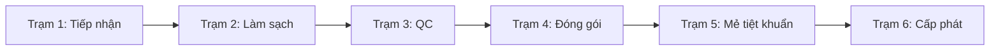

# ĐẶC TẢ NGHIỆP VỤ Y TẾ THỐNG NHẤT — KSNK BV103

> **Phiên bản:** 1.1 (30/05/2026)  
> **Trạng thái:** Hoạt động (SSOT Nghiệp vụ Bounded Context)  
> **Ánh xạ runtime:** [implementation-mapping.md](./implementation-mapping.md) (prefix `sys_`/`mdm_`/`cssd_`/`gstt_`/`qlcv_`/`nkbv_`).

---

## 1. Từ điển Thuật ngữ Nghiệp vụ (Ubiquitous Language)

| Thuật ngữ Spec | Ý nghĩa Nghiệp vụ Y tế | Bảng vật lý (SSOT) | View compat (read-only legacy) |
| :--- | :--- | :--- | :--- |
| **VST (Vệ sinh tay)** | Giám sát tuân thủ 5 thời điểm vệ sinh tay WHO. | `gstt_fact_vst_sessions`, `gstt_fact_vst` | `fact_giam_sat_vst_*` |
| **GSC (Giám sát chung)** | Giám sát checklist động; kết quả inline `results_jsonb`. | `gstt_fact_chung_sessions`, `gstt_dm_bang_kiem` | `fact_giam_sat_chung_sessions`, `dm_bang_kiem` |
| **NKBV (Nhiễm khuẩn BV)** | HAI surveillance stay-centric. | `nkbv_fact_su_kien`, `nkbv_fact_benh_an`, `nkbv_fact_vi_sinh` | `fact_nkbv_*`, `dm_loai_nkbv` |
| **CSSD (Tái xử lý dụng cụ)** | 6 trạm QR workflow tiệt khuẩn. | `cssd_fact_quy_trinh`, `cssd_fact_lo_tiet_khuan`, `cssd_fact_quy_trinh_thanh_phan` | `fact_quy_trinh`, `fact_lo_tiet_khuan` |
| **Mẻ Tiệt Khuẩn** | Chu trình hấp sấy + QC chỉ thị. | `cssd_fact_lo_tiet_khuan` | `fact_lo_tiet_khuan` |
| **QLCV (Quản lý công việc)** | Task nội bộ KSNK Track B (7 trạng thái). | `qlcv_fact_cong_viec`, `qlcv_fact_cong_viec_dinh_ky` | `fact_cong_viec` |
| **MDM Nhân sự / Khoa** | Master data dùng chung. | `mdm_nhan_su`, `mdm_dm_khoa_phong` | `dm_khoa_phong` |
| **RBAC** | Phân quyền module×action. | `sys_roles`, `sys_permissions`, `sys_role_permissions`, `sys_user_roles` | `dm_roles`, `dm_permissions` |

### Entities đã loại bỏ (không mô tả workflow mới)

- **RCA ticket workflow** (`gstt_fact_rca_ticket`) — reform 2026-05-29: ghi nhận inline, không ticket.
- **EAV kết quả GSC** (`fact_giam_sat_chung_results`) — thay bằng `results_jsonb`.
- **Phần 3–4 phân tích trên form GSC/VST** — cột JSONB/RCA fields đã DROP; dashboard v4 IPAC slim.

---

## 2. Các Hành trình Nghiệp vụ (Clinical Journeys)

### 2.1 Giám sát Vệ sinh tay (VST - WHO 5 Moments)
* **Đối tượng giám sát:** Nhân viên y tế tại các khoa lâm sàng.
* **Thời điểm giám sát (WHO 5 Moments):** T1–T5 theo chuẩn WHO.
* **Luồng dữ liệu:** Phiên → `gstt_fact_vst_sessions` + quan sát `gstt_fact_vst` → trigger sync `gstt_fact_vst_*_summary` → RPC **`rpc_dashboard_vst_strategic_analytics`** (Command Center + tab Thống kê `/giam-sat-vst?tab=analytics`). Đọc lịch sử/chi tiết: **`v_gstt_giam_sat_vst_*_full`**.

### 2.2 Quy trình Tái xử lý Dụng cụ y tế (CSSD Workflow)

* **Tab Kho** (`/cssd-quy-trinh?tab=kho`): giám sát FEFO/tồn — không phải trạm quét workflow.
* **Trạm 4:** Digital BOM (`BomChecklistModal`) + sync `cssd_fact_quy_trinh_thanh_phan`.
* **Trạm 5:** `cssd_fact_lo_tiet_khuan`; QC mẻ không đạt → rollback + sự cố.
* **Trạm 6:** Ledger soft-warning nếu thiếu cấu phần (QLDCPT Q2).

### 2.3 Quản lý Công việc Nội bộ KSNK (Track B Workflow)
* **Trạng thái:** `MOI` → `DANG_LAM` → `CHO_DUYET` → `HOAN_THANH` / `TU_CHOI` / `QUA_HAN` / `DA_HUY`.
* **Spawn định kỳ:** `qlcv_fact_cong_viec_dinh_ky` + `fn_qlcv_fact_cong_viec_spawn_dinh_ky_hom_nay()`.

---

## 3. Ranh giới Hệ thống & Chiến lược Tích hợp

### 3.1 Tích hợp HIS/LIS (roadmap)
MVP NKBV nhập liệu lâm sàng; kiến trúc hướng FHIR (`Patient`, `Encounter`, `Observation`).

### 3.2 Cơ chế Đồng bộ Master Data (MDM)
* Khoa phòng: **`mdm_dm_khoa_phong`**
* Nhân sự: **`mdm_nhan_su`** + `auth_user_id` → `auth.users`
* Lookup phẳng: **`sys_lookup_value`** (14+ category_type)
* Audit hệ thống: **không còn** (DROP 2026-06-02; xem `implementation-mapping.md` changelog)
