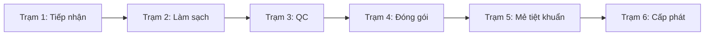

# ĐẶC TẢ NGHIỆP VỤ Y TẾ THỐNG NHẤT — KSNK BV103

> **Phiên bản:** 1.3 (28/07/2026)  
> **Trạng thái:** Hoạt động (SSOT Nghiệp vụ Bounded Context)  
> **Ánh xạ runtime:** [implementation-mapping.md](./implementation-mapping.md) (prefix `sys_`/`mdm_`/`cssd_`/`gstt_`/`qlcv_`/`nkbv_`).

---

## 1. Từ điển Thuật ngữ Nghiệp vụ (Ubiquitous Language)

| Thuật ngữ Spec | Ý nghĩa Nghiệp vụ Y tế | Bảng vật lý (SSOT) | Tên legacy (đã DROP khỏi DB 2026-06-02 — chỉ để tra cứu tài liệu cũ) |
| :--- | :--- | :--- | :--- |
| **VST (Vệ sinh tay)** | Giám sát tuân thủ 5 thời điểm vệ sinh tay WHO. | `gstt_fact_vst_sessions`, `gstt_fact_vst` | `fact_giam_sat_vst_*` |
| **GSC (Giám sát chung)** | Giám sát checklist động; kết quả inline `results_jsonb`. | `gstt_fact_chung_sessions`, `gstt_dm_bang_kiem` | `fact_giam_sat_chung_sessions`, `dm_bang_kiem` |
| **NKBV (Nhiễm khuẩn BV)** | HAI surveillance stay-centric; **1 module** cho mọi hội chứng (không tách 4 app — ADR 2026-07-15). | `nkbv_fact_su_kien`, `nkbv_fact_benh_an`, `nkbv_fact_vi_sinh` | `fact_nkbv_*`, `dm_loai_nkbv` |
| **CSSD (Tái xử lý dụng cụ)** | 6 trạm QR workflow tiệt khuẩn. | `cssd_fact_quy_trinh`, `cssd_fact_lo_tiet_khuan`, `cssd_fact_quy_trinh_thanh_phan` | `fact_quy_trinh`, `fact_lo_tiet_khuan` |
| **Mẻ Tiệt Khuẩn** | Chu trình hấp sấy + QC chỉ thị. | `cssd_fact_lo_tiet_khuan` | `fact_lo_tiet_khuan` |
| **QLCV (Quản lý công việc)** | Task nội bộ KSNK Track B (7 trạng thái). | `qlcv_fact_cong_viec`, `qlcv_fact_cong_viec_dinh_ky` | `fact_cong_viec` |
| **MDM Nhân sự / Khoa** | Master data dùng chung. | `mdm_nhan_su`, `mdm_dm_khoa_phong` | `dm_khoa_phong` |
| **RBAC** | Phân quyền module×action. | `sys_roles`, `sys_permissions`, `sys_role_permissions`, `sys_user_roles` | `dm_roles`, `dm_permissions` |
| **Đào tạo / Thi KSNK** | Thi thử + thi thật MCQ (Bloom, đa loại câu). | `dao_tao_cau_hoi`, `dao_tao_cau_hinh`, `dao_tao_lan_thi` (lean) | — |

### Entities đã loại bỏ (không mô tả workflow mới)

- **RCA ticket workflow** (`gstt_fact_rca_ticket`) — reform 2026-05-29: ghi nhận inline, không ticket.
- **EAV kết quả GSC** (`fact_giam_sat_chung_results`) — thay bằng `results_jsonb`.
- **Phần 3–4 phân tích trên form GSC/VST** — cột JSONB/RCA fields đã DROP; dashboard v4 IPAC slim.

---

## 2. Các Hành trình Nghiệp vụ (Clinical Journeys)

### 2.1 Giám sát Vệ sinh tay (VST - WHO 5 Moments)
* **Đối tượng giám sát:** Nhân viên y tế tại các khoa lâm sàng.
* **Thời điểm giám sát (WHO 5 Moments):** T1–T5 theo chuẩn WHO.
* **Luồng dữ liệu:** Phiên → `gstt_fact_vst_sessions` + quan sát `gstt_fact_vst` → KPI qua RPC **`rpc_dashboard_vst_strategic_analytics`** (Command Center + `/thong-ke/vst`). Bảng `gstt_fact_*_summary` đã DROP (2026-06-04); thay bằng **VIEW live** phục vụ RPC — app không đọc summary trực tiếp trừ ngoại lệ TGS coverage (xem metric-dictionary). Đọc lịch sử/chi tiết: **`v_gstt_giam_sat_vst_*_full`**. Bookmark cũ `?tab=analytics|history` redirect sang `/thong-ke/vst` / `/lich-su/vst`.

### 2.2 Quy trình Tái xử lý Dụng cụ y tế (CSSD Workflow)

> Bản nghiệp vụ đầy đủ (entity, QR, mẻ, luật đóng băng, màn hình): [`../modules/cssd/domain-overview.md`](../modules/cssd/domain-overview.md) — **chốt PO 2026-07-28**; **bổ sung domain 2026-08-22** từ PCI.03.00 (QT.18–25) — chỉ lấp domain đang có; HLD ngoài phạm vi.

```mermaid
flowchart LR
    A[Trạm 1: Tiếp nhận] --> B[Trạm 2: Làm sạch]
    B --> C[Trạm 3: QC]
    C --> D[Trạm 4: Đóng gói]
    D --> E[Trạm 5: Mẻ tiệt khuẩn]
    E --> F[Trạm 6: Cấp phát]
```

| Trạm | Việc chính |
|------|------------|
| 1 `TIEP_NHAN` | Quét bộ bẩn / mở chu trình; sau cấp phát → vòng mới |
| 2 `LAM_SACH` | Quét chuyển bước (chỉ +1) |
| 3 `QC` | Kiểm trước đóng gói (**QC trạm** QT.19 — ≠ QC mẻ QT.23) |
| 4 `DONG_GOI` | Quét + đối chiếu cấu phần + báo Hỏng/Mất/Bổ sung; sinh Cycle QR; thiếu cấu phần = **cảnh báo** (không chặn) |
| 5 `TIET_KHUAN` | **Chỉ qua phiếu mẻ** (không quét trên shell 6 trạm); nạp từ Đóng gói → chốt → máy → QC mẻ 3 cấp |
| 6 `CAP_PHAT` | Quét giao khoa / kho sạch; soft-warning thiếu cấu phần (Q2); bắt buộc mẻ ĐẠT |

* **Tab Kho** (`/cssd-quy-trinh?tab=kho`): giám sát FEFO/tồn — **không** phải trạm quét.
* **Tab Trace** (`?tab=trace`): timeline + liên kết SSI — không phải trạm.
* **Thu hồi / Recall:** phản ứng an toàn (không phải trạm 7); quay lại = `CAP_PHAT` → `TIEP_NHAN`. BI+ → recall theo `lo_tiet_khuan_id`.
* **Trạm 4:** panel đối chiếu cấu phần (read-only realtime). Digital BOM modal deprecated (`BV103_FEATURE_BOM_CHECKLIST=1` để bật lại).
* **Trạm 5:** `cssd_fact_lo_tiet_khuan`; QC mẻ không đạt → rollback về `DONG_GOI` + sự cố (+ đóng băng nếu cần). Implant → `Quarantine_BI` / `CHO_BI` trước `HOAN_THANH`.
* **Trạm 6:** Ledger soft-warning nếu thiếu cấu phần (QLDCPT Q2) — **không** hard-block.
* **Dual-coding:** tem quét `B01.SET.*` ↔ alias `B01.CD*` ↔ `BO-01-*` (resolve QR Hub); nhãn/Cycle QR đủ QT.20 gồm số mẻ.
* **Máy:** `READY` | `REPAIRING` | `HOLD_QC`; steam ⇒ BD đầu ngày đạt mới nạp.
* **Luật đóng băng (tóm tắt):** tách SUB khi lẫn nhiệt; Plasma cấm cellulose; master CRUD ≠ quét vận hành; Cycle QR reset khi vòng mới (giữ tem bộ vĩnh viễn). Chi tiết: domain-overview §5.

### 2.3 Quản lý Công việc Nội bộ KSNK (Track B Workflow)
* **Trạng thái canonical (7):** `MOI` → `DANG_LAM` → `CHO_DUYET` → `HOAN_THANH` / `TU_CHOI` / `QUA_HAN` / `DA_HUY`.
* **Alias legacy** (chỉ còn ở UI display nếu gặp dữ liệu cũ): `CHUA_BAT_DAU`→`MOI`, `CHO_NHAN_VIEC`/`DANG_THUC_HIEN`→`DANG_LAM`, `CHO_XAC_NHAN_HOAN_THANH`→`CHO_DUYET`. DB CHECK thu hẹp 7 mã — migration `20260709140000`.
* **Spawn định kỳ:** `qlcv_fact_cong_viec_dinh_ky` + `fn_qlcv_fact_cong_viec_spawn_dinh_ky_hom_nay()`.

---

## 3. Ranh giới Hệ thống & Chiến lược Tích hợp

### 3.1 Tích hợp HIS/LIS (roadmap)
MVP NKBV nhập liệu lâm sàng; kiến trúc hướng FHIR (`Patient`, `Encounter`, `Observation`).

### 3.2 Cơ chế Đồng bộ Master Data (MDM)

**MDM tổ chức** (dùng chung toàn viện):

* Khoa phòng: **`mdm_dm_khoa_phong`**
* Nhân sự: **`mdm_nhan_su`** + `auth_user_id` → `auth.users`
* Lookup phẳng: **`sys_lookup_value`** (14+ category_type)

**Master CSSD** (định nghĩa dụng cụ/máy/hóa chất — CRUD tại Quản trị, không phải phiên QR): TABLE **`cssd_dm_loai_dung_cu`**, **`cssd_dm_bo_dung_cu`**, **`cssd_dm_bo_dung_cu_chi_tiet`**, **`cssd_dm_thiet_bi`**, **`cssd_dm_hoa_chat`**. Ranh giới: [`../wiki/concepts.md`](../wiki/concepts.md#cssd-vs-mdm). Lộ trình: [`../modules/mdm/improvement-roadmap-20260717.md`](../modules/mdm/improvement-roadmap-20260717.md).

* Audit hệ thống: **không còn** (DROP 2026-06-02; xem `implementation-mapping.md` changelog)
