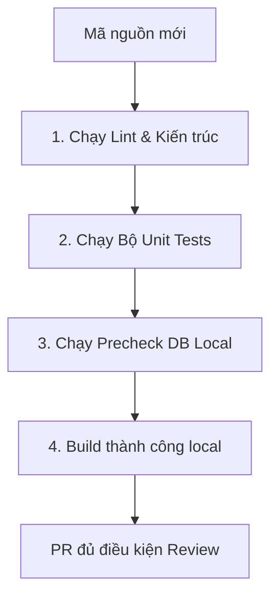

# QUY CHUẨN KỸ THUẬT & UI/UX THỐNG NHẤT — KSNK BV103

> **Phiên bản:** 1.0 (20/05/2026)  
> **Trạng thái:** Hoạt động (SSOT Phát triển Lập trình & UI/UX)  
> **Được hợp nhất từ:** Các quy chuẩn kỹ thuật, phát triển và giao diện cũ (`development-guide.md`, `DEVELOPMENT_PROCESS.md` và các quy chuẩn kỹ thuật cũ).

---

## 1. Quy chuẩn Lập trình (Engineering Standards)

Hệ thống KSNK BV103 được xây dựng dựa trên Next.js App Router (Next 16) + React 19 + TypeScript + Supabase. Để đảm bảo chất lượng, mọi lập trình viên và AI bắt buộc phải tuân thủ các quy tắc lập trình sau:

### 1.1 Nguyên tắc Thiết kế Module (DDD Boundaries)
* Mỗi phân hệ nghiệp vụ lâm sàng nằm trọn vẹn trong một thư mục dưới `src/modules/<ten-module>/`.
* **Không** import trực tiếp `actions/*` / `hooks/*` giữa hai module nghiệp vụ. Giao tiếp qua `contexts/<context>/entrypoint.ts` (CSSD), [`@/lib/mdm-read-gateway`](../../src/lib/mdm-read-gateway.ts) (GSC → bảng kiểm), [`@/lib/analytics/filter-helpers`](../../src/lib/analytics/filter-helpers.ts) (filter payload dùng chung dashboard).
* **SSOT dụng cụ:** định nghĩa master → `quan-tri-he-thong/danh-muc`; ledger vận hành → `fact_kho_dung_cu_giao_dich`.

### 1.2 Phân quyền Chặt chẽ tại Server Actions
* **Không bao giờ tin tưởng Client**: Mọi logic ghi/sửa dữ liệu ở phía Server Actions bắt buộc phải được bọc qua lớp kiểm tra quyền hạn `verifyPermission` hoặc `verifyPermissions`.
* Cú pháp mẫu kiểm tra quyền:
```typescript
import { verifyPermission } from "@/lib/server-permission";

export async function actionGhiNghiepVu(payload: InputSchema) {
  // Gate kiểm tra quyền trước khi truy cập database
  await verifyPermission("QUYEN_GHI_NGHIEP_VU");
  
  // Tiến hành ghi dữ liệu...
}
```

### 1.3 Phòng tránh Sụt giảm Hiệu năng Database
* **Không quét bảng không giới hạn**: Cấm viết các câu lệnh truy vấn dữ liệu thực tế từ các bảng `fact_*` khổng lồ mà không chỉ định giới hạn số dòng.
* Bắt buộc sử dụng `.limit()` hoặc `.range()` trên Supabase client để phân trang dữ liệu, bảo vệ bộ nhớ máy chủ Next.js và DB.

---

## 2. Hướng dẫn UI/UX và Layout Primitives (Chống Trôi lệch Giao diện)

SSOT hình ảnh: [`docs/reference/guides/bv103-visual-language.md`](../reference/guides/bv103-visual-language.md) · dialect: [`docs/reference/architecture/design-dialect-matrix-20260731.md`](../reference/architecture/design-dialect-matrix-20260731.md) · **chrome L1:** [`docs/reference/architecture/page-chrome-contract-20260731.md`](../reference/architecture/page-chrome-contract-20260731.md) · tokens `src/lib/bv103-design-tokens.ts`.

### 2.1 Cấu trúc Layout Chuẩn (module-first)

* Font / radius / surface: theo `globals.css` + design tokens (không tự thêm stack font/poster UI).
* Mọi trang authenticated nằm trong `KsnkPageShell` (`max-w-7xl`) — **cấm** thêm `max-w-5/6/7xl` trong view.
* **L1 dưới App Header = một `KsnkPageChrome`** (title/actions → tabs → filters). Không sticky kép tiêu đề; không border-b vs card lệch mật độ.
* Chọn **đúng một** vai trò trang (Ops / Analytics / Admin) — header qua chrome chung (`KsnkSupervisionHero` / `Bv103AnalyticsPageFrame` / `KsnkPageHeader` là wrapper).
* Banner ngữ cảnh: `KsnkContextBanner` (không invent box màu riêng trừ trạng thái máy/mẻ CSSD).
* Density: `--radius-shell` + `pageChromeShell`; tránh stack card dày trên Command Center.

### 2.2 Quy định Thiết kế Form và Empty State
* **Empty State đồng nhất:** Khi không có dữ liệu, dùng `EmptyState` (hoặc empty panel token) + CTA nhập liệu — không để viewport trống.
* **Loading Fallbacks:** Widget RPC / analytics bọc skeleton hoặc `Suspense` — không chặn cả trang.
* Gate: `npm run layout:drift-check` · `npm run layout:typography-check`.

---

## 3. Quy trình Phát triển & Kiểm soát Chất lượng P0 (CI/CD Gates)

Mọi Pull Request (PR) trước khi được duyệt vào nhánh chính bắt buộc phải đi qua các cổng kiểm soát kỹ thuật nghiêm ngặt:



### 3.1 Bộ lệnh kiểm tra cục bộ (Local Command Pack)
Trước khi tạo PR, chạy **một lệnh** (full gate — khớp CI):

```bash
npm run verify
```

Tương đương: `lint` + `verify:cssd` (arch + import MDM + tests CSSD) + `verify:engineering` + `build`.

Chỉ khi chắc không đụng Server Action / DB: `npm run verify:quick` (= build).

Bổ sung khi đụng schema: `npm run verify:mdm:local`, `npm run trial:db:precheck:local`. Chi tiết: [`lean-execution.md`](./lean-execution.md).

### 3.2 Quy trình Sử dụng PR Template
Khi tạo Pull Request trên GitHub, lập trình viên bắt buộc phải sử dụng **[.github/pull_request_template.md](file:///Users/trinhhuunghia/Desktop/ksnk_bv103/.github/pull_request_template.md)**, điền đầy đủ mô tả kịch bản kiểm thử lâm sàng bằng tay, và xác nhận hoàn thành phần **Alignment Check** (ánh xạ nghiệp vụ dữ liệu).
