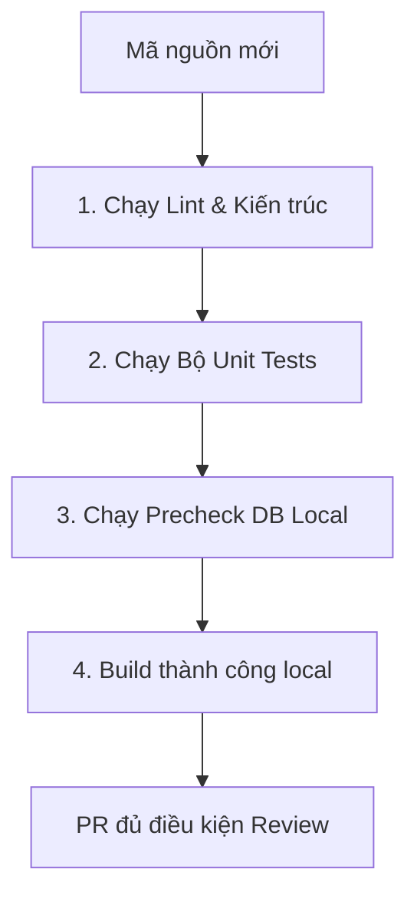

# QUY CHUẨN KỸ THUẬT & UI/UX THỐNG NHẤT — KSNK BV103

> **Phiên bản:** 1.0 (20/05/2026)  
> **Trạng thái:** Hoạt động (SSOT Phát triển Lập trình & UI/UX)  
> **Được hợp nhất từ:** Các quy chuẩn kỹ thuật, phát triển và giao diện cũ (`development-guide.md`, `DEVELOPMENT_PROCESS.md` và các quy chuẩn kỹ thuật cũ).

---

## 1. Quy chuẩn Lập trình (Engineering Standards)

Hệ thống KSNK BV103 được xây dựng dựa trên Next.js App Router (Next 16) + React 19 + TypeScript + Supabase. Để đảm bảo chất lượng, mọi lập trình viên và AI bắt buộc phải tuân thủ các quy tắc lập trình sau:

### 1.1 Nguyên tắc Thiết kế Module (DDD Boundaries)
* Mỗi phân hệ nghiệp vụ lâm sàng nằm trọn vẹn trong một thư mục dưới `src/modules/<ten-module>/`.
* **Không** import trực tiếp `actions/*` / `hooks/*` giữa hai module nghiệp vụ. Giao tiếp qua `contexts/<context>/entrypoint.ts` (CSSD), [`@/lib/mdm-read-gateway`](../../src/lib/mdm-read-gateway.ts) (GSC → bảng kiểm), [`@/lib/analytics/filter-helpers`](../../src/lib/analytics/filter-helpers.ts) (filter payload dùng chung dashboard).
* **SSOT dụng cụ:** định nghĩa master → `quan-tri-he-thong/danh-muc`; ledger vận hành → `fact_kho_dung_cu_giao_dich`.

### 1.2 Phân quyền Chặt chẽ tại Server Actions
* **Không bao giờ tin tưởng Client**: Mọi logic ghi/sửa dữ liệu ở phía Server Actions bắt buộc phải được bọc qua lớp kiểm tra quyền hạn `verifyPermission` hoặc `verifyPermissions`.
* Cú pháp mẫu kiểm tra quyền:
```typescript
import { verifyPermission } from "@/lib/server-permission";

export async function actionGhiNghiepVu(payload: InputSchema) {
  // Gate kiểm tra quyền trước khi truy cập database
  await verifyPermission("QUYEN_GHI_NGHIEP_VU");
  
  // Tiến hành ghi dữ liệu...
}
```

### 1.3 Phòng tránh Sụt giảm Hiệu năng Database
* **Không quét bảng không giới hạn**: Cấm viết các câu lệnh truy vấn dữ liệu thực tế từ các bảng `fact_*` khổng lồ mà không chỉ định giới hạn số dòng.
* Bắt buộc sử dụng `.limit()` hoặc `.range()` trên Supabase client để phân trang dữ liệu, bảo vệ bộ nhớ máy chủ Next.js và DB.

---

## 2. Hướng dẫn UI/UX và Layout Primitives (Chống Trôi lệch Giao diện)

Để ngăn ngừa lỗi giao diện trôi lệch (Layout Drift) và đảm bảo trải nghiệm đồng nhất, hệ thống BV103 định nghĩa cấu trúc giao diện theo các primitive layout chuẩn:

### 2.1 Cấu trúc Layout Chuẩn
* Sử dụng bộ font y tế đồng nhất (Google Fonts - Outfit/Inter) để hiển thị thông tin lâm sàng rõ nét.
* Giao diện Dashboard và các trang chức năng bắt buộc chia làm 3 khu vực rõ rệt:
  1. **Thanh định hướng chính (Sidebar):** Điều hướng chéo giữa các phân hệ lâm sàng.
  2. **Thanh trạng thái y tế (Context Bar):** Hiển thị bộ lọc thời gian toàn cục, khoa phòng đang thao tác và trạng thái đồng bộ dữ liệu.
  3. **Không gian làm việc (Viewport Area):** Nơi chứa các widget thông số và các form nhập liệu lâm sàng.

### 2.2 Quy định Thiết kế Form và Empty State
* **Empty State đồng nhất:** Khi không có dữ liệu (chưa chấm điểm VST, chưa có ca bệnh NKBV), bắt buộc hiển thị component `EmptyState` chuẩn kèm hình ảnh minh họa alpha rõ nét và nút hành động (Call-to-Action) hướng dẫn người dùng nhập liệu, không để màn hình trắng trơn.
* **Loading Fallbacks:** Mọi widget tính toán phức tạp bằng RPC bắt buộc phải được bọc trong React `Suspense` hoặc skeleton loading thích hợp để tránh chặn tương tác của toàn trang (Waterfall blocking).

---

## 3. Quy trình Phát triển & Kiểm soát Chất lượng P0 (CI/CD Gates)

Mọi Pull Request (PR) trước khi được duyệt vào nhánh chính bắt buộc phải đi qua các cổng kiểm soát kỹ thuật nghiêm ngặt:



### 3.1 Bộ lệnh kiểm tra cục bộ (Local Command Pack)
Trước khi tạo PR, chạy **một lệnh** (full gate — khớp CI):

```bash
npm run verify
```

Tương đương: `lint` + `verify:cssd` (arch + import MDM + tests CSSD) + `verify:engineering` + `build`.

Chỉ khi chắc không đụng Server Action / DB: `npm run verify:quick` (= build).

Bổ sung khi đụng schema: `npm run verify:mdm:local`, `npm run trial:db:precheck:local`. Chi tiết: [`LEAN_EXECUTION_BV103.md`](../specs/working/LEAN_EXECUTION_BV103.md).

### 3.2 Quy trình Sử dụng PR Template
Khi tạo Pull Request trên GitHub, lập trình viên bắt buộc phải sử dụng **[.github/pull_request_template.md](file:///Users/trinhhuunghia/Desktop/ksnk_bv103/.github/pull_request_template.md)**, điền đầy đủ mô tả kịch bản kiểm thử lâm sàng bằng tay, và xác nhận hoàn thành phần **Alignment Check** (ánh xạ nghiệp vụ dữ liệu).
