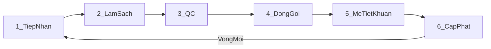
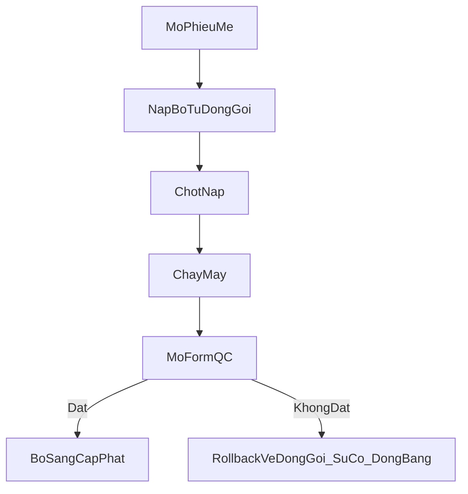

# Domain overview — Quy trình xử lý dụng cụ (CSSD)

> **Chốt:** 2026-07-28 (PO duyệt tổng hợp domain).  
> **SSOT hành trình ngắn:** [`../../core/domain-specification.md`](../../core/domain-specification.md) §2.2.  
> **Ánh xạ bảng/route:** [`../../core/implementation-mapping.md`](../../core/implementation-mapping.md) § CSSD.  
> Tài liệu này là bản **nghiệp vụ đầy đủ** (PO đọc được) — không thay mapping kỹ thuật.

---

## 1. Ranh giới

| Thuộc **Danh mục (định nghĩa)** | Thuộc **Vận hành CSSD** | Không thuộc CSSD |
|--------------------------------|-------------------------|------------------|
| Loại dụng cụ, Bộ dụng cụ, Thành phần trong bộ | Quét QR qua 6 trạm, mẻ tiệt khuẩn, cấp phát | Khoa / nhân sự (MDM tổ chức) |
| Máy / thiết bị hấp | Kho dụng cụ (xem tồn), bảo trì máy | Giám sát VST/GSC, NKBV (chỉ **liên kết** truy vết) |
| Hóa chất dùng tại CSSD | Sự cố (hỏng/mất/QC fail…), in tem | Vật tư phi-hóa-chất (chưa chốt BRD) |

**Quy tắc vàng:** CRUD danh mục ở **Quản trị danh mục**; quét tem / chạy mẻ / cấp phát ở **CSSD vận hành**.

Ranh giới chi tiết: [`../../wiki/concepts.md`](../../wiki/concepts.md#cssd-vs-mdm). Luồng master → vận hành: [`quan-ly-dung-cu-luong.md`](quan-ly-dung-cu-luong.md).

---

## 2. Đối tượng nghiệp vụ

### 2.1 Danh mục (master)

1. **Loại dụng cụ** — Spaulding (Thiết yếu / Bán thiết yếu / Không thiết yếu), chịu nhiệt hay không, phương pháp TK chỉ định (`STEAM_134` / `STEAM_121` / `PLASMA` / `EO`).
2. **Bộ dụng cụ** — bộ vật lý có tem QR cố định `KHOA.SET.NN` (vd. `B01.SET.01`).
3. **Thành phần bộ (cấu phần)** — từng món trong bộ (`DC-*`); **không** quét workflow.
4. **Máy / thiết bị** — máy hấp gắn mẻ; `READY` / `REPAIRING`.
5. **Hóa chất** — kho theo lô, `NHAP` / `XUAT` / `DIEU_CHINH`, FEFO, ngưỡng tồn tối thiểu.

### 2.2 Vận hành (fact)

1. **Quy trình / chu trình bộ** — một vòng đời bộ qua các trạm (hub `cssd_fact_quy_trinh`).
2. **Mẻ tiệt khuẩn** — phiếu hấp một lô trên một máy (`LOT-*`); nhiều bộ nạp vào một mẻ.
3. **Sự cố** — báo cáo (quy trình / dụng cụ / hóa chất / thiết bị…).
4. **Giao dịch kho dụng cụ lẻ** — Hỏng / Mất / Bổ sung / Điều chuyển.
5. **Phiếu bảo trì máy** — định kỳ hoặc sửa chữa.

### 2.3 Mã / tem QR

| Loại tem | Ví dụ | Quét workflow? |
|----------|-------|----------------|
| Tem bộ vĩnh viễn | `B01.SET.01` | Có |
| Tem chu trình (Cycle QR) | `BV103-CYC-…` | Có (sau đóng gói / mẻ / cấp phát) |
| Mã chi tiết trong bộ | `DC-0001` | Không |
| Mã mẻ | `LOT-…` | Có (màn mẻ) |
| Máy | `TB-…` / `MAY-…` | Có (mẻ / bảo trì) |

**QR Hub:** mọi màn quét vận hành CSSD nhận diện qua `resolveCssdCodeWithClient`.

---

## 3. Luồng chính — 6 trạm

| Trạm | Mã | Việc làm | Ghi chú đã chốt |
|------|-----|----------|-----------------|
| 1. Tiếp nhận | `TIEP_NHAN` | Quét bộ bẩn / mở chu trình mới | Sau cấp phát, lần tiếp nhận = vòng mới |
| 2. Làm sạch | `LAM_SACH` | Quét chuyển bước | Chỉ tiến đúng 1 bước |
| 3. QC | `QC` | Kiểm trước đóng gói | |
| 4. Đóng gói | `DONG_GOI` | Quét + đối chiếu cấu phần; báo Hỏng/Mất/Bổ sung; sinh Cycle QR | Thiếu cấu phần: **cảnh báo**, không chặn cứng |
| 5. Mẻ tiệt khuẩn | `TIET_KHUAN` | **Không quét trên bản đồ 6 trạm** — mở phiếu mẻ | Nạp bộ đang Đóng gói → chốt nạp → chạy máy → QC mẻ |
| 6. Cấp phát | `CAP_PHAT` | Quét giao khoa / vào kho sạch | Soft-warning thiếu cấu phần; phải có mẻ ĐẠT |

**Không phải trạm quét**

- **Tab Kho** (`?tab=kho`) — xem tồn / hạn dùng (FEFO).
- **Tab Truy vết** (`?tab=trace`) — timeline chu trình / liên kết SSI.
- **Thu hồi / Recall** — phản ứng an toàn (QC mẻ fail / sự cố), **không** phải trạm thứ 7. Quay lại CSSD = `Cấp phát → Tiếp nhận`. QC mẻ không đạt → rollback về Đóng gói + có thể **đóng băng** bộ.

---

## 4. Mẻ tiệt khuẩn

| Trạng thái mẻ (UI) | Ý nghĩa |
|--------------------|---------|
| `DANG_CHUAN_NAP` | Chưa chốt nạp |
| `DANG_TIET_KHUAN` | Đã chốt nạp, chưa mở form QC |
| `CHO_DANH_GIA_QC` | Đã mở form QC, chưa có kết quả |
| `HOAN_THANH` | QC đạt |
| `QC_KHONG_DAT` | QC không đạt |

**Chỉ thị QC:** Đạt / Không đạt / Không áp dụng (tiếp xúc, đa thông số, BI, CI, Bowie–Dick).

**Rủi ro nhiệt (Spaulding):** OK / Cảnh báo / Chặn — bộ lẫn chịu nhiệt / không chịu nhiệt phải **tách gói phụ (SUB)** trước khi hấp steam 134.

**Máy:** `REPAIRING` → không tạo mẻ mới; còn mẻ chưa có `ket_qua_test` ↔ ràng buộc ngược với bảo trì.

---

## 5. Luật nghiệp vụ đóng băng

1. Thiếu cấu phần lúc đóng gói / cấp phát → **cảnh báo + tem**, **không chặn cứng** (QLDCPT Q2).
2. Bộ lẫn chịu nhiệt / không chịu nhiệt → **bắt tách SUB** trước khi đạt đóng gói / khóa steam 134.
3. QC mẻ không đạt → **rollback về Đóng gói + sự cố** (+ đóng băng nếu cần).
4. Tiệt khuẩn chỉ qua **phiếu mẻ**, không quét trạm «Tiệt khuẩn» trên shell 6 bước.
5. Master CRUD ≠ vận hành quét.
6. Cấp phát khi chưa có mẻ / mẻ chưa QC → **lỗi** (chặn).
7. Sau cấp phát, quét tiếp nhận = **chu kỳ mới** (giữ tem bộ vĩnh viễn; Cycle QR reset).

---

## 6. Sự cố, kho, bảo trì

| Nhóm sự cố | Hệ quả điển hình |
|------------|------------------|
| Quy trình (vd. mẻ fail) | Rollback / đóng băng |
| Dụng cụ (Hỏng / Mất / Bổ sung / Điều chuyển) | Ghi sổ `cssd_fact_kho_giao_dich` |
| Hóa chất | Xuất / điều chỉnh kho HC |
| Thiết bị | Mở phiếu bảo trì; máy → đang sửa |

**Công thức tồn thực tế (QLDCPT):**  
Thực tế = tiêu chuẩn − (Hỏng + Mất) + Bổ sung ± Điều chuyển.

---

## 7. Màn hình vận hành

| Màn | Việc |
|-----|------|
| `/cssd-quy-trinh` | 6 trạm + tab Mẻ / Kho / Truy vết |
| `/cssd-erp/batch` | Deep link mẻ tiệt khuẩn |
| `/cssd-dung-cu` | Xem danh mục + in tem (không CRUD) |
| `/cssd-su-co` | Báo sự cố |
| `/cssd-thiet-bi` | Bảo trì máy |
| `/cssd-hoa-chat` | Kho hóa chất |
| Quản trị → Danh mục dụng cụ | CRUD Loại / Bộ / Thành phần |

Pilot: [`pilot-test-checklist.md`](pilot-test-checklist.md) · Cycle QR: [`pilot-checklist-cycle-qr-202606.md`](pilot-checklist-cycle-qr-202606.md).
