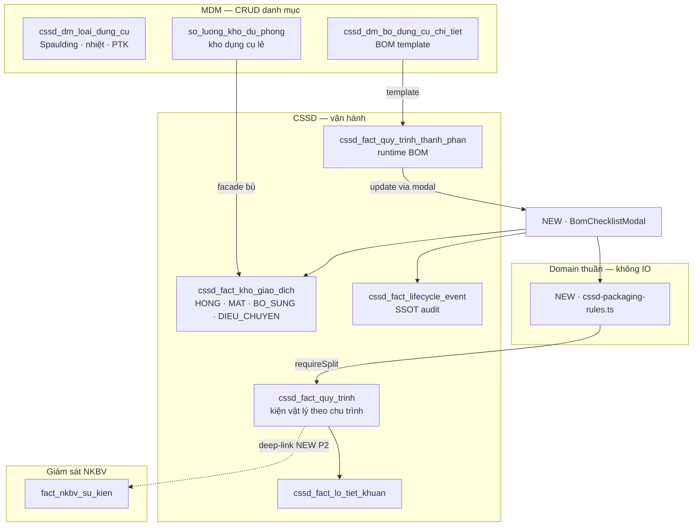
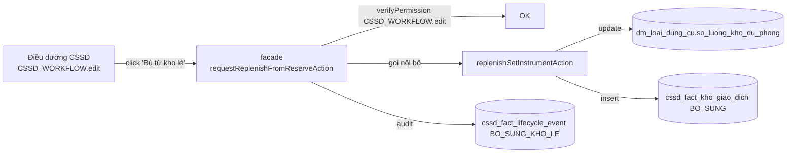

# QLDCPT/CSSD — Kế hoạch cải tổ v3

> Phiên bản: 2026-05-25 · Trạng thái: **Đã được duyệt 6 quyết định cốt lõi** · Phạm vi: module quản lý dụng cụ phẫu thuật (CSSD/QLDCPT)
> Đối chiếu nghiệp vụ: [`../../data/qldcpt/cssd-business-notes.md`](../../data/qldcpt/cssd-business-notes.md)
> Ràng buộc kỷ luật: [`AGENTS.md`](../../../AGENTS.md), [`01-agent-discipline.mdc`](../../../.cursor/rules/01-agent-discipline.mdc), [`51-database-migration-rules.mdc`](../../../.cursor/rules/51-database-migration-rules.mdc), [`../../core/lean-execution.md`](../../core/lean-execution.md)

## TL;DR

- Đa số schema CSSD prefix/Spaulding/chịu nhiệt/backward-compat view **đã DONE** ở migration `20260525000007_cssd_module_prefix_and_hybrid_qr.sql`. **Không viết lại schema** ở các pha tiếp theo.
- Còn lại 7 gap so với QLDCPT — cải tổ chia làm **4 pha** (P0–P3), mỗi pha một vertical slice.
- Quyết định người dùng đã chốt: triển khai trên **toàn bộ trạm `DONG_GOI`** (không pilot 1 khoa); **không chặn cấp phát** mà chỉ in nhãn cảnh báo (Poka-yoke); facade quyền chéo `CSSD_WORKFLOW.edit`; thêm 1 RPC atomic; có máy in nhãn niêm phong nên **làm P3 Cycle QR**.

## Tóm tắt quyết định (chốt 2026-05-25)

| Q | Câu hỏi | Quyết định | Tác động kế hoạch |
|---|---|---|---|
| Q1 | Phạm vi triển khai P0 | **Toàn bộ trạm `DONG_GOI`** | Bỏ pilot 1 khoa; giữ feature flag `BV103_FEATURE_BOM_CHECKLIST` để rollback nhanh nếu cần |
| Q2 | Hành vi khi thiếu cấu phần | **Không chặn cấp phát — chỉ in tem cảnh báo** | `assertLedgerDuChoCapPhat` chuyển từ throw → log lifecycle event + UI warning; print template thêm badge khi gap |
| Q3 | Quyền chéo MDM ↔ CSSD | **Đồng ý facade `CSSD_WORKFLOW.edit`** | Tạo facade `requestReplenishFromReserveAction` gọi nội bộ MDM elevated |
| Q4 | RPC atomic ở P0 | **Đồng ý** thêm 1 migration `rpc_cssd_persist_bom_checkpoint` | Exception duy nhất — không ALTER bảng |
| Q5 | Phần cứng cho Cycle QR | **Có máy in nhãn niêm phong** | P3 sẽ triển khai (sau khi P0–P2 ổn định) |
| Q6 | Ghi báo cáo thành doc | **Ghi vào `docs/modules/`** | File hiện tại |

---

## PHẦN A — Hiện trạng đã DONE (không động lại)

| # | Khoản đã làm | Bằng chứng |
|---|---|---|
| A1 | Prefix `cssd_*` cho 10 bảng | Archive `docs/archive/pilot_chain_20260520_20260529.tar.gz` → `20260525000007_cssd_module_prefix_and_hybrid_qr.sql` L17-27 |
| A2 | Cột nghiệp vụ `phan_loai_spaulding`, `is_chiu_nhiet`, `phuong_phap_tiet_khuan_chi_dinh` | Migration 000007 L30-33 |
| A3 | FK `cssd_fact_kho_giao_dich.nguoi_thuc_hien_id → mdm_nhan_su(id)` | Migration 000007 L47-48 |
| A4 | Backward-compat view 11 bảng (`dm_*` / `fact_*` ↔ `cssd_*`) với `security_invoker='true'` | Migration 000007 L254-264 |
| A5 | DROP `fact_nhat_ky_quet`; giữ `cssd_fact_lifecycle_event` làm SSOT audit | Migration 000007 L50 |
| A6 | RPC `rpc_scan_workflow_station` xử lý new cycle (`CAP_PHAT → TIEP_NHAN`) atomic | Migration 000007 L267-359 |
| A7 | 6 route legacy đã redirect | `src/app/cssd-{dong-goi,cap-phat,tiep-nhan,quan-tri,erp/inventory,erp/catalog}/page.tsx` |
| A8 | Action bù kho/báo hỏng cấp loại dụng cụ | `reportIndividualInstrumentIssueAction` + `replenishSetInstrumentAction` ở [`src/modules/quan-tri-he-thong/danh-muc/actions/bo-dung-cu-chi-tiet-read.actions.ts`](../../../src/modules/quan-tri-he-thong/danh-muc/actions/bo-dung-cu-chi-tiet-read.actions.ts) L94-180 |
| A9 | Guard `imports:cssd-mdm` chặn CSSD import UI MDM CRUD | [`scripts/guard-cssd-mdm-imports.mjs`](../../../scripts/guard-cssd-mdm-imports.mjs) |

---

## PHẦN B — Gap thực sự còn lại (7 gap)

### B1 · Digital BOM Checklist tại trạm `DONG_GOI` — **gap chính**

- Schema `cssd_fact_quy_trinh_thanh_phan` có sẵn, `syncThanhPhanTuTemplate` bơm template.
- **Không có UI** cho điều dưỡng cập nhật `so_luong_thuc_te`.
- Hệ quả: rule chặn `CAP_PHAT` tồn tại lý thuyết nhưng **không bao giờ kích hoạt** — đúng pain point QLDCPT §3.1.

### B2 · Domain rule engine cho Spaulding / chịu nhiệt

- Cột đã có trên `cssd_dm_loai_dung_cu`, view đã expose.
- **Không có** file domain thuần xử lý "bộ lẫn nhiệt → khóa STEAM_134" (QLDCPT §2.3).
- `me-tiet-khuan-process-qc-panel.tsx` chỉ phân loại máy theo tên, không đối chiếu BOM.

### B3 · Kết nối CSSD ↔ kho dụng cụ lẻ (cross-permission)

- `replenishSetInstrumentAction` dùng quyền `DC_LE.edit` (MDM).
- CSSD dùng `CSSD_WORKFLOW.edit`.
- Không có facade — điều dưỡng CSSD không thể "xin bù kho lẻ" mà không có đủ quyền MDM.

### B4 · Mapping doc lệch tên bảng

- [`docs/core/implementation-mapping.md`](../../core/implementation-mapping.md) L23-39 vẫn ghi tên cũ `dm_loai_dung_cu`, `fact_quy_trinh`.

### B5 · NKBV SSI ↔ CSSD trace link

- `fact_nkbv_su_kien` (migration `20260524000000`) chưa có cột `quy_trinh_id`/`lo_tiet_khuan_id`.
- QLDCPT §3.3 "click Mã Bộ → truy xuất SSI" không khả thi.

### B6 · Legacy bypass trong `assertLedgerDuChoCapPhat`

- Code: *"không có ledger = legacy bỏ qua"*. Sau P0 cần xóa nhánh này để mọi bộ đều đi qua checklist.

### B7 · Cycle QR (QR Bộ vĩnh viễn + QR Chu trình)

- Hiện gom 2 vai trò vào một cột `ma_qr_quy_trinh`. Tách thành P3 (Q5 đã đồng ý).

---

## PHẦN C — Kiến trúc đề xuất (v3)

### C.1 Domain map sau cải tổ



### C.2 Data flow một chu trình đầy đủ (sau P0, Q2)

```
TIEP_NHAN (quét QR) → RPC scan → cssd_fact_quy_trinh row
   └─> syncThanhPhanTuTemplate → BOM runtime

LAM_SACH (quét) → chuyển trạm

QC (quét) → chuyển trạm

DONG_GOI (quét QR) ⇨ MỞ BomChecklistModal (NEW)
   ├─ load v_dm_bo_dung_cu_chi_tiet_full + cssd_fact_quy_trinh_thanh_phan
   ├─ điều dưỡng tick Đạt/Thiếu/Hỏng/Bù từng cấu phần
   ├─ chạy evaluateHeatCompatibility:
   │     - lẫn nhiệt → requireSplit=true, đề nghị PLASMA/EO
   │     - đồng nhất → STEAM_134 ok
   ├─ nếu "Thiếu + Bù từ kho lẻ":
   │     → facade requestReplenishFromReserveAction (CSSD_WORKFLOW.edit)
   │     → ghi cssd_fact_kho_giao_dich (BO_SUNG)
   ├─ persistBomCheckpoint (RPC atomic):
   │     1. update cssd_fact_quy_trinh_thanh_phan.so_luong_thuc_te
   │     2. insert cssd_fact_kho_giao_dich cho mỗi delta (HONG/MAT)
   │     3. insertCssdLifecycleEvent KIEM_DEM_BOM
   │     4. nếu requireSplit && !daTach → event BO_LAN_NHIET_CHO_TACH
   ├─ nút "Đạt" enable khi:
   │     - đã tách SUB (nếu requireSplit) HOẶC bộ đồng nhất nhiệt
   │     - không yêu cầu gap = 0 (Q2: cho phép thiếu)
   └─ nếu còn gap khi chốt: in tem có badge ⚠ THIẾU CẤU PHẦN
                            + event DONG_GOI_THIEU_CAU_PHAN

TIET_KHUAN (mẻ TK; mẻ tự cảnh báo nếu bất kỳ bộ có requireSplit chưa tách)

CAP_PHAT (quét) → assertLedgerDuChoCapPhat (SOFTENED, Q2):
   ├─ Không throw nữa
   ├─ Nếu còn gap → insertCssdLifecycleEvent CAP_PHAT_BO_THIEU_CAU_PHAN
   ├─ Toast warning trên UI cấp phát (đỏ, không block confirm)
   └─ In tem giao bộ có badge ⚠ nếu gap
```

### C.3 Permission flow (giải quyết B3 + Q3)



---

## PHẦN D — Kế hoạch 4 pha

### P0 — Digital BOM Checklist + Rule chịu nhiệt

#### Mục tiêu Pilot DoD

1. Triển khai trên **toàn bộ trạm `DONG_GOI`** (Q1) sau khi pilot 3 ngày qua feature flag.
2. Tại trạm `DONG_GOI`, modal mở ngay khi quét QR; điều dưỡng kết thúc ≤ 60 giây/bộ.
3. ≥ 5 kịch bản tay xanh:
   - (a) đủ;
   - (b) thiếu + bù từ kho lẻ thành công;
   - (c) thiếu không bù → cho phép qua + tem cảnh báo;
   - (d) bộ lẫn nhiệt → bắt tách SUB trước khi Đạt;
   - (e) bộ thiếu chốt đóng gói → đến `CAP_PHAT` **không bị chặn** nhưng có toast cảnh báo + lifecycle event + tem giao bộ in badge ⚠.

#### File diff

| Type | File | Mục đích |
|---|---|---|
| NEW | `src/lib/domain/cssd-packaging-rules.ts` | Domain thuần: `evaluateHeatCompatibility`, `summarizeBomGap`, `isReadyForPackaging` |
| NEW | `src/lib/domain/cssd-packaging-rules.spec.ts` | ≥ 8 unit test |
| NEW | `src/lib/bv103-feature-config.ts` (mở rộng nếu đã có) | Thêm flag `BV103_FEATURE_BOM_CHECKLIST` |
| NEW | `src/modules/cssd-erp/actions/cssd-bom-checkpoint.actions.ts` | `loadBomCheckpoint(quyTrinhId)`, `persistBomCheckpoint(input)`, `requestReplenishFromReserveAction(input)` |
| NEW | `src/modules/cssd-erp/actions/cssd-bom-checkpoint.actions.spec.ts` | Mock supabase, test rule chặn + softening |
| NEW | `src/modules/cssd-erp/components/packaging/BomChecklistModal.tsx` | UI modal ≤ 350 dòng, dùng `CSSD_UI_PANEL` |
| NEW | `src/modules/cssd-erp/components/packaging/BomGapBadge.tsx` | Badge tóm tắt gap + nhiệt |
| MODIFY | `src/hooks/usePrint.ts` | Mở rộng `printLabel(data, opts?: { warningBadge?: string })` |
| MODIFY | `src/modules/cssd-erp/hooks/useCSSDWorkflow.ts` | Khi `currentStation === "DONG_GOI"` và scan thành công + flag bật: emit event `requireBomCheckpoint` thay vì auto-advance |
| MODIFY | `src/modules/cssd-erp/views/CSSDERPPage.tsx` | Render `<BomChecklistModal>` controlled |
| MODIFY | `src/modules/cssd-erp/asset/domain/cssd-asset-ledger.ts` | (1) Xóa nhánh `legacy bỏ qua`; (2) `assertLedgerDuChoCapPhat` đổi return type: `{ ok: true } | { ok: true, warning: string }` — **không throw** (Q2) |
| MODIFY | `src/modules/cssd-erp/workflow/application/cssd-workflow-application.ts` | Trạm `CAP_PHAT`: nếu `warning` → `insertCssdLifecycleEvent('CAP_PHAT_BO_THIEU_CAU_PHAN')` + return warning để UI toast |
| MODIFY | `src/modules/cssd-erp/components/scan/QRScanSuccessCard.tsx` | Hiển thị banner cảnh báo đỏ khi có `warning` |
| NEW | `scripts/cssd-backfill-thanh-phan.ts` | Script chạy 1 lần idempotent: sync template cho mọi `quy_trinh` active thiếu BOM runtime |
| NEW | `supabase/migrations/<YYYYMMDD>_cssd_rpc_persist_bom_checkpoint.sql` | CREATE FUNCTION `rpc_cssd_persist_bom_checkpoint` — additive, không ALTER bảng |
| MODIFY | `docs/core/implementation-mapping.md` | Dòng changelog P0 + cập nhật tên bảng `cssd_*` |

#### Domain API (`src/lib/domain/cssd-packaging-rules.ts`)

```ts
// Không import supabase / next / react — pure
export type BomItem = {
  loai_id: string;
  ten: string;
  so_luong_ke_hoach: number;
  so_luong_thuc_te: number;
  so_luong_hong?: number;
  is_chiu_nhiet: boolean;
  phan_loai_spaulding: 'CRITICAL' | 'SEMI_CRITICAL' | 'NON_CRITICAL';
  phuong_phap_tiet_khuan_chi_dinh: 'STEAM_134' | 'STEAM_121' | 'PLASMA' | 'EO';
};

export type HeatEvaluation = {
  requireSplit: boolean;
  recommendedMethod: 'STEAM_134' | 'STEAM_121' | 'PLASMA' | 'EO';
  reason: string;
};

export type GapRow = { loai_id: string; ten: string; thieu: number; hong: number };

export function evaluateHeatCompatibility(items: BomItem[]): HeatEvaluation;
export function summarizeBomGap(items: BomItem[]): GapRow[];
export function isReadyForPackaging(items: BomItem[], split: 'NONE' | 'DONE'): { ready: boolean; reason?: string };
```

Test bắt buộc (≥ 8):

1. Tất cả chịu nhiệt → `STEAM_134`, `requireSplit=false`.
2. Tất cả chịu nhiệt + có `SEMI_CRITICAL` → `STEAM_134` pass.
3. 1 dụng cụ không chịu nhiệt → `requireSplit=true`, recommend `PLASMA`.
4. Lẫn nhiệt + tất cả `NON_CRITICAL` → vẫn `requireSplit=true` (an toàn vật lý là ưu tiên).
5. `summarizeBomGap` đủ → `[]`.
6. `summarizeBomGap` thiếu 2 panh + hỏng 1 kéo → 2 row.
7. `isReadyForPackaging`: requireSplit + split=NONE → `ready=false, reason="Cần tách SUB"`.
8. `isReadyForPackaging`: requireSplit + split=DONE + gap > 0 → `ready=true` (Q2 cho phép thiếu).

#### RPC `rpc_cssd_persist_bom_checkpoint` (skeleton)

```sql
CREATE OR REPLACE FUNCTION public.rpc_cssd_persist_bom_checkpoint(
  p_quy_trinh_id uuid,
  p_lines jsonb,        -- [{thanh_phan_id, so_luong_thuc_te, so_luong_hong}]
  p_deltas jsonb,       -- [{loai_id, bo_id, loai_giao_dich, so_luong_thay_doi, ghi_chu}]
  p_do_split text,      -- 'NONE' | 'REQUESTED'
  p_operator_id uuid
) RETURNS json
LANGUAGE plpgsql SECURITY DEFINER
SET search_path TO 'public'
AS $$
DECLARE
  v_line jsonb;
  v_delta jsonb;
BEGIN
  -- 1. Update so_luong_thuc_te
  FOR v_line IN SELECT * FROM jsonb_array_elements(p_lines) LOOP
    UPDATE public.cssd_fact_quy_trinh_thanh_phan
       SET so_luong_thuc_te = (v_line->>'so_luong_thuc_te')::int,
           updated_at = now()
     WHERE id = (v_line->>'thanh_phan_id')::uuid
       AND quy_trinh_id = p_quy_trinh_id;
  END LOOP;

  -- 2. Insert ledger deltas
  FOR v_delta IN SELECT * FROM jsonb_array_elements(p_deltas) LOOP
    INSERT INTO public.cssd_fact_kho_giao_dich(
      loai_dung_cu_id, bo_dung_cu_id, quy_trinh_id,
      loai_giao_dich, so_luong_thay_doi, ghi_chu,
      nguoi_thuc_hien_id, created_at, updated_at
    ) VALUES (
      (v_delta->>'loai_id')::uuid,
      NULLIF(v_delta->>'bo_id','')::uuid,
      p_quy_trinh_id,
      v_delta->>'loai_giao_dich',
      (v_delta->>'so_luong_thay_doi')::int,
      v_delta->>'ghi_chu',
      p_operator_id, now(), now()
    );
  END LOOP;

  -- 3. Lifecycle event KIEM_DEM_BOM
  INSERT INTO public.cssd_fact_lifecycle_event(
    quy_trinh_id, ma_su_kien, ma_tram, payload, created_at, updated_at
  ) VALUES (
    p_quy_trinh_id, 'KIEM_DEM_BOM', 'DONG_GOI',
    jsonb_build_object('do_split', p_do_split, 'so_lines', jsonb_array_length(p_lines)),
    now(), now()
  );

  RETURN json_build_object('success', true);
EXCEPTION WHEN OTHERS THEN
  RETURN json_build_object('success', false, 'message', SQLERRM);
END;
$$;
```

Đảm bảo atomic 3 bảng — nếu lỗi giữa chừng, transaction rollback.

#### Action skeleton

```ts
"use server";
import { verifyPermission } from "@/lib/server-permission";
import { createAdminSupabaseClient } from "@/lib/supabase-server";
import {
  evaluateHeatCompatibility,
  summarizeBomGap,
  isReadyForPackaging,
} from "@/lib/domain/cssd-packaging-rules";
import { insertCssdLifecycleEvent } from "../shared/application/cssd-lifecycle-events";

export async function persistBomCheckpoint(input: {
  quy_trinh_id: string;
  lines: Array<{ thanh_phan_id: string; so_luong_thuc_te: number; so_luong_hong: number }>;
  do_split: 'NONE' | 'REQUESTED';
  ghi_chu?: string;
}) {
  await verifyPermission("CSSD_WORKFLOW", "edit");
  const supabase = createAdminSupabaseClient();

  const items = await loadBomItems(supabase, input.quy_trinh_id); // hàm helper trả về BomItem[]
  const deltas = computeDeltas(items, input.lines); // pure

  const { data, error } = await supabase.rpc('rpc_cssd_persist_bom_checkpoint', {
    p_quy_trinh_id: input.quy_trinh_id,
    p_lines: input.lines,
    p_deltas: deltas,
    p_do_split: input.do_split,
    p_operator_id: await resolveOperatorId(supabase),
  });
  if (error || !data?.success) throw new Error(error?.message || data?.message || 'RPC fail');

  const heat = evaluateHeatCompatibility(items);
  if (heat.requireSplit && input.do_split === 'NONE') {
    await insertCssdLifecycleEvent(supabase, {
      quy_trinh_id: input.quy_trinh_id,
      ma_su_kien: "BO_LAN_NHIET_CHO_TACH",
      payload: { recommendedMethod: heat.recommendedMethod, reason: heat.reason },
    });
  }
  return { success: true, heat, gap: summarizeBomGap(items) };
}

// Facade Q3
export async function requestReplenishFromReserveAction(params: {
  quy_trinh_id: string;
  loai_dung_cu_id: string;
  bo_dung_cu_id: string;
  quantity: number;
  note?: string;
}) {
  await verifyPermission("CSSD_WORKFLOW", "edit");
  // Gọi nội bộ action MDM (đã được verify lại trong action đó)
  const { replenishSetInstrumentAction } = await import(
    "@/modules/quan-tri-he-thong/danh-muc/actions/bo-dung-cu-chi-tiet-read.actions"
  );
  const result = await replenishSetInstrumentAction({
    loaiDungCuId: params.loai_dung_cu_id,
    boDungCuId: params.bo_dung_cu_id,
    quyTrinhId: params.quy_trinh_id,
    quantity: params.quantity,
    note: params.note,
  });
  if (result.success) {
    const supabase = createAdminSupabaseClient();
    await insertCssdLifecycleEvent(supabase, {
      quy_trinh_id: params.quy_trinh_id,
      ma_su_kien: "BO_SUNG_KHO_LE",
      payload: { loai_dung_cu_id: params.loai_dung_cu_id, quantity: params.quantity },
    });
  }
  return result;
}
```

Lưu ý: Facade **không bypass quyền** — `replenishSetInstrumentAction` vẫn tự gọi `verifyPermission("DC_LE", "edit")`. Phương án xử lý: thêm vai trò `DC_LE.edit` vào nhóm điều dưỡng CSSD đã có `CSSD_WORKFLOW.edit` (cập nhật policy permission, không sửa action MDM). Nếu cần tách hẳn → tạo `DC_LE.edit_from_cssd` riêng (đẩy sang P0.1 nếu phát hiện cần).

#### UI Modal — layout

```
┌─ Modal (max-w-3xl) — CSSD_UI_PANEL ──────────────────┐
│ Header: Mã QR · Tên bộ · Badge nhiệt (BomGapBadge)   │
├──────────────────────────────────────────────────────┤
│ Bảng cấu phần (table, không card lồng card):         │
│ Stt | Cấu phần | KH | TT | Hỏng | Bù | Spaulding     │
│  1  | Panh K…   | 5  |[5] | [0] |  - | CRITICAL      │
│  2  | Kéo Mayo  | 2  |[1] | [1] |[Bù]| CRITICAL      │
│  3  | Camera    | 1  |[1] | [0] |  - | SEMI ⚡        │
├──────────────────────────────────────────────────────┤
│ Tóm tắt: Thiếu 1 Kéo Mayo  [Bù từ kho lẻ ▶]          │
│ Cảnh báo: Bộ lẫn nhiệt — đề nghị PLASMA              │
│   [Tách & in nhãn SUB cho cấu phần không chịu nhiệt] │
├──────────────────────────────────────────────────────┤
│ Ghi chú: [_____________________________]             │
│                  [Hủy] [Đóng gói (Đạt)]              │
└──────────────────────────────────────────────────────┘
```

Nút **Đạt** disabled khi `isReadyForPackaging.ready=false` (chỉ vì lý do nhiệt chưa tách). Gap > 0 vẫn cho qua → in tem cảnh báo (Q2).

#### Verify

```bash
npm run lint:cssd-architecture
npm run imports:cssd-mdm
npm run test:cssd -- src/lib/domain src/modules/cssd-erp
npm run verify:engineering
npm run mdm:migrate:local && npm run verify:mdm:local
```

---

### P1 — Đồng bộ mapping doc + thu gọn entrypoint

#### Mục tiêu
Loại nhầm lẫn schema; không sửa code chức năng.

#### File diff

| Type | File | Mục đích |
|---|---|---|
| MODIFY | [`docs/core/implementation-mapping.md`](../../core/implementation-mapping.md) | Cập nhật tên `cssd_*`; thêm dòng `cssd_fact_lifecycle_event` là SSOT audit; dòng changelog ngày |
| MODIFY | [`src/lib/cssd-routes.ts`](../../../src/lib/cssd-routes.ts) | Comment đánh dấu `erpRoot`, `erpCatalog`, `erpInventory` = legacy redirect |
| MODIFY | [`docs/core/read-minimum.md`](../../core/read-minimum.md) | Thêm dòng đọc tối thiểu khi sửa `cssd-erp/components/packaging/*` |
| MODIFY | [`.cursor/rules/12-cssd-erp-spec-context.mdc`](../../../.cursor/rules/12-cssd-erp-spec-context.mdc) | Thêm anchor đến `cssd-packaging-rules.ts` và doc này |

#### Verify

```bash
npm run docs:links:check
npm run layout:drift-check
```

---

### P2 — NKBV SSI ↔ CSSD trace link

#### Mục tiêu
Click 1 nút từ ca SSI → mở `/cssd-quy-trinh?tab=trace&qr=<mã>` xem timeline bộ + mẻ TK.

#### File diff

| Type | File | Mục đích |
|---|---|---|
| NEW | `supabase/migrations/<YYYYMMDD>_nkbv_ssi_trace_link.sql` | `ALTER TABLE fact_nkbv_su_kien ADD COLUMN IF NOT EXISTS quy_trinh_id uuid REFERENCES cssd_fact_quy_trinh(id) ON DELETE SET NULL, lo_tiet_khuan_id uuid REFERENCES cssd_fact_lo_tiet_khuan(id) ON DELETE SET NULL, ma_cycle_qr_lien_quan text` + 2 index |
| MODIFY | `src/modules/giam-sat-nkbv/components/NkbvCaseEditor.tsx` | Nhóm field "Truy vết CSSD (tùy chọn)" — quét QR / nhập mã → resolve |
| MODIFY | `src/modules/giam-sat-nkbv/actions/giam-sat-nkbv-write.actions.ts` | Whitelist 3 cột mới ở insert/update |
| NEW | `src/modules/giam-sat-nkbv/lib/resolve-cssd-trace.ts` | Hàm `resolveCssdLinkFromQr(qr)` đọc `v_fact_quy_trinh_full` |
| MODIFY | `src/modules/giam-sat-nkbv/components/NkbvCaseEditor.tsx` (panel SSI) | Nút 🔍 "Truy vết bộ" khi có `quy_trinh_id` |
| MODIFY | [`docs/core/implementation-mapping.md`](../../core/implementation-mapping.md) | Dòng changelog P2 |

#### Verify

```bash
npm run mdm:migrate:local
npm run verify:mdm:local
npm run verify:engineering
```

---

### P3 — Cycle QR additive (Q5 đã đồng ý)

#### Tiền điều kiện trước khi vào pha

- [ ] Máy in nhãn niêm phong vận hành ổn định 1 tuần
- [ ] SOP in lại khi rách bao gói (ai có quyền)
- [ ] SOP fallback khi máy in / mạng down
- [ ] Cho phép chạy song song mã cũ 1 tuần

#### File diff (đề xuất — chốt khi vào pha)

| Type | File | Mục đích |
|---|---|---|
| NEW | `supabase/migrations/<YYYYMMDD>_cssd_cycle_qr_additive.sql` | `ALTER TABLE cssd_fact_quy_trinh ADD COLUMN IF NOT EXISTS ma_cycle_qr text UNIQUE, ma_qr_bo_vinh_vien text` + index; backfill `ma_cycle_qr = ma_qr_quy_trinh` |
| NEW | `supabase/migrations/<YYYYMMDD>_fn_cssd_gen_cycle_qr.sql` | `CREATE FUNCTION fn_cssd_gen_cycle_qr() RETURNS text` — format `BV103-CYC-YYMMDD-<base32(8)>`, UNIQUE đảm bảo loop retry |
| MODIFY | `src/modules/cssd-erp/workflow/application/cssd-workflow-application.ts` | Trạm 1, 2: scan `ma_qr_bo_vinh_vien`; Trạm 3 chốt đóng gói: gọi RPC sinh cycle + in nhãn; Trạm 4, 5, 6: scan `ma_cycle_qr` |
| MODIFY | `src/hooks/usePrint.ts` | Hỗ trợ in nhãn niêm phong (size 50mm × 25mm cho chỉ thị hóa học) |
| MODIFY | `src/modules/cssd-erp/components/packaging/BomChecklistModal.tsx` | Sau khi Đạt → trigger sinh + in cycle QR |

#### Format mã

`BV103-CYC-YYMMDD-<base32(8)>` — 32⁸ ≈ 10¹² mã/ngày, UNIQUE DB-level, sinh trong RPC duy nhất.

#### Verify

```bash
npm run mdm:migrate:local
npm run verify:mdm:local
npm run verify:engineering
npm run pilot:ship   # khi đóng pha
```

---

## PHẦN E — Báo cáo mô phỏng sau cải tổ

### E.1 Before / After

| Khía cạnh | Trước | Sau P0–P2 | Sau P0–P3 |
|---|---|---|---|
| **Domain** | 6 trạm + mẻ + sự cố + lifecycle audit | + BOM checklist số hóa + rule nhiệt/Spaulding + truy vết SSI | + tách QR Bộ vĩnh viễn vs QR chu trình |
| **Bộ thiếu phát hiện trễ** (sau cấp phát) | Không đo — rule không kích hoạt | Phát hiện ngay tại `DONG_GOI` + ghi log; **không chặn cấp phát** (Q2) | Như P2 |
| **Bộ lẫn nhiệt hư hỏng do TK sai** | Phụ thuộc kinh nghiệm | Cảnh báo + bắt tách SUB | Như P2 |
| **Thời gian điều tra ca SSI** | Tay, Excel/sổ giấy | 1 click → timeline CSSD | Như P2 |
| **Số bảng schema** | 17 CSSD + 8 MDM | +0 (chỉ +1 RPC + 1 ALTER NKBV) | +1 (cột `ma_cycle_qr`, `ma_qr_bo_vinh_vien`) |
| **LOC thêm** | — | ~1 200 | +~600 |
| **File delete** | — | 0 | 0 |
| **Migration thêm** | — | +2 | +1 |
| **Test coverage thêm** | — | +8 unit domain + 4 action spec | +6 spec |

### E.2 Mức phủ QLDCPT

| Yêu cầu QLDCPT | Trước | Sau P0–P2 |
|---|---|---|
| Bảng 1: Loại + Spaulding + nhiệt + PTK | Schema đủ, không khai thác | ✅ |
| Bảng 2: Bộ master | ✅ | ✅ |
| Bảng 3: BOM tiêu chuẩn | ✅ | ✅ |
| Bảng 4: Transaction log | Schema đủ, dùng rời ở MDM | ✅ tích hợp workflow |
| §2 Công thức tồn realtime | Không | ✅ qua RPC |
| §2.2 Cảnh báo + gợi ý bù khi đóng gói | Không | ✅ |
| §2.3 Khóa STEAM khi lẫn nhiệt | Không | ✅ |
| §3.1 Checklist số hóa | Không | ✅ |
| §3.2 Poka-yoke (cho qua + cảnh báo) | Không | ✅ (Q2) |
| §3.3 Truy vết SSI ↔ bộ | Không | ✅ (P2) |

**Mức phủ:** 100% chỉ với P0–P2. P3 là tối ưu vận hành (tách định danh), không bắt buộc để đạt chuẩn QLDCPT.

### E.3 Tradeoff đã chấp nhận

| Tradeoff | Lý do |
|---|---|
| Thêm 1 RPC trong P0 (Q4) | Atomic 3 bảng — y tế cần consistency |
| **Không chặn cấp phát** khi thiếu cấu phần (Q2) | Theo Poka-yoke QLDCPT §3.2 — tránh block vận hành PMổ; trách nhiệm chuyển sang điều dưỡng/khoa nhận qua tem cảnh báo + audit lifecycle event |
| Cycle QR tách P3 (Q5) | Cần SOP phần cứng riêng |
| Không gom 29 action file | Surgical; chỉ làm khi có pilot mới phụ thuộc |
| Giữ 6 route legacy redirect | Bookmark cũ vẫn dùng được; chi phí = 0 |

### E.4 Rủi ro & Mitigation

| Rủi ro | Khả năng | Mitigation |
|---|---|---|
| RPC `rpc_cssd_persist_bom_checkpoint` lỗi runtime | Trung | Spec test action + chỉ 3 DML rõ |
| Modal chậm trên tablet cũ | Thấp | Lazy load; query có index |
| Điều dưỡng resist UX mới (Q1 toàn bộ) | Cao | Feature flag `BV103_FEATURE_BOM_CHECKLIST=on/off`; rollout 3 ngày soft, sau đó on toàn bộ |
| Backfill `cssd_fact_quy_trinh_thanh_phan` sai | Thấp | Script idempotent + dry-run + báo cáo số dòng |
| Q2 dẫn đến bộ thiếu lọt phòng mổ | Trung-cao | Tem cảnh báo + lifecycle event báo cáo hàng tuần; KPI giảm dần qua training |
| Migration NKBV add column → break view | Thấp | `ADD COLUMN IF NOT EXISTS`; view không reference cột mới |
| Facade lạm dụng (Q3) | Thấp | Audit qua `cssd_fact_kho_giao_dich.BO_SUNG` có `quy_trinh_id` |

### E.5 Metric theo dõi (sau cải tổ)

| Metric | Cách tính | Mục tiêu |
|---|---|---|
| Tỉ lệ bộ qua `DONG_GOI` có checklist | `COUNT(lifecycle KIEM_DEM_BOM) / COUNT(quy_trinh DONG_GOI)` | ≥ 95% sau 2 tuần |
| Tỉ lệ bộ giao thiếu cấu phần | `COUNT(lifecycle CAP_PHAT_BO_THIEU) / COUNT(CAP_PHAT)` | Báo cáo tuần; mục tiêu giảm |
| Số bộ phát hiện lẫn nhiệt | `COUNT(BO_LAN_NHIET_CHO_TACH)` | Báo cáo tuyệt đối |
| Thời gian điều tra SSI | Trước/sau P2 | Giảm ≥ 50% |
| Số bù kho lẻ qua facade | `COUNT(KGT BO_SUNG có KIEM_DEM_BOM)` | Báo cáo cho QLDCPT |

---

## PHẦN F — Governance & Rollback

### F.1 Kỷ luật mỗi PR

| Pha | Pre-PR | Post-PR |
|---|---|---|
| P0 | `verify:engineering` + `verify:cssd` + test domain | `pilot:ship` khi đóng pha |
| P1 | `docs:links:check` + `layout:drift-check` | — |
| P2 | `mdm:migrate:local` + `verify:mdm:local` + `verify:engineering` | `verify:mdm` (remote) |
| P3 | tất cả + pilot phần cứng 1 tuần | `verify:full` |

### F.2 Rollback plan

| Pha | Rollback |
|---|---|
| P0 | Feature flag `BV103_FEATURE_BOM_CHECKLIST=off` → modal không mở, RPC không gọi; dữ liệu cũ còn nguyên |
| P1 | Git revert doc + rules; không ảnh hưởng runtime |
| P2 | `ALTER TABLE DROP COLUMN IF EXISTS quy_trinh_id, lo_tiet_khuan_id, ma_cycle_qr_lien_quan` (additive nên drop an toàn) |
| P3 | Backfill ngược `ma_qr_quy_trinh = ma_cycle_qr` rồi `DROP COLUMN ma_cycle_qr, ma_qr_bo_vinh_vien` |

### F.3 Cấu trúc tài liệu

- File hiện tại: track tiến độ + quyết định cốt lõi (immutable đối với 6 Q).
- [`docs/core/implementation-mapping.md`](../../core/implementation-mapping.md): mỗi pha 1 dòng changelog.
- [`.cursor/rules/12-cssd-erp-spec-context.mdc`](../../../.cursor/rules/12-cssd-erp-spec-context.mdc): bổ sung anchor sau P0.

### F.4 Tiêu chí dừng

- Pilot P0 cho thấy điều dưỡng > 3 phút/bộ → review UX, tạm tắt flag.
- RPC BOM checkpoint p99 latency > 500 ms trên DB pilot → tách thành 3 RPC nhỏ.
- KPI "bộ giao thiếu cấu phần" tăng (Q2 risk) → cân nhắc đảo lại Q2 thành chặn cứng ở `CAP_PHAT`.

---

## PHỤ LỤC G — Tham chiếu mã

### G.1 Tệp sẽ tạo ở P0
- `src/lib/domain/cssd-packaging-rules.ts`
- `src/lib/domain/cssd-packaging-rules.spec.ts`
- `src/modules/cssd-erp/actions/cssd-bom-checkpoint.actions.ts`
- `src/modules/cssd-erp/actions/cssd-bom-checkpoint.actions.spec.ts`
- `src/modules/cssd-erp/components/packaging/BomChecklistModal.tsx`
- `src/modules/cssd-erp/components/packaging/BomGapBadge.tsx`
- `scripts/cssd-backfill-thanh-phan.ts`
- `supabase/migrations/<YYYYMMDD>_cssd_rpc_persist_bom_checkpoint.sql`

### G.2 Tệp sẽ sửa ở P0
- `src/hooks/usePrint.ts`
- `src/modules/cssd-erp/hooks/useCSSDWorkflow.ts`
- `src/modules/cssd-erp/views/CSSDERPPage.tsx`
- `src/modules/cssd-erp/asset/domain/cssd-asset-ledger.ts`
- `src/modules/cssd-erp/workflow/application/cssd-workflow-application.ts`
- `src/modules/cssd-erp/components/scan/QRScanSuccessCard.tsx`
- `docs/core/implementation-mapping.md`

### G.3 Mã sự kiện lifecycle mới (Phụ lục cho QA)

| `ma_su_kien` | Trạm | Khi nào emit |
|---|---|---|
| `KIEM_DEM_BOM` | `DONG_GOI` | Mỗi lần persist checkpoint |
| `BO_LAN_NHIET_CHO_TACH` | `DONG_GOI` | Khi `requireSplit=true` và chưa tách |
| `BO_SUNG_KHO_LE` | `DONG_GOI` | Khi facade bù kho thành công |
| `DONG_GOI_THIEU_CAU_PHAN` | `DONG_GOI` | Khi chốt Đạt mà gap > 0 |
| `CAP_PHAT_BO_THIEU_CAU_PHAN` | `CAP_PHAT` | Khi cấp phát bộ vẫn còn gap (Q2) |

---

## Lịch sử thay đổi (changelog)

| Ngày | Người | Mô tả |
|---|---|---|
| 2026-05-25 | Agent + Người dùng | Tạo file; chốt 6 quyết định Q1–Q6; sẵn sàng vào P0 |
