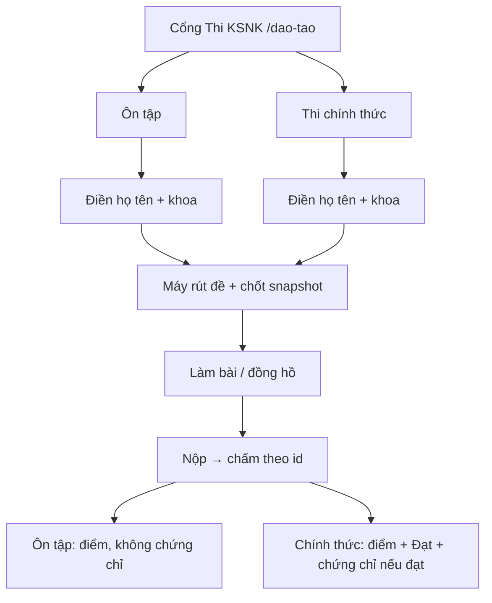

# Domain overview — Đào tạo / Thi KSNK

> **Chốt:** 2026-09-07 — mô tả theo **cái đang chạy** (không đề xuất tính năng mới).  
> **Nguồn kiểm:** migration `20260729150000` + lean `20260729160000` + `ma_cau` `20260802120000`; DB production `ksnk-bv103-prod` (3 bảng `dao_tao_*`); luật thuần `src/lib/dao-tao/`; thao tác `src/modules/dao-tao/actions/`.  
> **SSOT ngắn:** [`../../core/domain-specification.md`](../../core/domain-specification.md) §1 (dòng Đào tạo).  
> **Ánh xạ route / quyền:** [`../../core/implementation-mapping.md`](../../core/implementation-mapping.md) § Đào tạo.  
> **Vận hành gọn:** [`README.md`](README.md).  
> Tài liệu này là bản **nghiệp vụ đầy đủ** (PO đọc được) — không thay mapping kỹ thuật.

---

## 1. Ranh giới

| Thuộc **Đào tạo / Thi KSNK** | Không thuộc module này |
|------------------------------|------------------------|
| Ngân hàng câu trắc nghiệm KSNK | Lớp học, lịch học, điểm danh |
| Ôn tập (thi thử) theo mức độ | Chứng chỉ giấy / PDF in ấn |
| Thi chính thức theo kỳ, gán khoa / nhân viên | LMS khóa học nhiều buổi |
| Chấm điểm, đạt / chưa đạt | Giám sát VST / GSC / NKBV (không chấm chéo) |
| Chứng chỉ **logic** từ lần thi thật đạt + hạn tháng | Danh mục khoa / nhân sự (MDM — chỉ **đọc** để gán kỳ) |
| Sổ kết quả kỳ, chưa nộp, xuất Excel | Phân quyền hệ thống (RBAC — module `DAO_TAO` dùng chung) |

**Quy tắc vàng:** đây là **thi trắc nghiệm KSNK + sổ kết quả**, không phải hệ thống đào tạo nhân sự đầy đủ.

**Đã loại (không mô tả lại như thực thể sống):** 8 bảng cũ (`dao_tao_chu_de`, `dao_tao_phuong_an`, `dao_tao_muc_do_thi_thu`, `dao_tao_ky_thi`, `dao_tao_ky_thi_gan`, `dao_tao_lan_thi_cau`, …) — gộp lean 2026-07-29.

---

## 2. Từ điển thuật ngữ

| Thuật ngữ nghiệp vụ | Ý nghĩa | Tên trên UI (thường gặp) | Lưu trữ |
|---------------------|---------|--------------------------|---------|
| **Ngân hàng câu** | Tập câu đang dùng / tạm ẩn | Ngân hàng | `dao_tao_cau_hoi` |
| **Mã câu** | Khóa ổn định khi xuất/nhập Excel; sửa nội dung **không** đổi mã | `ma_cau` | `dao_tao_cau_hoi.ma_cau` (unique) |
| **Chủ đề** | Nhóm nội dung (vd. phòng ngừa nhiễm khuẩn vết mổ) — **không** còn bảng chủ đề riêng | Chủ đề | `chu_de_ma` + `chu_de_ten` trên từng câu |
| **Phương án** | Lựa chọn A–D (hoặc bước sắp xếp); mỗi phương án có **id cố định** | A / B / C / D | JSON `phuong_an` |
| **Đáp án đúng** | Gắn **id phương án**, không gắn chữ A/B/C/D sau khi đảo đề | — | JSON `dap_an_dung` |
| **Mức Bloom** | Độ khó nhận thức 1–5 (Nhớ → Đánh giá). Máy dùng khi **rút đề**; NV **không** thấy trên ngân hàng / làm bài | (ẩn với NV) | `bloom_level` |
| **Cấu hình** | Một mức ôn tập **hoặc** một kỳ thi chính thức | Mức độ / Kỳ thi | `dao_tao_cau_hinh` |
| **Ôn tập (thi thử)** | Làm bài luyện; **không** tính chứng chỉ | Ôn tập | `loai_cau_hinh = thi_thu_muc_do` · lần thi `che_do = thi_thu` |
| **Thi chính thức (thi thật)** | Kỳ có ngưỡng đạt, số lượt, người được thi | Thi chính thức | `loai_cau_hinh = thi_that` · `che_do = thi_that` |
| **Gán kỳ** | Ai được thi kỳ chính thức: theo khoa và/hoặc nhân viên | Gán khoa / NV | JSON `gan.khoa_ids`, `gan.nhan_su_ids` |
| **Lần thi** | Một lượt làm bài của một tài khoản, có đồng hồ và đề chốt | Bài làm | `dao_tao_lan_thi` |
| **Đề chốt (snapshot)** | Bản đề + thứ tự hiển thị + trả lời + chấm **của lần đó**. Sửa ngân hàng sau **không** đổi bài đã phát | — | JSON `de_snapshot` |
| **Đạt** | Điểm % ≥ ngưỡng kỳ (chỉ thi chính thức) | Đạt / Chưa đạt | `dao_tao_lan_thi.dat` |
| **Chứng chỉ (logic)** | Lần thi chính thức **đạt gần nhất** còn trong hạn tháng | Còn hạn / Sắp hết / Hết hạn | **Không có bảng** — tính từ lần đạt + `gan.han_chung_chi_thang` |

---

## 3. Đối tượng nghiệp vụ

### 3.1 Ngân hàng câu (`dao_tao_cau_hoi`)

Một câu gồm:

| Trường nghiệp vụ | Bắt buộc | Ghi chú |
|------------------|----------|---------|
| Mã câu | Có | Unique; trống khi import = hệ thống tạo mã mới |
| Chủ đề (mã + tên) | Có | Dùng để cân đề và đồng bộ import |
| Loại câu | Có | 4 loại — xem §4 |
| Mức Bloom 1–5 | Có | Chỉ máy rút đề |
| Nội dung câu (stem) | Có | |
| Phương án (JSON, ≥ 2 khi import) | Có | Mỗi PA: id, nhãn gốc, nội dung, thứ tự gốc, (Đúng/Sai nếu chùm) |
| Đáp án đúng (JSON theo id) | Có | |
| Giải thích | Không | Hiện **sau khi nộp** |
| Đang dùng / Tạm ẩn | Có | Câu ẩn không vào đề mới |
| STT import | Không | Phục vụ xuất/nhập |

**Hiện trạng production (2026-09-07, đối chiếu DB):** 787 câu, tất cả đang dùng — 571 chọn một · 94 chọn nhiều · 76 Đúng/Sai · 46 sắp xếp.

### 3.2 Cấu hình (`dao_tao_cau_hinh`)

Hai loài, **một bảng**:

| | Mức ôn tập `thi_thu_muc_do` | Kỳ chính thức `thi_that` |
|--|----------------------------|---------------------------|
| Mã (`ma`) | Bắt buộc, unique (vd. `co_ban`) | Không bắt buộc |
| Số câu / phút | Bắt buộc (> 0) | Bắt buộc (> 0) |
| Ngưỡng đạt `%` | Không dùng (để trống) | Có thì mới chấm Đạt |
| Số lượt cho phép | Có cột, ôn tập **không chặn** lượt khi bắt đầu bài | Chặn khi đủ lượt |
| Đảo câu / đảo đáp án | Mặc định bật | Cấu hình được |
| Tỷ lệ loại câu + Bloom (quota) | Máy rút đề | Máy rút đề |
| Lọc chủ đề (`chu_de_mas`) | Rỗng = cả ngân hàng đang dùng | Rỗng = cả ngân hàng đang dùng |
| Gán khoa / NV + hạn chứng chỉ | Không dùng để vào thi | **Bắt buộc có ≥ 1 khoa hoặc 1 NV** trước khi **mở thi** |
| Trạng thái | Thường `published` | `draft` (Nháp) · `published` (Đang mở) · `closed` (Đã kết thúc) |

**Mức ôn tập mặc định (seed + đang có trên production):**

| Mã | Tên | Số câu | Phút |
|----|-----|--------|------|
| `co_ban` | Cơ bản | 10 | 15 |
| `trung_binh` | Trung bình | 20 | 25 |
| `nang_cao` | Nâng cao | 40 | 45 |

**Hiện trạng production (2026-09-07):** chỉ 3 mức ôn tập trên; **chưa có kỳ thi chính thức**.

### 3.3 Lần thi (`dao_tao_lan_thi`)

| Trường | Ý nghĩa |
|--------|---------|
| Chế độ | `thi_thu` hoặc `thi_that` |
| Người làm | Tài khoản đăng nhập (`auth_user_id`) |
| Họ tên / khoa trên phiếu | Tự kê khi bắt đầu bài (không bắt buộc khớp hồ sơ MDM) |
| Đồng hồ | `bat_dau_luc` + `han_nop_luc` (theo **giờ máy chủ**) |
| Trạng thái | `dang_lam` · `da_nop` · `het_gio` |
| Điểm | Số câu đúng / tổng câu; `%` làm tròn 1 chữ số thập phân |
| Đạt | Chỉ tính khi thi chính thức **và** kỳ có ngưỡng đạt |
| Đề chốt | Toàn bộ đề + trả lời + đúng/sai từng câu |

---

## 4. Bốn loại câu và luật chấm

**Một câu = một điểm** (đúng hết theo luật loại đó). Điểm bài = số câu đúng / tổng câu × 100 (làm tròn 1 số thập phân).

| Loại (mã) | Nhãn NV | Đúng khi |
|-----------|---------|----------|
| `single` | Chọn một | Chọn đúng **một** id phương án |
| `multi` | Chọn nhiều | Tập id chọn **khớp hết** đáp án (thừa / thiếu = sai) |
| `true_false_cluster` | Đúng / Sai | **Mọi** nhánh Đúng/Sai đều khớp; thiếu một nhánh = sai |
| `order` | Sắp xếp | Thứ tự id **đúng từng vị trí** (không chỉ cùng tập) |

**Không đổi khi đảo đề:** đáp án lưu theo **id phương án**. Đảo A/B/C/D trên màn hình không làm sai chấm — kể cả câu sắp xếp.

**Sai ngay khi:** chưa trả lời, hoặc trả lời khác loại câu.

Luật thuần: `src/lib/dao-tao/grade.ts`.

---

## 5. Hai chế độ thi

### 5.1 Ôn tập

- **Ai:** đã đăng nhập **và** có quyền `DAO_TAO` xem.
- **Chọn:** mức Cơ bản / Trung bình / Nâng cao (hoặc mức admin sửa số câu/phút).
- **Không:** ngưỡng đạt, chứng chỉ, sổ “chưa nộp” theo kỳ.
- **Lượt:** không giới hạn khi bắt đầu bài mới.

### 5.2 Thi chính thức

- **Ai được thấy kỳ đang mở:**
  - Nhân viên có hồ sơ MDM gắn **khoa** nằm trong `gan.khoa_ids`, **hoặc**
  - Nhân viên có id nằm trong `gan.nhan_su_ids`, **hoặc**
  - Người có quyền `DAO_TAO` **sửa** (quản trị — vào mọi kỳ đang mở).
- **Mở kỳ (`published`):** server **từ chối** nếu chưa gán ít nhất một khoa hoặc một NV.
- **Số lượt:** đếm lần `dang_lam` + `da_nop` + `het_gio` của cùng người cùng kỳ; đủ `so_lan_cho_phep` thì không bắt đầu thêm.
- **Đạt:** `%` ≥ `diem_dat_pct` của kỳ. Không khai ngưỡng → cột Đạt để trống (không suy ra đạt/trượt).

---

## 6. Máy rút đề (trước khi thí sinh thấy câu)

1. Chỉ lấy câu **đang dùng**.
2. Nếu cấu hình có danh sách chủ đề → chỉ các chủ đề đó; danh sách rỗng → cả ngân hàng.
3. Phân bổ gần đúng theo **tỷ lệ loại câu × mức Bloom**.
4. Trong mỗi ô, lấy **đều theo chủ đề**.
5. Thiếu câu: bù cùng loại → Bloom gần → bất kỳ câu còn lại. Ngân hàng không đủ → đề ngắn hơn số cấu hình (có ghi chú nội bộ, không hiện Bloom cho NV).
6. Đảo thứ tự câu / phương án theo cấu hình; đáp án vẫn theo id.

Luật thuần: `src/lib/dao-tao/exam-engine.ts` + `shuffle.ts`.

**Hệ quả nghiệp vụ:** hai người cùng kỳ **không** nhất thiết cùng đề; cùng một người thi lại (còn lượt) cũng **không** giữ đề cũ.

---

## 7. Làm bài, đồng hồ, nộp

| Bước | Quy tắc |
|------|---------|
| Bắt đầu | Bắt buộc họ tên + khoa/đơn vị trên phiếu |
| Đồng hồ | Hạn nộp = giờ bắt đầu + số phút cấu hình, theo **máy chủ** (không tin đồng hồ máy thí sinh) |
| Lưu từng câu | Chỉ khi bài còn `dang_lam` và đúng chủ bài |
| Nộp đúng hạn | Trạng thái `da_nop` |
| Nộp sau hạn | Vẫn chấm điểm; trạng thái `het_gio`. Có **ân hạn 30 giây** trước khi coi là muộn (vẫn `het_gio` nếu đã quá hạn) |
| Xem lại | Thí sinh xem bài của mình. Quản trị (`DAO_TAO` xem) chỉ xem bài **đã nộp** của người khác |
| Sửa ngân hàng sau khi phát đề | **Không** đổi đề / đáp án của lần đã phát |

Ôn tập: có điểm, **không** ghi Đạt.  
Chính thức: có điểm; Đạt nếu kỳ có ngưỡng.

---

## 8. Chứng chỉ (lát 1 — DT-LMS)

Không phải văn bằng giấy. **Không** có bảng chứng chỉ.

| Quy tắc | Chi tiết |
|---------|----------|
| Nguồn | Lần thi **chính thức**, **đạt**, đã nộp (`da_nop` hoặc `het_gio`), lấy lần đạt **mới nhất** |
| Hạn | Cộng `han_chung_chi_thang` tháng kể từ giờ nộp lần đạt đó (mặc định **12**; chỉ nhận 1–60, lệch thì về 12) |
| Còn hạn | Còn hơn 30 ngày |
| Sắp hết hạn | Còn ≤ **30 ngày** — hub nhắc học lại |
| Hết hạn | Quá ngày hết — hub nhắc thi lại |
| Chưa có | Chưa từng đạt kỳ chính thức |

**Chưa có:** lớp học, điểm danh, PDF, in phôi, nhiều chứng chỉ song song theo từng kỳ.

Luật thuần: `src/lib/dao-tao/chung-chi.ts`.

---

## 9. Ngân hàng — xuất / nhập / sửa tay

Chuẩn danh mục (P4), màn `/dao-tao/admin/ngan-hang`.

1. Xuất mẫu hoặc xuất cả ngân hàng (Excel).
2. Sửa file: **giữ `ma_cau`** khi cập nhật; **để trống `ma_cau`** khi thêm mới.
3. Nhập → **xem trước** → chọn:
   - **An toàn:** chỉ thêm / sửa.
   - **Đồng bộ đầy đủ:** thêm / sửa **và ẩn** câu cùng chủ đề có trong hệ thống nhưng **không** còn trong file.

Cột: `ma_cau | chu_de_ma | chu_de_ten | stt | loai | stem | A | B | C | D | dap_an | bloom | giai_thich | is_active`.

**Từ chối dòng khi:**

- Không nhận loại câu / Bloom / thiếu nội dung câu.
- Dưới 2 phương án có chữ.
- Đáp án trỏ cột A–D đang trống.
- Chọn nhiều: dưới 2 đáp án đúng.
- Sắp xếp: thiếu đủ bước, trùng nhãn.
- Chùm Đúng/Sai: thiếu nhãn cho một phương án đã có chữ.

Xem trước liệt kê lỗi (tối đa 20 dòng trên UI). File layout cũ (`MCQ to form_2.xlsx`) vẫn đọc được.

Trên UI: bật/tắt từng câu, sửa nội dung (quyền sửa).

---

## 10. Quyền và màn hình

**Module quyền:** `DAO_TAO` (nhãn: Thi KSNK). Việc: xem · tạo · sửa · xóa · nhập.

| Việc | Ai (ý nghiệp vụ) |
|------|------------------|
| Vào cổng, ôn tập, làm bài, xem bài mình | Có quyền **xem** |
| Mở kỳ, gán khoa/NV, sửa mức ôn tập, sửa câu | **Sửa** / **tạo** |
| Nhập Excel ngân hàng | **Nhập** |
| Xóa | Có trong danh sách quyền; **chưa thấy nút/luồng xóa** trên module |

| Đường dẫn | Việc |
|-----------|------|
| `/dao-tao` | Cổng: ôn tập, thi chính thức, chứng chỉ, bài gần đây, vào quản trị |
| `/dao-tao/thi-thu` | Chọn mức ôn tập |
| `/dao-tao/thi-that` | Kỳ đang mở (đúng người được gán) |
| `/dao-tao/lam-bai/[id]` | Làm bài |
| `/dao-tao/ket-qua/[id]` | Xem điểm / giải thích sau nộp |
| `/dao-tao/admin/ngan-hang` | Ngân hàng |
| `/dao-tao/admin/muc-do` | Mức ôn tập |
| `/dao-tao/admin/ky-thi` | Kỳ chính thức |
| `/dao-tao/admin/ket-qua` | Sổ: lọc kỳ/khoa, chưa nộp, chưa có tài khoản, xuất Excel |

Menu trái: **Thi KSNK**. Khoa / nhân sự lấy từ MDM khi gán kỳ và khi tính “đã gán chưa nộp”.

---

## 11. Invariants (không được phá khi sửa module)

1. **Ba bảng lean** — không đẻ bảng tổng hợp / bảng chứng chỉ khi chưa đo nhu cầu và chưa duyệt PO.
2. **Đáp án = id phương án** — đảo hiển thị không được đổi cách chấm.
3. **Đề đã phát = snapshot** — sửa ngân hàng không sửa bài cũ.
4. **Đồng hồ máy chủ** — hạn nộp không lấy giờ máy thí sinh.
5. **Ôn tập ≠ chứng chỉ** — chỉ lần chính thức đạt mới nuôi hạn chứng chỉ.
6. **Mở kỳ chính thức = đã gán người** — ít nhất một khoa hoặc một NV.
7. **Upsert ngân hàng theo `ma_cau`** — không tạo câu trùng mã.
8. **Bloom chỉ để rút đề** — không hiện cho NV trên ngân hàng / phiếu làm bài.
9. **Chủ đề nhúng trên câu** — không khôi phục bảng chủ đề riêng trừ slice mới đã duyệt.

---

## 12. Ngoài phạm vi (đã chốt “chưa có”)

- Lớp học, khóa học nhiều buổi, điểm danh.
- Chứng chỉ giấy, PDF, chữ ký số, phôi in.
- Chấm trọng số khác nhau từng câu / từng loại.
- Đề cố định giống nhau 100% cho cả kỳ (máy rút + đảo theo lượt).
- Bắt họ tên/khoa trên phiếu **khớp** hồ sơ MDM.
- Module giám sát / CSSD / QLCV đọc điểm thi để chặn nghiệp vụ khác.

---

## 13. Bản kiểm đối chiếu (2026-09-07)

Đã kiểm — **khớp** giữa tài liệu này và hệ thống:

| Hạng mục | Cách kiểm | Kết quả |
|----------|-----------|---------|
| Đúng 3 bảng, không bảng cũ | `information_schema` production | Pass — `dao_tao_cau_hoi`, `dao_tao_cau_hinh`, `dao_tao_lan_thi` |
| Cột lean + `ma_cau` | Cột DB vs migration | Pass |
| 4 loại câu + chấm theo id | `grade.ts` + constraint `loai` | Pass |
| Ôn tập 3 mức seed | Hàng `dao_tao_cau_hinh` production | Pass — Cơ bản/Trung bình/Nâng cao |
| Mở kỳ phải gán người | `updateKyThiThat` khi `published` | Pass |
| Chứng chỉ 12 tháng / nhắc 30 ngày | `chung-chi.ts` + spec | Pass |
| Import từ chối đáp án lệch cột | `validateDapAnAgainstOptions` | Pass |
| Route / quyền `DAO_TAO` | `src/app/dao-tao/**`, registry | Pass |

**Lệch nhỏ / rủi ro còn lại** (ghi nhận, không sửa trong lát mô tả):

1. Nút “còn lượt” trên danh sách kỳ chỉ đếm bài **đã nộp**; lúc **bắt đầu** bài còn đếm cả bài **đang làm** — có thể thấy “còn lượt” nhưng vào thi thì báo hết lượt.
2. Quyền **xóa** có trong RBAC nhưng chưa có luồng xóa trên UI.
3. Production **chưa có kỳ thi chính thức** — chứng chỉ / sổ chưa nộp chưa kiểm được bằng dữ liệu thật.
4. Họ tên/khoa trên phiếu là **tự kê** — sổ kết quả có thể khác tên trên danh mục nhân sự.
5. Nộp muộn vẫn được chấm và **vẫn có thể Đạt** (trạng thái `het_gio` không chặn chứng chỉ).
