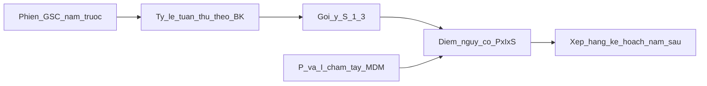

# Phân tích khả thi: điểm nguy cơ P×I×S trên bảng kiểm GSC

> Ngày: 2026-07-31 · Phạm vi: **chỉ phân tích** (chưa implement) · PO đã chốt: tuân thủ → **S**; P/I chấm tay.

## 1. Kết luận

**Áp dụng được** trên bảng kiểm Giám sát chung (GSC).

Hệ thống đã có tỉ lệ tuân thủ theo từng bảng kiểm theo khoảng ngày (có thể lấy cả năm trước). Thiếu lớp **đánh giá nguy cơ** (P, I, S, điểm `P×I×S`) gắn danh mục bảng kiểm — dùng để xếp hạng ưu tiên cải tiến / lập kế hoạch năm sau.

**Không** thay cách chấm điểm phiên giám sát hiện tại (`tong_diem` / `%` tuân thủ tiêu chí).

| Câu hỏi | Trả lời |
|---------|---------|
| Có áp dụng SOP 7.1 được không? | Có |
| Cần đổi engine chấm phiên? | Không |
| Dữ liệu tuân thủ năm trước đã có? | Gom được từ phiên GSC + RPC analytics theo `tu_ngay`/`den_ngay` |
| VST / NKBV trong scope? | Không |

## 2. Mô hình nghiệp vụ đã khóa (freeze)

Theo SOP bệnh viện mục 7.1 và lựa chọn PO (1A):

| Tham số | Thang | Ai quyết định | Cách lấy số |
|---------|-------|---------------|-------------|
| **P** — Khả năng xảy ra | 1–3 | KSNK chấm tay trên từng bảng kiểm | Tần suất sự cố / khả năng (SOP: >10 ca/năm → 3; 3–10 → 2; <3 hoặc chưa từng → 1) |
| **I** — Mức độ ảnh hưởng | 1–3 | KSNK chấm tay | Ảnh hưởng sức khỏe / vận hành / uy tín / chi phí (SOP: nặng / trung bình / nhẹ) |
| **S** — Hệ thống hiện tại | 1–3 | **Gợi ý tự động** từ `% tuân thủ năm trước` + KSNK được chỉnh tay (quy trình, đào tạo, TTB) | `<50%` → 3; `50–80%` → 2; `>80%` → 1 |
| **Điểm nguy cơ** | 1–27 | Tính | `P × I × S` |

### Phân loại hành động (SOP)

| Mức | Điểm | Hành động gợi ý |
|-----|------|-----------------|
| Cao | ≥ 12 | Kế hoạch hành động bắt buộc, ưu tiên can thiệp |
| Trung bình | 6–11 | Theo dõi định kỳ, cải tiến dần |
| Thấp | ≤ 5 | Duy trì quy trình, giám sát định kỳ |

### Quy tắc biên đã khóa cùng mô hình

- **Hai lớp số liệu tách biệt:** tuân thủ phiên ≠ điểm nguy cơ.
- **Gợi ý S chỉ từ bảng kiểm có `%`** (`TY_LE` / `TRON_GOI` / `DAT_KHONG_DAT`). Kiểu `NHAT_KY` (không có `%`) → không tự gán S; gắn nhãn “chưa đủ dữ liệu tuân thủ”.
- Năm trước **không có phiên** hoặc mẫu quá mỏng → không tự gán S; không “bịa” điểm nguy cơ.
- KSNK được **ghi đè S** khi chuyên môn đánh giá quy trình/đào tạo/TTB khác với tín hiệu % tuân thủ.
- **Không** dùng `diem_toi_da` tiêu chí làm trọng số nguy cơ (engine tuân thủ hiện không dùng trường này cho risk).

## 3. Hiện trạng hệ thống (đối chiếu)

| Thành phần | Trạng thái | Ghi chú |
|------------|------------|---------|
| Danh mục `gstt_dm_bang_kiem` | Có | Phân loại, `cach_tinh_diem`, `ap_dung_jsonb` — **chưa có P/I/S** |
| Quản trị UI `/quan-tri-he-thong/bang-kiem` | Có | Form MDM — chưa field nguy cơ |
| Engine tuân thủ phiên | Có | [`giam-sat-scoring.ts`](../../../src/lib/domain/giam-sat-scoring.ts) → `tong_diem` = % |
| Analytics `%` theo BK + khoảng ngày | Có | RPC/checklist analytics → `ty_le_tuan_thu` theo `ma_bk` |
| API “nguy cơ năm” / ma trận xếp hạng | Chưa | — |
| Trường `ap_dung_jsonb.muc_do` | Có | Bắt buộc / khuyến nghị / chỉ KSNK — **không** phải P/I/S |
| `la_then_chot` | Có | Then chốt gói care-bundle — **không** phải risk |

Tham chiếu: [`bang-kiem-overview.md`](bang-kiem-overview.md), [`metric-dictionary.md`](../dashboard/metric-dictionary.md), [`concepts.md#gsc-scoring`](../../wiki/concepts.md#gsc-scoring).

## 4. Gap và ranh giới (không đụng scoring phiên)

### Gap trước khi làm tính năng

1. Chưa có cột/JSON lưu P, I, S trên danh mục bảng kiểm.
2. Chưa có hàm domain tách: gợi ý S từ `%`, tính `P×I×S`, phân loại Cao/TB/Thấp.
3. Chưa có màn / báo cáo ma trận nguy cơ hoặc xếp hạng kế hoạch năm.
4. Lịch sử dài hạn có thể mỏng sau pilot cutover — cần nhãn độ tin cậy khi thiếu phiên.
5. `NHAT_KY` không có `%` — cần loại khỏi gợi ý S tự động.

### Ranh giới cứng

| Được làm (khi implement sau) | Không được làm |
|------------------------------|----------------|
| Thêm metadata nguy cơ trên danh mục BK | Đổi công thức `tong_diem` / `cach_tinh_diem` |
| Báo cáo / xếp hạng theo điểm nguy cơ | Ghi đè `%` phiên bằng điểm nguy cơ |
| Reuse RPC date-range hiện có để lấy `%` năm Y | Đẻ bảng summary/pre-agg mới khi chưa đo được nhu cầu |
| Scope GSC bảng kiểm | Mở rộng sang VST / NKBV trong cùng slice |

## 5. Ý nghĩa số liệu cho cải tiến

Khi có đủ P, I và S (gợi ý hoặc chốt tay), mỗi bảng kiểm có:

- **Một điểm nguy cơ** (1–27) và **mức** (Cao / Trung bình / Thấp).
- **Căn cứ so sánh** giữa các bảng kiểm / lĩnh vực để ưu tiên kế hoạch năm sau.
- **Giải thích được:** ví dụ `% tuân thủ thấp → S cao` + ảnh hưởng nặng (I) + khả năng cao (P) → ưu tiên can thiệp; ngược lại tuân thủ tốt → S thấp → nguy cơ giảm dù I vẫn cao.

Số liệu **không** thay thế đánh giá chuyên môn về P và I; chỉ tự động hóa phần gắn SOP với tuân thủ thực tế (S).

## 6. Khuyến nghị slice MVP (chat sau — chưa làm)

Giữ hai lớp metric:

| Lớp | Metric | Mục đích |
|-----|--------|----------|
| Tuân thủ (đã có) | `%` / Tốt–Đạt–Không đạt | Vận hành giám sát ngày |
| Nguy cơ (mới) | P, I, S, `P×I×S`, mức | Lập kế hoạch / ưu tiên cải tiến |

Thứ tự slice đề xuất:

1. **MDM:** lưu P, I, S (cột hoặc `rui_ro_jsonb`) trên `gstt_dm_bang_kiem` + form quản trị bảng kiểm.
2. **Domain thuần:** map `% năm trước` → gợi ý S; `risk = P*I*S` + mức — file riêng, không sửa `giam-sat-scoring.ts` cho compliance.
3. **Đọc tuân thủ năm Y** theo `ma_bk` (reuse analytics date-range).
4. **Một bề mặt xếp hạng** (vd. thống kê GSC hoặc báo cáo tổng hợp) theo điểm nguy cơ.

### Intake gợi ý khi mở chat mới

- **Goal:** MVP điểm nguy cơ P×I×S trên danh mục bảng kiểm GSC + xếp hạng phục vụ kế hoạch năm sau.
- **In scope:** MDM P/I/S, gợi ý S từ `%` năm trước, domain scorer, một màn/báo cáo xếp hạng.
- **Out of scope:** Đổi scoring phiên; VST; NKBV; bảng pre-agg mới; seed P/I đủ 36 mẫu nếu chưa có workshop chuyên môn (có thể để trống / nhập dần).
- **Acceptance mẫu:** 1) `% năm trước 85%` → gợi ý S=1; P=2,I=3 → điểm 6 (TB). 2) `% 40%` → S=3; P=3,I=3 → 27 (Cao). 3) Không phiên / `NHAT_KY` → không tự gán S.
- **Verify:** unit domain map S + risk; `verify:engineering` nếu đụng action; migration + `mdm:migrate` nếu đổi schema.
- **Risk:** Nhầm P với S; thiếu dữ liệu năm trước; user hiểu nhầm điểm nguy cơ là điểm phiên.

## 7. Việc đã hoàn tất trong phân tích này

- [x] Khóa mô hình: P/I tay, S gợi ý từ `%` tuân thủ năm trước theo SOP, điểm = P×I×S.
- [x] Ghi gap và ranh giới không đụng `tong_diem` / scoring phiên.
- [x] Chỉ đường chat sau: `/intake-nv` riêng cho MVP (không implement trong tài liệu này).
