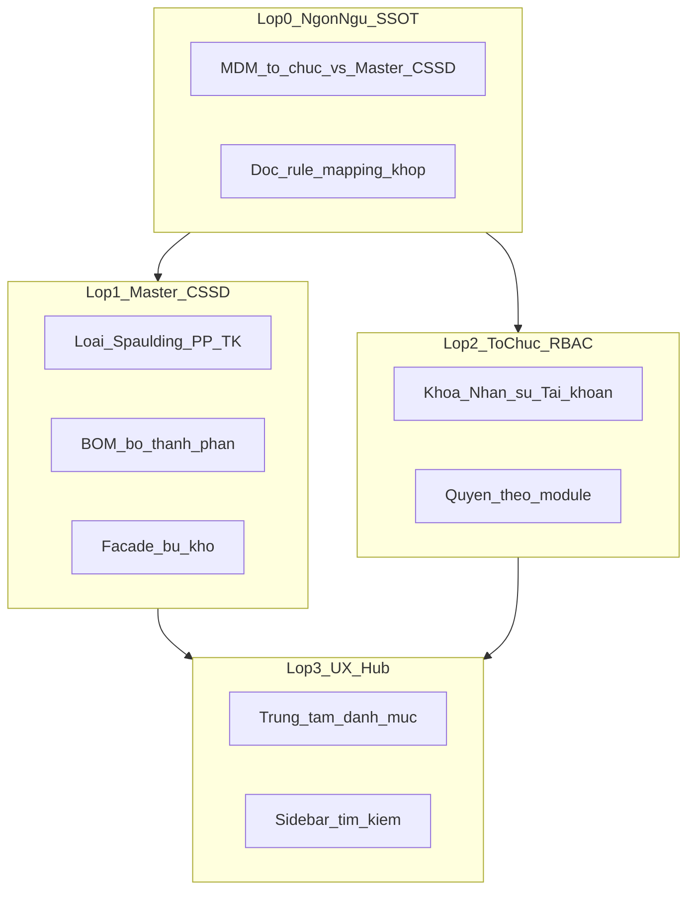

# Lộ trình cải tiến Quản trị hệ thống (2026-07-17)

> **Trạng thái:** SSOT lộ trình — đợt 1A (tài liệu + Lớp 0) đã ghi nhận.  
> **Phạm vi:** Module `quan-tri-he-thong` + ranh giới master ↔ vận hành.  
> **Không làm trong đợt 1A:** sửa `src/` cho Lớp 1–3 (mở chat `/intake-nv` riêng từng slice).  
> **Persona:** cân bằng KSNK / master CSSD / IT — thứ tự theo lớp cố định.  
> **Liên quan:** [README MDM](./README.md) · [debt D-16/D-17](../../reference/architecture/debt-register.md) · [F-04](../../archive/reports/comprehensive-review-20260603.md) · [reform CSSD](../cssd/reform-plan.md) · [roadmap 2026H2](../../reference/architecture/roadmap-2026h2.md)

---

## 1. Tóm tắt nghiệp vụ

**Quản trị hệ thống** là nơi định nghĩa dữ liệu gốc để CSSD, giám sát, NKBV, công việc dùng chung — không phải nơi làm mẻ tiệt khuẩn hay phiên giám sát.

Đã ổn: CRUD master tại `/quan-tri-he-thong`; CSSD catalog chỉ đọc; lookup gom `sys_lookup_value`; hub catalog SSOT. Còn lệch: ngôn ngữ “MDM” dễ hiểu nhầm, doc/rule drift prefix, hub nặng (~146 file), master dụng cụ (Spaulding / PP tiệt khuẩn / BOM) chưa khép với vận hành.

---

## 2. Bản đồ domain (ngôn ngữ chốt)

| Lớp nghiệp vụ | Người dùng chính | Ví dụ bảng / màn | Không nhầm với |
|---------------|------------------|------------------|----------------|
| **MDM tổ chức** | KSNK, hành chính | Khoa (`mdm_dm_khoa_phong`), nhân sự (`mdm_nhan_su`), lookup chức vụ… | Master CSSD |
| **Master CSSD** | Quản trị dụng cụ / CSSD lead | Loại–bộ–BOM, thiết bị, hóa chất (`cssd_dm_*` TABLE) | QR, mẻ, kho giao dịch (`cssd_fact_*`) |
| **Master giám sát / QLCV / NKBV** | KSNK theo phân hệ | Bảng kiểm (`gstt_dm_bang_kiem`), lookup loại việc / loại NKBV | Phiên GSC / ca NKBV |
| **Hệ thống** | IT | RBAC, tài khoản ↔ NV, MDM Governance | Danh mục nghiệp vụ |

**Nguyên tắc vàng:** một SSOT định nghĩa; vận hành chỉ đọc / ghi fact; guard `npm run imports:cssd-mdm` giữ nguyên.

---

## 3. Đã Done (không làm lại)

| Khoản | Bằng chứng |
|-------|------------|
| 9-slice admin / Double SSOT lookup | [`admin-module-slice-plan.md`](../../archive/plans/admin-module-slice-plan.md) |
| Placement: master UI dưới `quan-tri-he-thong/danh-muc/`; CSSD RO + banner | Rule `20-master-data-placement.mdc`, `CssdCatalogMdmBanner` |
| Hub catalog SSOT | `src/lib/master-data/danh-muc-hub-catalog.ts` |
| Soft-delete `is_active`; CRUD `master-crud-core` | Module quan-tri |
| Pilot 5 case tay | [README § Pilot](./README.md#pilot-checklist-tay--5-kịch-bản) |

---

## 4. Lộ trình 4 lớp

### Lớp 0 — Ngôn ngữ & SSOT tài liệu

| Trạng thái | Việc | Deliverable |
|------------|------|-------------|
| **Done (1A)** | Chuẩn hóa “MDM tổ chức” vs “Master CSSD” | Wiki [`concepts.md`](../../wiki/concepts.md#cssd-vs-mdm) + README này |
| **Done (1A)** | Sửa drift rule placement (`dm_*` → `{module}_dm_*`) | `.cursor/rules/20-master-data-placement.mdc` |
| **Done (1A)** | `LOAI_DUNG_CU` = TABLE `cssd_dm_loai_dung_cu` (không lookup) | [`implementation-mapping.md`](../../core/implementation-mapping.md) |
| **Done (1A)** | Gắn F-04 / D-16 / D-17 vào lộ trình | File này + debt-register |

**Out:** không refactor 146 file; không đổi schema trong Lớp 0.

---

### Lớp 1 — Master CSSD (giá trị lâm sàng cao)

Gắn nợ: Spaulding/heat (**D-16**), facade replenish (**D-17**), Digital BOM (reform CSSD — ops, phụ thuộc master đúng).

| Slice | Nghiệp vụ | In scope (khi implement) | Out | Debt |
|-------|-----------|--------------------------|-----|------|
| **1.1 Loại dụng cụ** | Spaulding + chịu nhiệt + PP tiệt khuẩn chuẩn | Form/list/actions; `cssd-loai-dung-cu-map.ts` — **partial 2026-07-17:** BOM runtime gọi chung normalize master | Không đổi QR/mẻ; còn đề xuất trạm tự động | D-16 |
| **1.2 Bộ + BOM** | Thành phần khớp loại; khoa phân bổ | Tab bộ/chi tiết; panel BOM; replenish facade | Không ledger chặn cứng cấp phát | Reform BOM |
| **1.3 Thiết bị / hóa chất** | Master máy & HC đồng bộ trạm/kho | CRUD quan-tri; CSSD RO; pilot TB/HC | Không CRUD dưới `/cssd-*` | — |
| **1.4 Cầu nối ops** | CSSD xin bù kho lẻ không cần quyền MDM đầy đủ | Facade `CSSD_WORKFLOW.edit` | Không import UI MDM vào cssd-erp | D-17 |

**Acceptance tay (khi code):**

1. Sửa loại CRITICAL + STEAM_134 → bộ dùng loại đó hiện đúng trên form bộ.  
2. BOM thiếu cấu phần → cảnh báo cấp phát (không chặn cứng).  
3. User CSSD workflow xin bù → OK qua facade; không quyền → từ chối rõ.

**Verify:** `npm run verify:admin` + `verify:cssd` + `imports:cssd-mdm` + specs map loại.

**Cách mở:** chat mới `/intake-nv` — một slice / một chat (vd. “Lớp 1.1 loại dụng cụ”).

---

### Lớp 2 — Tổ chức, nhân sự, RBAC

| Slice | Nghiệp vụ | Ghi chú |
|-------|-----------|---------|
| **2.1 Khoa ↔ NV ↔ GSC** | Tạo khoa → gán NV → phiên GSC đúng | Pilot case 1–2 README |
| **2.2 Tài khoản** | Link Auth ↔ `mdm_nhan_su` | Không đụng Auth provider |
| **2.3 RBAC theo danh mục** | Lookup/dedicated map đúng `moduleKey` | Gộp permission map chỉ khi grep chứng minh drift |
| **2.4 Bảng kiểm** | Mẫu BK → GSC qua `mdm-read-gateway` | Không CRUD BK trong module giám sát |

**Acceptance:** pilot case 1–4 README vẫn pass.  
**Verify:** `verify:admin` + `test:admin`.

---

### Lớp 3 — UX hub (sau L0–L1 ổn)

Cải trải nghiệm, không big-bang tách module (F-04).

| Việc | Lý do | Khi implement |
|------|-------|---------------|
| Hub nhóm + tìm kiếm xuyên catalog | Admin tìm nhanh | `QuanTriDanhMucPage` + `getAllDanhMucHubRows` |
| Sidebar 1 cổng hub (module-first) | Không nhân bản shortcut danh mục trên sidebar | `sidebar-admin-nav-groups.ts` → «Quản trị hệ thống» |
| Generic lookup UX đồng nhất | 18 loại cùng pattern | `GenericDmMasterPage` |
| Smart import là đường chính | Giảm Excel legacy | Deprecate fallback khi hết caller |

**Acceptance:** Sidebar → đúng màn ≤2 click; tìm “loại dụng cụ” / “chức danh” trên hub ra đúng path.  
**Verify:** `verify:quick` (UI) hoặc `verify:admin` nếu đụng action.

---

## 5. Thứ tự bắt buộc & DoD theo lớp

| Lớp | DoD đóng lớp | Không mở lớp sau nếu |
|-----|--------------|----------------------|
| 0 | Doc/rule/mapping + file này khớp ngôn ngữ | — |
| 1 | ≥3 acceptance Lớp 1 + verify admin/cssd/import-guard | L0 chưa Done |
| 2 | Pilot 1–4 pass | — (song song nhẹ với L1 được) |
| 3 | Acceptance hub/sidebar | L1.1–1.2 chưa tick |

---

## 6. Rủi ro

1. **Nhầm scope** — “sửa danh mục” thành sửa QR/mẻ → phá ranh giới. Mitigation: mỗi intake ghi MDM vs ops.  
2. **UX hub quá sớm** — UI đẹp, dữ liệu loại/BOM sai. Mitigation: L3 sau L1.  
3. **Tách module lớn vì F-04** — rewrite không cần thiết. Mitigation: chỉ tách nếu PO yêu cầu sau đo ownership.

---

## 7. Cách dùng (PO)

| Bạn nói | Việc tiếp |
|---------|-----------|
| Đợt 1A (file này) | Chỉ tài liệu — **đã xong** |
| Chat mới: `/intake-nv` + “Lớp 1.1 …” | Implement code slice |
| Chat mới: “Lớp 3 hub UX” | Chỉ sau khi Lớp 1 có dấu tick |

---

## Changelog

| Ngày | Việc |
|------|------|
| 2026-07-17 | Tạo lộ trình 4 lớp; đóng Lớp 0 (doc/rule/mapping). |
