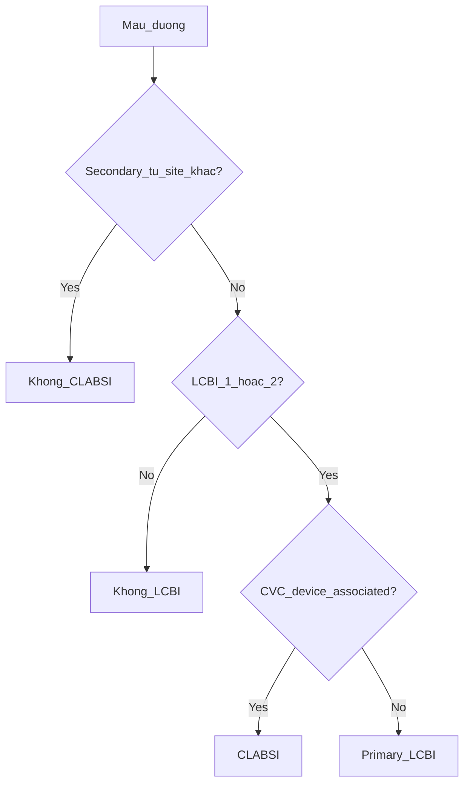
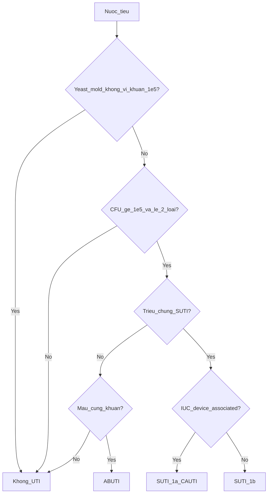
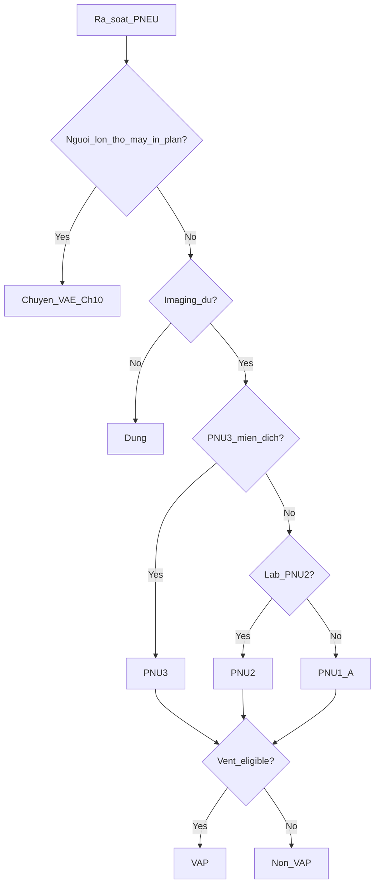
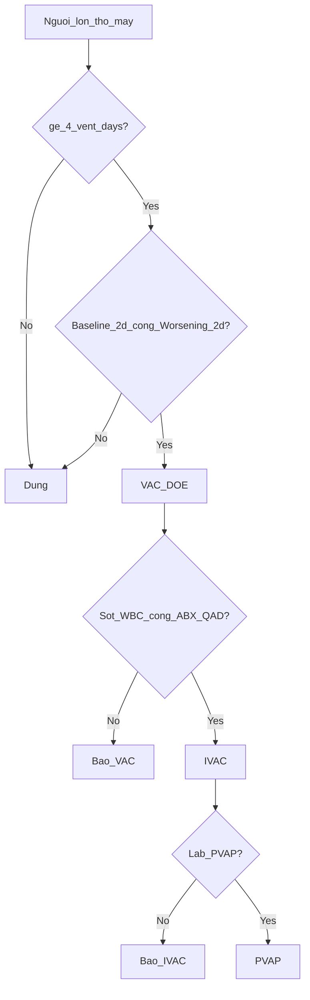
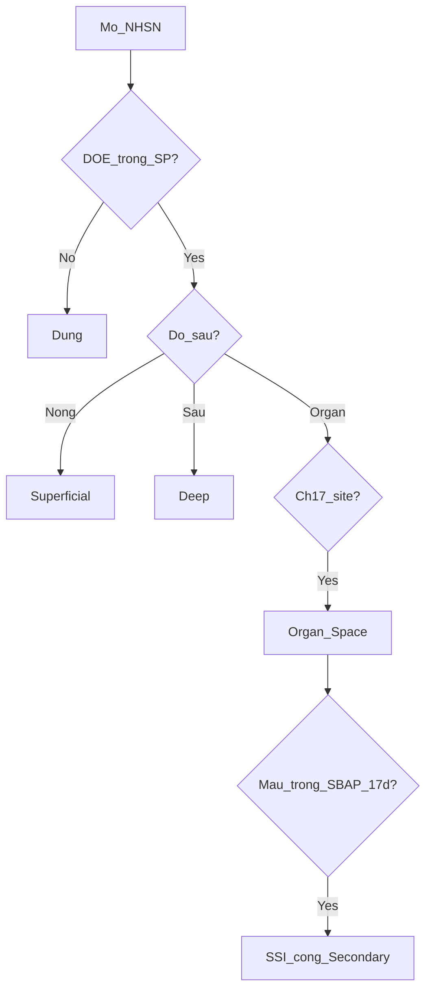
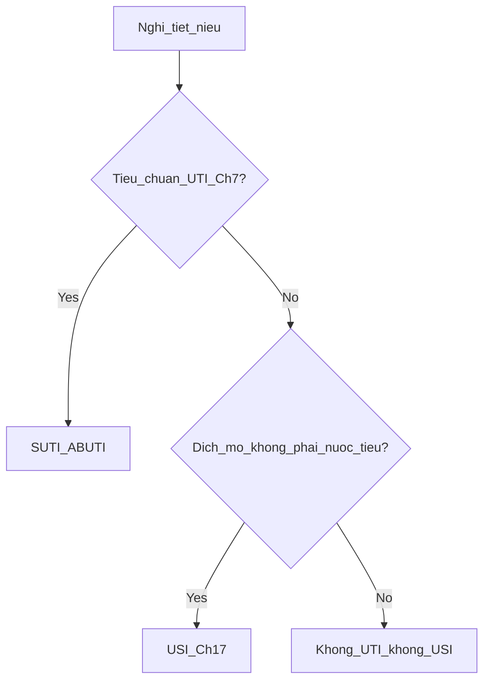

# Domain SSOT — Chẩn đoán / xác định ca NKBV (HAI) người lớn — BV103

| Trường | Giá trị |
|--------|---------|
| **Mã tài liệu** | `10-NKBV-diagnosis-domain-ssot-adult` |
| **Phiên bản** | **4.0** (refine từ v3.3 `hai-surveillance-domain-ssot-20260827`) |
| **Ngày** | **2026-09-22** (Asia/Saigon, UTC+7) |
| **Chuẩn case definition chính** | CDC NHSN *Patient Safety Component Manual*, **January 2025** |
| **PDF CDC local** | `/workspace/nkbv-sources/cdc/NHSN-PSC-Manual-2025.pdf` |
| **Drive CDC** | `ksnkbv103@gmail.com` — file id `1srXXSWNWpXJzuiVK0PNxbXxHtNXW4qgv` |
| **Lớp BYT (cấu trúc chương trình, không ghi đè timing)** | QĐ **3916/QĐ-BYT** ngày **28/8/2017** — Hướng dẫn giám sát NKBV |
| **Quy trình viện (đã NHSN day-3)** | KSNK.QT.34 / KSNK.QT.34.HD.01 |
| **Phạm vi tuổi** | **NGƯỜI LỚN ONLY** (Phụ lục C / mục F) |
| **Ngoài phạm vi** | GSC, VST, CSSD, QLCV, LabID, CLIP, AUR, PedVAE, NICU |
| **Đối tượng đọc** | PO · bác sĩ KSNK · kỹ sư rule engine |
| **Ngôn ngữ** | Tiếng Việt vận hành; **giữ nguyên mã CDC** (LCBI, IWP, DOE, POA, HAI, …) |

> **Một câu khóa:** Ca **HAI/NKBV** = DOE ≥ **ngày lịch thứ 3** của đợt nội trú (ngày nhập = ngày 1) **và** đủ tiêu chí loại nhiễm theo NHSN 2025. **Cấm** định nghĩa HAI bằng “48 giờ”.

---

## Mục lục

1. [Front matter & bảng xung đột](#0-front-matter--bảng-xung-đột)
2. [A. Thuật ngữ (Glossary)](#a-thuật-ngữ-glossary)
3. [B. Engine thời gian phổ quát (Ch.2)](#b-engine-thời-gian-phổ-quát-ch2)
4. [C. Thuật toán chẩn đoán từng loại](#c-thuật-toán-chẩn-đoán-từng-loại)
   - C1 LCBI/CLABSI · C2 UTI/CAUTI · C3 PNEU · C4 VAE · C5 SSI · C6 Ch.17 sites
5. [D. Thành phần dữ liệu phần mềm](#d-thành-phần-dữ-liệu-phần-mềm)
6. [E. Ánh xạ BYT QĐ 3916](#e-ánh-xạ-byt-qđ-3916)
7. [F. Ngoài phạm vi](#f-ngoài-phạm-vi)
8. [G. Truy vết nguồn](#g-truy-vết-nguồn)

---

## 0. Front matter & bảng xung đột

### 0.1. Nguồn ưu tiên (thứ tự quyết định)

| Ưu tiên | Nguồn | Dùng cho |
|---------|-------|----------|
| **1 (thắng)** | CDC NHSN PSC Manual **January 2025** (PDF + extract `cdc-ch2/4/6/7/9/10/17.txt`) | **Mọi case definition**, IWP/DOE/POA/HAI day-3, device association, Secondary BSI |
| **2** | Domain SSOT v3.3 đã audit BV103 (`hai-surveillance-domain-ssot-20260827.md` + dictionary + data-flow + algorithms) | Cấu trúc thuật toán tiếng Việt, field logic, catalog Ch.17 người lớn |
| **3** | KSNK.QT.34 (+ HD.01) | Quy trình viện: đã dùng **ngày 1–2 = POA / từ ngày 3 = NKBV** — **khớp NHSN** |
| **4** | QĐ 3916/QĐ-BYT 28/8/2017 | Phương pháp giám sát, mẫu số, phản hồi, tên tiếng Việt chương trình — **không** ghi đè timing POA/HAI |

Khi PDF CDC và SSOT v3.3 lệch chữ: **ưu tiên wording PDF CDC**, gắn cờ `[PO xác nhận]`.

### 0.2. Bảng xung đột — “48 giờ” vs NHSN day-3

| Nguồn | Câu / vị trí | Cách hiểu sai nếu áp dụng | **Quyết định BV103** |
|-------|--------------|---------------------------|----------------------|
| QĐ 3916 — phần Đặt vấn đề | “Nhiễm khuẩn xảy ra sau nhập viện **48 giờ (2 ngày)** thường được coi là NKBV” | Dùng 48 giờ đồng hồ / “sau 2 ngày” làm định nghĩa ca | **CONFLICT → ưu tiên NHSN.** Chỉ ghi nhận như mô tả khái niệm cũ trong văn bản BYT; **không** code vào engine |
| QĐ 3916 — tiêu chí hội chứng (Phụ lục) | Nhiều chỗ dùng “>2 ngày” thiết bị (khớp NHSN device day) | Nhầm “>2 ngày thiết bị” = “48 giờ HAI” | **Giữ >2 ngày lịch thiết bị** (NHSN). Không đổi thành 48 giờ |
| KSNK.QT.34 / HD.01 | “DOE ngày 1 hoặc 2 → POA; DOE từ ngày thứ 3 → NKBV” | — | **Khớp NHSN — dùng** |
| KSNK.QT.34 BM.01 / checklist | Cột “Yếu tố nguy cơ thiết bị trong **48 giờ** trước DOE” | Nhầm thành định nghĩa HAI | **Chỉ là câu hỏi ghi nhận nguy cơ trên phiếu** (legacy wording). Device association vẫn = **>2 ngày lịch** tại DOE + hiện diện DOE/DOE−1 |
| `domain-specification.md` form pilot | Field “trong vòng 48 giờ” trên form VAP/BSI/CAUTI | Nhầm device / HAI | **Legacy UI field list** — runtime SSOT: device **>2 ngày lịch**; HAI = DOE day ≥3 |
| NHSN Ch.2 (2025) | POA = DOE trong ngày nhập (HD1), 2 ngày trước nhập, hoặc ngày sau nhập (HD2). HAI = DOE **on or after 3rd calendar day** (HD1 = admission) | — | **PRIMARY — bắt buộc** |

**Công thức vận hành (calendar day, không đồng hồ):**

```
admission_date = ngày nhập nội trú = Hospital Day 1
DOE = ngày phần tử đầu tiên thỏa tiêu chí trong cửa sổ protocol
POA  ⇔  DOE ∈ {admission−2, admission−1, admission (HD1), admission+1 (HD2)}
       (nếu DOE ∈ {admission−2, admission−1} → ghi DOE = HD1 cho RIT)
HAI  ⇔  DOE ≥ admission + 2 ngày lịch   (= Hospital Day ≥ 3)
```

**Cấm trong code / tài liệu vận hành BV103:** `hours_since_admit >= 48` → HAI.

### 0.3. Phạm vi người lớn (tóm tắt — chi tiết mục F)

**IN SCOPE:** LCBI-1, LCBI-2, MBI-LCBI; SUTI-1a/1b, ABUTI; PNU1-A / PNU2 / PNU3 người lớn; VAE (VAC/IVAC/PVAP) tuổi ≥18 khoa adult; SSI; Ch.17 sites người lớn (kể BONE/MEN/ENDO/IAB/GI-CDI/…).

**OUT OF SCOPE (đánh dấu, không implement):** PedVAE; NICU; LCBI-3; SUTI-2; nhánh PNU trẻ/sơ sinh; Ch.17 nhánh ≤1 tuổi (vd. USI nhánh 4); UMB/NEC/CIRC sơ sinh; Birthweight/Apnea Ch.16.

### 0.4. Quan hệ tài liệu dự án

| Tài liệu | Vai trò sau v4.0 |
|----------|------------------|
| **File này** | **Canonical** case-finding người lớn + timing + Ch.17 + BYT alignment |
| `hai-surveillance-domain-ssot-20260827.md` (v3.3) | Nguồn refine; giữ archive thuật toán |
| `hai-criteria-element-dictionary-20260827.md` | Từ điển nguyên tử SX/LAB/IMG/DEV/EXCL |
| `hai-identification-data-flow-20260827.md` | Luồng LIS/HIS-copy + thứ tự chẩn đoán |
| `domain-specification.md` | Hợp đồng UI/state pilot — **không ghi đè** case definition |
| Algorithms `nkh/nktn/pneu/ssi/vae/exclusion-rules/data-fields` | Gợi ý form/SRS — tiêu chí lấy từ file này + CDC |

---


## A. Thuật ngữ (Glossary)

### A.1. Nguyên tắc ngôn ngữ

1. **Mã CDC** (IWP, DOE, POA, HAI, LCBI, CLABSI, …) **không dịch** trên phiếu/engine.
2. **NKBV** = tên module/chương trình tiếng Việt (`/giam-sat-nkbv`). Tử số giám sát = sự kiện **HAI** (và site Ch.17).
3. Định nghĩa = **giám sát NHSN**, không phải định nghĩa lâm sàng khoa điều trị / Sepsis-3.
4. **Calendar day** = 00:00–23:59. Mọi “ngày” protocol = ngày lịch, **không** phải 24 giờ tròn từ giờ đặt — trừ khi protocol nói rõ.

### A.2. Ánh xạ tên BYT ↔ mã NHSN

| Tên BYT / viện (QĐ 3916, QT.34) | Mã / khái niệm NHSN | Ghi chú |
|--------------------------------|---------------------|---------|
| NKBV / Nhiễm khuẩn bệnh viện | **HAI** | Chỉ khi đủ case definition + DOE day ≥3 (hoặc SSI/VAE theo protocol riêng) |
| Nhiễm khuẩn lúc nhập viện | **POA** | DOE ngày 1–2 (và khung trước nhập theo Ch.2) |
| NKH / Nhiễm khuẩn huyết | **BSI / LCBI** | Primary khi không Secondary |
| NKH liên quan catheter TMTT / CLABSI | **CLABSI** | LCBI + CVC device-associated |
| NKTN / Nhiễm khuẩn tiết niệu | **UTI** (SUTI/ABUTI) | Luôn site nguyên phát |
| NKTN liên quan ống thông tiểu / CAUTI | **CAUTI** = SUTI 1a | IUC >2 ngày lịch |
| Viêm phổi bệnh viện / VPBV | **PNEU** (PNU1/2/3) | Người lớn thở máy **in-plan** → ưu tiên **VAE** |
| Viêm phổi thở máy / VAP | **VAP** (nhãn sau PNEU) hoặc tier **VAE** | Không mặc định VAP từ đờm |
| Biến cố liên quan thở máy | **VAE** (VAC/IVAC/PVAP) | Chỉ người lớn; không CXR trong thuật toán |
| NKVM / Nhiễm khuẩn vết mổ | **SSI** | SP 30/90; không IWP/RIT Ch.2 |
| Ngày sự kiện | **DOE** | — |
| Cửa sổ nhiễm 7 ngày | **IWP** (Infection Window Period) | QT.34 viết IWP/IWP — cùng nghĩa |
| Khung lặp 14 ngày | **RIT** | — |
| Khoa quy kết | **LOA** | + Transfer Rule |

### A.3. Bảng định nghĩa giám sát (rút gọn — đủ implement)

| Mã | Định nghĩa giám sát BV103 | Cấm nhầm |
|----|---------------------------|----------|
| **HAI** | DOE ≥ Hospital Day 3 + đủ tiêu chí site (Ch.2 áp dụng) | ≠ “mọi nhiễm trong viện”; ≠ 48 giờ; ≠ tên module NKBV |
| **POA** | DOE ∈ HD1, 2 ngày trước nhập, hoặc HD2 | ≠ “bệnh từ nhà” cảm tính; không áp SSI/VAE |
| **IWP** | Index ± 3 ngày lịch = **7 ngày**; mọi yếu tố tiêu chí ∈ IWP | Không áp SSI, VAE; ENDO = 21 ngày |
| **Index** | Ngày XN/chẩn đoán **đầu** dùng làm yếu tố để **mở** IWP | Sốt **không** đặt IWP; Index ≠ DOE |
| **DOE** | Ngày phần tử **đầu tiên** thỏa tiêu chí **lần đầu** trong IWP (hoặc trong SP/SSI; hoặc ngày đầu worsening/VAE) | ≠ ngày nhập; ≠ ngày cấy nếu yếu tố khác sớm hơn |
| **RIT** | 14 ngày từ DOE (= ngày 1); không báo ca cùng major/specific type | Không áp SSI/VAE |
| **SBAP** | IWP ∪ RIT (14–17 ngày) cho Secondary BSI lâm sàng | SSI: cố định 17 ngày `[DOE−3, DOE+13]`; VAE: chỉ PVAP + Event Period |
| **LOA** | Khoa BN đang nằm **vào DOE** | Trừ Transfer Rule |
| **Transfer Rule** | DOE = ngày chuyển hoặc ngày sau chuyển → quy kết **khoa chuyển đi** | Không = “khoa nằm lâu hơn” |
| **Device-associated** | HAI + dụng cụ tại chỗ **>2 ngày lịch** vào DOE **và** còn DOE hoặc DOE−1 | “>2 ngày lịch” ≠ 48 giờ |
| **Device Day 1** | Ngày đặt (ngày rút cũng 1 Device Day). CVC sẵn lúc nhập: ngày access nội trú đầu. Foley/máy sẵn trước nhập: ngày nhập nội trú đầu | Break ≥1 ngày lịch đầy đủ → Device Day 1 mới |
| **CLABSI** | LCBI + CVC device-associated tại DOE | Secondary **trước** khi gắn CLABSI |
| **LCBI** | Laboratory-Confirmed BSI (1 hoặc 2 người lớn) | LCBI-3 = OUT OF SCOPE |
| **MBI-LCBI** | Subset LCBI + neutropenia/ANC + MBI organism + tổn thương hàng rào niêm mạc (Ch.4) | Không tự gắn vì “BN ung thư” |
| **Secondary BSI** | Máu matching site nguyên phát trong SBAP (hoặc Scenario 2) | Không đếm CLABSI; yeast máu **không** Secondary cho UTI |
| **CAUTI** | SUTI 1a | Yeast/nấm **không** thỏa UTI |
| **SUTI 1a / 1b** | Có triệu chứng + cấy ≤2 loài, ≥1 vi khuẩn ≥10⁵ CFU/ml | SUTI-2 = OUT OF SCOPE |
| **ABUTI** | Không triệu chứng SUTI + nước tiểu ≥10⁵ + máu cùng khuẩn (không yeast) | ≠ ASB |
| **ASB** | Vi khuẩn niệu không triệu chứng (không đủ SUTI/ABUTI) | **Không** báo UTI/HAI |
| **PNEU / PNU1–3** | Viêm phổi giám sát sau đủ imaging + lâm sàng ± lab | Không chốt chỉ bằng chẩn đoán bác sĩ |
| **VAP vs Non-VAP** | Nhãn sau PNU*: vent eligible → VAP; không → Non-VAP PNEU | Người lớn in-plan vent → **VAE** |
| **VAE** | VAC → IVAC → PVAP; tuổi ≥18; ≥4 vent days; **không CXR** | PedVAE OUT |
| **VAC / IVAC / PVAP** | Tầng VAE | Secondary BSI **chỉ PVAP** |
| **SSI** | Superficial / Deep / Organ-Space trong SP 30/90 | Không IWP/POA/RIT Ch.2 |
| **PATOS** | Nhiễm cùng độ sâu **đã có lúc mổ** (Operative Note) | Không = “BN bẩn” cảm tính |
| **in-plan / off-plan** | Cam kết đủ protocol MRP vs theo dõi nội bộ | App hiện chưa MRP — không tuyên bố FacWide in-plan |
| **NCT** | Cấy hoặc XN vi sinh không cấy **điều trị** | ≠ ASC/AST sàng lọc mang |
| **Matching organism** | Cùng loài nếu cả hai có loài; một mẫu chỉ chi → khớp chi; kháng sinh đồ **không** bắt buộc khớp | Không gộp “họ” lỏng |

### A.4. Từ điển mở rộng

Chi tiết tên site Ch.17 và cấm nhầm: xem [C.6](#c6-ch17-sites--catalog--tiêu-chí-người-lớn) và bảng E trong nguồn v3.3 (nhúng dưới mục G khi cần map UI).

---


## B. Engine thời gian phổ quát (Ch.2)

> Nguồn: CDC NHSN 2025 **Chapter 2** — *Identifying Healthcare-associated Infections (HAI) for NHSN Surveillance*.  
> Extract: `/workspace/nkbv-sources/extracted/cdc-ch2.txt`.  
> Áp dụng: Ch.4, 6, 7, 17 (trừ ngoại lệ ENDO). **Không** áp SSI (Ch.9), VAE (Ch.10).


#### 2.1. Loại trừ chung (mọi định nghĩa NHSN)

Không dùng các giống sau để thỏa **bất kỳ** định nghĩa NHSN: *Blastomyces, Histoplasma, Coccidioides, Paracoccidioides, Cryptococcus, Pneumocystis*.  
Không báo HAI nếu mẫu lấy sau đồng ý hiến tạng **và** bệnh nhân đang hỗ trợ hiến tạng.  
Hospice / palliative **không** loại khỏi giám sát.  
Tái hoạt nhiễm tiềm ẩn (herpes, zona, giang mai, lao…) **không** coi là HAI.

Bệnh nhân observation nếu **nằm khoa nội trú** → phải vào tử số/mẫu số in-plan.

#### 2.2. Infection Window Period (IWP)

IWP = **7 ngày lịch**: ngày lấy xét nghiệm/chẩn đoán **đầu tiên** dùng làm yếu tố tiêu chí + **3 ngày trước** + **3 ngày sau**.

Xét nghiệm/chẩn đoán để **đặt** IWP: mẫu lab, hình ảnh, thủ thuật/khám.  
Nếu tiêu chí **không** có xét nghiệm: dùng ngày dấu hiệu **khu trú** đầu (đau tại chỗ, dẫn lưu mủ, tiêu chảy…). **Sốt không** dùng để đặt IWP (không khu trú).

Chọn xét nghiệm **đầu** sao cho **mọi** yếu tố tiêu chí nằm trong IWP đó (ví dụ PNU2: ưu tiên phim nếu phim tạo cửa sổ đủ tiêu chí sớm hơn cấy máu).

#### 2.3. Date of Event (DOE)

DOE = ngày phần tử **đầu tiên** thỏa tiêu chí site-specific **lần đầu** trong IWP.

DOE quyết định: POA vs HAI, nơi quy kết (LOA), gắn dụng cụ, ngày 1 của RIT.

#### 2.4. POA vs HAI

- **POA:** DOE trong khung: ngày nhập nội trú (ngày 1), **2 ngày trước nhập**, và **ngày sau nhập**. Nếu DOE rơi 2 ngày trước nhập → ghi DOE = **ngày 1** viện (cho RIT).
- **HAI:** DOE **từ ngày lịch thứ 3** trở đi (ngày nhập = ngày 1).

Công thức vận hành: `ngày sự kiện ≥ ngày nhập + 2 ngày lịch`.

#### 2.5. Location of Attribution (LOA) & Transfer Rule

Mặc định: quy kết **khoa nơi BN đang nằm vào DOE**.

**Transfer Rule:** nếu DOE = **ngày chuyển khoa** hoặc **ngày sau chuyển** → quy kết **khoa chuyển đi**. Nhiều khoa trong 24 giờ trước DOE → khoa đầu ngày trước DOE (theo protocol Ch.2).

#### 2.6. Repeat Infection Timeframe (RIT)

RIT = **14 ngày** từ DOE (DOE = ngày 1). Trong RIT: không báo ca **cùng loại**; giữ DOE/RIT/gắn dụng cụ/LOA gốc; thêm tác nhân mới vào ca cũ.

- **Major type** (một RIT chung): BSI (mọi LCBI/MBI), UTI (SUTI/ABUTI), PNEU (mọi PNU).
- **Specific type:** các site Ch.17 (SKIN ≠ DECU có thể chồng RIT).

#### 2.7. Secondary BSI Attribution Period (SBAP)

SBAP = IWP ∪ RIT (độ dài **14–17 ngày** tùy DOE so với Index). Máu trong SBAP + **matching organism** với site nguyên phát → Secondary BSI (không đếm CLABSI).

**Scenario 2:** máu là **thành phần bắt buộc** của tiêu chí site (vd. IAB 3b) → Secondary khi máu ∈ IWP của site đó.

**Cấm Secondary** (canonical, Ch.2 + protocol hội chứng):

- Yeast/Candida từ máu **không** Secondary cho UTI.
- Candida / CoNS / Enterococcus từ đờm/ETA/BAL/PSB **không** Secondary cho PNEU trừ mô phổi / dịch màng phổi.
- VAE: Secondary **chỉ PVAP** (không VAC/IVAC); máu trong Event Period 14 ngày.

Matching: cùng chi/loài theo hướng dẫn Ch.2 Pathogen Assignment (không gộp “họ” lỏng).

#### 2.8. Gắn dụng cụ (device-associated)

Nhiễm khuẩn HAI gắn dụng cụ khi dụng cụ **đã tại chỗ > 2 ngày lịch** vào DOE **và** còn tại chỗ **DOE hoặc ngày trước DOE**. Ngày đặt = Device Day 1; ngày rút cũng tính một Device Day.

- CVC sẵn lúc nhập: Device Day 1 = ngày **access nội trú đầu**.
- Foley / thở máy sẵn trước nhập: đếm từ ngày nhập khoa nội trú đầu.

**Break rule:** ngắt ≥ 1 ngày lịch đầy đủ → đặt lại = Device Day 1 mới.

#### 2.9. Ma trận KHÔNG áp dụng Ch.2

| Khái niệm | SSI | VAE |
|-----------|-----|-----|
| IWP ±3 | Không | Không |
| POA/HAI Day-3 | Không (dùng SP 30/90) | Không (DOE = worsening) |
| RIT 14 | Không | Event Period 14d |
| SBAP IWP∪RIT | SBAP 17d cố định | Chỉ PVAP + Event Period |

LabID / AUR (CDC Ch.12, 14) cũng không dùng cửa sổ Ch.2 — **không thuộc domain này**.

---


### B.10. Ma trận cửa sổ — nhắc lại cho engineer

| Khái niệm | LCBI / UTI / PNEU / Ch.17 | SSI | VAE |
|-----------|---------------------------|-----|-----|
| IWP ±3 (7 ngày) | Có (ENDO: 21 ngày) | **Không** | **Không** |
| POA / HAI Day-3 | Có | **Không** (dùng SP) | **Không** (DOE = worsening) |
| RIT 14 | Có | **Không** | Event Period 14 ngày |
| SBAP | IWP ∪ RIT | Cố định 17 ngày | Chỉ PVAP + Event Period |
| Device association Ch.2 | Có (CVC/IUC/vent cho nhãn) | N/A (procedure) | Vent days riêng Ch.10 |

### B.11. Loại trừ nấm không dùng mọi định nghĩa NHSN

Không dùng để thỏa **bất kỳ** định nghĩa NHSN: *Blastomyces, Histoplasma, Coccidioides, Paracoccidioides, Cryptococcus, Pneumocystis*.

Không báo HAI nếu mẫu lấy sau đồng ý hiến tạng **và** BN đang hỗ trợ hiến tạng.  
Hospice / palliative **không** loại khỏi giám sát.  
Tái hoạt nhiễm tiềm ẩn (herpes, zona, giang mai, lao…) **không** coi là HAI.

---


## C. Thuật toán chẩn đoán từng loại

Mỗi mục dưới: định nghĩa · checklist · loại trừ · device · cửa sổ · Secondary BSI · field tối thiểu · decision flow đánh số.

---

### C.1. LCBI / CLABSI (Ch.4) — người lớn


#### 4.1. Định nghĩa

**Primary BSI / LCBI:** cấy máu (hoặc NCT) thỏa LCBI **và không** Secondary từ site khác.

**CLABSI:** LCBI + CVC gắn dụng cụ (Ch.2 §2.8) tại DOE.

**Common commensal:** danh sách NHSN (CoNS, *Micrococcus*, *Bacillus* spp. trừ anthracis, *Corynebacterium* spp. trừ diphtheriae, …).

#### 4.2. LCBI 1 (mọi tuổi — BV103 dùng)

Tác nhân **recognized pathogen** (không nằm list commensal) từ:

1. ≥ 1 mẫu máu cấy, **hoặc**
2. NCT (vd. T2MR, NGS) định danh chi/loài từ máu; nếu có cấy máu trong NCT−2 … NCT+1 ngày → **chỉ dùng cấy**, bỏ NCT.

**Và** không liên quan nhiễm khuẩn site khác (Secondary Guide).

DOE LCBI 1 = ngày mẫu máu dương **đầu** đặt IWP.

Nếu vừa LCBI 1 vừa LCBI 2: báo **LCBI 1**; pathogen #1 = recognized, #2 = commensal.

#### 4.3. LCBI 2 (mọi tuổi — BV103 dùng)

≥ 1: sốt >38°C, rét run, hạ HA  
**và** cùng commensal từ **≥ 2 mẫu máu** lấy **separate occasions**  
**và** không Secondary.

#### 4.5. MBI-LCBI

Sau khi thỏa LCBI, xét MBI nếu: giảm bạch cầu / ANC trong cửa sổ NHSN **và** tác nhân MBI-eligible **và** bằng chứng tổn thương hàng rào niêm mạc (tiêu chảy, GVHD ruột…). Chi tiết bảng ANC/GI theo protocol Ch.4. App hiện: nhánh rút gọn (P1).

#### 4.6. Nhãn CLABSI

Sau LCBI: nếu CVC eligible (§2.8) → **CLABSI**; không → Primary LCBI không gắn line.

Ngoại lệ SIR (carve-out protocol): ECMO, VAD, community fungal… theo danh sách Ch.4 — IP đối chiếu khi xuất SIR chuẩn (app chưa SIR chuẩn).

#### 4.7. Secondary trước CLABSI

Luôn chạy Secondary BSI (Ch.2 §2.7) **trước** khi gắn nhãn CLABSI. Máu đã Secondary → **không** đếm CLABSI.



---


#### C.1.8. Decision flow đánh số (implement)

1. Có kết quả máu (cấy hoặc NCT) dương tính eligible?
2. **Chạy Secondary BSI gate trước** (site Ch.6/7/9/17 trong SBAP + matching; hoặc Scenario 2). Nếu SECONDARY → **không** CLABSI; gắn Secondary BSI vào site nguyên phát; **STOP** nhánh CLABSI.
3. Phân loại pathogen: recognized vs common commensal (NHSN list).
4. Nếu recognized → thử **LCBI-1** (≥1 máu/NCT theo rule; ưu tiên cấy nếu có trong NCT−2…NCT+1).
5. Nếu commensal → thử **LCBI-2**: ≥1 trong {sốt >38°C, rét run, hạ HA} **và** ≥2 máu cùng commensal **separate occasions**.
6. **LCBI-3** (≤1 tuổi: hạ thân nhiệt / ngưng thở / bradycardia) → **OUT OF SCOPE** — không evaluate.
7. Nếu vừa LCBI-1 vừa LCBI-2 → báo **LCBI-1**; pathogen #1 = recognized.
8. Sau LCBI: xét **MBI-LCBI** (ANC/WBC cửa sổ + MBI organism + bằng chứng hàng rào niêm mạc theo Ch.4).
9. Gắn dụng cụ CVC: Device Day >2 tại DOE **và** CVC tại DOE hoặc DOE−1?
10. Có → nhãn **CLABSI**; không → **Primary LCBI** (non-central line BSI).
11. Áp IWP/DOE/POA|HAI/LOA/RIT theo Ch.2.
12. Carve-out SIR (ECMO, VAD, …) — IP đối chiếu khi xuất SIR chuẩn (app có thể chưa SIR).

#### C.1.9. Fields tối thiểu (logic)

| Field logic | Kiểu | Bắt buộc |
|-------------|------|----------|
| `admission_date` | date | Có |
| `blood_collection_date` | date | Có (Index LCBI) |
| `organism_code` / `pathogen_type` | enum recognized\|commensal\|excluded | Có |
| `blood_commensal_count_separate` | int | Nếu commensal |
| `sx.fever_gt_38` / `sx.bsi_chills` / `sx.bsi_hypotension` | bool+date | LCBI-2 |
| `cvc_present_by_day[]` | bool grid | Để gắn CLABSI |
| `cvc_device_day_count_at_doe` | int | Có nếu xét CLABSI |
| `secondary_bsi_result` | enum none\|secondary | Có — chạy trước |
| `doe`, `poa_hai`, `loa`, `rit_end` | derived | Có |

---

### C.2. UTI / CAUTI (Ch.7) — người lớn


> **USI** (thận/niệu quản/khoang quanh thận, **không** phải UTI nước tiểu) → [Ch.17 USI](#1710-usi).

UTI **luôn là site nguyên phát** — không Secondary từ site khác.

#### 7.1. Foley (IUC)

Chỉ ống thông tiểu **lưu trong niệu đạo–bàng quang**. Không: condom, straight/in-out, nephrostomy, suprapubic đơn thuần (trừ khi protocol nêu).

CAUTI (SUTI 1a): IUC **>2 ngày lịch** nội trú tại DOE **và** còn tại chỗ DOE hoặc rút ngày trước DOE.

#### 7.2. SUTI 1a — CAUTI (mọi tuổi — BV103)

1. IUC eligible như trên  
2. ≥1: sốt >38°C; đau trên xương mu*; đau góc sườn-cột sống*; **không** dùng tiểu gấp/rắt/buốt khi **ống còn tại chỗ**  
3. Cấy nước tiểu ≤2 loài, ≥1 vi khuẩn **≥10⁵ CFU/ml**

Mọi yếu tố ∈ IWP. Sốt **không** loại vì “do nguyên nhân khác”.

#### 7.3. SUTI 1b — Non-CAUTI

Không đủ điều kiện IUC >2 ngày; cùng triệu chứng + cấy ≥10⁵; ống không tại chỗ vào DOE/ngày trước (triệu chứng tiểu gấp/rắt/buốt **được** dùng).

#### 7.4. ABUTI

Không triệu chứng SUTI + cấy nước tiểu ≥10⁵ + **cấy máu cùng khuẩn** (không yeast). Mọi tuổi.

#### 7.5. Loại trừ tác nhân nước tiểu

**Không** dùng để thỏa UTI: mọi **yeast/nấm men**, nấm mốc, nấm lưỡng hình, ký sinh trùng.

Mẫu vẫn chấp nhận nếu **còn đúng một vi khuẩn ≥10⁵ CFU/ml** kèm yeast (yeast không đếm loài; không tạo UTI từ yeast).

Secondary BSI từ UTI: matching trong SBAP; **máu yeast không** Secondary cho UTI.



---


#### C.2.8. Decision flow đánh số

1. Có cấy nước tiểu? (Index thường = ngày lấy mẫu nước tiểu).
2. Có yeast/mold/parasite **mà không** còn đúng 1 vi khuẩn ≥10⁵? → **không UTI** (STOP). Yeast không đếm loài.
3. CFU ≥10⁵ **và** ≤2 loài vi khuẩn?
4. Có ≥1 triệu chứng SUTI trong IWP? (sốt >38; đau trên xương mu*; đau góc sườn-cột sống*; nếu **không** còn IUC tại DOE/DOE−1: thêm tiểu gấp/rắt/buốt).
5. Có triệu chứng → SUTI. IUC device-associated (>2 ngày + hiện diện DOE/DOE−1)? → **SUTI 1a CAUTI**; không → **SUTI 1b**.
6. Không triệu chứng SUTI nhưng máu cùng khuẩn (không yeast) trong IWP → **ABUTI** (± CAUTI nếu IUC eligible).
7. Không triệu chứng và không máu khớp → **ASB** — không báo UTI.
8. **SUTI-2** (nhánh trẻ) → OUT OF SCOPE.
9. Áp IWP/DOE/POA|HAI/LOA/RIT. UTI luôn site nguyên phát — không Secondary từ site khác.
10. Secondary BSI từ UTI: matching trong SBAP; **cấm** yeast máu Secondary cho UTI.

#### C.2.9. Fields tối thiểu

| Field logic | Ghi chú |
|-------------|---------|
| `urine_collection_date`, `urine_cfu`, `urine_species_count` | L1 |
| `excl.urine_yeast_mold_parasite` | Block UTI nếu chỉ nấm |
| `sx.fever_gt_38`, `sx.uti_suprapubic`, `sx.uti_cva`, `sx.uti_dysuria/urgency/frequency` | Ẩn dysuria/urgency/frequency khi Foley tại chỗ |
| `iuc_present_by_day[]`, `iuc_device_days_at_doe` | CAUTI |
| `lab.blood_match_urine` | ABUTI / Secondary |

---

### C.3. PNEU (Ch.6) — người lớn


> CDC 2025 Ch.6. Dùng IWP/DOE/POA/RIT Ch.2.  
> **Adult vent in-plan → bắt buộc VAE Ch.10**, không dùng PNEU cho người lớn thở máy in-plan.  

#### 6.1. Imaging (mọi PNU — người lớn)

- Không bệnh nền tim–phổi: ≥1 phim thâm nhiễm mới / tiến triển / hang.  
- Có bệnh nền: ≥2 phim serial trong 7 ngày chứng minh tồn tại/tiến triển; phim mơ hồ cần **clinical correlation** (bác sĩ ghi kháng sinh điều trị viêm phổi).

**Cấm** chốt PNEU chỉ bằng chẩn đoán lâm sàng của bác sĩ, không đủ tiêu chí.

#### 6.2. PNU1 — nhánh A (mọi tuổi — BV103 dùng)

Imaging + ≥1 toàn thân (sốt >38; WBC ≤4000 hoặc ≥12000; rối loạn ý thức nếu ≥70 tuổi không nguyên nhân khác)  
+ ≥2 hô hấp khác dòng: đờm mủ/đổi tính chất; khó thở / thở nhanh >25; ho mới/xấu; ran / thở phế quản; gas exchange xấu (P/F ≤240 hoặc tăng O₂/máy).

#### 6.3. PNU2

Imaging + ≥1 toàn thân + ≥1 hô hấp + (≥1 lab Table 2 **hoặc** Table 3):

- Table 2: máu (+); dịch màng phổi (+); LRT ít nhiễm đạt ngưỡng (BAL/PBAL ≥10⁴; PSB ≥10³; ETA ≥10⁵ nếu thở máy; semi-quant Moderate/Heavy); ≥5% BAL nội bào; mô phổi ≥10⁴ CFU/g; mô bệnh học.  
- Table 3: virus / *Bordetella* / *Legionella* / *Chlamydia* / *Mycoplasma*; IgG ×4; Legionella IFA; kháng nguyên nước tiểu Legionella.

Flora miệng hỗn hợp **cấm** PNU2/3. Candida/yeast NOS, CoNS, Enterococcus từ đờm/ETA/BAL/PSB **cấm** trừ mô phổi / dịch màng phổi.

#### 6.4. PNU3 (suy giảm miễn dịch)

Tiêu chí miễn dịch protocol (giảm bạch cầu, ung thư máu, HIV CD4<200, ghép, hóa chất, steroid >14 ngày…) + imaging + ≥1 triệu chứng + lab (kể ngoại lệ Candida máu **khớp** LRT trong IWP).

#### 6.5. Nhãn VAP vs Non-VAP

Sau PNU*: nếu thở máy xâm lấn eligible (>2 ngày lịch + hiện diện DOE/DOE−1) → **VAP**; không → **Non-ventilator PNEU (HAP)**.

Secondary BSI: SBAP Ch.2; cấm Candida/CoNS/Enterococcus secondary trừ lung/pleural.



---


#### C.3.8. Decision flow đánh số

1. Người lớn + thở máy **in-plan eligible**? → **chuyển C.4 VAE**, không dùng PNEU thay cho in-plan vent.
2. Đủ imaging người lớn? (không bệnh nền tim–phổi: ≥1 phim mới/tiến triển/hang; có bệnh nền: ≥2 phim serial 7 ngày; mơ hồ → clinical correlation kháng sinh điều trị viêm phổi).
3. Không đủ imaging → STOP (không PNEU).
4. Đủ tiêu chí miễn dịch PNU3? → thử **PNU3**.
5. Không: có lab Table 2 hoặc 3 trong IWP? → **PNU2**; không → **PNU1-A** (≥1 toàn thân + ≥2 hô hấp).
6. Cấm: flora miệng hỗn hợp; Candida/yeast NOS, CoNS, Enterococcus từ đờm/ETA/BAL/PSB trừ mô phổi/dịch màng phổi.
7. Nhãn: vent device-associated (>2 ngày + DOE/DOE−1) → **VAP**; không → **Non-VAP PNEU**.
8. Secondary BSI: SBAP Ch.2; cấm Candida/CoNS/Enterococcus secondary trừ lung/pleural.
9. Nhánh PNU trẻ/sơ sinh → OUT OF SCOPE.

#### C.3.9. Fields tối thiểu

| Field logic | Ghi chú |
|-------------|---------|
| `img.chest_infiltrate_*` + `underlying_cardiac_pulmonary` | Imaging gate |
| `sx` toàn thân / hô hấp PNU | Trong IWP |
| `lab` Table 2/3 thresholds | PNU2/3 |
| `vent_present_by_day[]` | Nhãn VAP vs Non-VAP |
| `immunosuppressed_pnu3` | PNU3 |

---

### C.4. VAE người lớn (Ch.10)


> CDC 2025 Ch.10. **Chỉ khoa người lớn.** Không IWP ±3.  
> Tuổi ≥18 tại khoa adult; thở máy ≥4 ngày lịch (ngày đặt = Vent Day 1).

#### 10.1. VAC

Baseline 2 ngày ổn định/giảm PEEP tối thiểu hoặc FiO₂ tối thiểu  
→ Worsening 2 ngày duy trì tăng PEEP hoặc FiO₂ theo ngưỡng protocol  
→ DOE = **ngày đầu worsening** (ngày 3 của chuỗi 4 ngày) và ≥ Vent Day 3.

Loại trừ ngày ECMO/HFV trọn ngày khỏi dải tính; APRV: chỉ dùng FiO₂ (không PEEP tương đương) theo protocol.

#### 10.2. IVAC (sau VAC)

Trong VAE Window (DOE ±3, theo Ch.10): sốt/hạ thân nhiệt **hoặc** biến động WBC  
**và** kháng sinh mới + đủ Qualifying Antimicrobial Days (≥4 QAD).

#### 10.3. PVAP (sau IVAC)

Một trong 3 nhóm lab trong Window (ngưỡng BAL/ETA/PSB; tế bào; mô; virus/Legionella… — **cấm** flora miệng, Candida/yeast, CoNS, Enterococcus từ đờm/ETA/BAL trừ lung/pleural).

#### 10.4. Event Period & Secondary

Khóa **14 ngày** từ DOE: không tạo VAE mới chồng. Secondary BSI **chỉ PVAP** + máu matching trong Event Period.

**Transfer Rule** VAE: DOE ngày chuyển hoặc ngày sau → khoa chuyển đi.



---


#### C.4.8. Decision flow đánh số

1. Tuổi ≥18 **và** khoa adult? Không → OUT (PedVAE không dùng).
2. Thở máy xâm lấn ≥4 ngày lịch (ngày đặt = Vent Day 1)?
3. Tìm baseline ≥2 ngày ổn định/giảm PEEP min hoặc FiO₂ min → ngay sau đó worsening ≥2 ngày (ΔPEEP ≥3 hoặc ΔFiO₂ ≥20 điểm % theo protocol).
4. Đạt → **VAC**; DOE = **ngày đầu worsening** (và ≥ Vent Day 3).
5. Trong VAE Window (theo Ch.10, thường DOE±3): sốt/hạ thân nhiệt **hoặc** biến động WBC **và** kháng sinh mới + ≥4 QAD? → **IVAC**.
6. Trong Window: lab PVAP đạt ngưỡng (và không bị cấm Candida/CoNS/Enterococcus/flora miệng từ đờm/ETA/BAL trừ lung/pleural)? → **PVAP**.
7. **Cấm dùng CXR/CT** trong thuật toán VAE.
8. Khóa Event Period 14 ngày từ DOE — không tạo VAE mới chồng.
9. Secondary BSI: **chỉ khi PVAP** + máu matching trong Event Period.
10. Transfer Rule VAE: DOE ngày chuyển hoặc ngày sau → khoa chuyển đi.
11. Loại trừ ngày ECMO/HFV trọn ngày khỏi dải tính; APRV: chỉ FiO₂ theo protocol.

#### C.4.9. Fields tối thiểu

| Field logic | Ghi chú |
|-------------|---------|
| `age_years`, `location_adult` | Gate |
| `vent_day_index`, `peep_daily_min[]`, `fio2_daily_min[]` | VAC |
| `excl.ecmo_hfv_full_day` | Loại ngày |
| `temp` / `wbc` trong window | IVAC |
| `new_antibiotic_start`, `qad_count` | IVAC |
| `lab.pvap_*` | PVAP |
| `img.chest_*` | **Drop khỏi quyết định VAE** (có thể lưu BA cho PNEU) |

---

### C.5. SSI (Ch.9)


> CDC 2025 Ch.9. **Không** dùng IWP/POA/RIT/SBAP Ch.2.

#### 9.1. Mẫu số thủ thuật

Phẫu thuật NHSN: mã ICD-10-PCS/CPT map; có đường rạch; OR hợp lệ (kể cả mổ lấy thai, cath lab mạch khi đủ định nghĩa). Thời gian ≥5 phút và ≤ IQR5. ASA 1–5 (ASA 6 loại).

**Cấm WoundClass = Clean** cho APPY, BILI, CHOL, COLO, REC, SB, VHYS → loại khỏi mẫu số.

#### 9.2. Surveillance Period (SP)

- **30 ngày:** mọi Superficial; Deep/Organ của nhóm mã 30-ngày (APPY, COLO, CSEC, HYST, … theo bảng Ch.9).  
- **90 ngày:** Deep/Organ BRST, CARD, CBGB/C, CRAN, FUSN, FX, HER, HPRO, KPRO, PACE, PVBY, VSHN.  
- Secondary incision luôn ≤30 ngày.

DOE = ngày yếu tố đầu thỏa tiêu chí **trong SP**. Ngày mổ = ngày 1 SP.

**Reset SP:** mổ NHSN mới qua cùng vết → SP cũ hết, SP mới từ mổ mới.

#### 9.3. Độ sâu (sâu nhất thắng)

**Superficial** (≤30 ngày, da/mô dưới da) ≥1: mủ; cấy vô khuẩn (+); chủ động mở + không cấy + ≥1 sưng/nóng/đỏ/đau; chẩn đoán MD/IP.  
**Cấm:** stitch abscess; chân đinh; cellulitis đơn thuần.

**Deep** (30/90 ngày, fascia/cơ) ≥1: mủ sâu; mở/toác + (cấy+ hoặc không cấy) + sốt/đau — cấy (−) **không** đủ; áp xe sâu.

**Organ/Space:** mủ từ dẫn lưu vô khuẩn vào tạng/khoang **hoặc** cấy dịch/mô **hoặc** áp xe/imaging (± clinical correlation) **và** ≥1 tiêu chí site Ch.17.

#### 9.4. PATOS / 24h OR / Manipulation

**PATOS = Yes** chỉ khi độ sâu nhiễm **lúc mổ** = độ sâu SSI sau; bằng chứng trong Operative Note.

Trở lại OR ≤24 giờ: một bản ghi mẫu số; cộng thời gian; ASA/Wound xấu nhất; SP từ hết mổ 2.

**Invasive manipulation exclusion:** không nghi nhiễm trước + can thiệp xâm lấn vào vết vì chẩn đoán/điều trị + nhiễm sau đúng lớp → không tính procedure gốc (không áp dụng nắn kín / thay băng thường).

#### 9.5. SSI Secondary BSI

SBAP **cố định 17 ngày:** `[DOE−3, DOE+13]`. Scenario 1: máu ∈ SBAP + match. Scenario 2: máu là criterion Ch.17 → Secondary.



---


#### C.5.8. Decision flow đánh số

1. Có thủ thuật NHSN hợp lệ trong mẫu số? (mã map, đường rạch, OR hợp lệ, thời gian, ASA 1–5; cấm WoundClass Clean cho APPY/BILI/CHOL/COLO/REC/SB/VHYS).
2. Xác định SP: Superficial luôn 30 ngày; Deep/Organ 30 hoặc 90 theo mã Ch.9; secondary incision ≤30.
3. DOE = ngày yếu tố đầu thỏa tiêu chí **trong SP** (ngày mổ = ngày 1). Ngoài SP → STOP.
4. Phân độ sâu (sâu nhất thắng): Superficial / Deep / Organ-Space.
5. Organ-Space → **phải** kèm ≥1 tiêu chí site Ch.17.
6. PATOS? Chỉ khi độ sâu nhiễm lúc mổ = độ sâu SSI sau (Operative Note).
7. Invasive manipulation exclusion? (không nghi nhiễm trước + can thiệp xâm lấn + nhiễm sau đúng lớp).
8. Secondary BSI: máu ∈ `[DOE−3, DOE+13]` + match (hoặc Scenario 2).
9. **Không** áp IWP/POA/HAI Day-3/RIT Ch.2.

#### C.5.9. Fields tối thiểu

| Field logic | Ghi chú |
|-------------|---------|
| `procedure_code_nhsn`, `surgery_date`, `implant_flag` | SP |
| `wound_class`, `asa`, `duration_min` | Mẫu số |
| `ssi_depth`, criteria checkboxes nông/sâu/organ | Độ sâu |
| `patos_flag`, `operative_note_evidence` | PATOS |
| `ch17_site_code` | Organ-Space |
| `blood_in_ssi_sbap` | Secondary |

---

### C.6. Ch.17 sites — catalog + tiêu chí người lớn


> CDC 2025 Ch.17. Dùng khi SSI Organ/Space **hoặc** site nguyên phát cho Secondary BSI.  
> IWP/RIT/POA = **Ch.2**, trừ **ENDO** (cửa sổ đặc biệt §17.4).  
> Tiêu chí UTI / BSI / PNEU / VAE / SSI **không** nằm trong chương này — xem Ch.4, 6, 7, 9, 10.

**Quy ước viết tắt trong chương này**

| Ký hiệu | Nghĩa CDC (không dịch thuật ngữ) |
|---------|----------------------------------|
| **NCT** | Cấy **hoặc** xét nghiệm vi sinh không cấy, **phục vụ chẩn đoán/điều trị** — **không** phải Active Surveillance Culture/Testing (ASC/AST) |
| **\*** | Không nguyên nhân khác (*no other recognized cause*) |
| **Matching organism** | Cùng loài nếu cả hai mẫu có loài; nếu một mẫu chỉ có chi thì khớp ở chi. **Không** bắt kháng sinh đồ máu và site phải giống nhau. Ngoại lệ LCBI-2 *Staphylococcus* / *Streptococcus*: xem Ch.4. Chi tiết ví dụ: PDF 17-1 … 17-3. |
| **MBI organism** | Giống trong NHSN Terminology Browser (dùng GIT/IAB + máu) |
| **Physician** | Bác sĩ điều trị / phẫu thuật / nhiễm khuẩn / cấp cứu **hoặc** người được ủy quyền (NP/PA) |
| **Organism(s)** | Gồm cả virus |

Nấm *Blastomyces, Histoplasma, Coccidioides, Paracoccidioides, Cryptococcus, Pneumocystis* **không** dùng thỏa bất kỳ định nghĩa NHSN (đã nêu Ch.2).

Khi nhiều site cùng lúc: chọn **sâu nhất** theo hướng dẫn báo cáo từng mã (vd. BONE thắng JNT/PJI nếu đủ xương).


#### 17.1. Catalog người lớn

| Nhóm | Mã (domain BV103) |
|------|-------------------|
| **BJ** | BONE, DISC, JNT, PJI |
| **CNS** | IC, MEN, SA |
| **CVS** | CARD, ENDO, MED, VASC |
| **EENT** | CONJ, EAR, EYE, ORAL, SINU, UR |
| **GI** | CDI, GE, GIT, IAB |
| **LRI** | LUNG (không phải PNEU) |
| **REPR** | EMET, EPIS, OREP, VCUF, BRST |
| **SST** | BURN, DECU, SKIN, ST |
| **USI** | USI — **loại trừ UTI Ch.7** |

**UMB, NEC sơ sinh, CIRC newborn:** CDC có — **không dùng tại BV103.**

**GI-CDI (Ch.17)** là tiêu chí **nhiễm khuẩn lâm sàng** *C. difficile* khi dùng như site HAI/SSI. Module LabID (Ch.12) **không thuộc domain này** — không trộn Incident/Recurrent/HO-CO vào GI-CDI.

---

#### 17.2. BJ — nhiễm khuẩn xương–khớp

##### BONE — Osteomyelitis

Thỏa **ít nhất một**:

1. NCT từ **xương**.  
2. Bằng chứng viêm xương trên đại thể hoặc GPB.  
3. ≥2 dấu tại chỗ: sốt >38,0°C, sưng*, đau/tức*, nóng*, chảy dịch* **và** một trong:  
   - (a) NCT máu **và** imaging chắc chắn nhiễm (X-quang/CT/MRI/xạ hình; mơ hồ cần clinical correlation điều trị viêm xương)  
   - (b) imaging chắc chắn nhiễm (cùng quy tắc mơ hồ như trên)

**Báo cáo:** viêm trung thất sau mổ tim **kèm** viêm xương → SSI-**MED**, không SSI-BONE. Nếu đủ cả Organ/Space JNT và BONE → SSI-**BONE**. Sau HPRO/KPRO nếu đủ cả PJI và BONE → SSI-**BONE**.

##### DISC — Disc space infection

Thỏa **ít nhất một**:

1. NCT từ khoang đĩa đệm.  
2. Đại thể/GPB nhiễm khoang đĩa.  
3. Sốt >38,0°C **hoặc** đau* tại đĩa **và** một trong:  
   - (a) NCT máu **và** imaging chắc chắn (mơ hồ → clinical correlation điều trị DISC)  
   - (b) imaging chắc chắn (cùng quy tắc)

##### JNT — Joint or bursa (không dùng Organ/Space SSI sau HPRO/KPRO)

Thỏa **ít nhất một**:

1. NCT từ dịch khớp hoặc sinh thiết màng hoạt dịch.  
2. Đại thể/GPB nhiễm khớp/bursa.  
3. Nghi nhiễm khớp **và** ≥2: sưng*, đau/tức*, nóng*, tràn dịch*, hạn chế vận động* **và** một trong:  
   - (a) bạch cầu dịch khớp tăng (theo lab) **hoặc** leukocyte esterase dịch khớp (+)  
   - (b) vi khuẩn + bạch cầu trên Gram dịch khớp  
   - (c) NCT máu  
   - (d) imaging chắc chắn (mơ hồ → clinical correlation điều trị JNT)

**Báo cáo:** JNT + BONE cùng lúc → SSI-**BONE**.

##### PJI — Periprosthetic Joint Infection (chỉ Organ/Space SSI sau **HPRO và KPRO**)

Thỏa **ít nhất một**:

1. **Hai** mẫu quanh khớp giả (mô hoặc dịch) **cùng matching organism** (NCT). Vi sinh từ **hardware** háng/gối được dùng cho nhánh 1.  
2. **Sinus tract** thông khớp trên đại thể (lỗ hẹp xuyên mô mềm, khoang chết, nguy cơ áp xe).  
3. **Ba** tiêu chí phụ:  
   - (a) CRP huyết thanh >100 mg/L **và** ESR >30 mm/giờ  
   - (b) WBC dịch khớp >10.000/µL **hoặc** leukocyte esterase “++” trở lên  
   - (c) PMN% dịch khớp >90%  
   - (d) GPB quanh khớp: >5 PMN / quang trường lớn  
   - (e) NCT **một** mẫu quanh khớp (+)

Cutoff 3a–3d **chỉ** cho giám sát SSI HPRO/KPRO NHSN — không thay định nghĩa lâm sàng MSIS.

**Báo cáo:** sau HPRO/KPRO nếu đủ PJI và BONE → SSI-**BONE**.

---

#### 17.3. CNS — nhiễm khuẩn thần kinh trung ương

##### IC — Intracranial (áp xe não, dưới/trên màng cứng, viêm não)

Thỏa **ít nhất một**:

1. NCT từ mô não hoặc màng cứng.  
2. Áp xe hoặc bằng chứng nhiễm nội sọ trên đại thể/GPB.  
3. ≥2: đau đầu*, chóng mặt*, sốt >38,0°C, dấu khu trú*, thay đổi ý thức*, lú lẫn* **và** một trong:  
   - (a) vi sinh trên kính hiển vi mô não/áp xe (chọc/mổ/tử thiết)  
   - (b) imaging chắc chắn (siêu âm/CT/MRI/xạ hình/chụp mạch; mơ hồ → clinical correlation điều trị IC)  
   - (c) IgM đơn độc chẩn đoán **hoặc** IgG tăng 4 lần huyết thanh cặp


**Báo cáo:** MEN + viêm não (IC) cùng lúc → **MEN**. MEN + áp xe não (IC) sau mổ → **IC**. MEN + SA cùng lúc → **SA**.

##### MEN — Meningitis or ventriculitis

Thỏa **ít nhất một**:

1. NCT từ CSF.  
2. Nghi viêm màng não/não thất **và** ≥2 yếu tố **trong đó “i” một mình không đủ hai yếu tố**:  
   - (i) sốt >38,0°C **hoặc** đau đầu  
   - (ii) dấu màng não*  
   - (iii) dấu dây thần kinh sọ*  
   **và** một trong: (a) CSF: bạch cầu tăng + protein tăng + glucose giảm (theo lab); (b) Gram CSF thấy vi sinh; (c) NCT máu; (d) IgM / IgG tăng 4 lần.


**Báo cáo:** co giật **không** thỏa “dấu dây thần kinh sọ”. Nhiễm shunt CSF trong 90 ngày đặt → SSI-MEN; sau đó hoặc sau thao tác/chọc → CNS-MEN, **không** SSI. Cùng quy tắc IC/SA như trên.

##### SA — Spinal abscess/infection

Thỏa **ít nhất một**:

1. NCT từ áp xe hoặc mủ khoang ngoài/dưới màng cứng tủy.  
2. Áp xe hoặc bằng chứng nhiễm tủy trên đại thể/GPB.  
3. ≥1: sốt >38,0°C, đau lưng/tức*, viêm rễ*, liệt hai chi dưới một phần*, liệt hoàn toàn* **và** một trong:  
   - (a) NCT máu **và** imaging chắc chắn SA (mơ hồ → clinical correlation)  
   - (b) imaging chắc chắn (myelography/siêu âm/CT/MRI/xạ hình; mơ hồ → clinical correlation)

**Báo cáo:** MEN + SA sau mổ → **SA**.

---

#### 17.4. CVS — nhiễm khuẩn tim mạch

##### CARD — Myocarditis or pericarditis

Thỏa **ít nhất một**:

1. NCT từ mô/dịch màng ngoài tim.  
2. ≥2: sốt >38,0°C, đau ngực*, mạch nghịch*, tim to* **và** một trong: (a) ECG phù hợp; (b) GPB cơ tim; (c) IgG tăng 4 lần; (d) tràn dịch màng ngoài tim trên echo/CT/MRI/chụp mạch.


##### ENDO — Endocarditis (cửa sổ đặc biệt)

| Khái niệm | ENDO | Ch.2 thường |
|-----------|------|-------------|
| IWP | Ngày xét nghiệm/chẩn đoán **đầu** dùng làm yếu tố + **10 ngày trước** + **10 ngày sau** = **21 ngày** | ±3 |
| RIT | Hết **đợt nằm viện hiện tại** | 14 ngày |
| SBAP Secondary BSI | IWP 21 ngày **và mọi ngày còn lại** của admission | IWP ∪ RIT |

Secondary BSI ENDO: **chỉ** máu **khớp matching organism** với tác nhân đã dùng chốt ENDO. Ví dụ ENDO bằng *S. aureus* (sùi hoặc máu) rồi máu *S. aureus* + *E. coli* → chỉ *S. aureus* gán Secondary; *E. coli* phải xét BSI riêng (site khác hoặc primary). Nếu máu đó **tự** thỏa một nhánh ENDO thì **cả hai** giống được gán.

Van tự nhiên hoặc van giả thỏa **ít nhất một** nhánh:

**ENDO 1\*** — NCT từ: sùi tim†, mô tim, van giả/vòng khâu đã tháo, graft động mạch chủ lên **có bằng chứng van‡**, CIED nội mạch, hoặc thuyên tắc động mạch. Cũng eligible: cấy (+) dây máy tạo nhịp/sốc hoặc thành phần VAD **trong tim**.

**ENDO 2** — GPB thấy endocarditis¶ trên sùi/mô tim/van giả/vòng khâu/graft ĐMC lên có van‡ / CIED / thuyên tắc.

**ENDO 3** — Quan sát đại thể endocarditis trong mổ tim.

**ENDO 4** — Imaging echo hoặc CT tim có ≥1: (i) sùi van/cấu trúc đỡ†; (ii) thủng van/lá; (iii) phình van/lá; (iv) áp xe quanh van/graft; (v) giả phình; (vi) rò trong tim; (vii) hở van **mới có ý nghĩa so với ảnh cũ** (chỉ echo); (viii) hở một phần **mới** van giả (so ảnh cũ)  
**hoặc** FDG PET/CT: (ix) hoạt tính bất thường van tự nhiên/giả\|\|, graft ĐMC lên có van, dây máy/vật liệu giả **>3 tháng** sau mổ tim; (x) hoạt tính bất thường **≤3 tháng** sau đặt van giả\|\| / graft / dây / vật liệu  
**và** một trong (a–f):  
(a) typical IE từ **≥2** máu khớp, lấy **ngày khác**, cách nhau **≤1 ngày lịch**: *S. aureus, S. lugdunensis, E. faecalis*, streptococci **trừ** *S. pneumoniae* và *S. pyogenes*, *Granulicatella, Abiotrophia, Gemella*, HACEK  
(b) typical trên **vật liệu giả** từ ≥2 máu (cùng quy tắc ngày): CoNS, *C. striatum, C. jeikeium, S. marcescens, P. aeruginosa, C. acnes*, NTM, *Candida* spp.  
(c) non-typical từ **≥3** máu khớp (cùng quy tắc ngày)  
(d) *C. burnetii* anti-phase I IgG >1:800 **hoặc** NCT một máu  
(e) IFA IgM/IgG *B. henselae* hoặc *B. quintana* với IgG **≥1:800**  
(f) *C. burnetii*, *Bartonella* spp. hoặc *T. whipplei* trên máu bằng PCR/NCT

**ENDO 5** — **Ba** yếu tố (mỗi nhóm i–v chỉ dùng **một** điều kiện) từ: (i) tiền sử ENDO / van giả / sửa van / CIED / tim bẩm sinh chưa sửa# / hở-hep hơn nhẹ mọi nguyên nhân / HOCM / IVDU**; (ii) sốt >38,0°C; (iii) hở van mới khi nghe; (iv) hiện tượng mạch (thuyên tắc lớn, nhồi phổi nhiễm, phình nấm, xuất huyết nội sọ, xuất huyết kết mạc, Janeway); (v) hiện tượng miễn dịch (viêm cầu thận phức hợp, Osler, Roth, RF (+))  
**và** một trong (a–f) như ENDO 4.

**ENDO 6** — Imaging echo/CT **hoặc** FDG PET/CT như ENDO 4 (kèm hở van mới trên echo = mục viii trong PDF)  
**và** điều kiện từ **ba** nhóm trong (a–e): (a) yếu tố nguy cơ như 5i; (b) sốt; (c) hiện tượng mạch; (d) miễn dịch; (e) máu: mầm bệnh nhận diện **hoặc** cùng commensal từ ≥2 lần lấy máu ngày khác / ngày liên tiếp.

**ENDO 7** — **Mỗi** nhóm a–g: nguy cơ như 5i; sốt; hở van mới khi nghe; hiện tượng mạch; miễn dịch; máu như ENDO 6e.

Imaging mơ hồ (§) → clinical correlation (bác sĩ ghi điều trị kháng sinh **cho endocarditis**).  
Yếu tố 5i / 6a / 7a ghi trong admission **được** dùng dù ngoài IWP/SP SSI; **không** dùng để đặt DOE ENDO.

##### MED — Mediastinitis

Thỏa **ít nhất một**:

1. NCT từ mô/dịch trung thất.  
2. Đại thể/GPB viêm trung thất.  
3. ≥1: sốt >38,0°C, đau ngực*, xương ức không vững* **và** (a) mủ dẫn lưu trung thất **hoặc** (b) trung thất giãn trên imaging.


Khoang trung thất: dưới xương ức, trước cột sống (tim, mạch lớn, khí quản, thực quản, tuyến ức, hạch…).

##### VASC — Arterial or venous infection (loại nhiễm đường mạch **có** vi sinh trong máu thỏa LCBI)

Nếu đủ LCBI **và** VASC → báo **LCBI**, không VASC.

Thỏa **ít nhất một**:

1. NCT từ động/tĩnh mạch đã lấy ra.  
2. Đại thể/GPB nhiễm mạch.  
3. ≥1: sốt >38,0°C, đau*, đỏ*, nóng* tại chỗ mạch* **và** >15 khuẩn lạc đầu cannula (cấy bán định lượng).  
4. Mủ tại chỗ mạch.


**Báo cáo:** graft/shunt/fistula/cannula **không** có vi sinh máu → CVS-VASC. Organ/Space VASC là SSI (kể cả khi có Secondary BSI) — không LCBI. Nhiễm nội mạch có máu thỏa LCBI → BSI-LCBI.

Ngoại lệ “pus at vascular access site” (đánh Yes trên BSI khi khớp máu trong IWP BSI): catheter động mạch **trừ** ĐMP/động mạch chủ/rốn; AVF; AVG; HERO; IABP; CL **không** đặt/không dùng đợt này.

---

#### 17.5. EENT — nhiễm khuẩn mắt, tai, mũi, họng, miệng

##### CONJ — Conjunctivitis

≥1: đau, đỏ, sưng kết mạc hoặc quanh mắt **và** một trong: (a) NCT từ cạo kết mạc hoặc mủ kết mạc/mô liền (mi, giác mạc, tuyến Meibomius, lệ); (b) WBC + vi sinh trên Gram dịch; (c) mủ; (d) tế bào khổng lồ đa nhân trên kính hiển vi; (e) IgM / IgG tăng 4 lần.

**Không** báo viêm kết mạc hóa chất (AgNO₃). **Không** báo CONJ riêng nếu là một phần bệnh virus khác (vd. UR). Nhiễm mắt khác → **EYE**.

##### EAR — Tai / xương chũm

**Otitis externa — một trong:**  
1. NCT mủ ống tai.  
2. ≥1: sốt >38,0°C, đau*, đỏ* **và** vi sinh trên Gram mủ ống tai.

**Otitis media — một trong:**  
3. NCT dịch tai giữa lấy khi thủ thuật (vd. chọc nhĩ).  
4. ≥2: sốt, đau*, viêm*, màng nhĩ rút/giảm di động*, dịch sau màng nhĩ*.

**Otitis interna — một trong:**  
5. NCT dịch tai trong lấy khi thủ thuật.  
6. Chẩn đoán của physician: nhiễm tai trong.

**Mastoiditis — một trong:**  
7. NCT dịch/mô xương chũm.  
8. ≥2: sốt, đau/tức*, sưng sau tai*, đỏ*, đau đầu*, liệt mặt* **và** (a) Gram dịch/mô chũm **hoặc** (b) imaging chắc chắn (vd. CT; mơ hồ → clinical correlation điều trị mastoid).

##### EYE — Mắt, không phải kết mạc

Thỏa **ít nhất một**:

1. NCT dịch tiền phòng / dịch kính / buồng sau.  
2. ≥2 không nguyên nhân khác: đau mắt*, rối loạn thị giác*, hypopyon* **và** physician **bắt đầu kháng sinh trong 2 ngày** kể từ khởi phát/nặng thêm.

##### ORAL — Khoang miệng (miệng, lưỡi, lợi)

Thỏa **ít nhất một**:

1. NCT mủ/áp xe mô khoang miệng.  
2. Áp xe hoặc bằng chứng nhiễm khi thủ thuật / đại thể / GPB.  
3. ≥1*: loét, mảng trắng trên niêm mạc viêm, hoặc mảng niêm mạc miệng **và** một trong: (a) NCT virus từ cạo/dịch; (b) tế bào khổng lồ đa nhân; (c) IgM / IgG tăng 4 lần; (d) nấm trên soi (Gram, KOH); (e) physician bắt đầu kháng sinh trong 2 ngày.

**Báo cáo:** herpes miệng **nguyên phát** liên quan chăm sóc y tế → ORAL; herpes **tái phát** không phải HAI.

##### SINU — Sinusitis

Thỏa **ít nhất một**:

1. NCT dịch/mô xoang lấy khi thủ thuật.  
2. ≥1: sốt >38,0°C, đau/tức trên xoang*, đau đầu*, mủ*, tắc mũi* **và** imaging viêm xoang (X-quang/CT).

##### UR — Upper respiratory tract (không phải UTI, không phải PNEU)

Thỏa **ít nhất một**:

1. ≥2: sốt >38,0°C, đỏ họng*, đau họng*, ho*, khàn*, thở nhanh*, chảy mũi*, mủ họng* **và** một trong: (a) NCT từ thanh quản / tỵ hầu / họng / nắp thanh môn — **loại đờm và hút khí quản**; (b) IgM / IgG tăng 4 lần; (c) physician chẩn đoán nhiễm đường hô hấp trên.  
2. Áp xe trên đại thể/GPB hoặc imaging.


---

#### 17.6. GI — nhiễm khuẩn tiêu hóa

##### CDI

GI-CDI: nhiễm khuẩn *C. difficile* lâm sàng (*Clostridioides difficile* infection).

Thỏa **ít nhất một**:

1. Xét nghiệm **độc tố** *C. difficile* (+) trên **phân không thành khuôn** (đổ theo khuôn lọ). Khi nhiều bước xét nghiệm: lấy **kết quả cuối** ghi vào hồ sơ trong ngày.  
2. Đại thể (kể nội soi) hoặc GPB: viêm đại tràng giả mạc.

DOE nhánh 1 = **ngày lấy mẫu** phân, không phải ngày bắt đầu phân lỏng. Độc tố (+) **và** phân không khuôn là **một** yếu tố — phải đủ cả hai.

**Báo cáo:** nếu thêm vi sinh đường ruột và đủ GE hoặc GIT → báo **cả** CDI và GE/GIT. Mỗi GI-CDI mới theo **RIT HAI Ch.2**. Nhãn LabID (Incident/Recurrent, HO/CO/CO-HCFA) **không** áp cho GI-CDI.

##### GE — Gastroenteritis

Thỏa **ít nhất một**:

1. Tiêu chảy cấp (phân lỏng **>12 giờ**) **không** nguyên nhân không nhiễm (xét nghiệm chẩn đoán, phác đồ **không** phải kháng sinh, đợt cấp bệnh mạn, stress).  
2. ≥2: buồn nôn*, nôn*, đau bụng*, sốt >38,0°C, đau đầu* **và** một trong: (a) NCT phân/tăm trực tràng ra **enteric pathogen**; (b) soi phân thấy enteric pathogen; (c) IgM / IgG tăng 4 lần.

Enteric pathogen **không** phải flora thường: *Salmonella, Shigella, Yersinia, Campylobacter, Listeria, Vibrio*, EPEC/EHEC, *Giardia* (và tương đương lab NHSN).

**Báo cáo:** đủ cả GE và GIT → chỉ **GIT**, DOE = GIT.

##### GIT — Gastrointestinal tract (thực quản → trực tràng), loại trừ GE, viêm ruột thừa, CDI

Thỏa **ít nhất một**:

1. (a) Áp xe hoặc bằng chứng nhiễm ống tiêu hóa trên đại thể/GPB **hoặc**  
   (b) như (a) **và** NCT máu có ≥1 **MBI organism**. Nếu GPB đã định danh vi sinh thì máu phải **matching**.  
2. ≥2 dấu phù hợp tạng: sốt >38,0°C, buồn nôn*, nôn*, đau/tức*, nuốt đau*, nuốt khó* **và** một trong:  
   - (a) NCT dẫn lưu/mô khi thủ thuật hoặc dẫn lưu đặt vô khuẩn  
   - (b) Gram / KOH nấm / tế bào khổng lồ đa nhân trên mẫu đó  
   - (c) NCT máu có ≥1 MBI **và** imaging chắc chắn nhiễm ống tiêu hóa (nội soi/MRI/CT; mơ hồ → clinical correlation điều trị GIT)  
   - (d) imaging chắc chắn (cùng quy tắc)

Người >1 tuổi: **pneumatosis intestinalis** = imaging **mơ hồ**.

**Báo cáo:** GE + GIT → chỉ GIT.

##### IAB — Intraabdominal (không nêu nơi khác): túi mật, đường mật, gan (**loại viêm gan virus**), lách, tụy, phúc mạc, sau phúc mạc, dưới hoành, mô ổ bụng khác

Thỏa **ít nhất một**:

1. NCT từ áp xe hoặc mủ khoang bụng.  
2. (a) Áp xe/bằng chứng nhiễm ổ bụng đại thể/GPB **hoặc**  
   (b) như (a) **và** NCT máu có ≥1 MBI. Nếu GPB đã có vi sinh thì máu phải matching.  
3. ≥2: sốt >38,0°C, hạ huyết áp, buồn nôn*, nôn*, đau/tức bụng*, transaminase tăng*, vàng da* **và** một trong:  
   - (a) Gram và/hoặc NCT dịch/mô khi thủ thuật hoặc dẫn lưu vô khuẩn ổ bụng (hút kín, dẫn lưu hở, T-tube, dẫn lưu CT)  
   - (b) NCT máu có ≥1 MBI **và** imaging chắc chắn (siêu âm/CT/MRI/ERCP/xạ hình/X-quang bụng; mơ hồ → clinical correlation điều trị IAB)

**Báo cáo:** giãn đường mật = imaging **mơ hồ** cho viêm đường mật. **Không** báo viêm tụy (hội chứng men tụy) trừ khi **chứng minh nhiễm**.

---

#### 17.7. LRI — nhiễm khuẩn đường hô hấp dưới, không phải viêm phổi

##### LUNG — Lower respiratory tract and pleural cavity (không PNEU)

Thỏa **ít nhất một**:

1. Gram mô phổi/dịch màng phổi **hoặc** NCT mô phổi / dịch màng phổi\* (dịch màng phổi: lấy khi chọc **hoặc** trong **24 giờ** đặt dẫn lưu ngực).  
2. Áp xe phổi hoặc bằng chứng nhiễm (vd. empyema) đại thể/GPB.  
3. Imaging áp xe/nhiễm (**loại** imaging viêm phổi); mơ hồ → clinical correlation điều trị LUNG.

**Báo cáo:** đủ LUNG và PNEU → chỉ **PNEU**, **trừ** khi LUNG là Organ/Space SSI thì báo **cả** PNEU và SSI-LUNG.

\* Dịch màng phổi sau **điều chỉnh vị trí** dẫn lưu hoặc sau 24 giờ đặt: **không** eligible LUNG 1. Điều chỉnh phải có ghi hồ sơ.

---

#### 17.8. REPR — nhiễm khuẩn sinh dục

##### EMET — Endometritis

Thỏa **ít nhất một**:

1. NCT dịch/mô nội mạc tử cung.  
2. Nghi EMET **và** ≥2: sốt >38,0°C, đau/tức (tử cung hoặc bụng)*, mủ từ tử cung.

**Báo cáo:** không báo chorioamnionitis HAI như EMET (→ OREP). Không báo EMET sau đẻ **âm đạo** nếu nhập với POA chorioamnionitis (OREP). Nếu **mổ lấy thai** trên nền chorioamnionitis rồi EMET → Organ/Space **SSI-EMET**.

##### EPIS — Episiotomy

Thỏa **một**: (1) sau đẻ âm đạo: mủ vết cắt tầng sinh môn; (2) áp xe vết cắt tầng sinh môn.

Hiếm tại BV103 — vẫn thuộc từ điển; không bắt buộc form riêng.

##### OREP — Deep pelvic / sinh dục nam nữ (mào tinh, tinh hoàn, tiền liệt, âm đạo, buồng trứng, tử cung), gồm chorioamnionitis; **loại** viêm âm đạo, EMET, VCUF

Thỏa **ít nhất một**:

1. NCT mô/dịch site OREP (**loại nước tiểu và tăm âm đạo**).  
2. Áp xe hoặc bằng chứng nhiễm đại thể/GPB.  
3. Nghi OREP **và** ≥2: sốt >38,0°C, buồn nôn*, nôn*, đau/tức*, tiểu buốt* **và** (a) NCT máu **hoặc** (b) physician bắt đầu kháng sinh trong 2 ngày.

**Báo cáo:** nội mạc → EMET; cuff âm đạo → VCUF. Viêm mào tinh/tiền liệt/tinh hoàn đủ OREP **và** đủ UTI → chỉ **UTI**, **trừ** khi OREP là Organ/Space SSI thì chỉ **OREP**.

##### VCUF — Vaginal cuff (chỉ sau **HYST** và **VHYS**)

Thỏa **ít nhất một**: (1) mủ cuff trên đại thể; (2) áp xe/bằng chứng nhiễm cuff đại thể; (3) NCT dịch/mô cuff.

**Báo cáo:** SSI-VCUF.

##### BRST — Breast / mastitis

Thỏa **ít nhất một**:

1. NCT mô/dịch vú khi thủ thuật hoặc dẫn lưu vô khuẩn.  
2. Áp xe/bằng chứng nhiễm đại thể/GPB.  
3. Sốt >38,0°C **và** viêm tại chỗ vú **và** physician bắt đầu kháng sinh trong 2 ngày.

**Báo cáo SSI sau thủ thuật BRST:** dưới da → Superficial incisional; cơ/cân → Deep incisional. Nhánh **3 không** eligible Organ/Space SSI sau BRST.

---

#### 17.9. SST — nhiễm khuẩn da–mô mềm

##### BURN — Burn infection

**Phải đủ:** thay đổi vết bỏng (bong hoại tử nhanh, hoặc hoại tử nâu/đen/tím) **và** NCT máu.

**Báo cáo:** bỏng nhiễm dưới **mảnh ghép/băng tạm** → BURN. Ghép da **vĩnh viễn** (autograft) trên bỏng → **SKIN** hoặc **ST**.

##### DECU — Decubitus / pressure injury (nông và sâu)

**Phải đủ:** ≥2: đỏ*, tức*, sưng bờ vết* **và** NCT từ chọc dịch hoặc sinh thiết **bờ** loét.

##### SKIN — Skin and/or subcutaneous (loại DECU, bỏng, VASC)

Thỏa **ít nhất một**:

1. ≥1: mủ; mụn mủ; bóng nước; nhọt (**loại mụn trứng cá**).  
2. ≥2: đau/tức*, sưng*, đỏ*, nóng* **và** một trong: (a) NCT hút/dẫn lưu — **không** dùng ≥2 commensal **không** có mầm bệnh nhận diện (diphtheroids trừ *C. diphtheriae*, *Bacillus* trừ *B. anthracis*, *Propionibacterium*, CoNS gồm *S. epidermidis*, VGS, *Aerococcus, Micrococcus, Rhodococcus*, … — NHSN Terminology Browser); (b) tế bào khổng lồ đa nhân; (c) IgM / IgG tăng 4 lần.

**Không** báo trứng cá là HAI. Ưu tiên mã chuyên: UMB/CIRC (không dùng BV103), DECU, BURN, BRST, VASC (nếu máu thỏa LCBI → LCBI).

##### ST — Soft tissue (cơ/cân: necrotizing fasciitis, gangrene nhiễm, cellulitis hoại tử, myositis nhiễm, lymphadenitis, lymphangitis, parotitis) — loại DECU, bỏng, VASC

Thỏa **ít nhất một**:

1. NCT mô/dẫn lưu.  
2. Mủ tại chỗ.  
3. Áp xe hoặc bằng chứng nhiễm đại thể/GPB.

Ưu tiên DECU, BURN, BRST, OREP, VASC/LCBI như SKIN.

---

#### 17.10. USI

Nhiễm khuẩn hệ tiết niệu (thận, niệu quản, bàng quang, niệu đạo, quanh thận) — **loại trừ UTI Ch.7**. Bệnh phẩm **không phải nước tiểu**.

Thỏa **ít nhất một**:

1. NCT dịch (**không phải nước tiểu**) hoặc mô vị trí.  
2. Áp xe hoặc bằng chứng nhiễm đại thể / thủ thuật / GPB.  
3. Sốt >38,0°C **hoặc** đau/tức tại chỗ* **và** (a) mủ tại chỗ **hoặc** (b) NCT máu **và** imaging chắc chắn (siêu âm/CT/MRI/xạ hình; mơ hồ → clinical correlation điều trị USI).

**Nhánh 4 (<1 tuổi):** CDC có — **không dùng tại BV103.**

**Báo cáo:** nhiễm sau cắt bao quy đầu sơ sinh → SST-CIRC (không dùng BV103).



---

#### 17.11. Đủ cho từ điển chưa?

**v3.1:** đủ nhánh tiêu chí người lớn. **v3.2:** từ điển = [Phụ lục E](#phụ-lục-e--từ-điển-nhsn-2025--ksnk-bv103).

App hiện: evaluate BJ/CNS/CVS/GI/LRI/REPR + **USI người lớn**; **chưa** EENT/SST — lệch **phần mềm**, không phải thiếu domain.

---


#### C.6.99. Decision flow chung Ch.17

1. Xác định không thỏa UTI/BSI/PNEU/VAE/SSI superficial-deep protocol riêng — hoặc đang cần Organ-Space SSI / Secondary BSI site.
2. Chọn mã site sâu nhất phù hợp (vd. BONE thắng JNT nếu đủ xương).
3. Đặt IWP (7 ngày; **ENDO = 21 ngày**).
4. Gom đủ ≥1 nhánh tiêu chí site trong IWP → DOE = ngày yếu tố đầu.
5. POA/HAI/LOA/RIT theo Ch.2 (ENDO: RIT/SBAP hết admission).
6. Nhánh ≤1 tuổi / UMB / NEC / CIRC → OUT OF SCOPE.

---


## D. Thành phần dữ liệu phần mềm

### D.1. Thực thể (entities)

| Thực thể | Vai trò | Ghi chú implement |
|----------|---------|-------------------|
| **Stay / Bệnh án** | Một đợt nội trú; khóa `ma_benh_an` | Ngày vào viện = HD1; thiếu ngày VV → chưa phân tích HAI |
| **Event / Phiếu sự kiện** | Kết luận sau adjudication | Chỉ tạo khi IP chốt — **không** spawn từ LIS Day-3 |
| **Device grid** | CVC / IUC / Vent theo **ngày lịch** | Tích từng ngày trên BA; break rule |
| **Lab** | Kho vi sinh thô | Gợi ý việc làm — **không** chẩn đoán |
| **Imaging** | CĐHA trên timeline BA | PNEU/Ch.17/SSI; **không** dùng cho VAE decision |
| **Criteria elements** | Nguyên tử SX/LAB/IMG/DEV/EXCL | Dictionary 20260827 |
| **Case adjudication** | Verdict + state phiếu | KSNK chốt |

### D.2. Ba lớp thông tin (không gộp)

| Lớp | Thành “ca HAI”? |
|-----|-----------------|
| A. Bệnh án + timeline + device grid | Không |
| B. Kho vi sinh (LIS copy) | Không; không tự tạo phiếu |
| C. Phiếu sự kiện | Chỉ khi IP **Tạo phiếu** / loại trừ |

### D.3. Roles

| Vai trò | Việc | Không được |
|---------|------|------------|
| **Vi sinh** | Copy/import LIS (cấy +, −, nhiễm) | Không chẩn đoán HAI; không đè BA đã có mã |
| **Lâm sàng** | Điền triệu chứng / CĐHA / xác nhận device trên BA hoặc form | Không chốt tử số HAI |
| **KSNK adjudicator** | Chạy/duyệt thuật toán; Secondary trước CLABSI; chốt POA/HAI; RIT | Không bỏ qua Secondary gate |

### D.4. Thứ tự process bắt buộc

```
1. Có admission_date trên Stay
2. Nạp Lab / Imaging / Symptoms / Devices vào Stay timeline
3. Chọn Index (XN hoặc CĐHA hoặc TC SSI)
4. Đặt cửa sổ đúng protocol (IWP / SP / VAE)
5. Máu? → Secondary BSI gate TRƯỚC evaluate LCBI/CLABSI
6. Evaluate hội chứng tương ứng
7. DOE → POA|HAI (nếu protocol dùng Ch.2) → LOA → device label → RIT/Event Period
8. IP tạo phiếu hoặc Bỏ qua (có lý do)
```

**Cấm:** coi ngày cấy = DOE = HAI; LIS auto-diagnose; mở CLABSI trước Secondary; mặc định VAP từ đờm.

### D.5. State phiếu (app pilot — tham chiếu)

`DANG_GHI_NHAN` → `CHO_XAC_MINH` → `CHO_DUYET` → `XAC_NHAN` / `LOAI_TRU` (bắt buộc lý do).

### D.6. Denominator (mẫu số) — liên hệ BYT

| Mẫu số | Cách đếm | Dùng tỷ suất |
|--------|----------|--------------|
| Patient-days | Đếm tại giờ cố định / ngày | Tỷ suất chung |
| Central-line days | BN có CVC tại giờ đếm | CLABSI / 1000 CL-days |
| Urinary-catheter days | BN có IUC | CAUTI / 1000 UC-days |
| Ventilator days | BN thở máy | VAE hoặc VAP / 1000 vent-days |
| Procedures | Số PT NHSN trong mẫu | SSI % |

Chi tiết phiếu mẫu số: QT.34 BM.02; QĐ 3916 hướng dẫn mẫu số.

---


## E. Ánh xạ BYT QĐ 3916

### E.1. BV103 **lấy từ** QĐ 3916 / QT.34

| Hạng mục | Nội dung lấy | Ghi chú |
|----------|--------------|---------|
| Tổ chức giám sát | Giám sát chủ động, có mục tiêu, liên tục; mạng lưới KSNK | QT.34 |
| Ưu tiên hội chứng | CLABSI, CAUTI, VAP/VAE, SSI (+ site khác khi cần) | Khớp PSC device/procedure |
| Mẫu số | Patient-days, device-days, số PT; đếm giờ cố định | QT.34 BM.02 |
| Phản hồi | Báo cáo tỷ suất về khoa lâm sàng; điều tra khi vượt ngưỡng / chùm ca | QT.34 BM.05 |
| Vai trò | Vi sinh cảnh báo; lâm sàng cung cấp hồ sơ; KSNK thẩm quyền cuối | Khớp D.3 |
| Tên tiếng Việt chương trình | NKBV, NKH, NKTN, NKVM, VPBV… | Map A.2 → mã NHSN |
| Nguyên tắc xác định ca BYT | Kết hợp lâm sàng + XN; phối hợp BS điều trị | **Tiêu chí chi tiết = NHSN** |

### E.2. BV103 **giữ NHSN-only** (không lấy timing 48h BYT)

| Hạng mục | Giữ NHSN | Lý do |
|----------|----------|-------|
| POA vs HAI | Day 1–2 vs Day ≥3 theo DOE | QĐ 3916 intro 48h = conflict |
| IWP / RIT / SBAP / Transfer Rule | Ch.2 | QT.34 đã align |
| LCBI 1/2, MBI; SUTI/ABUTI yeast ban; PNU tables; VAE tiers; SSI SP/PATOS | Protocol 2025 | Case finding |
| Secondary before CLABSI | Ch.2 + Ch.4 | Bắt buộc |
| Device association | >2 calendar days | ≠ 48 giờ đồng hồ |

### E.3. Ghi chú conflict đã xử lý

Xem [§0.2](#02-bảng-xung-đột--48-giờ-vs-nhsn-day-3). QT.34 **đã đúng** day-3; không cần “sửa QT.34 timing”. Chỉ cần: (1) không code 48h HAI từ QĐ 3916 intro; (2) field “48 giờ trước DOE” trên phiếu = ghi nhận nguy cơ, không = device rule.

---


## F. Ngoài phạm vi

### F.1. Nhi khoa / sơ sinh (Phụ lục C style)

| Mục CDC | Lý do loại |
|---------|------------|
| **PedVAE** (Ch.11) | Chỉ NICU/pediatric locations |
| **LCBI-3** | ≤1 tuổi |
| **SUTI-2** | Nhánh trẻ |
| **PNU** nhánh infant / ≤1 tuổi | Ch.6 pediatric branches |
| Ch.17 nhánh ≤1 tuổi (vd. USI criterion 4) | — |
| **UMB, NEC, CIRC** sơ sinh | — |
| Birthweight / Apnea (Ch.16) | — |

Runtime và form **không** còn field nhi.

### F.2. Module NHSN không phải case-finding HAI lâm sàng

| Module | Ghi chú |
|--------|---------|
| **CLIP** (Ch.5) | Process đặt CVC — không ca HAI |
| **LabID MDRO/CDI** (Ch.12) | Sự kiện lab; không IWP/DOE Ch.2. **GI-CDI Ch.17** vẫn trong domain khi dùng như site HAI/SSI |
| **AUR** (Ch.14) | AU/AR; Days present ≠ patient days |
| **CDC Location** (Ch.15) | Map SIR — ngoài domain chẩn đoán |
| Ch.8 / Ch.13 | Đã rút |

### F.3. Module phần mềm BV103 khác

**GSC, VST, CSSD, QLCV** — không thuộc file này; không ghi đè entity HAI.

### F.4. Khác

Laundry / môi trường / occupational health — ngoài PSC HAI lâm sàng người lớn.

---


## G. Truy vết nguồn

| Chủ đề | CDC Ch. 2025 | BYT QĐ 3916 | QT.34 | File dự án |
|--------|--------------|-------------|-------|------------|
| IWP / DOE / POA / HAI / RIT / SBAP / LOA / Transfer / Device | **Ch.2** | Intro 48h = conflict; Phụ lục tiêu chí hội chứng | HD.01 thuật toán ngày 1–2 / ≥3 | SSOT v3.3 §2; `cdc-ch2.txt` |
| LCBI / CLABSI / MBI / Secondary guide | **Ch.4** | Tiêu chí NKH | HD.01 CLABSI | `nkh-algorithm.md`; dictionary §BSI |
| PNEU / VAP label | **Ch.6** | VPBV | VAP hướng dẫn | `pneu-algorithm.md` |
| UTI / CAUTI / ABUTI / USI trỏ Ch.17 | **Ch.7** | NKTN | CAUTI | `nktn-algorithm.md` |
| SSI / PATOS / SP 30/90 | **Ch.9** | NKVM | SSI | `ssi-algorithm.md` |
| VAE adult | **Ch.10** | VAE trong phụ lục BYT (gần NHSN) | VAP/VAE | `vae-algorithm.md` |
| Site-specific / Secondary | **Ch.17** | Một số site trong phụ lục | “khác” | SSOT v3.3 §17 |
| Key terms | **Ch.16** | — | Định nghĩa QT.34 | Glossary A |
| MRP / in-plan | **Ch.3** | Kế hoạch giám sát năm | Bước 1 kế hoạch | Ghi nhận; app chưa MRP |
| Mẫu số / phản hồi | Denominator trong từng Ch. | **Có — lấy** | BM.02 / BM.05 | Mục D.6 / E |
| Loại trừ nấm / ASC | Ch.2, 16 | Không phải NKBV (cư trú, …) | — | `exclusion-rules.md` |
| Luồng dữ liệu LIS→BA→phiếu | — | Phối hợp VS–LS–KSNK | Bước 1–4 | `hai-identification-data-flow-20260827.md` |

### G.1. Cờ `[PO xác nhận]` hiện có

| # | Nội dung | Lý do |
|---|----------|-------|
| 1 | Ngưỡng chi tiết **MBI-LCBI** (ANC/WBC cửa sổ từng bảng Ch.4) khi app còn nhánh rút gọn P1 | SSOT mô tả đủ hướng; code MBI đầy đủ phải đối chiếu PDF Ch.4 từng dòng |
| 2 | **APRV / ECMO / HFV** day exclusion trong VAE | Ch.10 có rule đặc biệt; xác nhận khi harden engine |
| 3 | Field “**48 giờ** trước DOE” trên QT.34 BM.01: giữ như câu hỏi nguy cơ hay đổi label thành “>2 ngày lịch thiết bị” | Không ảnh hưởng case definition nếu engine đúng; PO chọn wording phiếu |
| 4 | QĐ 3916 **Phụ lục tiêu chí** hội chứng (dựa CDC đời cũ) vs NHSN **2025** | Case finding **luôn** NHSN 2025; BYT chỉ cấu trúc chương trình / mẫu số / phản hồi |
| 5 | Danh sách **common commensal** / **MBI organism** — dùng NHSN Terminology Browser hiện hành | Không hard-code list đóng trong SSOT; engine trỏ browser/versioned list |
| 6 | Carve-out SIR CLABSI (ECMO, VAD, …) khi xuất SIR chuẩn | App hiện chưa SIR FacWide; IP đối chiếu Ch.4 khi bật SIR |

### G.2. Extract đã dùng khi biên soạn v4.0

- `/workspace/nkbv-sources/extracted/cdc-ch2.txt` … `cdc-ch4.txt` `cdc-ch6.txt` `cdc-ch7.txt` `cdc-ch9.txt` `cdc-ch10.txt` `cdc-ch17.txt`
- `/workspace/nkbv-sources/extracted/QD3916.txt`, `QD3916-criteria.txt`, `QT34.txt`
- `/workspace/nkbv-sources/project/hai-surveillance-domain-ssot-20260827.md` (+ dictionary, data-flow, algorithms)

---

## Phụ lục — Từ điển NHSN / KSNK (nhúng từ v3.3 Phụ lục E)

> Giữ để map UI. Case definition chi tiết ở mục B–C; đây là **tên gọi**.


> **Vai trò:** một nguồn chữ dùng trên phiếu, bảng phân tích, engine và báo cáo.  
> **Không** thay tiêu chí trong Ch.2–4, 6–7, 9–10, 16–17 — chỉ khóa **tên gọi**.  
> Định nghĩa = **giám sát NHSN**, không phải định nghĩa lâm sàng khoa điều trị.

#### E.0. Nguyên tắc ngôn ngữ

1. Cột **Mã CDC** giữ nguyên tiếng Anh / viết tắt sổ 2025 — **không dịch**.  
2. Cột **KSNK BV103** là cách gọi khi nói chuyện / UI tiếng Việt — **không** dịch từng chữ.  
3. **NKBV** = tên **module phần mềm** (`/giam-sat-nkbv`). Tử số giám sát = sự kiện **HAI** (và site Ch.17), không đổi chữ CDC thành “NKBV”.  
4. Cột **BV103:** `Dùng` = người lớn, trong domain; `Không dùng` = nhi/sơ sinh; `Ngoài domain` = CDC có, SSOT này không vận hành.  
5. Tên site **Ch.17** tiếng Việt: luôn **nhiễm khuẩn + vị trí** (vd. nhiễm khuẩn khớp, nhiễm khuẩn mô mềm). Không rút thành “nhiễm khớp”, “nhiễm mô mềm”. Không dùng “viêm …” làm tên giám sát khi CDC gọi là *infection*.

**Giữ nguyên (không thay bằng tiếng Việt trên phiếu/engine):**  
HAI, IWP, DOE, POA, RIT, SBAP, LOA, CLABSI, LCBI, MBI-LCBI, CAUTI, SUTI, ABUTI, USI, VAE, VAC, IVAC, PVAP, PNEU, PNU, VAP, SSI, PATOS, Secondary BSI, NCT, ASC/AST, MRP, in-plan, off-plan, và mọi **mã site Ch.17**.

---

#### E.1. Cửa sổ thời gian (Ch.2) — hay nhầm nhất

| Mã CDC | KSNK BV103 | Định nghĩa giám sát | Ch. | Cấm nhầm | BV103 |
|--------|------------|---------------------|-----|----------|-------|
| **Calendar day** | Ngày lịch | 00:00–23:59. Mọi “ngày” protocol = ngày lịch, không phải 24 giờ tròn từ giờ đặt. | 2, 16 | Không đếm “đủ 48 giờ” theo giờ đồng hồ trừ khi protocol nói rõ. | Dùng |
| **Index / first diagnostic test** | Xét nghiệm đặt IWP | Ngày mẫu/chẩn đoán **đầu** dùng làm yếu tố tiêu chí để **mở** IWP 7 ngày. | 2 | Sốt **không** đặt IWP (không khu trú). Không = DOE. | Dùng |
| **IWP** | IWP (cửa sổ nhiễm 7 ngày) | Index + 3 ngày trước + 3 ngày sau. Mọi yếu tố tiêu chí phải nằm trong IWP. | 2, 16 | **Không** áp SSI, VAE. ENDO = IWP 21 ngày. | Dùng |
| **DOE** | DOE (ngày sự kiện) | Ngày phần tử **đầu tiên** thỏa tiêu chí **lần đầu** trong IWP. | 2, 16 | SSI: DOE trong Surveillance Period. VAE: ngày đầu worsening. Không = ngày nhập / ngày cấy dương nếu yếu tố khác sớm hơn. | Dùng |
| **POA** | POA | DOE ∈ ngày nhập (ngày 1) **hoặc** 2 ngày trước nhập **hoặc** ngày sau nhập. DOE 2 ngày trước nhập → ghi DOE = ngày 1 cho RIT. | 2, 16 | **Không** = “bệnh mang từ nhà” theo cảm tính. Không áp SSI/VAE. | Dùng |
| **HAI** | HAI | DOE **từ ngày lịch thứ 3** của nằm nội trú (ngày nhập = ngày 1). | 2, 16 | **Không** đồng nghĩa “NKBV”. **Không** = mọi nhiễm trong khuôn viên viện. Không áp SSI/VAE. | Dùng |
| **RIT** | RIT (14 ngày) | Từ DOE = ngày 1; không báo ca **cùng loại**; thêm tác nhân vào ca cũ; không đổi DOE/LOA/gắn dụng cụ. | 2, 16 | Major type: BSI, UTI, PNEU mỗi loại một RIT. Site Ch.17 = specific type. Không áp SSI/VAE. | Dùng |
| **SBAP** | SBAP | Máu phải lấy trong khoảng này mới Secondary BSI. Ch.2: IWP ∪ RIT (14–17 ngày). SSI: cố định `[DOE−3, DOE+13]` = 17 ngày. ENDO: IWP 21 ngày ∪ hết admission. | 2, 9, 17 | VAE: **không** SBAP Ch.2 — chỉ PVAP + Event Period. | Dùng |
| **Secondary BSI** | Secondary BSI | Máu matching với site nguyên phát trong SBAP (hoặc Scenario 2: máu là yếu tố bắt buộc của site). **Không** đếm CLABSI. | 2 | Không gọi “nhiễm khuẩn huyết thứ phát” nếu hiểu là bệnh lý lâm sàng khác quy kết NHSN. Yeast máu **không** Secondary cho UTI. | Dùng |
| **Matching organism** | Matching organism | Cùng loài nếu cả hai có loài; nếu một mẫu chỉ chi thì khớp ở chi. Kháng sinh đồ **không** phải khớp. | 2, 17 | Không gộp “họ” lỏng (*Enterococcus faecium* ≠ *E. faecalis*). | Dùng |
| **LOA** | LOA (khoa quy kết) | Khoa BN đang nằm **vào DOE**, trừ Transfer Rule. | 2, 16 | Không = khoa lấy mẫu / khoa mổ (trừ SSI protocol). | Dùng |
| **Transfer Rule** | Transfer Rule | DOE = ngày chuyển khoa **hoặc** ngày sau chuyển → quy kết **khoa chuyển đi**. | 2, 10 | Không áp dụng cảm tính “khoa nằm lâu hơn”. | Dùng |
| **Device-associated** | Gắn dụng cụ | HAI + dụng cụ tại chỗ **>2 ngày lịch** vào DOE **và** còn DOE hoặc ngày trước DOE. | 2, 16 | “>2 ngày lịch” ≠ 48 giờ. | Dùng |
| **Device Day 1** | Device Day 1 | Ngày đặt (và ngày rút cũng 1 Device Day). CVC sẵn lúc nhập: ngày **access nội trú đầu**. Foley/máy sẵn trước nhập: ngày nhập nội trú đầu. | 2, 4, 7, 10 | Ngắt ≥1 ngày lịch đầy đủ → Device Day 1 mới (break rule). | Dùng |

---

#### E.2. Bệnh phẩm, phân lập, hình ảnh (Ch.16 + hội chứng)

| Mã CDC | KSNK BV103 | Định nghĩa giám sát | Ch. | Cấm nhầm | BV103 |
|--------|------------|---------------------|-----|----------|-------|
| **NCT** | NCT | Cấy **hoặc** xét nghiệm vi sinh không cấy, **phục vụ chẩn đoán/điều trị**. | 4, 17 | **Không** phải ASC/AST. | Dùng |
| **ASC/AST** (surveillance) | Cấy/xét nghiệm sàng lọc mang | Tìm mang để cách ly hoặc theo dõi colonize (MRSA mũi, VRE trực tràng…). | 16 | **Không** dùng thỏa HAI/Ch.17. **Không** = kháng sinh đồ. | Dùng (nghĩa này) |
| **AST** (antimicrobial susceptibility testing) | Kháng sinh đồ | Kết quả nhạy/kháng trên isolate điều trị. | 4, 16 | CDC cũng viết AST cho sàng lọc — từ điển **tách hai nghĩa**. | Dùng |
| **Surveillance cultures** | Cấy giám sát | = ASC/AST. Mẫu vô khuẩn (kể máu) **không** phải cấy giám sát. | 16 | Máu (+) vẫn eligible HAI. | Dùng |
| **Aseptically obtained** | Lấy vô khuẩn | Lấy mẫu sao cho không đưa vi sinh từ mô xung quanh. | 16, 17 | Dẫn lưu đặt vô khuẩn ≠ swab vết bẩn. | Dùng |
| **Isolate** | Isolate / phân lập | Vi sinh định danh từ một mẫu. | 4 | Không = “chủng viện” cảm tính. | Dùng |
| **Recognized pathogen** | Recognized pathogen | Tác nhân **không** nằm list common commensal NHSN. | 4 | Dùng cho LCBI 1. | Dùng |
| **Common commensal** | Common commensal | Danh sách NHSN (CoNS, *Micrococcus*, *Bacillus* trừ anthracis, *Corynebacterium* trừ diphtheriae, VGS, *Aerococcus*, *Rhodococcus*, …). | 4, 17 | ≥2 commensal không mầm bệnh **không** đủ SKIN 2a. | Dùng |
| **MBI organism** | MBI organism | Giống trong NHSN Terminology Browser — dùng GIT/IAB + máu. | 17 | Không tự suy “vi khuẩn ruột”. | Dùng |
| **CFU** | CFU | Đơn vị hình thành khuẩn lạc (nước tiểu ≥10⁵ CFU/ml cho SUTI/ABUTI). | 7 | Không quy đổi cảm tính “nhiều/ít”. | Dùng |
| **Unformed stool** | Phân không thành khuôn | Phân đổ theo khuôn lọ — yếu tố **bắt buộc** cùng độc tố cho GI-CDI 1. | 17 | Không dùng phân khuôn. | Dùng |
| **Fever (NHSN)** | Sốt giám sát | **>38,0°C** (hoặc >100,4°F) ghi hồ sơ. Không quy đổi nguồn đo. | 16 | Sốt **không** bị loại vì “do nguyên nhân khác” ở SUTI. Sốt không đặt IWP. | Dùng |
| **Clinical correlation** | Clinical correlation | Bác sĩ ghi **điều trị kháng sinh cho đúng loại nhiễm** khi imaging **mơ hồ**. | 16 | Không = “bác sĩ nghĩ là nhiễm”. Không chốt PNEU chỉ bằng chẩn đoán. | Dùng |
| **Equivocal imaging** | Imaging mơ hồ | Ảnh **không chắc** nhiễm (vd. “tụ dịch”) — bắt buộc clinical correlation. | 16 | “Áp xe thấy rõ” = chắc chắn, không mơ hồ. Pneumatosis >1 tuổi = mơ hồ (GIT). Giãn đường mật = mơ hồ (IAB/cholangitis). | Dùng |
| **Gross anatomical exam** | Đại thể | Bằng chứng nhiễm thấy khi khám hoặc trong thủ thuật. | 16, 9 | Không = chỉ mô tả trên giấy không khám/thủ thuật. | Dùng |
| **Physician** | Physician / designee | Bác sĩ điều trị **hoặc** NP/PA được ủy quyền. | 16, 17 | Không = điều dưỡng ghi cảm tính. | Dùng |
| **Organism(s)** | Organism(s) | Gồm **virus**. | 17 | Loại *Blastomyces, Histoplasma, Coccidioides, Paracoccidioides, Cryptococcus, Pneumocystis* khỏi mọi định nghĩa NHSN. | Dùng |

---

#### E.3. Hội chứng người lớn (Ch.4, 6, 7, 9, 10)

| Mã CDC | KSNK BV103 | Định nghĩa giám sát | Ch. | Cấm nhầm | BV103 |
|--------|------------|---------------------|-----|----------|-------|
| **BSI** | BSI | Nhiễm khuẩn huyết giám sát (LCBI ± Secondary). | 4 | Không = “nhiễm trùng huyết” lâm sàng Sepsis-3. | Dùng |
| **LCBI** | LCBI | Laboratory-Confirmed BSI. Primary khi **không** Secondary. | 4 | — | Dùng (1–2) |
| **LCBI 1** | LCBI 1 | Recognized pathogen từ ≥1 máu (cấy hoặc NCT theo rule) + không Secondary. | 4 | Ưu tiên cấy nếu có trong NCT±1 ngày. | Dùng |
| **LCBI 2** | LCBI 2 | Sốt / rét run / hạ HA + cùng commensal ≥2 máu separate occasions. | 4 | Không đủ 1 máu commensal. | Dùng |
| **MBI-LCBI** | MBI-LCBI | Sau LCBI: giảm bạch cầu/ANC + MBI-eligible + tổn thương hàng rào niêm mạc theo Ch.4. | 4 | Không tự gắn vì “BN ung thư”. | Dùng (app P1) |
| **Primary BSI** | Primary LCBI | LCBI không Secondary. | 4 | Có CVC eligible → nhãn **CLABSI**. | Dùng |
| **CLABSI** | CLABSI | LCBI + CVC gắn dụng cụ tại DOE. | 4 | Luôn Secondary **trước** khi gắn CLABSI. Secondary ≠ CLABSI. | Dùng |
| **Central line / CVC** | CVC / central line | Ống kết thúc gần tim hoặc mạch lớn, dùng theo định nghĩa Ch.4 (kể PICC, umbilical CDC — BV103 người lớn: PICC/CVC nội trú). | 4 | Không = mọi “đường truyền”. Peripheral IV ≠ central line. | Dùng |
| **UTI** | UTI | Nhiễm khuẩn tiết niệu **nước tiểu** (SUTI hoặc ABUTI). Luôn site nguyên phát. | 7 | **Không** = USI. **Không** = UR (hô hấp trên). | Dùng |
| **SUTI 1a** | SUTI 1a / CAUTI | IUC eligible >2 ngày + triệu chứng SUTI (không dùng rắt/buốt khi ống còn) + cấy ≤2 loài, ≥1 vi khuẩn ≥10⁵ CFU/ml. | 7 | Yeast/nấm **không** thỏa UTI. | Dùng |
| **SUTI 1b** | SUTI 1b / non-CAUTI | Không đủ IUC >2 ngày; triệu chứng + ≥10⁵; rắt/buốt **được** dùng. | 7 | Không gọi CAUTI. | Dùng |
| **ABUTI** | ABUTI | Không triệu chứng SUTI + nước tiểu ≥10⁵ + **máu cùng khuẩn** (không yeast). | 7 | Máu phải ∈ IWP. | Dùng |
| **CAUTI** | CAUTI | = SUTI 1a (gắn IUC). | 7 | Không = mọi UTI có Foley cảm tính. | Dùng |
| **IUC / Foley** | IUC / Foley lưu | Ống thông **lưu** niệu đạo–bàng quang. | 7 | Không: condom, in-out, nephrostomy, trên xương mu đơn thuần. | Dùng |
| **USI** | USI | **Nhiễm khuẩn hệ tiết niệu** (thận, niệu quản, bàng quang, niệu đạo, quanh thận) — bệnh phẩm **không phải nước tiểu**. | 17 | **Không** = UTI/SUTI/ABUTI/CAUTI. Đủ UTI thì không chuyển USI. | Dùng (app chưa) |
| **PNEU** | PNEU | Viêm phổi giám sát PNU1/2/3. | 6 | Người lớn thở máy **in-plan** → **VAE**, không dùng PNEU thay. | Dùng |
| **PNU1 / PNU2 / PNU3** | PNU1-A / PNU2 / PNU3 | Nhánh lâm sàng / lab / suy giảm miễn dịch. BV103: PNU1 nhánh người lớn. | 6 | — | Dùng |
| **Non-ventilator PNEU (HAP)** | Non-VAP PNEU | PNEU không đủ vent eligible. | 6 | HAP lâm sàng ≠ tự chốt PNEU. | Dùng |
| **VAE** | VAE | Sự kiện gắn thở máy người lớn: VAC → IVAC → PVAP. Không IWP Ch.2. | 10 | Chỉ khoa người lớn. ≥4 vent days. | Dùng |
| **VAC** | VAC | Baseline 2 ngày + worsening 2 ngày PEEP/FiO₂. DOE = ngày đầu worsening. | 10 | Không = VAP. | Dùng |
| **IVAC** | IVAC | VAC + sốt/WBC + kháng sinh mới đủ QAD. | 10 | Không Secondary BSI. | Dùng |
| **PVAP** | PVAP | IVAC + lab nhóm protocol. **Chỉ PVAP** được Secondary BSI. | 10 | Cấm flora miệng / Candida / CoNS / Enterococcus từ đờm/ETA/BAL (trừ lung/pleural). | Dùng |
| **VAE Event Period** | Event Period 14 ngày | Khóa 14 ngày từ DOE VAE; không VAE mới chồng. | 10 | **Không** = RIT Ch.2. | Dùng |
| **QAD** | QAD | Qualifying Antimicrobial Days (≥4) trong cửa sổ VAE. | 10 | Không đếm mọi kháng sinh cảm tính. | Dùng |
| **SSI** | SSI | Nhiễm khuẩn vết mổ trong Surveillance Period 30/90 ngày. Không IWP/POA/RIT Ch.2. | 9 | DOE ≠ IWP. Superficial luôn 30 ngày. | Dùng |
| **Surveillance Period (SSI)** | SP 30/90 | Ngày mổ = ngày 1. 30 hoặc 90 ngày theo độ sâu + mã mổ. | 9, 16 | Reset nếu mổ NHSN mới cùng vết. | Dùng |
| **Superficial / Deep / Organ-Space** | Nông / sâu / tạng-khoang | Độ sâu SSI; **sâu nhất thắng**. Organ-Space cần ≥1 tiêu chí site Ch.17. | 9 | Stitch abscess, chân đinh, cellulitis đơn thuần **không** Superficial. | Dùng |
| **PATOS** | PATOS | Nhiễm khuẩn **cùng độ sâu** đã có lúc mổ (Operative Note). | 9 | Không = “BN bẩn trước mổ” cảm tính. | Dùng |
| **SSI-SBAP** | SBAP 17 ngày | `[DOE−3, DOE+13]`. | 9 | Không dùng IWP ∪ RIT Ch.2. | Dùng |

---

#### E.4. Site Ch.17 — nhóm và mã (giữ nguyên)

Chi tiết nhánh tiêu chí: [Ch.17](#17-định-nghĩa-vị-trí-nhiễm-khuẩn-cụ-thể). Bảng này **chỉ tên**.

| Mã CDC | Nhóm | KSNK BV103 | Cấm nhầm | BV103 |
|--------|------|------------|----------|-------|
| **BJ** | — | Nhiễm khuẩn xương–khớp (nhóm) | Không = “viêm khớp” lâm sàng. | Dùng |
| **BONE** | BJ | Nhiễm khuẩn xương (osteomyelitis giám sát) | JNT/PJI + BONE → báo **BONE**. MED+BONE sau mổ tim → **MED**. | Dùng |
| **DISC** | BJ | Nhiễm khuẩn khoang đĩa đệm | Không = BONE nếu chỉ đĩa. | Dùng |
| **JNT** | BJ | Nhiễm khuẩn khớp / bursa | **Không** Organ/Space sau HPRO/KPRO (dùng PJI). | Dùng |
| **PJI** | BJ | Nhiễm khuẩn quanh khớp giả | Chỉ Organ/Space sau **HPRO/KPRO**. Cutoff CRP/ESR/WBC **chỉ** giám sát NHSN. | Dùng |
| **CNS** | — | Nhiễm khuẩn thần kinh trung ương (nhóm) | — | Dùng |
| **IC** | CNS | Nhiễm khuẩn nội sọ (áp xe / viêm não) | MEN+viêm não → **MEN**; MEN+áp xe sau mổ → **IC**. | Dùng |
| **MEN** | CNS | Nhiễm khuẩn màng não / não thất | Co giật ≠ dấu dây thần kinh sọ. Shunt >90 ngày: CNS-MEN, không SSI. | Dùng |
| **SA** | CNS | Nhiễm khuẩn tủy (áp xe / ngoài–dưới màng cứng) | MEN+SA sau mổ → **SA**. | Dùng |
| **CVS** | — | Nhiễm khuẩn tim mạch (nhóm) | — | Dùng |
| **CARD** | CVS | Nhiễm khuẩn cơ tim / màng ngoài tim | Không = ENDO. | Dùng |
| **ENDO** | CVS | Nhiễm khuẩn nội tâm mạc | IWP **21 ngày**; RIT/SBAP hết admission; Secondary chỉ matching. Không = “bác sĩ chẩn đoán IE”. | Dùng |
| **MED** | CVS | Nhiễm khuẩn trung thất | — | Dùng |
| **VASC** | CVS | Nhiễm khuẩn động/tĩnh mạch | Đủ LCBI → **LCBI**, không VASC. Pus + máu matching: ngoại lệ field BSI, không đổi thành VASC. | Dùng |
| **EENT** | — | Nhiễm khuẩn mắt–tai–mũi–họng–miệng (nhóm) | — | Dùng (app chưa) |
| **CONJ** | EENT | Nhiễm khuẩn kết mạc | Không hóa chất AgNO₃; không CONJ riêng trong bệnh virus (vd. UR). Mắt khác → **EYE**. | Dùng |
| **EAR** | EENT | Nhiễm khuẩn tai / xương chũm | Gồm externa, media, interna, mastoid — từng nhánh. | Dùng |
| **EYE** | EENT | Nhiễm khuẩn mắt (không kết mạc) | Không = CONJ. | Dùng |
| **ORAL** | EENT | Nhiễm khuẩn khoang miệng | Herpes **tái phát** không HAI. | Dùng |
| **SINU** | EENT | Nhiễm khuẩn xoang | Cần NCT khi thủ thuật **hoặc** triệu chứng + imaging. | Dùng |
| **UR** | EENT | Nhiễm khuẩn đường **hô hấp trên** | **Không** = nước tiểu / UTI. Loại đờm và hút khí quản. | Dùng |
| **GI** | — | Nhiễm khuẩn tiêu hóa (nhóm) | — | Dùng |
| **CDI** / **GI-CDI** | GI | Nhiễm khuẩn *C. difficile* **lâm sàng** (Ch.17) | **Không** = LabID CDI (Ch.12, ngoài domain). Không dùng nhãn HO/CO/Incident. | Dùng |
| **GE** | GI | Nhiễm khuẩn dạ dày–ruột (GE) | GE+GIT → chỉ **GIT**. | Dùng |
| **GIT** | GI | Nhiễm khuẩn ống tiêu hóa | Loại GE, ruột thừa, CDI. | Dùng |
| **IAB** | GI | Nhiễm khuẩn ổ bụng (không nêu nơi khác) | Loại viêm gan virus; không báo viêm tụy trừ khi nhiễm khuẩn. | Dùng |
| **LRI** | — | Nhiễm khuẩn hô hấp dưới không PNEU (nhóm) | — | Dùng |
| **LUNG** | LRI | Nhiễm khuẩn phổi / màng phổi (không PNEU) | LUNG+PNEU → PNEU, trừ SSI-LUNG thì báo cả hai. Dịch màng phổi >24 giờ dẫn lưu: không LUNG 1. | Dùng |
| **REPR** | — | Nhiễm khuẩn sinh dục (nhóm) | — | Dùng |
| **EMET** | REPR | Nhiễm khuẩn nội mạc tử cung | Chorioamnionitis → **OREP**, không EMET. | Dùng |
| **EPIS** | REPR | Nhiễm khuẩn vết cắt tầng sinh môn | Hiếm BV103 — vẫn trong từ điển. | Dùng |
| **OREP** | REPR | Nhiễm khuẩn sâu chậu / sinh dục | Loại nước tiểu và tăm âm đạo. Đủ UTI + OREP không SSI → chỉ UTI. | Dùng |
| **VCUF** | REPR | Nhiễm khuẩn cuff âm đạo | Chỉ sau **HYST/VHYS**; SSI-VCUF. | Dùng |
| **BRST** | REPR | Nhiễm khuẩn vú | Nhánh 3 không Organ/Space SSI sau thủ thuật BRST. | Dùng |
| **SST** | — | Nhiễm khuẩn da–mô mềm (nhóm) | — | Dùng (app chưa) |
| **BURN** | SST | Nhiễm khuẩn vết bỏng | Ghép tạm → BURN; autograft vĩnh viễn → SKIN/ST. | Dùng |
| **DECU** | SST | Nhiễm khuẩn loét tỳ đè | Không dùng SKIN/ST. | Dùng |
| **SKIN** | SST | Nhiễm khuẩn da / dưới da | Không trứng cá; không DECU/BURN/VASC. | Dùng |
| **ST** | SST | Nhiễm khuẩn mô mềm (cơ/cân) | Không = SKIN. Ưu tiên DECU/BURN/BRST/OREP/VASC. | Dùng |
| **UMB** | SST | Nhiễm khuẩn rốn (omphalitis) | Sơ sinh. | **Không dùng** |
| **NEC** | GI | Nhiễm khuẩn ruột hoại tử sơ sinh (NEC) | — | **Không dùng** |
| **CIRC** | SST | Nhiễm khuẩn chỗ cắt bao quy đầu sơ sinh | — | **Không dùng** |

---

#### E.5. Mẫu số, kế hoạch tháng (trong domain)

| Mã CDC | KSNK BV103 | Định nghĩa giám sát | Ch. | Cấm nhầm | BV103 |
|--------|------------|---------------------|-----|----------|-------|
| **Patient days** | Patient days / ngày nằm khoa | Số BN tại khoa trong kỳ (đếm ngày hoặc sampling tuần). | 16 | **Không** = Days present (AUR). | Dùng (mẫu số thô) |
| **Device days** | Device days | Số BN **có dụng cụ** tại khoa trong kỳ. | 16 | Không = patient days. | Dùng |
| **In-plan** | In-plan | Cam kết làm **đủ** protocol đã khai MRP. | 3, 16 | App hiện **chưa** MRP — không tuyên bố FacWide in-plan. | Ghi nhận |
| **Off-plan** | Off-plan | Theo dõi nội bộ, không CMS/NHSN publications. | 3, 16 | Không = “làm tắt tiêu chí”. | Ghi nhận |
| **MRP** | MRP | Kế hoạch báo cáo tháng (form 57.106). | 3 | Chưa form app. | Ghi nhận |

---

#### E.6. Ngoài domain — vẫn ghi để **cấm nhầm**

CDC vẫn có các mục dưới; **SSOT HAI lâm sàng không vận hành**. App có thể còn lát cũ — không neo file này.

| Mã CDC | KSNK BV103 | Một câu | Cấm nhầm |
|--------|------------|---------|----------|
| **CLIP** | — | Process tuân thủ **đặt** CVC (Ch.5). | Không phải ca HAI/CLABSI. |
| **LabID Event** | — | Sự kiện **chỉ lab** + onset/de-dup (Ch.12). Không IWP/DOE/RIT Ch.2. | **Không** = phiếu HAI (`nkbv_fact_su_kien`). **Không** = cờ cách ly `is_mdro`. |
| **Infection Surveillance (MDRO)** | — | HAI lâm sàng **và** phenotype MDRO. | Không = LabID. |
| **GI-CDI** | GI-CDI | Site Ch.17 — **trong domain**. | Không dán nhãn LabID (HO/CO/Incident/Recurrent). |
| **Days present** | — | Mẫu số **AUR** (Ch.14). | **Không** = patient days. |
| **AU / AR / SAAR** | — | Dùng / kháng kháng sinh; cấm nhập tay. | Không form DOT tay. |
| **CDC Location / 80% acuity / Virtual location** | — | Map khoa cho SIR (Ch.15). | Mã trên danh mục ≠ SIR chuẩn. |
| **SIR / SUR** | Tỷ lệ chuẩn hóa CDC | Observed / predicted. `numPred < 1` → không in SIR số. | Dashboard hiện = **tỷ lệ thô**, không SIR. |
| **FacWideIN** | — | Toàn viện nội trú (AUR/LabID/SIR). | Không tự suy từ tổng khoa. |

Ba sổ **không gộp:** phiếu HAI ≠ LabID Event ≠ cờ MDRO cách ly.

---

#### E.7. Tường lửa module BV103

| Module | Việc | **Không** thuộc NKBV / HAI |
|--------|------|----------------------------|
| **NKBV** (`/giam-sat-nkbv`) | Phát hiện, phân loại, ghi nhận **HAI** (+ site Ch.17) | — |
| **VST** | 5 thời điểm WHO vệ sinh tay | Không phân loại CLABSI/CAUTI/SSI |
| **GSC** | Phiên bảng kiểm tuân thủ | Không engine HAI; không ghi `nkbv_fact_*` |
| **CSSD** | Dụng cụ / mẻ tiệt khuẩn | Chỉ **liên kết** QR bộ với SSI khi có mã quy trình |
| **QLCV** | Công việc / kanban | Không ca HAI |
| **Dashboard** | Đọc số đã chốt | Không tự suy SIR CDC |

---

#### E.9. Ba câu khóa (duyệt PO trước khi sửa phần mềm)

Dùng đúng Phụ lục E:

1. **HAI** là sự kiện giám sát khi DOE ≥ ngày lịch 3; **NKBV** là tên module; **POA** là khung ngày nhập — không phải “bệnh từ nhà” cảm tính.  
2. Phiếu HAI ≠ LabID Event ≠ cờ cách ly MDRO. LabID **ngoài domain** này; GI-CDI Ch.17 **trong** domain.  
3. **UTI/SUTI/CAUTI** = nhiễm khuẩn tiết niệu (nước tiểu); **USI** = nhiễm khuẩn hệ tiết niệu (không phải nước tiểu); **UR** = nhiễm khuẩn đường hô hấp trên; **patient days** ≠ **Days present** (AUR, ngoài domain).

---


---

## Nhật ký phiên bản

| Ver | Ngày (Asia/Saigon) | Thay đổi |
|-----|--------------------|----------|
| 3.3 | 2026-08-27 | Canonical thuật toán + Phụ lục E; người lớn |
| **4.0** | **2026-09-22** | Gộp SSOT chẩn đoán adult: cấu trúc A–G; bảng conflict 48h→NHSN; BYT/QT.34 alignment; decision flow đánh số; fields tối thiểu; OUT OF SCOPE rõ |

---

*Hết Domain SSOT v4.0 — Chẩn đoán NKBV/HAI người lớn. Primary = NHSN PSC January 2025. Cấm HAI = 48 giờ. Không GSC/VST/CSSD/QLCV.*
