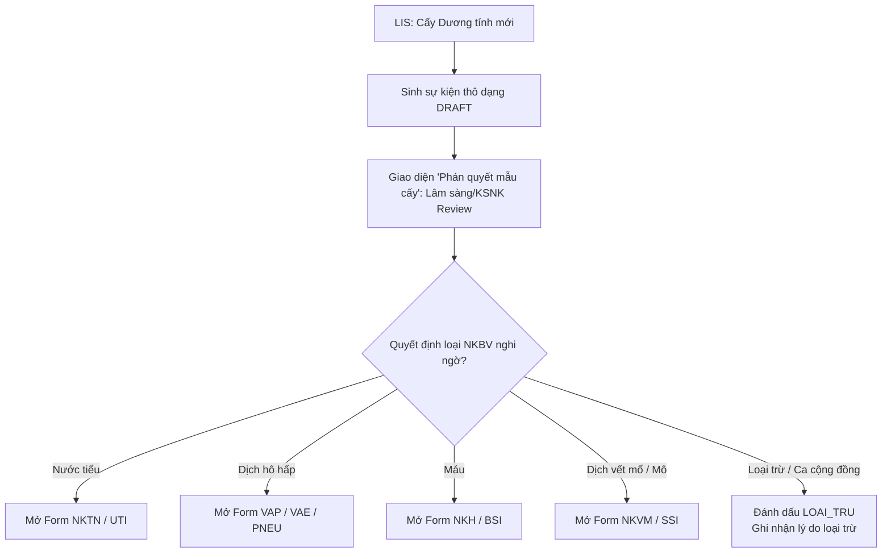

# ĐẶC TẢ THIẾT KẾ CÁC BIỂU MẪU NHẬP LIỆU LÂM SÀNG NKBV (CDC/NHSN SURVEILLANCE PROTOCOL)

> **Tài liệu SSOT Thiết kế Biểu mẫu & Luồng Nghiệp vụ "Phán quyết Dịch tễ"**  
> **Phiên bản:** 1.0 (24/05/2026)  
> **Mục tiêu:** Định nghĩa chuẩn khung nhập liệu lâm sàng, quy tắc kiểm duyệt của Bác sĩ Lâm sàng & Khoa Kiểm soát Nhiễm khuẩn (KSNK) đối với 4 loại Nhiễm khuẩn Bệnh viện (NKBV) phổ biến theo CDC/NHSN.

---

## I. QUY TRÌNH "PHÁN QUYẾT MẪU CẤY DƯƠNG TÍNH" (CLINICAL DECISION WORKFLOW)

Trong thực tế lâm sàng, các chỉ định cấy vi sinh từ hệ thống LIS rất đa dạng và có tên gọi không đồng nhất (ví dụ: *dịch phế quản, dịch hút phế quản, dịch rửa phế nang, nước tiểu qua catheter, nước tiểu giữa dòng, dịch vết mổ nông, dịch dẫn lưu mô sâu, cấy máu ngoại vi, cấy máu catheter trung tâm*). 

Do đó, **hệ thống không tự động áp đặt cứng nhắc loại nhiễm khuẩn**, mà thay vào đó thiết lập quy trình **"Phán quyết mẫu cấy" (Clinical Decision Step)**:



### 1. Trạng thái và Phân quyền Phán quyết:
- **Người thực hiện:** Bác sĩ Khoa Lâm sàng điều trị (chịu trách nhiệm nhập triệu chứng lâm sàng) hoặc Bác sĩ chuyên trách KSNK (thẩm định).
- **Hành động:** Khi click vào một sự kiện vi sinh mới từ danh sách, người dùng sẽ chọn loại NKBV nghi ngờ trong danh sách: **UTI, VAE/PNEU, BSI, SSI, hoặc Loại trừ**.
- **Kết quả:** Chọn loại nào sẽ kích hoạt hiển thị đúng biểu mẫu nhập liệu chuyên biệt của loại đó.

---

## II. THIẾT KẾ CHI TIẾT 4 BIỂU MẪU LÂM SÀNG CHUẨN CDC/NHSN

---

### 1. BIỂU MẪU GIÁM SÁT NHIỄM KHUẨN TIẾT NIỆU (UTI / CA-UTI)
> *Áp dụng cho các mẫu cấy nước tiểu dương tính nghi ngờ Nhiễm khuẩn tiết niệu liên quan đặt ống thông (CA-UTI) hoặc không liên quan ống thông (SUTI).*

```
┌─────────────────────────────────────────────────────────────────────────────┐
│ 🚰 PHIẾU GIÁM SÁT LÂM SÀNG: NHIỄM KHUẨN TIẾT NIỆU (UTI)                    │
├─────────────────────────────────────────────────────────────────────────────┤
│ 1. THÔNG TIN THIẾT BỊ XÂM LẤN                                               │
│ [ ] Có đặt ống thông tiểu Foley liên tục trong đợt nằm viện?                │
│     ├─ Ngày đặt: [ YYYY-MM-DD ]      Ngày rút: [ YYYY-MM-DD ] (Nếu đã rút)   │
│     └─ Thiết bị còn hiện diện vào ngày DOE hoặc 1 ngày trước đó? (Có/Không)  │
│                                                                             │
│ 2. KẾT QUẢ VI SINH NƯỚC TIỂU (Sàng lọc LIS)                                 │
│ ├─ Tác nhân phân lập: [ Klebsiella pneumoniae (Ví dụ) ]                     │
│ ├─ Định lượng khuẩn lạc: [          ] CFU/ml                                │
│ ├─ Số lượng chủng vi sinh vật mọc trong mẫu cấy: [ 1 ] (Nếu > 2 -> Loại trừ)│
│ └─ [ ] Mẫu cấy có chứa Nấm Candida, nấm men hoặc ký sinh trùng?             │
│    (Cảnh báo CDC: Nấm/Ký sinh trùng sẽ không được tính là CA-UTI/UTI)       │
│                                                                             │
│ 3. TRIỆU CHỨNG LÂM SÀNG (Xuất hiện trong cửa sổ IWP: [Day X-3] đến [Day X+3])│
│ [ ] Sốt cao (> 38.0°C)                                                      │
│ [ ] Đau tức vùng hạ vị / trên xương mu (không rõ nguyên nhân khác)          │
│ [ ] Đau tức hố thắt lưng / sườn lưng (không rõ nguyên nhân khác)            │
│ Triệu chứng khi KHÔNG ĐẶT Foley (chỉ hiển thị nếu Foley = Không hoặc đã rút):│
│ [ ] Tiểu buốt / Tiểu khó (Dysuria)                                         │
│ [ ] Tiểu gấp / Cấp bách (Urgency)                                           │
│ [ ] Tiểu nhiều lần / Tiểu rắt (Frequency)                                   │
│                                                                             │
│ 4. BIỂN DIỄN HUYẾT HỌC & SECONDARY BSI (ABUTI)                              │
│ [ ] Bệnh nhân có cấy máu dương tính song song trong vòng 7 ngày của IWP?     │
│     └─ Tác nhân cấy máu trùng khớp hoàn toàn với tác nhân cấy nước tiểu?     │
└─────────────────────────────────────────────────────────────────────────────┘
```

#### Quy tắc Rules Engine tự động thẩm định:
- **CA-UTI (Có ống thông tiểu):** Có Foley $\ge 2$ ngày liên tiếp + Foley còn lưu tại ngày DOE hoặc DOE-1 + Có cấy vi khuẩn $\ge 10^5$ CFU/ml (tối đa 2 tác nhân, không chứa nấm) + Ít nhất 1 triệu chứng (Sốt, đau hạ vị, đau hông lưng).
- **SUTI (Không có ống thông tiểu):** Không đặt Foley hoặc Foley đã rút $> 2$ ngày trước DOE + Có cấy vi khuẩn $\ge 10^5$ CFU/ml (tối đa 2 tác nhân) + Ít nhất 1 triệu chứng tiết niệu tại chỗ (Tiểu buốt, tiểu gấp, tiểu rắt) hoặc Sốt.
- **ABUTI (Nhiễm khuẩn niệu không triệu chứng kèm nhiễm khuẩn huyết thứ phát):** Bệnh nhân không có triệu chứng lâm sàng của UTI nhưng cấy nước tiểu $\ge 10^5$ CFU/ml + Cấy máu dương tính cùng tác nhân trong khung thời gian 7 ngày.

---

### 2. BIỂU MẪU GIÁM SÁT VIÊM PHỔI THỞ MÁY & VIÊM PHỔI BỆNH VIỆN (VAE / PNEU)
> *Áp dụng cho các mẫu dịch hô hấp (đờm, BAL, ETA) nghi ngờ Viêm phổi liên quan máy thở (VAE/VAP) ở bệnh nhân thở máy hoặc Viêm phổi bệnh viện (PNEU) ở bệnh nhân không thở máy.*

```
┌─────────────────────────────────────────────────────────────────────────────┐
│ 🫁 PHIẾU GIÁM SÁT LÂM SÀNG: VIÊM PHỔI THỞ MÁY & VIÊM PHỔI (VAE / PNEU)     │
├─────────────────────────────────────────────────────────────────────────────┤
│ 1. ĐÁNH GIÁ THỞ MÁY & PEEP/FIO2 (Dành cho VAE - Bệnh nhân >= 18 tuổi)       │
│ [ ] Bệnh nhân có thở máy xâm nhập liên tục >= 2 ngày?                       │
│     ├─ Ngày bắt đầu thở máy: [ YYYY-MM-DD ]   Ngày ngừng: [ YYYY-MM-DD ]     │
│     ├─ [ ] Có giai đoạn PEEP/FiO2 tối thiểu ổn định hoặc giảm trong >= 2 ngày│
│     ├─ [ ] Chỉ số PEEP tăng >= 3 cmH2O liên tục trong >= 2 ngày tiếp theo    │
│     └─ [ ] Chỉ số FiO2 tăng >= 20% (0.20) liên tục trong >= 2 ngày tiếp theo │
│                                                                             │
│ 2. TIÊU CHUẨN IVAC (Đánh giá Nhiễm trùng hệ thống trong cửa sổ 5 ngày)      │
│ [ ] Nhiệt độ cơ thể biến động: Sốt (> 38°C) hoặc Hạ thân nhiệt (< 36°C)     │
│ [ ] Bạch cầu máu bất thường: BC >= 12,000/mm3 hoặc BC <= 4,000/mm3          │
│ [ ] Có khởi đầu kháng sinh MỚI và sử dụng liên tục trong >= 4 ngày?        │
│                                                                             │
│ 3. TIÊU CHUẨN PVAP (Bằng chứng Vi sinh Hô hấp)                              │
│ [ ] Đờm mủ đạt chuẩn tế bào học (Gram nhuộm: BC đa nhân >= 25, tb vảy <= 10)│
│ [ ] Kết quả cấy định lượng dịch hô hấp đạt ngưỡng CDC:                       │
│     └─ Ngưỡng: BAL >= 10^4 CFU/ml; ETA >= 10^5 CFU/ml; PSB >= 10^3 CFU/ml   │
│ [ ] Kết quả test nhanh virus hô hấp (Influenza, RSV...) hoặc Legionella (+)?│
│                                                                             │
│ 4. VIÊM PHỔI BỆNH VIỆN KHÔNG THỞ MÁY (PNEU) - Dành cho bệnh nhân thường      │
│ [ ] X-quang/CT ngực: Tổn thương thâm nhiễm mới/tiến triển/dai dẳng,         │
│     đông đặc phổi, hoặc tạo hang? (Yêu cầu >= 2 phim nếu có bệnh tim phổi nền)│
│ [ ] Lú lẫn / Thay đổi ý thức cấp tính (Chỉ áp dụng cho bệnh nhân >= 70 tuổi)│
│ [ ] Triệu chứng hô hấp tại chỗ (Tích chọn các triệu chứng xuất hiện):       │
│     [ ] Ho mới hoặc ho nặng lên      [ ] Đờm mủ mới hoặc tăng lượng đờm     │
│     [ ] Rale ẩm, rale nổ hoặc khò khè  [ ] Suy giảm trao đổi khí PaO2/FiO2  │
└─────────────────────────────────────────────────────────────────────────────┘
```

#### Quy tắc Rules Engine tự động thẩm định:
- **VAC (Ventilator-Associated Condition):** Thở máy $\ge 2$ ngày + PEEP/FiO2 tăng sau 2 ngày ổn định.
- **IVAC (Infection-related Ventilator-Associated Complication):** Đạt tiêu chuẩn VAC + Sốt/Bạch cầu bất thường + Sử dụng kháng sinh mới liên tục $\ge 4$ ngày.
- **PVAP (Possible Ventilator-Associated Pneumonia):** Đạt tiêu chuẩn IVAC + Cấy dịch hô hấp định lượng đạt ngưỡng hoặc đờm mủ đạt chuẩn tế bào học.
- **PNEU (Viêm phổi thường):** X-quang phổi thâm nhiễm + Sốt/Bạch cầu bất thường + Có triệu chứng hô hấp (ho, đờm mủ, rale phổi, giảm oxy máu).

---

### 3. BIỂU MẪU GIÁM SÁT NHIỄM KHUẨN HUYẾT (BSI / CLABSI)
> *Áp dụng cho các mẫu cấy máu dương tính nghi ngờ Nhiễm khuẩn huyết liên quan đến đường truyền trung tâm (CLABSI) hoặc Nhiễm khuẩn huyết nguyên phát (LCBI).*

```
┌─────────────────────────────────────────────────────────────────────────────┐
│ 💉 PHIẾU GIÁM SÁT LÂM SÀNG: NHIỄM KHUẨN HUYẾT (BSI / CLABSI)               │
├─────────────────────────────────────────────────────────────────────────────┤
│ 1. THÔNG TIN ĐƯỜNG TRUYỀN TĨNH MẠCH TRUNG TÂM (CVC)                        │
│ [ ] Có đặt Catheter tĩnh mạch trung tâm (CVC / Arterial Line) trong viện?   │
│     ├─ Ngày đặt CVC: [ YYYY-MM-DD ]    Ngày rút: [ YYYY-MM-DD ]              │
│     └─ CVC còn lưu tại ngày lấy mẫu cấy máu hoặc vừa rút trong vòng 48 giờ?   │
│                                                                             │
│ 2. PHÂN LOẠI TÁC NHÂN CẤY MÁU                                               │
│ Tác nhân phân lập được: [ Staphylococcus epidermidis (Ví dụ) ]              │
│ Phân loại tác nhân theo danh mục CDC:                                       │
│ ( ) Recognized Pathogen (Vi khuẩn gây bệnh thực sự: S.aureus, E.coli, P.aerug)│
│     └─ Chỉ cần 1 mẫu cấy máu dương tính là đủ chuẩn.                        │
│ ( ) Common Commensal (Vi hệ da thường gặp: CoNS, Bacillus, Micrococcus...)   │
│     └─ Yêu cầu >= 2 mẫu máu lấy riêng biệt (vị trí/thời gian khác nhau)     │
│        dương tính với CÙNG một tác nhân vi hệ da.                           │
│                                                                             │
│ 3. TRIỆU CHỨNG LÂM SÀNG NÊN CÓ (Đặc biệt bắt buộc nếu là tác nhân Vi hệ da) │
│ [ ] Sốt cao (> 38.0°C) hoặc Hạ thân nhiệt (< 36.0°C ở trẻ nhỏ)              │
│ [ ] Rét run (Chills)                                                        │
│ [ ] Tụt huyết áp (HA tối đa < 90 mmHg hoặc HA trung bình giảm)              │
│                                                                             │
│ 4. BIỆN BIỂU PHÂN TÍCH LOẠI TRỪ CLABSI (Secondary BSI Exclusion)            │
│ [ ] Bệnh nhân có tình trạng giảm bạch cầu hạt nặng (ANC < 500 tế bào/mm3)?  │
│ [ ] Có ổ nhiễm trùng tại chỗ đạt chuẩn CDC khác (VAP, CAUTI, SSI...)        │
│     trong vòng 14 ngày của cửa sổ cấy máu?                                  │
│     ├─ Ổ nhiễm trùng tại chỗ được xác định: [ UTI (Ví dụ) ]                 │
│     ├─ Tác nhân cấy máu trùng khớp hoàn toàn với tác nhân tại ổ tại chỗ?   │
│     └─ Cấy máu nằm trong khung cửa sổ SBAP 14 ngày của ca bệnh đó?          │
└─────────────────────────────────────────────────────────────────────────────┘
```

#### Quy tắc Rules Engine tự động thẩm định:
- **LCBI 1 (Recognized Pathogen):** Cấy máu dương tính với tác nhân gây bệnh chính + Không có ổ nhiễm trùng tại chỗ nào khác trùng tác nhân gây ra cấy huyết thứ phát (Secondary BSI).
- **LCBI 2 (Common Commensal):** Cấy máu dương tính với vi hệ da + Có triệu chứng lâm sàng (Sốt, rét run, tụt HA) + Có $\ge 2$ mẫu máu lấy ở 2 thời điểm khác nhau dương tính cùng loại vi hệ da trong vòng 2 ngày liên tiếp.
- **CLABSI:** Đạt tiêu chuẩn LCBI + Có đặt CVC lưu $\ge 2$ ngày + CVC còn hoạt động tại ngày DOE hoặc DOE-1.
- **Secondary BSI (Loại trừ khỏi CLABSI):** Đạt tiêu chuẩn cấy máu dương tính nhưng được xác định là thứ phát sau một ổ nhiễm khuẩn tại chỗ khác (ví dụ: Vi khuẩn từ đường tiểu UTI hoặc phổi VAP rò rỉ vào máu). Hệ thống tự động liên kết và chuyển thành ca Secondary BSI, xóa lỗi CLABSI cho khoa lâm sàng.

---

### 4. BIỂU MẪU GIÁM SÁT NHIỄM KHUẨN VẾT MỔ (SSI)
> *Áp dụng cho các ca bệnh mổ ngoại khoa có chảy dịch mủ vết rạch hoặc cấy dương tính dịch vết mổ.*

```
┌─────────────────────────────────────────────────────────────────────────────┐
│ ✂️ PHIẾU GIÁM SÁT LÂM SÀNG: NHIỄM KHUẨN VẾT MỔ (SSI)                       │
├─────────────────────────────────────────────────────────────────────────────┤
│ 1. THÔNG TIN TIỀN SỬ PHẪU THUẬT                                             │
│ ├─ Tên phẫu thuật (Mã NHSN): [ COLO - Phẫu thuật đại tràng (Ví dụ) ]         │
│ ├─ Ngày phẫu thuật: [ YYYY-MM-DD ]                                          │
│ ├─ Ngày phát hiện triệu chứng (DOE): [ YYYY-MM-DD ]                         │
│ ├─ Số ngày từ lúc mổ đến DOE: [ 12 ] ngày                                   │
│ └─ Phẫu thuật có đặt vật liệu nhân tạo (Implant/Mảnh ghép cấy ghép)?        │
│    (Cửa sổ giám sát chuẩn: Có Implant -> 90 ngày; Không Implant -> 30 ngày)  │
│                                                                             │
│ 2. ĐÁNH GIÁ ĐỘ SÂU NHIỄM KHUẨN VẾT MỔ (SSI DEPTH SELECTOR)                  │
│ Chọn độ sâu nghi ngờ:                                                       │
│ ( ) Superficial Incisional (Nhiễm khuẩn vết mổ Nông - chỉ liên quan da/mô dưới da)│
│ ( ) Deep Incisional (Nhiễm khuẩn vết mổ Sâu - liên quan cân và cơ)          │
│ ( ) Organ / Space (Nhiễm khuẩn Khoang/Cơ quan - liên quan ổ bụng, ngực...)   │
│                                                                             │
│ 3. TIÊU CHUẨN LÂM SÀNG THEO ĐỘ SÂU ĐÃ CHỌN                                  │
│ A. TIÊU CHUẨN VẾT MỔ NÔNG (Chọn >= 1 triệu chứng):                           │
│ [ ] Chảy dịch mủ từ vết rạch nông                                           │
│ [ ] Cấy dịch/mô lấy vô khuẩn từ vết rạch nông dương tính                    │
│ [ ] Phẫu thuật viên chủ động mở vết mổ nông + bệnh nhân có đau/sưng/đỏ/nóng  │
│ [ ] Bác sĩ lâm sàng chẩn đoán trực tiếp là SSI nông                          │
│                                                                             │
│ B. TIÊU CHUẨN VẾT MỔ SÂU (Chọn >= 1 triệu chứng):                           │
│ [ ] Chảy dịch mủ từ vết rạch sâu (nhưng không từ khoang cơ quan bên trong)  │
│ [ ] Vết mổ tự toác hoặc được mở chủ động + bệnh nhân sốt > 38°C hoặc đau tại chỗ│
│ [ ] Phát hiện ổ áp xe hoặc bằng chứng nhiễm khuẩn sâu qua mổ lại, hình ảnh   │
│     học (X-quang, CT, Siêu âm) hoặc giải phẫu bệnh                          │
│                                                                             │
│ C. TIÊU CHUẨN KHOANG/CƠ QUAN (Chọn >= 1 triệu chứng):                       │
│ [ ] Chảy mủ từ dẫn lưu đặt trực tiếp trong khoang/cơ quan (dẫn lưu ổ bụng...)│
│ [ ] Cấy dịch/mô lấy vô khuẩn từ khoang/cơ quan dương tính                    │
│ [ ] Phát hiện áp xe hoặc nhiễm khuẩn khoang qua mổ lại, hình ảnh học hoặc GPB│
│                                                                             │
│ 4. SECONDARY BSI LINKAGE                                                    │
│ [ ] Có cấy máu dương tính trong vòng +/- 1 ngày của ngày phát hiện SSI?      │
│     └─ Tác nhân cấy máu trùng khớp hoàn toàn với tác nhân cấy vết mổ?        │
└─────────────────────────────────────────────────────────────────────────────┘
```

#### Quy tắc Rules Engine tự động thẩm định:
- **SSI Nông:** Xảy ra trong vòng 30 ngày sau mổ + Chỉ liên quan da/mô dưới da + Đạt ít nhất 1 tiêu chí nông.
- **SSI Sâu:** Xảy ra trong vòng 30 ngày (không implant) hoặc 90 ngày (có implant) sau mổ + Liên quan cân/cơ + Đạt ít nhất 1 tiêu chí sâu.
- **SSI Khoang/Cơ quan:** Xảy ra trong vòng 30 ngày (không implant) hoặc 90 ngày (có implant) sau mổ + Liên quan bất kỳ phần cơ thể nào được mở ra trong cuộc mổ ngoài vết rạch cân cơ + Đạt ít nhất 1 tiêu chí khoang.

---

## III. BẢNG TỔNG HỢP ÁNH XẠ CHỈ ĐỊNH DỊCH VÀ NKBV NGHI NGỜ GỢI Ý

Để hỗ trợ người dùng thao tác nhanh, hệ thống sẽ **gợi ý (nhưng không áp đặt)** loại NKBV nghi ngờ dựa trên từ khóa của tên loại bệnh phẩm cấy trả về từ LIS:

| Tên bệnh phẩm LIS (Chứa từ khóa) | Loại NKBV Gợi ý | Biểu mẫu Kích hoạt tương ứng |
| :--- | :--- | :--- |
| `Nước tiểu`, `Urine`, `Catheter nước tiểu` | **UTI** | Biểu mẫu Nhiễm khuẩn tiết niệu (CA-UTI) |
| `Đờm`, `Sputum`, `Dịch phế quản`, `BAL`, `ETA`, `Hút nội khí quản` | **VAE/PNEU** | Biểu mẫu Viêm phổi máy / Viêm phổi bệnh viện |
| `Máu`, `Blood`, `Catheter tĩnh mạch`, `CVC` | **BSI** | Biểu mẫu Nhiễm khuẩn huyết (CLABSI) |
| `Dịch vết mổ`, `Pus`, `Mủ`, `Dịch dẫn lưu ổ bụng`, `Mô sinh thiết` | **SSI** | Biểu mẫu Nhiễm khuẩn vết mổ (SSI) |
| *Các loại dịch khác (não tủy, màng phổi...)* | **Exclusion hoặc Other** | Cho phép người dùng chọn chẩn đoán lâm sàng tự do hoặc loại trừ |

---

## IV. LỘ TRÌNH TRIỂN KHAI PHẦN CỨNG & PHẦN MỀM (DOD)

1. **Giai đoạn 1: Thống nhất thiết kế biểu mẫu lâm sàng (Hiện tại)**
   - Trình duyệt và thống nhất các trường thông tin lâm sàng của 4 biểu mẫu với bác sĩ KSNK & Lâm sàng qua tệp đặc tả MD này.
2. **Giai đoạn 2: Cập nhật Database & Server Actions**
   - Đảm bảo các trường động (JSONB) lưu trữ đầy đủ các thuộc tính của biểu mẫu tương ứng mà không làm thay đổi cấu trúc vật lý của bảng `fact_nkbv_su_kien`.
3. **Giai đoạn 3: Tái thiết kế Giao diện Modal Soạn thảo**
   - Thay vì hiện một form chung chung, khi mở sự kiện vi sinh, giao diện yêu cầu thực hiện bước "Phán quyết" (chọn loại NKBV nghi ngờ).
   - Dựa trên loại nghi ngờ đã chọn, render đúng SubForm lâm sàng tương ứng với các trường nhập liệu chuẩn hóa.
4. **Giai đoạn 4: Thử nghiệm thực tế với UAT Seeder**
   - Nạp dữ liệu triệu chứng phong phú của từng loại ca bệnh qua `seed-uat-medical-record.ts` để kiểm chứng thuật toán Rules Engine.
