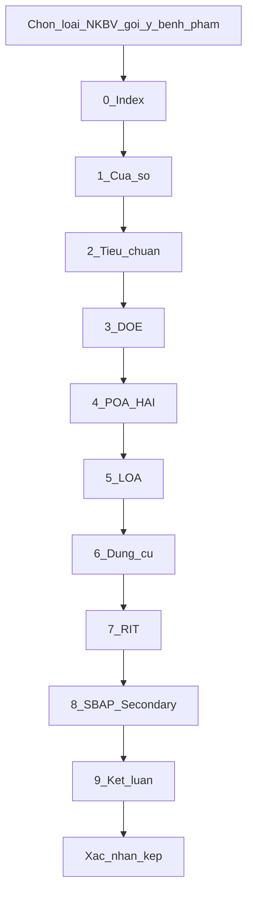

# ĐẶC TẢ THIẾT KẾ CÁC BIỂU MẪU NHẬP LIỆU LÂM SÀNG NKBV (CDC/NHSN)

> **Hợp đồng UI pilot** (không thay Domain SSOT)  
> **Phiên bản:** 3.2 (2026-08-05) — lớp L1/L2/L3 tinh gọn CDC + investigation-forms  
> Neo domain: [`hai-surveillance-domain-ssot-20260804.md`](./hai-surveillance-domain-ssot-20260804.md)  
> Phân tích phiếu: [`investigation-forms/README.md`](./investigation-forms/README.md)  
> **SSOT triệu chứng:** [`investigation-forms/02-clinical-symptom-catalog.md`](./investigation-forms/02-clinical-symptom-catalog.md) · code `nkbv-clinical-symptom-catalog.ts` · Ch.17 SSI `nkbv-chapter17-clinical.ts` · UAT [`investigation-forms/symptom-catalog-uat-20260809.md`](./investigation-forms/symptom-catalog-uat-20260809.md)

## Cập nhật 2026-08 — form hàng chẩn đoán (2 cột)

| Hội chứng | Yếu tố xác định khung | Form runtime | Domain |
|-----------|----------------------|--------------|--------|
| **BSI/CLABSI** | Cấy máu | `BsiClinicalSubForm` trong `NkbvDiagnosticCaseForm` | §6 |
| **UTI/CAUTI** | Cấy nước tiểu + IWP | `UtiClinicalSubForm` | §7 |
| **VAE** | Máy thở (PEEP/FiO₂); **không X-quang** | `VaeClinicalSubForm` | §8 |
| **VAP / HAP (PNEU)** | Cấy **hoặc** X-quang | `PneuClinicalSubForm` | §10 |
| **SSI** | Theo dõi sau mổ 30/90 ngày | `SsiClinicalSubForm` | §11 |

**UI copy:** không hiện “cò súng” / “SSOT §…” — dùng “Yếu tố xác định khung”, “Quy kết khoa (LOA)”, “Cửa sổ Secondary BSI (SBAP)”.

**Out of scope:** PedVAE, ENDO, IAB/BONE/PJI, LabID/CLIP, AU.

Runtime: `NkbvDiagnosticCaseForm` + `NkbvDiagnosticRow` trong modal phán quyết (một màn, không tab lâm sàng/KSNK).

---

## I. CHUỖI CHẨN ĐOÁN TRÊN FORM

```mermaid
flowchart TB
  top[Chon_loai_NKBV_goi_y_benh_pham]
  r0[0_Index]
  r1[1_Cua_so]
  r2[2_Tieu_chuan]
  r3[3_DOE]
  r4[4_POA_HAI]
  r5[5_LOA]
  r6[6_Dung_cu]
  r7[7_RIT]
  r8[8_SBAP_Secondary]
  r9[9_Ket_luan]
  confirm[Xac_nhan_kep]
  top --> r0 --> r1 --> r2 --> r3 --> r4 --> r5 --> r6 --> r7 --> r8 --> r9 --> confirm
```

Domain §2.6: Criteria → DOE → POA/HAI → Device → RIT → Secondary BSI (+ LOA §1.6 / Transfer Rule).

### Wireframe

- **Trái:** mốc thời gian / bước chẩn đoán  
- **Phải:** tiêu chuẩn hoặc nhập liệu tương ứng  
- **Mobile:** xếp dọc (mốc rồi nhập), cùng thứ tự hàng  
- **Cuối:** xác nhận lâm sàng + KSNK + ghi chú

| Hàng | Trái (mốc) | Phải (nhập / chỉ đọc) |
|------|------------|------------------------|
| 0 | Yếu tố xác định khung | Cấy / XQ (+ ngày) → Index |
| 1 | Cửa sổ thời gian | IWP ±3 / Event Period / Surveillance |
| 2 | Tiêu chuẩn trong cửa sổ | Triệu chứng / lab / hình ảnh + ngày đầu |
| 3 | Ngày sự kiện (DOE) | Tự tính |
| 4 | POA / HAI | Từ vào viện + DOE |
| 5 | LOA — Quy kết khoa | Lịch sử khoa; Transfer Rule; lý do quy kết |
| 6 | Dụng cụ xâm lấn | Loại · đặt/rút · ≥2 ngày · hiện diện DOE/DOE−1 |
| 7 | RIT | [DOE → DOE+13] |
| 8 | Secondary BSI (nếu có) | SBAP; máu ∈ SBAP; khớp loài |
| 9 | Kết luận tiêu chuẩn | Badge engine |

---

## II. MA TRẬN FIELD THEO HỘI CHỨNG

Giữ mapping type ↔ UI như v2 (BSI/UTI/VAE/PNEU/SSI) — field nằm ở hàng 0/2/6/8 tương ứng; LOA/RIT/SBAP dùng `calculateCdcMetrics` + `treatmentHistory`.

### II.a Phân lớp tinh gọn (L1 / L2 / L3) — khóa 2026-08-05

| Lớp | Ý nghĩa | UI |
|-----|---------|-----|
| **L1 Core** | Bắt buộc phân loại CDC | Màn vận hành luôn hiện |
| **L2 Branch** | Nhánh có điều kiện | Progressive disclosure |
| **L3 Audit** | Ruled-out / đào tạo / in giấy | Thu gọn hoặc phụ lục B |

Chi tiết cây + bảng field: [`investigation-forms/trees/`](./investigation-forms/trees/).  
Spec A (vận hành) + B (phụ lục): `investigation-forms/*-2026.md`.  
Gap P0/P1: [`investigation-forms/gap-lean-vs-runtime.md`](./investigation-forms/gap-lean-vs-runtime.md).

| Hội chứng | L1 (tóm tắt) | L2 hay gặp | L3 |
|-----------|--------------|------------|-----|
| BSI | Pathogen class + CVC association | Commensal sx, LCBI3, MBI, Secondary | Contamination / CLIP (out) |
| UTI | CFU/≤2/no nấm + ≥1 sx | Foley CAUTI, voiding, SUTI2, ABUTI | ASB giải trình |
| VAE | Age≥18, vent≥4d, VAC | IVAC, PVAP, Secondary PVAP | APRV/ECMO stub |
| PNEU | Imaging + toàn thân + ≥2 hô hấp | Bệnh nền/phim, AMS≥70, PNU2/3, VAP device | Ruled-out Phần V |
| SSI | Cửa sổ 30/90 + depth + ≥1 tiêu chí | Implant, PATOS, CSSD QR, Secondary | Hết cửa sổ |

**VAE ≠ PNEU:** VAE không X-quang / Event Period; PNEU có X-quang / IWP ±3 — xem [`investigation-forms/01-shared-spine.md`](./investigation-forms/01-shared-spine.md).

---

## III. ÁNH XẠ LIS → GỢI Ý LOẠI

| Bệnh phẩm LIS | Gợi ý xác nhận | Form | Ghi chú |
|---------------|----------------|------|---------|
| Máu / Blood | **BSI/CLABSI** | BSI | Secondary BSI = hàng SBAP sau ổ nguyên phát |
| Nước tiểu / Urine | **UTI/CAUTI** | UTI | |
| Đờm / BAL / ETA | **HAP** | PNEU | Thở máy → user đổi VAE hoặc VAP |
| Dịch / mủ **vết mổ** | **SSI** | SSI | Không gợi SSI từ keyword “mổ” trần |

**Luật gợi ý (runtime `suggestNkbvTypeFromSpecimen` + import `resolveMdmLoaiId`):**

1. Ưu tiên **bệnh phẩm + vị trí**; chỉ tin `loai_ma` khi khớp alias MDM và **không** mâu thuẫn bệnh phẩm (vd. SSI + máu → bỏ SSI, gợi BSI).  
2. Alias MDM: `BSI↔CLABSI`, `UTI↔CAUTI|UTI_NKBV`, `HAP↔VAP|PNEU`.  
3. **Cấm** fallback `categories[0]` (trước đây hay ra SSI). Không khớp → `null` / `KHAC`.

---

## III.b BỆNH ÁN → NGÀY VÀO VIỆN (POA/HAI)

- Modal đọc `nkbv_fact_benh_an` theo `ma_benh_an` → hiển thị / sửa **ngày vào viện**.  
- Đổi ngày → `syncNkbvAdmissionDate` cập nhật BA (+ tùy chọn sự kiện) → `calculateCdcMetrics` tính lại HD / POA / HAI (HD≥3 = HAI).

---

## III.c DOE TRONG IWP

| Hội chứng | Key `symptom_dates` đóng góp DOE |
|-----------|----------------------------------|
| BSI | `has_fever`, `has_chills`, `has_hypotension`, infant (`has_hypothermia`…) + legacy `symptoms_window_7days` |
| UTI | sốt / đau mu / CVA / tiểu buốt·gấp·rắt + infant SUTI2 có ngày |
| PNEU | toàn thân + hình ảnh + hô hấp tại chỗ (`has_dyspnea`, `has_tachypnea`, ho, đờm, rale, PaO₂…) |
| VAE / SSI | Event Period / Surveillance — không ép IWP ±3 cho DOE kiểu lâm sàng |

PNEU checklist tối thiểu theo tuổi: ≤1 / 1–12 / người lớn; PNU1/2/3 lab-first từ loại mẫu + CFU/bán định lượng + Table 3 atoms + checklist miễn dịch; CFU/`so_luong` LIS đổ từ lưới BA (`nkbv-pneu-lab-tier`).

---

## III.d MDRO vận hành (không LabID NHSN)

- Nạp vi sinh: `is_mdro` + `mdro_phenotype` (MRSA/VRE/CRE/…).  
- Tab Hồ sơ BA: panel BN đa kháng đang nằm + link BM.31.03 / BM.14.01.  
- GSC tuân thủ: dropdown BN theo khoa; badge đã GS / đã cách ly; deep-link `?bk=&ma_benh_an=`.

## IV. In phiếu chốt ca (envelope SSOT §5.2)

- Runtime: `NkbvCasePrintView` + `PrintLayout`; nút **In phiếu** trên modal xác định ca.
- Tên file: `NKBV_PXDC_{ma_ca}` (`print-file-title`).
- Nội dung: hành chính · cửa sổ/DOE/POA-HAI/LOA · tiêu chuẩn+ngày · dụng cụ/RIT/SBAP · kết luận; nhãn **NHÁP / ĐÃ CHỐT**.

---

## V. DoD

1. Một màn xác định ca — không tab “Lâm sàng / KSNK”.  
2. Đủ hàng 0–9 + xác nhận kép.  
3. LOA + SBAP lộ rõ trên form.  
4. Gợi ý loại theo bệnh phẩm (máu≠SSI); BA cung cấp ngày vào viện cho POA/HAI.  
5. Tick triệu chứng + ngày ∈ IWP → DOE = ngày sớm nhất hợp lệ.  
6. In phiếu envelope đủ lưu trữ / họp.
