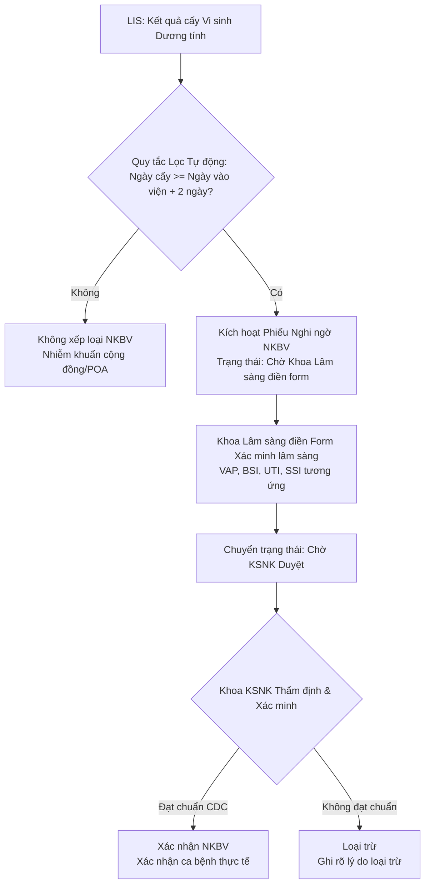

# ĐẶC TẢ NGHIỆP VỤ GIÁM SÁT NHIỄM KHUẨN BỆNH VIỆN (NKBV) — CDC/NHSN STANDARD

> **Phiên bản:** 1.0 (22/05/2026)  
> **Trạng thái:** Kế hoạch Thiết kế (SSOT Nghiệp vụ NKBV)  
> **Tiêu chuẩn tham chiếu:** CDC/NHSN (National Healthcare Safety Network) Guidelines for HAI Surveillance

---

## 1. Tổng quan Nghiệp vụ Giám sát NKBV (Hospital-Acquired Infection - HAI)

Giám sát nhiễm khuẩn bệnh viện (NKBV) là một trong những nhiệm vụ cốt lõi của Khoa Kiểm soát Nhiễm khuẩn (KSNK). Mục tiêu là chủ động phát hiện sớm các ca bệnh nhiễm khuẩn phát sinh trong quá trình điều trị nội trú, đưa ra chẩn đoán chính xác dựa trên tiêu chí cận lâm sàng (vi sinh) kết hợp lâm sàng, từ đó triển khai kịp thời các biện pháp phòng ngừa lan truyền và báo cáo số liệu thống kê dịch tễ.

Luồng quy trình nghiệp vụ tổng quát gồm 4 bước liên kết chặt chẽ:

---

## 2. Tiêu chuẩn Lọc & Cảnh báo Sơ bộ (Tự động từ Vi sinh LIS)

### 2.1 Quy tắc "Ngày lịch thứ 3" (Calendar Day 3 Rule)
Theo định nghĩa chuẩn của CDC/NHSN, một nhiễm khuẩn được coi là nhiễm khuẩn bệnh viện (Healthcare-Associated Infection - HAI) nếu **Ngày phát hiện** (date of event - thường lấy theo ngày lấy mẫu bệnh phẩm vi sinh dương tính) xảy ra từ **Ngày lịch thứ 3 trở đi** của đợt nhập viện (với Ngày vào viện là Ngày 1).

* **Công thức toán học áp dụng:**
  $$\text{Ngay cấy vi sinh} \ge \text{Ngay vào viện} + 2 \text{ ngày}$$
* **Ví dụ cụ thể:**
  - Bệnh nhân nhập viện lúc 14:00 ngày 20/05/2026 (Ngày 1).
  - Ngày 21/05/2026 là Ngày 2.
  - Ngày 22/05/2026 là Ngày 3.
  - Nếu cấy máu dương tính lấy mẫu lúc 08:00 ngày 22/05/2026 $\to$ Đủ điều kiện nghi ngờ NKBV (Day 3).
  - Nếu cấy máu dương tính lấy mẫu ngày 21/05/2026 $\to$ Coi là Nhiễm khuẩn có sẵn lúc vào viện (Present on Admission - POA).

### 2.2 Phân loại Nghi ngờ theo Loại bệnh phẩm (Microbiology Specimen Mapping)
Khi phát hiện kết quả vi sinh dương tính đạt quy tắc "Ngày lịch thứ 3", hệ thống tự động phân loại loại nhiễm khuẩn bệnh viện nghi ngờ dựa trên **Loại bệnh phẩm** của kết quả xét nghiệm:

| Nhóm bệnh phẩm cấy | Loại bệnh phẩm chi tiết | Loại NKBV Nghi ngờ | Tên chuyên môn y tế |
| :--- | :--- | :--- | :--- |
| **Bệnh phẩm hô hấp** | Đờm, Dịch hút nội khí quản, Dịch phế quản (BAL)... | **VAP** | Viêm phổi liên quan thở máy (Ventilator-Associated Pneumonia) |
| **Bệnh phẩm máu** | Máu, cấy đầu catheter tĩnh mạch trung tâm... | **BSI** | Nhiễm khuẩn huyết liên quan đường truyền trung tâm (CLABSI/LCBI) |
| **Bệnh phẩm nước tiểu** | Nước tiểu (giữa dòng, qua sonde), dịch chọc bàng quang... | **UTI** | Nhiễm khuẩn tiết niệu liên quan đặt ống thông (CAUTI) |
| **Bệnh phẩm vết mổ** | Dịch vết mổ, mủ vết mổ, mảnh sinh thiết vết mổ... | **SSI** | Nhiễm khuẩn vết mổ (Surgical Site Infection) |
| **Bệnh phẩm khác** | Dịch não tủy, dịch màng bụng, dịch khớp... | **OTHER** | Nhiễm khuẩn vị trí khác |

---

## 3. Danh mục Form Xác minh Lâm sàng (Clinical Validation Templates)

Đối với mỗi ca nghi ngờ, khoa lâm sàng điều trị trực tiếp có trách nhiệm cung cấp dữ liệu lâm sàng và cận lâm sàng thông qua các form kiểm duyệt tương ứng. Cấu trúc form được thiết kế động thông qua JSONB để đảm bảo tính linh hoạt tối đa.

### 3.1 Form Giám sát VAP (Viêm phổi thở máy)
Dành cho bệnh phẩm hô hấp (đờm, BAL).
* **`had_ventilator` (Có thở máy $\ge 2$ ngày):** Bệnh nhân có thở máy xâm nhập liên tục trong vòng 48 giờ trước thời điểm cấy bệnh phẩm? (Có/Không)
* **`fever_hypothermia` (Biến động thân nhiệt):** Sốt $> 38^\circ\text{C}$ hoặc hạ thân nhiệt $< 36^\circ\text{C}$? (Có/Không)
* **`leukocytosis_leukopenia` (Biến động bạch cầu):** Số lượng bạch cầu máu $\ge 12,000/\mu\text{L}$ hoặc $< 4,000/\mu\text{L}$? (Có/Không)
* **`purulent_sputum` (Tính chất đờm mủ):** Đờm đục, đờm mủ mới xuất hiện, hoặc thay đổi tính chất đờm (tăng lượng đờm, tăng mùi hôi)? (Có/Không)
* **`imaging_infiltrate` (X-quang ngực tổn thương):** X-quang hoặc CT phổi có tổn thương thâm nhiễm mới, tiến triển hoặc dai dẳng kéo dài $\ge 24$ giờ? (Có/Không)

### 3.2 Form Giám sát BSI (Nhiễm khuẩn huyết / LCBI)
Dành cho cấy máu dương tính.
* **`had_central_line` (Có đường truyền trung tâm):** Bệnh nhân có đặt catheter tĩnh mạch trung tâm (Central Line) trong vòng 48 giờ trước ngày cấy máu? (Có/Không)
* **`symptoms` (Triệu chứng lâm sàng nhiễm độc):** Có ít nhất 1 trong các dấu hiệu: sốt $> 38^\circ\text{C}$, rét run, hoặc tụt huyết áp (HA tối đa $< 90\text{ mmHg}$)? (Có/Không)
* **`pathogen_type` (Phân loại tác nhân phân lập):** Tác nhân phân lập được thuộc nhóm:
  - `recognized_pathogen`: Vi khuẩn gây bệnh chính rõ ràng (vd. *S. aureus*, *P. aeruginosa*, *E. coli*, *Klebsiella*...). Chỉ cần **1 mẫu** dương tính để chẩn đoán.
  - `skin_commensal`: Vi hệ da thường gặp (vd. *Coagulase-negative Staphylococci*, *Micrococcus*, *Bacillus*...). Cần **$\ge 2$ mẫu** máu lấy ở 2 thời điểm khác nhau dương tính cùng loại để chẩn đoán.
* **`skin_commensal_details` (Nếu là vi hệ da):** Có ít nhất 2 mẫu cấy máu drawn on separate occasions dương tính với cùng một loại tác nhân vi hệ da? (Có/Không/Không áp dụng)

### 3.3 Form Giám sát CAUTI (Nhiễm khuẩn tiết niệu)
Dành cho cấy nước tiểu dương tính.
* **`had_urinary_catheter` (Có đặt sonde tiểu):** Bệnh nhân có lưu sonde tiểu liên tục trong vòng 48 giờ trước ngày cấy nước tiểu? (Có/Không)
* **`symptoms` (Lâm sàng tiết niệu):** Có ít nhất 1 trong các dấu hiệu: sốt $> 38^\circ\text{C}$, đau vùng thượng vị/hông lưng, tiểu buốt, tiểu rắt, ấn đau vùng hạ vị? (Có/Không)
* **`urine_colony_count` (Định lượng khuẩn lạc):** Kết quả cấy nước tiểu có số lượng khuẩn lạc $\ge 10^5\text{ CFU/ml}$ và không quá 2 loại tác nhân vi khuẩn phân lập được? (Có/Không)

### 3.4 Form Giám sát SSI (Nhiễm khuẩn vết mổ)
Dành cho bệnh phẩm cấy dịch vết mổ hoặc phát hiện lâm sàng vết mổ ngoại khoa.
* **`post_op_window` (Thời hạn sau mổ):** Ngày lấy mẫu/phát hiện nhiễm khuẩn xảy ra trong vòng:
  - Phẫu thuật thông thường: trong vòng **30 ngày** sau mổ.
  - Phẫu thuật có đặt dụng cụ cấy ghép/mảnh ghép nhân tạo (Implant): trong vòng **90 ngày** sau mổ.
* **`surgical_history` (Thông tin cuộc mổ):** Tên phẫu thuật và ngày phẫu thuật liên quan (vd. Mổ ruột thừa ngày 15/05/2026).
* **`symptoms` (Lâm sàng vết mổ):** Chảy mủ từ vết mổ nông hoặc sâu; hoặc có biểu hiện sưng, nóng, đỏ, đau tại vết mổ? (Có/Không)
* **`incision_opened` (Mở vết mổ chủ động):** Bác sĩ phẫu thuật chủ động mở vết mổ hoặc chích rạch giải phóng mủ dịch do vết mổ có dấu hiệu viêm đỏ và cấy dịch dương tính? (Có/Không)

---

## 4. Quản lý Trạng thái & Phân quyền An toàn (RLS Policies)

Quy trình phê duyệt ca bệnh NKBV được quản trị chặt chẽ nhằm tránh dữ liệu ảo và đảm bảo tính thống nhất chuyên môn:

### 4.1 Cơ chế Chuyển trạng thái Phiếu (Case State Transitions)
* **`DANG_GHI_NHAN` (Đang ghi nhận/Chờ lâm sàng):** Ca bệnh được tự động sinh ra từ kết quả vi sinh dương tính Day 3 hoặc KSNK nhập tay. Hệ thống yêu cầu khoa lâm sàng điền form.
* **`CHO_XAC_MINH` (Chờ lâm sàng điền form):** Phiếu đã được KSNK kích hoạt từ danh sách vi sinh cảnh báo, khoa lâm sàng cần hoàn thiện form.
* **`CHO_DUYET` (Chờ duyệt):** Khoa lâm sàng đã hoàn tất khai báo đầy đủ các trường lâm sàng bắt buộc của form.
* **`XAC_NHAN` (Xác nhận NKBV):** Cán bộ khoa KSNK thẩm định form thấy khớp chuẩn CDC và xác nhận ca bệnh. Ghi nhận là ca nhiễm khuẩn bệnh viện thực tế trong báo cáo dịch tễ.
* **`LOAI_TRU` (Loại trừ):** Cán bộ khoa KSNK từ chối xác nhận ca bệnh do không đủ tiêu chuẩn lâm sàng của CDC. Yêu cầu nhập bắt buộc **Lý do loại trừ** (chuyển vào `clinical_notes->'ly_do_loai_tru'`).

### 4.2 Ma trận phân quyền thao tác (RBAC & RLS)
Hệ thống sử dụng cơ chế bảo mật cấp dòng (Row Level Security - RLS) trên PostgreSQL để phân định quyền hạn:

| Người dùng | Quyền xem danh sách NKBV | Quyền báo cáo vi sinh (LIS) | Quyền điền form lâm sàng | Quyền Duyệt/Loại bỏ ca |
| :--- | :--- | :--- | :--- | :--- |
| **Khoa KSNK (Chuyên trách)** | Xem toàn viện | Có (Nhập tay / Import Excel) | Có | Có (Toàn quyền chuyển trạng thái) |
| **Khoa Vi sinh (Lab)** | Không xem ca bệnh lâm sàng | Có (Toàn quyền nhập/import cấy dương tính) | Không | Không |
| **Khoa Lâm sàng (Bác sĩ/ĐD)** | Xem duy nhất khoa mình | Không | Có (Chỉ ca thuộc `khoa_ghi_nhan_id` của mình) | Không |
| **Quản trị hệ thống** | Xem toàn viện | Có | Có | Có |

---

## 5. Chiến lược Đồng bộ & Dữ liệu Tổng hợp (Pre-aggregation Rules)

Để phục vụ phân tích báo cáo thời gian thực mà không làm suy giảm hiệu năng DB (tuân thủ **AGENTS.md - Quản trị Pre-aggregation chặt chẽ**):
- **Bảng dữ liệu giao dịch vi sinh (`fact_vi_sinh_records`):** Chứa dữ liệu nhập thô từ LIS. Các chỉ mục (B-tree Index) được đặt tại `ma_benh_nhan`, `ngay_lay_mau`, `loai_benh_pham` để tìm kiếm và quét nhanh.
- **Rules Engine (Database View):** Không tạo bảng vật lý tổng hợp dư thừa. Thay vào đó, sử dụng SQL View `v_fact_vi_sinh_nkbv_screening` để thực hiện phép lọc tự động Day 3 giữa `fact_vi_sinh_records` và `fact_giam_sat_nkbv_ca`.
- **Thống kê Dashboard:** Sử dụng hàm SQL/RPC tính toán động trên View để hiển thị tỷ lệ NKBV theo Bệnh nhân, theo Khoa phòng, theo Loại nhiễm khuẩn và loại Bệnh phẩm. Chỉ cân nhắc vật lý hóa (Materialized View) khi dữ liệu vượt ngưỡng $100.000$ dòng giao dịch thực tế.

---

## 6. Quy trình báo cáo & Đẩy dữ liệu của Khoa Vi sinh (LIS Lab Pipeline)

Để đảm bảo dữ liệu đầu vào cho Rules Engine sàng lọc nhiễm khuẩn luôn nhất quán, Khoa Vi sinh được thiết lập một cổng báo cáo dữ liệu cấy dương tính (Microbiology Upload Portal). Cổng này hỗ trợ hai hình thức báo cáo:

### 6.1 Nhập tay kết quả cấy dương tính đơn lẻ (Single Positive Entry)
Giao diện nhập tay dành cho các kết quả cấy lẻ tẻ hoặc khẩn cấp, bao gồm các thông tin:
* Mã bệnh nhân, Họ tên, Giới tính, Ngày sinh.
* Ngày nhập viện (Encounter Admission Time).
* Ngày lấy mẫu cấy (Specimen Collection Time).
* Khoa lâm sàng yêu cầu cấy.
* Loại bệnh phẩm (Lựa chọn từ danh sách chuẩn bệnh phẩm CDC).
* Tên tác nhân vi khuẩn cấy dương tính (gõ tự động gợi ý danh mục vi sinh).

### 6.2 Báo cáo hàng loạt bằng Import Excel (Batch Excel Upload)
Khoa Vi sinh xuất danh sách cấy dương tính từ hệ thống LIS nội bộ và tải lên hệ thống qua file Excel mẫu. 

**Cấu trúc bảng Excel tiêu chuẩn (.xlsx / .csv):**
1. `ma_benh_nhan` (Mã bệnh nhân - Bắt buộc)
2. `ho_ten_benh_nhan` (Họ tên - Bắt buộc)
3. `ngay_sinh` (Định dạng YYYY-MM-DD - Tùy chọn)
4. `gioi_tinh` (Nam/Nữ/Khác - Tùy chọn)
5. `ngay_vao_vien` (Định dạng YYYY-MM-DD HH:mm:ss - Bắt buộc)
6. `ngay_lay_mau` (Định dạng YYYY-MM-DD HH:mm:ss - Bắt buộc)
7. `ma_khoa_yeu_cau` (Mã khoa phòng thực tế trong HIS - Bắt buộc)
8. `loai_benh_pham` (Chuẩn hóa: Đờm, Máu, Nước tiểu, Dịch vết mổ... - Bắt buộc)
9. `tac_nhan` (Tác nhân phân lập được, phân tách bằng dấu phẩy nếu cấy đa tác nhân - Bắt buộc)
10. `so_luong_khuan_lac` (Mật độ khuẩn lạc nếu có, ví dụ: 10^5 CFU/ml - Tùy chọn)

**Quy tắc xử lý trùng lặp dữ liệu (Idempotency Rule):**
Hệ thống sử dụng khóa tự nhiên tổng hợp `unique_vi_sinh_key = md5(ma_benh_nhan + ngay_lay_mau + loai_benh_pham)` lưu tại cột `metadata->>'unique_key'` để ngăn chặn việc import trùng lặp dữ liệu cấy vi sinh khi người dùng tải lại cùng một file Excel nhiều lần.

