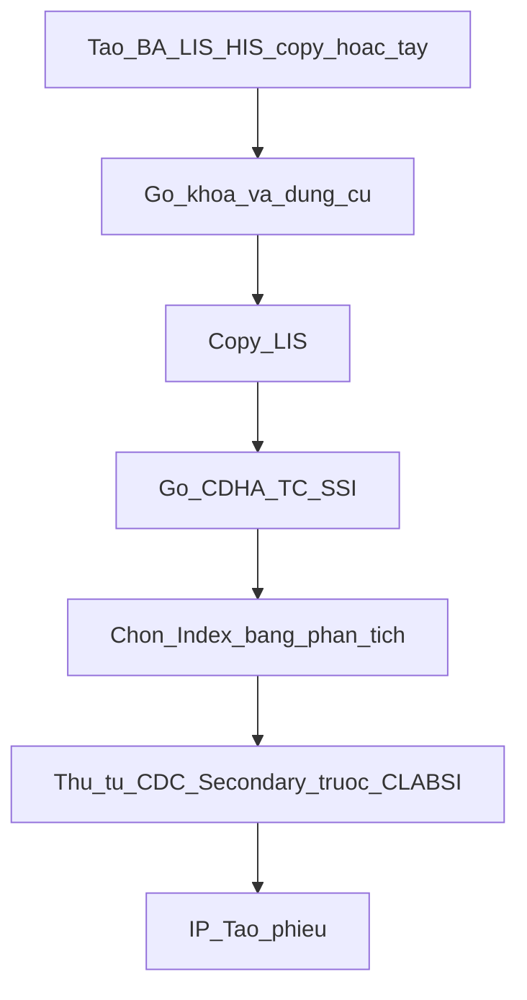

# ĐẶC TẢ NGHIỆP VỤ GIÁM SÁT NHIỄM KHUẨN BỆNH VIỆN (NKBV) — CDC/NHSN STANDARD

> **Phiên bản:** 1.2 (2026-08-27)  
> **Trạng thái:** Hợp đồng vận hành pilot (RBAC / state / cổng nạp LIS).  
> **Quy trình ca + dữ liệu:** [`hai-identification-data-flow-20260827.md`](hai-identification-data-flow-20260827.md) (LIS tạo BA nếu chưa có mã; copy HIS/gõ tay; triệu chứng timeline = BA).  
> **Thuật toán + từ điển:** [`hai-surveillance-domain-ssot-20260827.md`](hai-surveillance-domain-ssot-20260827.md) (v3.3).  
> **Workspace phân tích:** [`ba-centric-timeline.md`](ba-centric-timeline.md) — **Bệnh án trung tâm**; cổng vi sinh chỉ nạp timeline.  
> §3 form “48 giờ” bên dưới là **legacy field list** — runtime dùng device **>2 ngày lịch** và split VAE/PNEU (SSOT Ch.2 §2.8).  
> **Không API HIS/LIS.** Vi sinh = copy LIS (tạo BA nếu chưa có mã). Bệnh án cũng copy HIS hoặc gõ tay.  
> **Chiến lược sản phẩm:** [`adr-nkbv-unified-module-20260715.md`](../../reference/architecture/adr-nkbv-unified-module-20260715.md).

---

## 1. Tổng quan Nghiệp vụ Giám sát NKBV (HAI)

Giám sát HAI tại BV103: phát hiện và phân loại sự kiện nhiễm khuẩn liên quan chăm sóc y tế **người lớn** theo CDC NHSN 2025, trên **một** module `/giam-sat-nkbv`. Tên module = **NKBV**; tử số = sự kiện **HAI** (Phụ lục E).

**Không kết nối API HIS/LIS.** Bệnh án: (1) lấy từ LIS khi copy vi sinh — **đã có mã thì không bổ sung**; (2) copy HIS / gõ tay. **Vi sinh:** copy bảng/Excel từ LIS. Chi tiết: [`hai-identification-data-flow-20260827.md`](hai-identification-data-flow-20260827.md).

**Luồng chuẩn — chi tiết [`hai-identification-data-flow-20260827.md`](hai-identification-data-flow-20260827.md):**

```mermaid
flowchart TD
  A[Tao_BA_LIS_HIS_copy_hoac_tay] --> B[Go_khoa_va_dung_cu]
  B --> C[Copy_LIS]
  C --> D[Go_CDHA_TC_SSI]
  D --> E[Chon_Index_bang_phan_tich]
  E --> F[Thu_tu_CDC_Secondary_truoc_CLABSI]
  F --> G[IP_Tao_phieu]
```

Cổng LIS **không** tạo phiếu. “XN (+) ngày lịch 3” chỉ **hàng đợi chưa phân tích** — **không** = HAI. HAI/POA theo **DOE** sau khi đủ tiêu chí trong cửa sổ.

---

## 2. Sàng lọc từ LIS (gợi ý việc làm — không chẩn đoán)

### 2.1 Ngày lịch thứ 3 — chỉ hàng đợi

Ngày **lấy mẫu** ≥ ngày vào viện + 2 ngày lịch → badge **Chưa PT** (cần mở bảng phân tích).

**Không** dùng công thức này để gắn HAI hay POA. DOE có thể khác ngày cấy (triệu chứng/ảnh sớm hơn trong IWP).

### 2.2 Gợi ý protocol theo bệnh phẩm (IP được đổi)

Pilot: **không** hard auto-map. Máy gợi ý; IP chốt trên bảng phân tích.

| Bệnh phẩm LIS | Gợi ý mở | Không |
| :--- | :--- | :--- |
| Máu | Secondary BSI **trước** → LCBI → CLABSI nếu CVC | Không mở CLABSI trước |
| Nước tiểu | UTI (SUTI/ABUTI) | Không = USI; yeast không thỏa UTI |
| Dịch/mô tiết niệu **không** nước tiểu | USI (Ch.17) | Không = CAUTI |
| Đờm / ETA / BAL | Người lớn + thở máy eligible → **VAE**; không → **PNEU** | Không mặc định VAP |
| Dịch/mủ vết mổ | SSI (SP 30/90) | Không IWP ±3 |
| Dịch/mô vị trí khác | Site Ch.17 (nhiễm khuẩn ổ bụng, màng não, …) | Không nhét sai 4 hội chứng |
| Phân không khuôn + độc tố CD | GI-CDI Ch.17 | Không LabID |

---

## 3. Danh mục Form Xác minh Lâm sàng (Clinical Validation Templates)

Đối với mỗi ca nghi ngờ, khoa lâm sàng điều trị trực tiếp có trách nhiệm cung cấp dữ liệu lâm sàng và cận lâm sàng thông qua các form kiểm duyệt tương ứng. Cấu trúc form được thiết kế động thông qua JSONB để đảm bảo tính linh hoạt tối đa.

### 3.1 Form Giám sát VAP (Viêm phổi thở máy)
Dành cho bệnh phẩm hô hấp (đờm, BAL).
* **`had_ventilator` (Có thở máy $\ge 2$ ngày):** Bệnh nhân có thở máy xâm nhập liên tục trong vòng 48 giờ trước thời điểm cấy bệnh phẩm? (Có/Không)
* **`fever_hypothermia` (Biến động thân nhiệt):** Sốt $> 38^\circ\text{C}$ hoặc hạ thân nhiệt $< 36^\circ\text{C}$? (Có/Không)
* **`leukocytosis_leukopenia` (Biến động bạch cầu):** Số lượng bạch cầu máu $\ge 12,000/\mu\text{L}$ hoặc $< 4,000/\mu\text{L}$? (Có/Không)
* **`purulent_sputum` (Tính chất đờm mủ):** Đờm đục, đờm mủ mới xuất hiện, hoặc thay đổi tính chất đờm (tăng lượng đờm, tăng mùi hôi)? (Có/Không)
* **`imaging_infiltrate` (X-quang ngực tổn thương):** X-quang hoặc CT phổi có tổn thương thâm nhiễm mới, tiến triển hoặc dai dẳng kéo dài $\ge 24$ giờ? (Có/Không)

### 3.2 Form Giám sát BSI (Nhiễm khuẩn huyết / LCBI)
Dành cho cấy máu dương tính.
* **`had_central_line` (Có đường truyền trung tâm):** Bệnh nhân có đặt catheter tĩnh mạch trung tâm (Central Line) trong vòng 48 giờ trước ngày cấy máu? (Có/Không)
* **`symptoms` (Triệu chứng lâm sàng nhiễm độc):** Có ít nhất 1 trong các dấu hiệu: sốt $> 38^\circ\text{C}$, rét run, hoặc tụt huyết áp (HA tối đa $< 90\text{ mmHg}$)? (Có/Không)
* **`pathogen_type` (Phân loại tác nhân phân lập):** Tác nhân phân lập được thuộc nhóm:
  - `recognized_pathogen`: Vi khuẩn gây bệnh chính rõ ràng (vd. *S. aureus*, *P. aeruginosa*, *E. coli*, *Klebsiella*...). Chỉ cần **1 mẫu** dương tính để chẩn đoán.
  - `skin_commensal`: Vi hệ da thường gặp (vd. *Coagulase-negative Staphylococci*, *Micrococcus*, *Bacillus*...). Cần **$\ge 2$ mẫu** máu lấy ở 2 thời điểm khác nhau dương tính cùng loại để chẩn đoán.
* **`skin_commensal_details` (Nếu là vi hệ da):** Có ít nhất 2 mẫu cấy máu drawn on separate occasions dương tính với cùng một loại tác nhân vi hệ da? (Có/Không/Không áp dụng)

### 3.3 Form Giám sát CAUTI (Nhiễm khuẩn tiết niệu)
Dành cho cấy nước tiểu dương tính.
* **`had_urinary_catheter` (Có đặt sonde tiểu):** Bệnh nhân có lưu sonde tiểu liên tục trong vòng 48 giờ trước ngày cấy nước tiểu? (Có/Không)
* **`symptoms` (Lâm sàng tiết niệu):** Có ít nhất 1 trong các dấu hiệu: sốt $> 38^\circ\text{C}$, đau vùng thượng vị/hông lưng, tiểu buốt, tiểu rắt, ấn đau vùng hạ vị? (Có/Không)
* **`urine_colony_count` (Định lượng khuẩn lạc):** Kết quả cấy nước tiểu có số lượng khuẩn lạc $\ge 10^5\text{ CFU/ml}$ và không quá 2 loại tác nhân vi khuẩn phân lập được? (Có/Không)

### 3.4 Form Giám sát SSI (Nhiễm khuẩn vết mổ)
Dành cho bệnh phẩm cấy dịch vết mổ hoặc phát hiện lâm sàng vết mổ ngoại khoa.
* **`post_op_window` (Thời hạn sau mổ):** Ngày lấy mẫu/phát hiện nhiễm khuẩn xảy ra trong vòng:
  - Phẫu thuật thông thường: trong vòng **30 ngày** sau mổ.
  - Phẫu thuật có đặt dụng cụ cấy ghép/mảnh ghép nhân tạo (Implant): trong vòng **90 ngày** sau mổ.
* **`surgical_history` (Thông tin cuộc mổ):** Tên phẫu thuật và ngày phẫu thuật liên quan (vd. Mổ ruột thừa ngày 15/05/2026).
* **`symptoms` (Lâm sàng vết mổ):** Chảy mủ từ vết mổ nông hoặc sâu; hoặc có biểu hiện sưng, nóng, đỏ, đau tại vết mổ? (Có/Không)
* **`incision_opened` (Mở vết mổ chủ động):** Bác sĩ phẫu thuật chủ động mở vết mổ hoặc chích rạch giải phóng mủ dịch do vết mổ có dấu hiệu viêm đỏ và cấy dịch dương tính? (Có/Không)

---

## 4. Quản lý Trạng thái & Phân quyền An toàn (RLS Policies)

Quy trình phê duyệt ca bệnh NKBV được quản trị chặt chẽ nhằm tránh dữ liệu ảo và đảm bảo tính thống nhất chuyên môn:

### 4.1 Cơ chế Chuyển trạng thái Phiếu (Case State Transitions)
* **`DANG_GHI_NHAN` (Đang ghi nhận):** Phiếu do KSNK **tạo sau kết luận** trên bảng phân tích (hoặc nhập tay). Không tự sinh từ LIS Day-3.
* **`CHO_XAC_MINH` (Chờ lâm sàng điền form):** Phiếu đã tạo, khoa lâm sàng cần hoàn thiện form.
* **`CHO_DUYET` (Chờ duyệt):** Khoa lâm sàng đã hoàn tất khai báo đầy đủ các trường lâm sàng bắt buộc của form.
* **`XAC_NHAN` (Xác nhận NKBV):** Cán bộ khoa KSNK thẩm định form thấy khớp chuẩn CDC và xác nhận ca bệnh. Ghi nhận là ca nhiễm khuẩn bệnh viện thực tế trong báo cáo dịch tễ.
* **`LOAI_TRU` (Loại trừ):** Cán bộ khoa KSNK từ chối xác nhận ca bệnh do không đủ tiêu chuẩn lâm sàng của CDC. Yêu cầu nhập bắt buộc **Lý do loại trừ** (chuyển vào `clinical_notes->'ly_do_loai_tru'`).

### 4.2 Ma trận phân quyền thao tác (RBAC & RLS)
Hệ thống sử dụng cơ chế bảo mật cấp dòng (Row Level Security - RLS) trên PostgreSQL để phân định quyền hạn:

| Người dùng | Quyền xem danh sách NKBV | Quyền báo cáo vi sinh (LIS) | Quyền điền form lâm sàng | Quyền Duyệt/Loại bỏ ca |
| :--- | :--- | :--- | :--- | :--- |
| **Khoa KSNK (Chuyên trách)** | Xem toàn viện | Có (Nhập tay / Import Excel) | Có | Có (Toàn quyền chuyển trạng thái) |
| **Khoa Vi sinh (Lab)** | Không xem ca bệnh lâm sàng | Có (Toàn quyền nhập/import cấy dương tính) | Không | Không |
| **Khoa Lâm sàng (Bác sĩ/ĐD)** | Xem duy nhất khoa mình | Không | Có (Chỉ ca thuộc `khoa_ghi_nhan_id` của mình) | Không |
| **Quản trị hệ thống** | Xem toàn viện | Có | Có | Có |

---

## 5. Chiến lược Đồng bộ & Dữ liệu Tổng hợp (Pre-aggregation Rules)

Để phục vụ phân tích báo cáo thời gian thực mà không làm suy giảm hiệu năng DB (tuân thủ **AGENTS.md - Quản trị Pre-aggregation chặt chẽ**):
- **Bảng dữ liệu giao dịch vi sinh (`fact_vi_sinh_records`):** Chứa dữ liệu nhập thô từ LIS. Các chỉ mục (B-tree Index) được đặt tại `ma_benh_nhan`, `ngay_lay_mau`, `loai_benh_pham` để tìm kiếm và quét nhanh.
- **Rules Engine (Database View):** Không tạo bảng vật lý tổng hợp dư thừa. Thay vào đó, sử dụng SQL View `v_fact_vi_sinh_nkbv_screening` để thực hiện phép lọc tự động Day 3 giữa `fact_vi_sinh_records` và `fact_giam_sat_nkbv_ca`.
- **Thống kê Dashboard:** Sử dụng hàm SQL/RPC tính toán động trên View để hiển thị tỷ lệ NKBV theo Bệnh nhân, theo Khoa phòng, theo Loại nhiễm khuẩn và loại Bệnh phẩm. Chỉ cân nhắc vật lý hóa (Materialized View) khi dữ liệu vượt ngưỡng $100.000$ dòng giao dịch thực tế.

---

## 6. Cổng vi sinh — copy từ LIS

Khoa Vi sinh (hoặc KSNK) **copy bảng** từ LIS hoặc tải Excel. Adapter: `NkbvViSinhImportPortal` / `nkbv-lis-adapter.ts`. Chi tiết: [`hai-identification-data-flow-20260827.md`](hai-identification-data-flow-20260827.md) §2.1.

Nếu LIS thiếu mã BA / ngày vào viện: điền trên màn xem trước (gõ, hoặc lấy từ bản copy HIS đã có trên BA). **Đã có mã BA trên module → không đè hồ sơ.**

### 6.1 Nhập tay kết quả cấy dương tính đơn lẻ

Dành cho kết quả lẻ / khẩn: mã BN, họ tên, ngày lấy mẫu, loại bệnh phẩm, tác nhân, CFU nếu có; **mã BA + ngày vào viện** bắt buộc trước khi lưu.

### 6.2 Copy bảng / Excel từ LIS

Xuất hoặc bôi đen bảng LIS → dán / tải file. Khóa dòng = số phiếu hoặc barcode.

Cột tối thiểu: mã BN, họ tên, ngày lấy mẫu, loại bệnh phẩm, kết quả, tác nhân; CFU nếu UTI/PNEU. Mã BA và ngày vào viện: có trên file **hoặc** điền khi xem trước.

**Quy tắc xử lý trùng lặp dữ liệu (Idempotency Rule):**
Khóa idempotency import: **`ma_xet_nghiem`** (duy nhất khi `is_active`); mẫu cột cố định (`nkbv-vi-sinh-template.ts`). Lưu cả `DUONG_TINH` / `AM_TINH` / `NHIEU`. Dương tính **không** spawn phiếu — vào hàng đợi `Chưa PT` đến khi tạo phiếu (`verification_data.index_vi_sinh_id`) hoặc Bỏ qua. UI: `NkbvViSinhImportPortal` + badge trên bảng chung.

