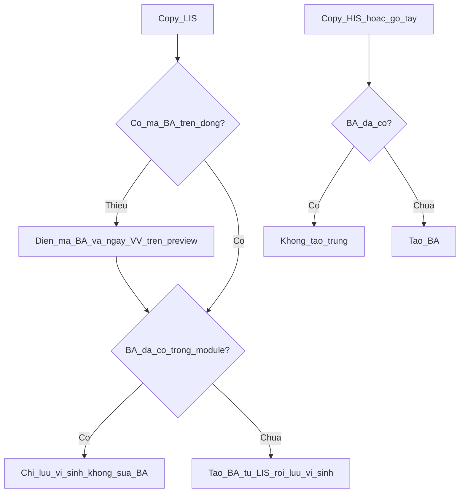

# Quy trình xác định ca HAI và luồng dữ liệu BV103

> **Ngày:** 2026-08-27 · **Loại:** quy trình vận hành + thứ tự thuật toán  
> **Neo tiêu chí / từ điển:** [`hai-surveillance-domain-ssot-20260827.md`](hai-surveillance-domain-ssot-20260827.md) (Ch.2–4, 6–7, 9–10, 17, Phụ lục E)  
> **Neo UI 3 khối:** [`ba-multi-timeline-architecture.md`](ba-multi-timeline-architecture.md)  
> **CSDL / bảng timeline:** [`hai-database-plan-20260827.md`](hai-database-plan-20260827.md)  
> **Không** thay tiêu chí CDC. File này = cách **lấy dữ liệu** và **thứ tự chẩn đoán** tại BV103.  
> **Không API HIS/LIS/PACS.** Mọi nạp = copy bảng / Excel / gõ tay.

Thuật ngữ (HAI, IWP, DOE, POA, Secondary BSI, USI, …): Phụ lục E — không dịch mã CDC.  
Yếu tố tiêu chí (sốt, CFU, XQ, …): [`hai-criteria-element-dictionary-20260827.md`](hai-criteria-element-dictionary-20260827.md).

---

## 1. Ba lớp thông tin (không gộp)

| Lớp | Là gì | Chỗ ghi | Thành “ca HAI”? |
|-----|--------|---------|-----------------|
| **A. Bệnh án** | Một đợt nằm viện + bằng chứng trên đợt đó | `nkbv_fact_benh_an` + `nkbv_fact_ba_timeline` + `nkbv_fact_ba_ngay_khoa` + `nkbv_fact_ba_ngay_dung_cu` | Không |
| **B. Kho vi sinh** | Kết quả LIS thô | `nkbv_fact_vi_sinh` | Không; không tự tạo phiếu |
| **C. Phiếu sự kiện** | Kết luận sau phân tích | `nkbv_fact_su_kien` | Chỉ khi IP **Tạo phiếu** / loại trừ |

`is_mdro` trên vi sinh = cờ cách ly — không = phiếu HAI, không = LabID (ngoài domain).

**Triệu chứng, CĐHA, ngày mổ, khoa theo ngày** nhập trên timeline **là thông tin bệnh án** (lớp A), không phải phiếu (lớp C). Phiếu chỉ chốt sau khi đủ tiêu chí.

---

## 2. Bệnh án — ba cổng vào, một khóa

Khóa nghiệp vụ: **`ma_benh_an`**. Một mã = một đợt nằm viện trong module.

### 2.1. Copy từ LIS (cổng vi sinh)

LIS thường đã có: mã BN, họ tên, ngày sinh, khoa chỉ định, **ngày lấy mẫu**, bệnh phẩm, khuẩn, CFU; nhiều dòng còn có **mã bệnh án** và gợi ý ngày vào viện.

Khi lưu copy LIS (`importViSinhExcel`):

1. Đối chiếu `ma_benh_an` với `nkbv_fact_benh_an`.  
2. **Đã có mã** → **không bổ sung / không ghi đè** bệnh án (giữ ngày vào viện, tên, khoa đã nhập). Chỉ gắn thêm dòng vi sinh vào BA đó.  
3. **Chưa có mã** → **tạo bệnh án mới** từ các trường LIS (mã BA, mã BN, họ tên, ngày vào viện — bắt buộc trên màn xem trước nếu LIS thiếu).  
4. Không tự sinh mã BA giả.

App hiện: đúng bước 2–3 với bệnh án (`if (!existingStay) insert`). Dòng vi sinh vẫn giữ ngày lấy mẫu (và ngày vào viện **trên dòng XN** nếu LIS có) — **không** ghi đè ngày vào viện trên sổ BA đã có.

XN trùng `ma_xet_nghiem` → bỏ qua, không nhân đôi kho. Thiếu mã BA / ngày vào viện trên bảng LIS → điền trên màn xem trước rồi mới lưu; **không** tự sinh mã giả.

### 2.2. Copy từ HIS hoặc gõ tay (cổng hồ sơ bệnh án)

Cùng thao tác copy/Excel/gõ như LIS, tab **Hồ sơ bệnh án** (`NkbvBenhAnImportPortal`).

Dùng khi: LIS không có đủ ADT, hoặc cần ngày ra viện / khoa lúc nhập trước khi có cấy.

Quy tắc mong muốn (khớp 2.1): **đã có `ma_benh_an` → không tạo bản thứ hai, không bổ sung đè lên hồ sơ đã có.** Chưa có → tạo mới.

*Lệch app:* `importBenhAnExcel` hiện **cập nhật** BA đã có (tên, ngày vào/ra, khoa). Khi sửa code: đổi thành bỏ qua nếu đã có mã — trừ khi PO cho phép chỉ **điền ô đang trống** (vd. ngày ra viện), không đè ngày vào viện.

### 2.3. Thứ tự nên làm



Không bắt buộc copy HIS trước LIS. Thiếu ngày vào viện thì **chưa phân tích HAI** (không có ngày 1).

---

## 3. Timeline thuộc bệnh án

Mọi mốc IP nhập trên lưới BA ghi `nkbv_fact_ba_timeline` theo `ma_benh_an`:

| Loại mốc | Dùng cho |
|----------|----------|
| SYMPTOM (sốt, đau, mủ, … catalog) | Yếu tố tiêu chí; **DOE** = ngày yếu tố đầu trong cửa sổ |
| IMAGING_CHEST / ảnh khác | PNEU, Ch.17, SSI Organ/Space; imaging mơ hồ cần clinical correlation |
| PROCEDURE_SURGERY | Neo SSI / SP 30–90 |
| Khoa theo ngày | Chọn danh sách mã khoa trên lưới → bệnh án; phiếu theo |
| Foley / máy / CVC | **Tích từng ngày trên lưới** → bệnh án; bỏ tích → xóa trên BA và phiếu. Không nhập sổ đặt–rút tay |

Khi mở **bảng phân tích**, máy **kéo triệu chứng đã có trên BA** vào cửa sổ IWP (`hydrateLamSangDraftFromBa`) — không bắt gõ lại. Gõ thêm trên **bảng chung** hoặc trên **phiên phân tích** đều ghi `nkbv_fact_ba_timeline` (cùng đợt nằm viện), để lần sau các Index khác vẫn thấy.

Triệu chứng / CĐHA / khoa / Foley–máy–CVC trên lưới = **bệnh án**. Phiếu xác định ca **lấy theo bệnh án** (không nhập lại). Bỏ tích dụng cụ hoặc đổi khoa trên lưới → sửa bệnh án và phiếu. Chi tiết: [`hai-database-plan-20260827.md`](hai-database-plan-20260827.md) mục Quy tắc thống nhất.

---

## 4. Các bước vận hành (làm việc)

| Bước | Việc | Xong khi |
|------|------|----------|
| 1 | Copy LIS (và tạo BA nếu chưa có mã) **hoặc** tạo BA từ HIS/tay rồi copy LIS | Mỗi XN có `ma_benh_an` + ngày lấy mẫu; BA có ngày vào viện |
| 2 | Bổ sung trên BA những gì LIS không có: khoa từng ngày, CVC/Foley/máy, CĐHA, ngày mổ | Đủ để đặt cửa sổ và gắn dụng cụ |
| 3 | Hàng đợi XN (+) **Chưa PT** | Việc còn lại, **không** = danh sách HAI |
| 4 | Chọn **một** Index (một chip XN, hoặc CĐHA, hoặc TC SSI) | Mở bảng phân tích đúng protocol |
| 5 | Máy gợi ý + IP đối chiếu tiêu chí trong cửa sổ | Kết luận nháp |
| 6 | **Tạo phiếu** hoặc **Bỏ qua** (có lý do) | Lớp C; XN ra khỏi hàng đợi |

Cấm: tạo phiếu lúc copy LIS; coi ngày cấy = DOE; coi “cấy ngày lịch 3” = HAI.

---

## 5. Thuật toán chẩn đoán (thứ tự bắt buộc)

Hàm thuần: `src/modules/giam-sat-nkbv/lib/` (`nkbv-shared-timeline`, `nkbv-secondary-bsi-gate`, `evaluateBsiClabsi` / `evaluateUtiCauti` / `evaluateVaeVap` / `evaluateSsi` / `evaluateCh17`). Zod không chứa cây CDC.

### 5.1. Đặt cửa sổ (trước khi gom triệu chứng)

| Protocol | Cửa sổ | Index |
|----------|--------|--------|
| LCBI, UTI, PNEU, site Ch.17 (trừ ENDO) | IWP = Index ± 3 ngày lịch | Ngày xét nghiệm/chẩn đoán **đầu** dùng làm yếu tố (thường ngày lấy mẫu). Sốt **không** đặt IWP |
| ENDO | IWP 21 ngày (Index ± 10) | Như trên |
| SSI | Surveillance Period 30 hoặc 90 ngày từ ngày mổ (ngày mổ = ngày 1). Superficial luôn 30 | Không dùng IWP ±3 |
| VAE | Baseline 2 ngày + worsening 2 ngày; Event Period 14 ngày từ DOE | DOE = ngày đầu worsening; **không** IWP ±3 |

### 5.2. DOE, POA/HAI, LOA, dụng cụ, RIT

Áp dụng **sau** khi đủ yếu tố trong cửa sổ (Ch.2; SSI/VAE không dùng POA/HAI Day-3):

1. **DOE** = ngày phần tử **đầu tiên** thỏa tiêu chí trong cửa sổ (có thể sớm hơn ngày cấy nếu triệu chứng/ảnh trên BA sớm hơn).  
2. **POA** vs **HAI** theo DOE và ngày vào viện (ngày 1), không theo ngày cấy.  
3. **LOA** = khoa đang nằm vào DOE, trừ Transfer Rule (DOE = ngày chuyển hoặc ngày sau → khoa chuyển đi) — cần khoa **theo ngày** trên BA.  
4. **Gắn dụng cụ:** dụng cụ >2 ngày lịch tại DOE và còn DOE hoặc ngày trước DOE.  
5. **RIT** 14 ngày từ DOE (không SSI/VAE). SSI: SP. VAE: Event Period.  
6. **SBAP:** IWP ∪ RIT (lâm sàng); SSI cố định `[DOE−3, DOE+13]`; ENDO: hết đợt nằm viện.

### 5.3. Máu — Secondary trước CLABSI

```
máu (+) 
  → secondary-bsi-gate (S1 matching trong SBAP site; S2 máu là yếu tố bắt buộc của site)
  → nếu SECONDARY: không CLABSI
  → nếu không: evaluateBsiClabsi (LCBI 1 / 2)
  → rồi mới gắn CLABSI nếu CVC eligible
```

Yeast máu không Secondary cho UTI. VAE: Secondary chỉ PVAP.

### 5.4. Gợi ý protocol từ Index (IP được đổi)

| Index | Mở | Không |
|-------|-----|--------|
| Máu | Cổng Secondary → LCBI → CLABSI nếu CVC | CLABSI trước Secondary |
| Nước tiểu | UTI (`evaluateUtiCauti`); CFU thiếu = không đạt; yeast không thỏa | USI |
| Dịch/mô tiết niệu **không** nước tiểu | USI Ch.17 | CAUTI |
| Đờm / ETA / BAL | Người lớn + thở máy eligible → **VAE**; không → **PNEU** | Mặc định VAP |
| Dịch/mủ / TC vết mổ / ngày mổ | SSI (`evaluateSsi`, SP) | IWP ±3 |
| Dịch/mô vị trí khác | `evaluateCh17` + mã site | Nhét sai 4 hội chứng |
| Phân không khuôn + độc tố CD | GI-CDI Ch.17 | LabID |
| CĐHA phổi | PNEU (hoặc VAE nếu đang vent eligible) | — |

`nkbv-specimen-syndrome` / `preferVae`: gợi ý, không chốt phiếu.

### 5.5. Chuỗi máy (tóm tắt)

```
copy LIS → adapter → fact_vi_sinh
         → nếu chưa có ma_benh_an trên sổ BA → insert fact_benh_an
copy/gõ HIS → fact_benh_an (không trùng mã)
gõ timeline → fact_ba_timeline (triệu chứng / CĐHA / khoa / Foley–máy–CVC = BA)
dụng cụ/khoa trên lưới → BA; phiếu đọc theo BA (bỏ tích/đổi khoa → sửa phiếu)

chọn Index
  → specimen-syndrome (gợi ý)
  → shared-timeline (cửa sổ đúng protocol)
  → máu: secondary-bsi-gate TRƯỚC evaluateBsiClabsi
  → UTI / VAE|PNEU / SSI / Ch.17
  → verdict nháp
  → Tạo phiếu → fact_su_kien + index_vi_sinh_id
```

---

## 6. Lệch phần mềm (ghi nhận — không sửa trong đợt giấy này)

| Đúng theo file này | App hiện |
|--------------------|----------|
| LIS: đã có BA → không đè hồ sơ | Đúng (`importViSinhExcel`) |
| HIS copy: đã có mã → không tạo trùng / không đè ngày vào viện | `importBenhAnExcel` **update** BA đã có |
| Triệu chứng timeline = BA | Đúng (`SYMPTOM` → `nkbv_fact_ba_timeline` + hydrate phiên) |
| Ngày cấy ≠ DOE ≠ HAI | `isHaiSuspectByDay3Rule` chỉ hàng đợi — không gắn HAI |
| Đờm + máy → VAE | Cần `preferVae`; không mặc định VAP |
| USI / EENT / SST | Domain đủ; engine chưa đủ |
| Transfer Rule đủ | Cần khoa theo ngày trên BA (chọn mã trên lưới) |

---

## 7. Ba tình huống kiểm tay (khi nghiệm thu giấy / sau này code)

1. **LIS có mã BA đã có trên module** → lưu XN mới; ngày vào viện trên BA **không đổi**.  
2. **LIS có mã BA chưa có** → tạo BA từ LIS + lưu XN; mở timeline thấy đúng ngày 1.  
3. **Gõ sốt trên timeline** → lưu trên BA; mở phiên phân tích Index khác trong IWP vẫn thấy sốt, chưa có phiếu HAI cho đến khi Tạo phiếu.

---

*Hết. Tiêu chí từng hội chứng không chép lại — xem SSOT chương tương ứng.*
