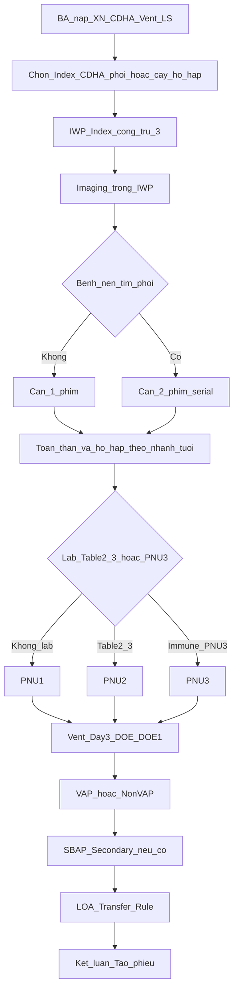

# Audit PNEU — điều kiện chuẩn vs runtime (PO nghiên cứu)

> **Ngày:** 2026-08-10 · **Loại:** audit nghiệp vụ (không ship sửa engine trong slice này)  
> **Đối tượng:** Product Owner / IP KSNK — đối chiếu case thật với bảng lệch  
> **SSOT:** [`hai-surveillance-domain-ssot-20260804.md`](../hai-surveillance-domain-ssot-20260804.md) §10 · [`trees/PNEU.md`](trees/PNEU.md) · [`PNEU-2026.md`](PNEU-2026.md)  
> **Runtime:** `nkbv-pneu-timeline-verdict.ts` → `evaluateVaeVap(..., "PNEU")` · `nkbv-pneu-lab-tier.ts` · `nkbv-secondary-bsi-gate.ts` · `nkbv-timeline-math.ts` (LOA)

---

## 0. Mục đích & giới hạn

| Làm | Không làm (slice này) |
|-----|------------------------|
| Nêu lại điều kiện chuẩn PNU1/2/3 · VAP · loại trừ · SBSI · LOA | Sửa `rules-engine` / bỏ auto-tính toàn BA |
| Chỉ ra lệch runtime (file/hàm) | Triển khai khung nhập tay (plan B) trước khi PO chọn |
| Cho PO chọn hướng A hoặc B | Audit sâu BSI/UTI/SSI (chỉ khung theo dõi §7) |

---

## 1. Luồng phân tích chuẩn (domain)



**Bước nghiệp vụ (chuẩn BA):**

1. Nạp BA + XN hô hấp / CĐHA phổi + tick Vent + LS.
2. Chọn **Index** = 1 CĐHA phổi **hoặc** 1 cấy hô hấp (đờm/ETA/BAL…).
3. **IWP** = Index ± 3 ngày lịch — chỉ lấy bằng chứng trong cửa sổ này.
4. **Imaging bắt buộc** trong IWP; bệnh nền tim phổi → ≥2 phim.
5. Triệu chứng theo nhánh tuổi → đủ lâm sàng.
6. (Tuỳ) Lab Table 2/3 → **PNU2**; miễn dịch + lab đặc thù → **PNU3**.
7. **DOE** = ngày sớm nhất của yếu tố tiêu chuẩn ∈ IWP.
8. Gắn **VAP** nếu thở máy xâm lấn liên tục ≥3 ngày lịch + hiện diện DOE hoặc rút DOE−1; không thì Non-VAP/HAP.
9. **SBAP** = `[Index−3 … DOE+13]`; máu (+) ∈ SBAP + match (và không dính ban) → Secondary BSI.
10. **LOA** = khoa tại DOE theo Transfer Rule (DOE = ngày chuyển hoặc Day+1 → khoa chuyển đi).
11. Kết luận → **Tạo phiếu** (không spawn phiếu lúc chọn Index).

**Ranh giới VAE:** Adult thở máy trong kế hoạch VAE → module VAE (§8), không dùng cây PNEU lâm sàng cho adult vent in-plan.

---

## 2. Điều kiện chẩn đoán chuẩn

### 2.1 Imaging (bắt buộc mọi PNU)

| Điều kiện | Chuẩn |
|-----------|--------|
| Phim bất thường ∈ IWP | Thâm nhiễm mới/tiến triển, đông đặc, hang; ≤1 tuổi có thể thêm pneumatocele |
| Không bệnh nền tim phổi | ≥ **1** phim |
| Có bệnh nền tim phổi | ≥ **2** phim serial (7 ngày) dai dẳng/tiến triển |
| Không imaging đạt | **Không** cấu thành PNEU (ruled-out) |

### 2.2 PNU1 — lâm sàng

**Nhánh A — người lớn:**

- Imaging đạt, **và**
- **≥1 toàn thân:** sốt >38°C **hoặc** WBC ≤4000/≥12000 **hoặc** rối loạn ý thức nếu ≥70 tuổi không giải thích khác, **và**
- **≥2 nhóm hô hấp khác nhau** (không phải ≥2 tick bất kỳ):
  1. Đờm mủ mới / đổi tính chất / tăng đờm hoặc hút
  2. Khó thở **hoặc** thở nhanh (>25 người lớn)
  3. Ho mới/nặng hơn
  4. Ran / tiếng thở phế quản
  5. Suy trao đổi khí xấu hơn

**Nhánh B — ≤1 tuổi:** Imaging + suy trao đổi khí + ≥3 nhóm lâm sàng riêng.

**Nhánh C — >1 đến ≤12 tuổi:** Imaging + ≥3 nhóm lâm sàng nhi.

### 2.3 PNU2 — lâm sàng + lab

- Imaging + ≥1 toàn thân + **≥1 nhóm hô hấp**, **và**
- ≥1 bằng chứng Table 2 (máu/MMP/BAL≥10⁴/PSB≥10³/ETA≥10⁵/semi-quant/…) **hoặc** Table 3.

### 2.4 PNU3 — suy giảm miễn dịch (Footnote 10)

- Immunocompromised + Imaging + **≥1** triệu chứng trong danh sách mở rộng (sốt, AMS≥70, ho/khó thở, ran, gas, **hoặc** ho ra máu / đau ngực màng phổi) + lab PNU3.

### 2.5 Gắn VAP (sau khi đã đạt PNU*)

1. Thở máy xâm lấn (ETT/trach — không CPAP/BiPAP mask) liên tục **>2 ngày lịch** tới DOE (Day 1 đặt → đủ từ Day 3).
2. Còn mang tại DOE **hoặc** rút đúng DOE−1.
3. Ngắt ≥1 ngày lịch không thở máy → đếm lại Day 1.

### 2.6 Loại trừ / không nâng bậc

| Quy tắc | Ý nghĩa |
|---------|---------|
| Flora thường / mixed flora | Không dùng cho PNU2/3 |
| Candida/yeast, CoNS, Enterococcus từ đờm/ETA/BAL/PSB | Cấm PNU2/3 (trừ mô phổi / MMP ≤24h) |
| Chẩn đoán “viêm phổi” của bác sĩ đơn thuần | **Không** đủ xác nhận NHSN |
| Xẹp phổi coi là imaging | Ruled-out |
| 1 phim khi có bệnh nền tim phổi | Ruled-out |
| Candida/CoNS/Enterococcus máu sau PNEU | **Không** Secondary trừ cùng loài từ mô phổi/MMP |

### 2.7 Secondary BSI từ PNEU

- Máu ∈ **SBAP** `[Index−3, DOE+13]` + organism match → Secondary (không CLABSI).
- **Scenario 2:** máu là thành phần tiêu chuẩn site (vd PNU2 dùng cấy máu) → vẫn Secondary.
- Áp dụng ban §2.6 với máu sau PNEU.

### 2.8 LOA

- Khoa/CDC Location tại thời điểm sự kiện.
- **Transfer Rule:** DOE = ngày chuyển hoặc Day+1 → quy về khoa **chuyển đi**.

---

## 3. Runtime hiện tại (ánh xạ code)

| Bước | File / hàm | Hành vi |
|------|------------|---------|
| Index | `NkbvBaMultiTimelineWorkspace` / `NkbvSyndromeIwpPanel` | CĐHA phổi hoặc XN → panel PNEU |
| IWP | `clinicalIwp` / `computeBaGridSession` | Index ±3 |
| Imaging | `imagingInIwp` trong `nkbv-pneu-timeline-verdict.ts` | Đếm CĐHA ∈ IWP; Index CDHA luôn +1 |
| Tim phổi nền | `hasCardiopulmonaryDisease` draft | ≥2 phim nếu tick |
| Toàn thân | `fever` / `fever_or_wbc` / AMS key ∈ IWP | Không tách WBC vs sốt chi tiết |
| Hô hấp | `countDistinctKeysInIwp` | **Đếm criteria key**, không đếm **nhóm CDC** |
| Gate trước lab | `evaluateVaeVap` nhánh PNEU (~296–336) | Luôn đòi systemic + local (≥2 người lớn) **trước** PNU2/3 |
| Lab | `nkbv-pneu-lab-tier` | Table 2/3 + ban flora/Candida LRT |
| PNU3 | `nkbv-rules-engine.ts` ~355–362 | Sau PNU1-gate, **bắt buộc** hemoptysis **hoặc** đau màng phổi |
| VAP | `deviceAssociationFromCanThiepDates` | ≥3d + DOE/DOE−1; clamp ngày vào viện |
| DOE | `nsk` từ grid | min yếu tố ∈ IWP (đúng hướng) |
| SBSI | `nkbv-secondary-bsi-gate` | Scenario 2 + ban Candida/CoNS/Enterococcus PNEU |
| LOA | `calculateCdcMetrics` trong `nkbv-timeline-math.ts` ~232–265 | Transfer Rule trên metrics/form; **không** gate chính trên BA progressive |
| Ruled-out L3 | — | **Thiếu** UI/engine riêng |
| Tạo phiếu | Workspace `canCreate` | Khóa theo `criteriaMet` từ verdict |

---

## 4. Bảng lệch (ưu tiên)

### A — Lệch điều kiện chẩn đoán

| ID | Lệch | Hậu quả | Neo runtime |
|----|------|---------|-------------|
| **PNEU-AUDIT-A1** | Đếm key hô hấp thay vì **nhóm CDC** (vd `dyspnea`+`tachypnea` = 2) | Dương tính giả PNU1 | `nkbv-pneu-timeline-verdict.ts` `RESPIRATORY_CRITERIA_KEYS` + `countDistinctKeysInIwp` |
| **PNEU-AUDIT-A2** | PNU2 bị siết như PNU1 (≥2 hô hấp) trước khi xét lab | Âm tính giả PNU2 | `evaluateVaeVap` PNEU: `needLocal` rồi mới `microTier === "PNU2"` |
| **PNEU-AUDIT-A3** | PNU3 bắt buộc hemoptysis **hoặc** đau màng phổi | Âm tính giả PNU3 | `nkbv-rules-engine.ts` ~355–362 |
| **PNEU-AUDIT-A4** | Checklist miễn dịch Footnote 10 trên BA mỏng | Lệch tier PNU3 | Panel BA vs `PneuClinicalSubForm` |
| **PNEU-AUDIT-A5** | Adult vent in-plan nên VAE; BA vẫn cây PNEU+VAP | Sai phân luồng module | Workspace mở PNEU từ CĐHA/đờm |

### B — Lệch quy trình trên BA

| ID | Lệch | Hậu quả |
|----|------|---------|
| **PNEU-AUDIT-B1** | Auto gộp verdict + khóa Tạo phiếu theo `criteriaMet` | IP không đi checklist “bổ sung XN/LS/phim” |
| **PNEU-AUDIT-B2** | Thiếu dẫn bước bổ sung bằng chứng | Chỉ warning text |
| **PNEU-AUDIT-B3** | LOA Transfer Rule không gắn rõ trên BA | Cột Khoa ≠ CDC Location đầy đủ (ALL-P1-1) |
| **PNEU-AUDIT-B4** | Ruled-out L3 thiếu (PNEU-P0-3) | Không loại tường minh xẹp phổi / 1 phim+nền / BS ghi VP… |
| **PNEU-AUDIT-B5** | Secondary chip SBAP dễ gắn trước khi site PNEU đạt | Rối Scenario 2 vs Primary |

### C — Đúng hướng (không phải lỗi chính)

- IWP ±3; SBAP clinical `[Index−3, DOE+13]`.
- Vent ≥3 ngày lịch + DOE/DOE−1; không đếm trước ngày vào viện.
- Lab-first Table 2/3 + loại flora/Candida LRT khi nâng bậc.
- Không spawn phiếu lúc chọn Index.

---

## 5. Checklist case thật (PO điền)

Dùng 2–3 ca; mỗi ca một khối:

```
Case #: ________
Index: [ ] CĐHA phổi ngày ____  [ ] Cấy hô hấp (loại ____) ngày ____
Tuổi: ____   Bệnh nền tim phổi: [ ] Có [ ] Không
Phim ∈ IWP: số ____ · mô tả ngắn: ________________
LS toàn thân: ________________
LS hô hấp (liệt kê theo nhóm 1–5): ________________
Lab Table 2/3 / miễn dịch: ________________
Vent: đặt ____ rút ____ · DOE ____
Kết luận IP đúng: PNU? · VAP/Non-VAP? · Secondary?
Phần mềm ra: ________________
Khớp bảng lệch ID: ________
```

---

## 6. Quyết định tiếp theo (PO chọn một)

> Engineering **không** tự chọn. Tick một ô rồi mở chat implement tương ứng.

### Phương án A — Sửa từng lệch thuật toán PNEU (ưu tiên A1→A5, rồi B)

- [x] **Chọn A** — PO duyệt 2026-08-18; A1–A5 đã ship. B1–B5 còn lại.
- Thứ tự đề xuất: A1 (nhóm hô hấp) → A2 (gate PNU2) → A3 (PNU3 triệu chứng) → A4/A5 → B4 Ruled-out → B3 LOA trên BA.
- Verify: vitest `nkbv-pneu-timeline-verdict` + `nkbv-rules-engine` + 3 case tay từ §5.

### Phương án B — BA khung nhập tay (ngắt auto khỏi luồng chính)

- [ ] **Chọn B**
- Giữ lưới nhập (XN/CĐHA/LS/Vent); kết luận tay; mở khóa Tạo phiếu không phụ thuộc `criteriaMet`.
- Không xóa `rules-engine` phiếu cũ trong slice đầu.

### Chưa chọn

- [ ] Cần thêm case §5 trước khi chọn A/B.

**Ngày PO ký:** 2026-08-18 **Người ký:** PO — chat implement A1–A5

---

## 7. Khung audit hội chứng tiếp (sau khi chốt PNEU)

Không làm sâu trong slice này — chỉ cố định mẫu để chat sau:

| Hội chứng | File audit (tạo khi mở chat) | Trọng tâm domain |
|-----------|------------------------------|------------------|
| BSI / CLABSI | `bsi-standard-vs-runtime-audit-YYYYMMDD.md` | LCBI · CVC Day3 · MBI · Secondary-before-CLABSI · loại trừ |
| UTI / CAUTI | `uti-standard-vs-runtime-audit-YYYYMMDD.md` | CFU · ≤2 tác nhân · nấm cấm · Foley · voiding |
| SSI | `ssi-standard-vs-runtime-audit-YYYYMMDD.md` | SP 30/90 · depth · PATOS · SBAP |
| SBSI chung | mục trong từng audit + `01-shared-spine` | Scenario 1/2 · ban Candida/CoNS/Enterococcus |
| LOA | mục Shared + ALL-P1-1 | Transfer Rule · CDC Location |

Mẫu mục bắt buộc mỗi audit: (1) luồng chuẩn, (2) điều kiện, (3) runtime map, (4) bảng lệch ID, (5) case PO, (6) quyết định A/B.

---

## 8. Liên kết

| Doc | Vai trò |
|-----|---------|
| [`gap-lean-vs-runtime.md`](gap-lean-vs-runtime.md) | Catalog P0/P1 — đã bổ sung ID audit A1–A3 |
| [`trees/PNEU.md`](trees/PNEU.md) | Cây quyết định form |
| [`ba-multi-timeline-architecture.md`](../ba-multi-timeline-architecture.md) | BA progressive |
| [`../hai-surveillance-domain-ssot-20260804.md`](../hai-surveillance-domain-ssot-20260804.md) §10 | Thuật toán chuẩn |
