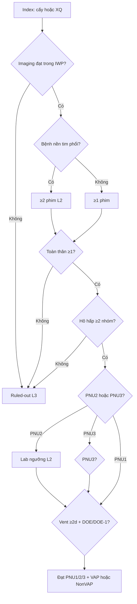

# Cây quyết định + phân lớp — PNEU / VAP / Non-VAP

> **A2** · SSOT §10 · Runtime: `PneuClinicalSubForm` + `VaeVerificationData` (nhánh PNEU)  
> **PO audit chuẩn vs runtime (2026-08-10):** [`../pneu-standard-vs-runtime-audit-20260810.md`](../pneu-standard-vs-runtime-audit-20260810.md) — lệch A1–A5 / B1–B5; chưa sửa engine trong audit.

## Decision tree

## Bảng phân lớp field

| Field / nhóm | Lớp | Type / UI hiện | Ghi chú |
|--------------|-----|----------------|---------|
| `pneu_trigger` CULTURE\|IMAGING + ngày Index | L1 | Có | Hàng 0 |
| `has_chest_imaging_abnormal` + ngày | L1 | Có | |
| `has_cardiopulmonary_disease_underlying` | L2 | Có | Mở yêu cầu số phim |
| `imaging_films_count` | L2 | Có | ≥2 nếu bệnh nền |
| `fever_or_wbc_abnormal` (+ ngày) | L1 | Có | OR nhóm toàn thân |
| `altered_mental_status_ge_70yo` | L2 | Có | Gate tuổi ≥70 |
| Hô hấp: cough / sputum / rales / gas / dyspnea / tachypnea | L1 | Có (count) | Cần ≥2 nhóm CDC |
| `microbiology_evidence` NONE\|PNU2\|PNU3 | Computed | Có | Đồng bộ từ lab-first |
| `pneu_lab_specimen` + CFU / semi-quant / organism | L2 | Có | Table 2 ngưỡng |
| Table 3 atoms (Influenza/RSV/Legionella/…) | L2 | Có | IgG×4 chi tiết = phụ lục |
| Atom miễn dịch (neutropenia/HSCT/steroid…) + Candida match | L2 | Có | Footnote 10 lean |
| CFU/semi từ `so_luong` LIS → timeline/form | L2 | Có | `parsePneuSoLuong` |
| Vent dates + active DOE/DOE−1 → VAP label | L1/Computed | Partial | Engine `*_VAP` |
| IWP / DOE / POA-HAI / LOA | Computed | Có | Spine |
| Secondary máu SBAP + match | L2 | Partial | Shared SBSI |
| Ruled-out (xẹp phổi, 1 phim+nền, Candida đờm, CoNS/Enterococcus, Gram kém, BS ghi VP thiếu tiêu chí) | L3 | **Thiếu** | |
| CDC Location mã | L3/P1 | Thiếu | W4 dừng |
| IP ký / mã biểu mẫu giấy | L3 | In phiếu | |

**PO duyệt bảng này trước khi mở rộng UI PNEU.**
