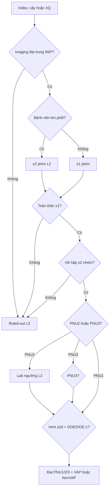

# Cây quyết định + phân lớp — PNEU / VAP / Non-VAP

> **A2** · SSOT §10 · Runtime: `PneuClinicalSubForm` + `VaeVerificationData` (nhánh PNEU)

## Decision tree

```mermaid
flowchart TD
  idx[Index: cấy hoặc XQ]
  img{Imaging đạt trong IWP?}
  films{Bệnh nền tim phổi?}
  sys{Toàn thân ≥1?}
  resp{Hô hấp ≥2 nhóm?}
  micro{PNU2 hoặc PNU3?}
  imm{PNU3?}
  vent{Vent ≥2d + DOE/DOE-1?}
  ok[Đạt PNU1/2/3 + VAP hoặc NonVAP]
  out[Ruled-out L3]
  idx --> img
  img -->|Không| out
  img -->|Có| films
  films -->|Có| need2[≥2 phim L2]
  films -->|Không| need1[≥1 phim]
  need2 --> sys
  need1 --> sys
  sys -->|Không| out
  sys -->|Có| resp
  resp -->|Không| out
  resp -->|Có| micro
  micro -->|PNU2| lab[Lab ngưỡng L2]
  micro -->|PNU3| imm
  micro -->|PNU1| vent
  lab --> vent
  imm --> vent
  vent --> ok
```

## Bảng phân lớp field

| Field / nhóm | Lớp | Type / UI hiện | Ghi chú |
|--------------|-----|----------------|---------|
| `pneu_trigger` CULTURE\|IMAGING + ngày Index | L1 | Có | Hàng 0 |
| `has_chest_imaging_abnormal` + ngày | L1 | Có | |
| `has_cardiopulmonary_disease_underlying` | L2 | Có | Mở yêu cầu số phim |
| `imaging_films_count` | L2 | Có | ≥2 nếu bệnh nền |
| `fever_or_wbc_abnormal` (+ ngày) | L1 | Có | OR nhóm toàn thân |
| `altered_mental_status_ge_70yo` | L2 | Có | Gate tuổi ≥70 |
| Hô hấp: cough / sputum / rales / gas / dyspnea / tachypnea | L1 | Có (count) | Cần ≥2 nhóm CDC |
| `microbiology_evidence` NONE\|PNU2\|PNU3 | Computed | Có | Đồng bộ từ lab-first |
| `pneu_lab_specimen` + CFU / semi-quant / organism | L2 | Có | Table 2 ngưỡng |
| Table 3 atoms (Influenza/RSV/Legionella/…) | L2 | Có | IgG×4 chi tiết = phụ lục |
| Atom miễn dịch (neutropenia/HSCT/steroid…) + Candida match | L2 | Có | Footnote 10 lean |
| CFU/semi từ `so_luong` LIS → timeline/form | L2 | Có | `parsePneuSoLuong` |
| Vent dates + active DOE/DOE−1 → VAP label | L1/Computed | Partial | Engine `*_VAP` |
| IWP / DOE / POA-HAI / LOA | Computed | Có | Spine |
| Secondary máu SBAP + match | L2 | Partial | Shared SBSI |
| Ruled-out (xẹp phổi, 1 phim+nền, Candida đờm, CoNS/Enterococcus, Gram kém, BS ghi VP thiếu tiêu chí) | L3 | **Thiếu** | |
| CDC Location mã | L3/P1 | Thiếu | W4 dừng |
| IP ký / mã biểu mẫu giấy | L3 | In phiếu | |

**PO duyệt bảng này trước khi mở rộng UI PNEU.**

---

## Phiếu PNEU-2026

> Phụ lục thiết kế · Cây: đầu file này · Methodology: [`../00-lean-cdc-methodology.md`](../00-lean-cdc-methodology.md)

## Phần A — Phiếu vận hành (app, L1 + L2 mở)

**Màn chính (≤12 tương tác ca đơn giản)**

1. **Index:** Cấy đờm trước **hoặc** ngày X-quang/CT (radio).  
2. **Cửa sổ:** IWP ±3 (Computed) — chỉ sửa nếu sai.  
3. **Hình ảnh (L1):** Thâm nhiễm/đông đặc/hang + ngày ∈ IWP.  
4. **Bệnh nền (L2):** Nếu có → số phim ≥2.  
5. **Toàn thân (L1):** Sốt/WBC (một nhóm) + ngày; AMS nếu ≥70 (L2).  
6. **Hô hấp (L1):** Checklist nhóm CDC — cần ≥2 nhóm khác nhau + ngày.  
7. **Phân cấp:** PNU1 / PNU2 / PNU3 — mở lab/miễn dịch khi PNU2/3 (L2).  
8. **Device (L1/Computed):** Vent → nhãn VAP vs Non-VAP.  
9. **Secondary (L2):** Máu trong SBAP + khớp loài.  
10. **Kết luận:** Badge engine + xác nhận kép.

Không hiện Ruled-out đầy trên màn chính (xem Phần B / L3).

## Phần B — Phụ lục điều tra đầy đủ (in / đào tạo / audit)

Nội dung tham chiếu mức mẫu giấy IP (6 phần):

- **I** Hành chính + suy giảm miễn dịch PNU3 (từng tiêu chí ANC, leukemia/HIV-CD4, cắt lách, HSCT, hóa trị, steroid >14 ngày).  
- **II** Máy thở xâm lấn, Vent Day 1, ≥2 ngày, DOE/DOE−1 → VAP/Non-VAP.  
- **III** Index, IWP, DOE, POA/HAI.  
- **IV** Imaging (1 vs ≥2 phim), signs/symptoms, lab (máu SBAP, dịch màng phổi, BAL/PBAL/PSB/ETA, PCR).  
- **V** Ruled-out: xẹp phổi; 1 phim khi có nền; Candida/CoNS/Enterococcus đờm; Gram không đạt; BS ghi VP thiếu tiêu chí NHSN.  
- **VI** Kết luận PNU1/2/3 · VAP/Non-VAP · Secondary · chữ ký IP.

Field Phần B map cùng schema Phần A; UI A6 mở L2/L3 theo progressive disclosure.
