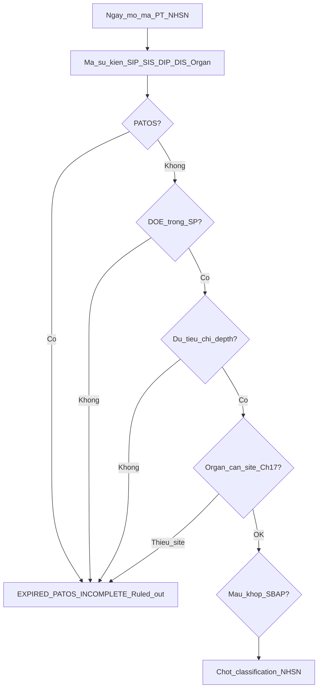

# Cây quyết định + phân lớp — SSI

> **A2** · SSOT runtime: `nkbv-ssi-nhsn-catalog.ts` + `evaluateSsi` · Form: `SsiClinicalSubForm` / panel BA  
> **Cửa sổ:** Surveillance 30/90 ngày sau mổ — **không** IWP ±3 kiểu UTI.

## Decision tree

## Luật SP (Surveillance Period)

| Trường hợp | SP (ngày) |
|------------|-----------|
| SIP / SIS / SUPERFICIAL | **30** (mọi mã PT) |
| DIS (deep secondary) | **30** (kể cả PT nhóm 90, VD CBGB) |
| DIP / ORGAN_SPACE | Theo mã PT: 30 hoặc 90 |
| Thiếu mã PT | Fallback `has_implant` (90 nếu tick) — chỉ tương thích dữ liệu cũ |

`has_implant` = thuộc tính ca / mẫu số — **không** gán từ nhóm SP90.

## Ba danh mục NHSN (SSOT)

| Catalog | Trường | Vai trò |
|---------|--------|---------|
| A. Mã PT | `loai_phau_thuat_nhsn` | SP Deep/Organ; mẫu số; SIR |
| B. Loại sự kiện | `ssi_event_type` | SIP/SIS/DIP/DIS/ORGAN_SPACE — **bắt buộc khi chốt** |
| C. Site Organ | `organ_space_site` | Bắt buộc nếu Organ/Space; PJI↔HPRO/KPRO; VCUF↔HYST/VHYS |

Nhãn phân loại chốt: `SIP` / `SIS` / `DIP` / `DIS` / `ORGAN_SPACE:{site}`.

Contract báo cáo JSON: `nkbv-ssi-reporting-contract.ts` (`extractSsiReportingSlice`).

## Bảng phân lớp field

| Field / nhóm | Lớp | Runtime | Ghi chú |
|--------------|-----|---------|---------|
| `surgery_date` / `doe_date` / `days_since_surgery` | L1 | Có | Days tự tính |
| `loai_phau_thuat_nhsn` | L1 | Có | Dropdown catalog A |
| `ssi_event_type` | L1 | Có | Bắt buộc chốt |
| `organ_space_site` | L1 | Có | Khi Organ/Space |
| `has_implant` | L2 | Có | Không quyết định SP nếu đã có mã PT |
| `is_patos` | L1 | Có | Engine PATOS |
| `return_to_or_within_24h` | L2/L3 | Có UI | Engine chưa reset SP |
| Tiêu chí Superficial / Deep / Organ-Space | L1 | Có | Theo depth từ event |
| Secondary blood + match | L2 | Có | SBAP 17d quanh DOE |
| `ma_qr_cssd_lien_quan` | L2/Delta BV103 | Có | Không phải NHSN core |
| Soft-gate mẫu số Clean/ASA/duration | L2 | Soft toast | `softWarnMauSoSurgery` |

**Core:** trong SP + không PATOS + mã sự kiện + ≥1 tiêu chí (+ site nếu Organ).
