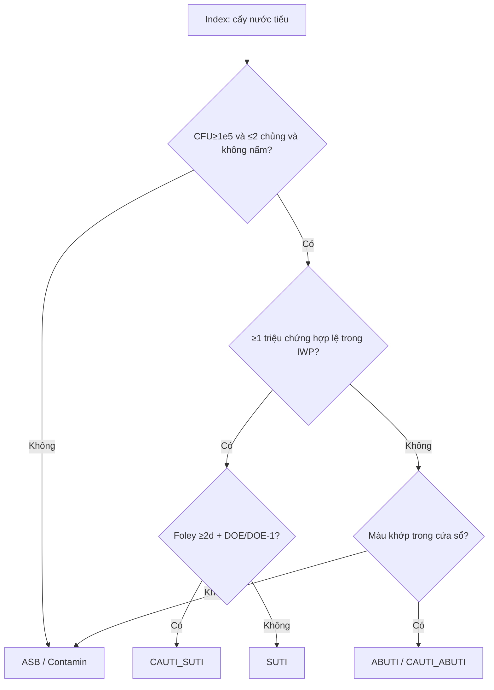

# Cây quyết định + phân lớp — UTI / CAUTI / ABUTI

> **A2** · SSOT §7 · Runtime: `UtiClinicalSubForm` + `UtiVerificationData`  
> **PO audit chuẩn vs runtime (2026-08-10):** [`../uti-standard-vs-runtime-audit-20260810.md`](../uti-standard-vs-runtime-audit-20260810.md) — lệch A1–A5 / B1–B5; chưa sửa engine trong audit.  
> Flowchart dưới ghi «Foley ≥2d» = diễn giải NHSN «>2 ngày lịch» → đủ từ **Day 3** (xem audit §2.5).

## Decision tree

## Bảng phân lớp field

| Field / nhóm | Lớp | Runtime | Ghi chú |
|--------------|-----|---------|---------|
| `urine_cfu_count` | L1 | Có | |
| `pathogen_count` | L1 | Có | >2 → loại |
| `has_fungi_yeast_parasite` | L1 | Có | Cấm |
| `has_fever` / suprapubic / CVA + ngày | L1 | Có | |
| `has_dysuria` / urgency / frequency | L2 | Có | **Ẩn khi Foley** |
| `foley_present_doe_or_prior` + dates | L1/L2 | Có | CAUTI gate |
| `is_infant_le1` + sx infant | L2 | Có | SUTI 2 |
| ABUTI blood + match | L2 | Có | |
| Yeast blood ban secondary | Computed | Engine | Shared SBSI |
| Ruled-out ASB / tạp nhiễm giải trình | L3 | Partial | |

**Cấm mâu thuẫn:** không hiện voiding khi `foley_active` / `foley_present_doe_or_prior`.
