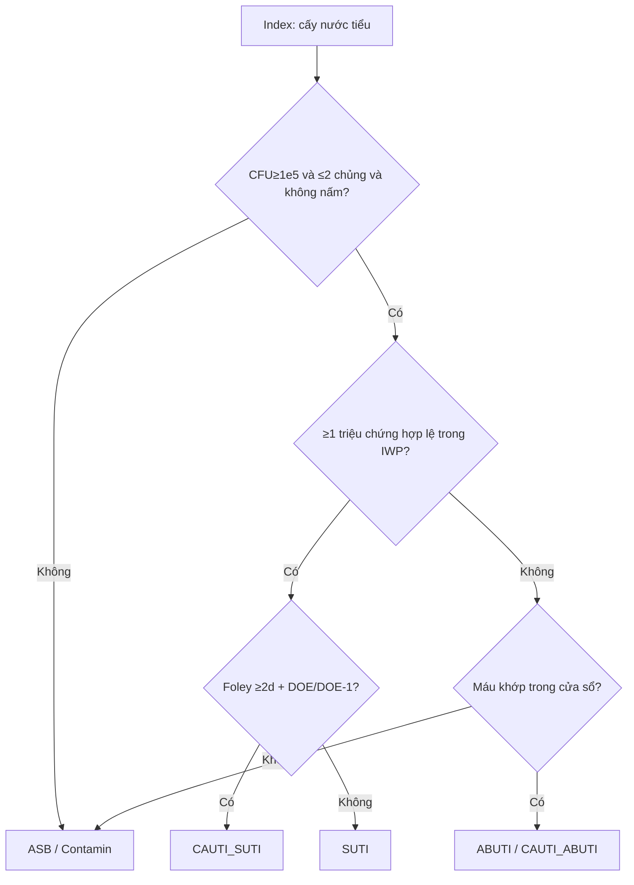

# Cây quyết định + phân lớp — UTI / CAUTI / ABUTI

> **A2** · SSOT §7 · Runtime: `UtiClinicalSubForm` + `UtiVerificationData`  
> Flowchart dưới ghi «Foley ≥2d» = diễn giải NHSN «>2 ngày lịch» → đủ từ **Day 3** (xem NHSN protocol).

## Decision tree

```mermaid
flowchart TD
  urine[Index: cấy nước tiểu]
  micro{CFU≥1e5 và ≤2 chủng và không nấm?}
  sx{≥1 triệu chứng hợp lệ trong IWP?}
  foley{Foley ≥2d + DOE/DOE-1?}
  blood{Máu khớp trong cửa sổ?}
  cauti[CAUTI_SUTI]
  suti[SUTI]
  abuti[ABUTI / CAUTI_ABUTI]
  asb[ASB / Contamin]
  urine --> micro
  micro -->|Không| asb
  micro -->|Có| sx
  sx -->|Có| foley
  sx -->|Không| blood
  foley -->|Có| cauti
  foley -->|Không| suti
  blood -->|Có| abuti
  blood -->|Không| asb
```

## Bảng phân lớp field

| Field / nhóm | Lớp | Runtime | Ghi chú |
|--------------|-----|---------|---------|
| `urine_cfu_count` | L1 | Có | |
| `pathogen_count` | L1 | Có | >2 → loại |
| `has_fungi_yeast_parasite` | L1 | Có | Cấm |
| `has_fever` / suprapubic / CVA + ngày | L1 | Có | |
| `has_dysuria` / urgency / frequency | L2 | Có | **Ẩn khi Foley** |
| `foley_present_doe_or_prior` + dates | L1/L2 | Có | CAUTI gate |
| ABUTI blood + match | L2 | Có | |
| Yeast blood ban secondary | Computed | Engine | Shared SBSI |
| Ruled-out ASB / tạp nhiễm giải trình | L3 | Partial | |

**Cấm mâu thuẫn:** không hiện voiding khi `foley_active` / `foley_present_doe_or_prior`.

---

## Phiếu UTI-2026

> Cây: đầu file này.

## Phần A — Vận hành

1. Index: cấy nước tiểu.  
2. IWP Computed.  
3. CFU ≥10⁵ · ≤2 chủng · không nấm (L1).  
4. Triệu chứng IWP: sốt / đau mu / CVA (+ ngày).  
5. Foley gate: dates + hiện diện DOE/DOE−1 → CAUTI.  
6. Không Foley (L2): tiểu buốt/gấp/rắt — **ẩn khi Foley**.  
8. ABUTI (L2): máu khớp cửa sổ.  
9. Kết luận: CAUTI_SUTI / SUTI / ABUTI / ASB.

## Phần B — Phụ lục đầy đủ

- Hành chính.  
- Gatekeeper CAUTI chi tiết §7.  
- Ruled-out: tạp nhiễm >2, nấm, ASB không máu.  
- Secondary yeast ban (giải trình).  
- Chữ ký IP.
