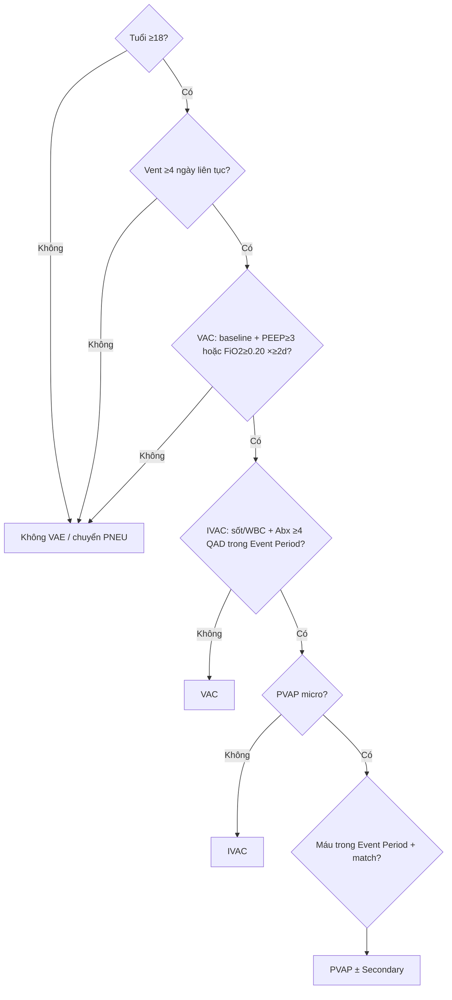

# Cây quyết định + phân lớp — VAE (VAC → IVAC → PVAP)

> **A2** · SSOT §8 · Runtime: `VaeClinicalSubForm`  
> **Cấm:** dùng X-quang ngực để chẩn đoán VAE (khác PNEU).

## Decision tree

## Bảng phân lớp field

| Field / nhóm | Lớp | Runtime | Ghi chú |
|--------------|-----|---------|---------|
| `patient_age` ≥18 | L1 | Có | |
| Vent start/stop / days | L1/Computed | Có | Prefill Registry |
| `vent_daily_params` PEEP/FiO₂ | L1 | Có | Cò súng |
| VAC flags (baseline, peep, fio2) | L1 | Có | + gợi ý compute |
| Event Period (không IWP ±3) | Computed | Có | `uses_clinical_iwp=false` |
| IVAC: fever/WBC/Abx | L2 | Có | Sau VAC |
| PVAP micro 3 tiêu chí | L2 | Có | |
| Secondary blood khi PVAP | L2 | Có | |
| `on_aprv_or_hfv` / `on_ecmo` | L3 | Stub | Chưa đủ pipeline |
| X-quang | **Drop** | — | Không thuộc VAE |
| Ruled-out (không đủ vent/VAC) | L3 | Partial | |

**Tách PNEU:** user chọn VAP/HAP → form PNEU; chọn VAE → form này.
