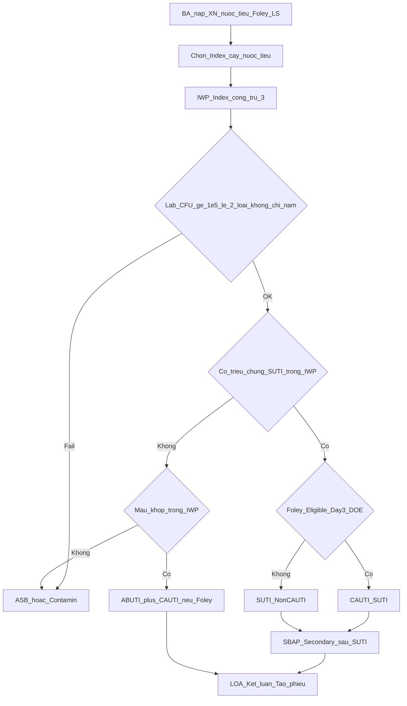

# Audit UTI — điều kiện chuẩn vs runtime (PO nghiên cứu)

> **Ngày:** 2026-08-10 · **Loại:** audit nghiệp vụ (không ship sửa engine trong slice này)  
> **Đối tượng:** Product Owner / IP KSNK — đối chiếu case thật với bảng lệch  
> **SSOT:** [`hai-surveillance-domain-ssot-20260804.md`](../hai-surveillance-domain-ssot-20260804.md) §7 · Domain CAUTI · [`trees/UTI.md`](trees/UTI.md) · [`UTI-2026.md`](UTI-2026.md)  
> **Runtime:** `nkbv-uti-timeline-verdict.ts` → `evaluateUtiCauti` · `stripUtiVoidingFromLamSang` · `nkbv-secondary-bsi-gate.ts` · `nkbv-shared-timeline.ts` (Foley)

---

## 0. Mục đích & giới hạn

| Làm | Không làm (slice này) |
|-----|------------------------|
| Nêu lại điều kiện chuẩn SUTI / ABUTI / CAUTI · lab · Foley · loại trừ · SBSI · LOA | Sửa `evaluateUtiCauti` / verdict trong chat này |
| Chỉ ra lệch runtime (file/hàm) + thứ tự sửa đề xuất | Triển khai khung nhập tay toàn BA |
| Cho PO xác nhận lệch bằng case thật rồi mở chat sửa A1→… | Audit sâu BSI/SSI (xem backlog) |

**Lưu ý ID:** không dùng chung token `UTI-P0-1` giữa các catalog cũ (nghĩa khác nhau). Lệch mới dùng **`UTI-AUDIT-A*` / `B*`**.

---

## 1. Luồng phân tích chuẩn (domain)



**Bước nghiệp vụ (chuẩn BA):**

1. Nạp BA + XN nước tiểu + tick Foley + LS.
2. Chọn **Index** = 1 cấy nước tiểu hợp lệ.
3. **IWP** = Index ± 3 ngày lịch.
4. **Lab gate** trên Index: ≤2 loài; ≥1 vi khuẩn ≥10⁵ CFU/ml; không chỉ nấm/ký sinh; xử lý yeast+bacterium theo §2.1.
5. Có ≥1 triệu chứng SUTI hợp lệ ∈ IWP?
   - **Có** → Foley Eligible? → **CAUTI_SUTI** hoặc **SUTI** (Non-CAUTI); nhánh ≤1 tuổi = SUTI 2.
   - **Không** → máu khớp ∈ **IWP**? → **ABUTI** (+ CAUTI nếu Foley Eligible); không thì ASB.
6. **DOE** = ngày sớm nhất của yếu tố tiêu chuẩn ∈ IWP (sx hoặc cấy đạt).
7. **SBAP** = `[Index−3 … DOE+13]`; sau khi UTI đạt, máu ∈ SBAP + match → Secondary BSI (Candida máu sau UTI **không** Secondary).
8. **LOA** theo Transfer Rule → kết luận → **Tạo phiếu** (không spawn lúc chọn Index).

---

## 2. Điều kiện chẩn đoán chuẩn

### 2.1 Lab (Index nước tiểu)

| Điều kiện | Chuẩn |
|-----------|--------|
| Số loài | ≤ **2** |
| Ngưỡng | ≥1 **vi khuẩn** ≥ **10⁵ CFU/ml** |
| Nấm / ký sinh | **Không** là pathogen UTI |
| Mixed flora | Invalid (thường ≥3 hiệu lực) |
| Yeast + đúng 1 bacterium ≥10⁵ | **Bỏ yeast**, xét bacterium |
| Thiếu CFU / không parse được | **Không đạt** lab (fail closed) |

### 2.2 SUTI 1 (>1 tuổi)

≥1 trong IWP:

- Sốt >38.0°C  
- Đau / ấn đau trên xương mu (không nguyên nhân khác)  
- Đau CVA / hông lưng (không nguyên nhân khác)  
- **Chỉ khi không mang Foley:** tiểu gấp, tiểu nhiều lần, khó tiểu (urgency / frequency / dysuria)

**Có Foley trên người:** cấm dùng urgency / frequency / dysuria làm tiêu chuẩn.

### 2.3 SUTI 2 (≤1 tuổi)

≥1: sốt >38 hoặc hạ thân nhiệt <36; ngưng thở; chậm tim; lì bì; nôn; ấn đau trên xương mu (không nguyên nhân khác).

### 2.4 ABUTI

- **Không** có triệu chứng SUTI 1/2 trong IWP, **và**
- Urine đạt lab, **và**
- Máu (+) khớp với vi khuẩn nước tiểu **∈ IWP** (cửa sổ định nghĩa ABUTI — khác SBAP dùng cho Secondary sau SUTI).

### 2.5 CAUTI (Eligible IUC)

1. Chỉ Foley lưu (không condom / thông thẳng / nephrostomy đơn thuần…).  
2. Mang liên tục **>2 ngày lịch** tới DOE (Day 1 = đặt; đặt trước viện → Day 1 = ngày vào viện) → đủ từ **Day 3**.  
3. Hiện diện tại **DOE** hoặc rút đúng **DOE−1**.  
4. Gap ≥1 ngày lịch không Foley → đếm lại Day 1.  
5. Gắn nhãn CAUTI khi Eligible **và** (SUTI hoặc ABUTI).

### 2.6 Secondary BSI từ UTI

- UTI là **site tiên phát** (không Secondary từ site khác).  
- Máu ∈ **SBAP** `[Index−3, DOE+13]` + organism match → Secondary (không CLABSI).  
- **Candida / yeast máu** trong SBAP sau UTI → **không** Secondary → đánh giá Primary BSI/CLABSI.

### 2.7 LOA

- Khoa / CDC Location tại sự kiện.  
- Transfer Rule: DOE = ngày chuyển hoặc Day+1 → quy về khoa **chuyển đi**.

### 2.8 Loại trừ / ruled-out (hay gặp)

| Quy tắc | Kết quả |
|---------|---------|
| Lab fail (CFU / >2 / chỉ nấm / mixed) | Không UTI — Contamin / ASB ops |
| Urine đạt + không sx + không máu khớp IWP | ASB |
| Voiding khi đang Foley | Không dùng làm tiêu chuẩn |
| Cùng major UTI trong RIT | Không báo ca mới |

---

## 3. Runtime hiện tại (ánh xạ code)

| Bước | File / hàm | Hành vi |
|------|------------|---------|
| Index | Workspace → `specimenToSyndromePanel` | Nước tiểu → panel UTI |
| IWP | `clinicalIwp` / IwpPanel | Index ±3 |
| Lab CFU | `gateUtiIndexLab` / `parseUrineCfu` | `cfu == null` → **cfuOk true**; seed `urine_cfu_count: … ?? 100000` |
| ≤2 loài | `evaluateUtiCauti` | `pathogen_count > 2` → CONTAMINATION — BA thường chỉ 1 chuỗi `vi_khuan` |
| Nấm nước tiểu | regex yeast | Mọi yeast → `CANDIDA_EXCLUSION` (không tách yeast+1 bacterium) |
| Triệu chứng | keys ∈ IWP sau strip voiding | Fever / CVA / suprapubic / infant keys |
| Voiding + Foley | `stripUtiVoidingFromLamSang` + engine | Strip theo **ngày** có Foley; engine còn chặn nếu `foley_active_on_event` |
| Foley / CAUTI | `deviceAssociationFromCanThiepDates` | ≥3d + DOE/DOE−1; lưới SSOT (không phình sổ) |
| ABUTI máu | IwpPanel tick máu | UI lọc máu ∈ **SBAP** (không siết IWP) |
| Secondary | ABUTI trong engine + grid SBAP scan | SUTI+máu: engine ít set `is_secondary_bsi`; dựa scan/chip |
| LOA | `calculateCdcMetrics` | BA gọi với `treatmentHistory: []` → không Transfer Rule đầy |
| Tạo phiếu | Workspace | Khóa theo `criteriaMet` từ verdict |

---

## 4. Bảng lệch (ưu tiên)

### A — Lệch điều kiện chẩn đoán

| ID | Lệch | Hậu quả | Neo runtime |
|----|------|---------|-------------|
| **UTI-AUDIT-A1** | CFU thiếu/`null` coi đạt; seed mặc định 100000 | Dương tính giả SUTI/CAUTI/ABUTI | `nkbv-uti-timeline-verdict.ts` (~63–64, ~170) |
| **UTI-AUDIT-A2** | ABUTI: máu tick theo **SBAP**; chuẩn máu ∈ **IWP** | Sai cửa sổ định nghĩa ABUTI | `NkbvSyndromeIwpPanel` (blood ABUTI); SSOT §7.4 |
| **UTI-AUDIT-A3** | Mọi yeast → loại cứng; chuẩn bỏ yeast nếu còn 1 bacterium ≥10⁵ | Âm tính giả | verdict + `evaluateUtiCauti` |
| **UTI-AUDIT-A4** | `pathogen_count` BA gần như 0/1 — gate >2 chết | Không bắt tạp nhiễm / mixed flora | seed từ một `vi_khuan` |
| **UTI-AUDIT-A5** | Secondary rõ trên nhánh ABUTI; SUTI+máu SBAP dựa grid scan | Hai nguồn sự thật | `evaluateUtiCauti` return sớm khi có sx |

### B — Lệch quy trình / BA

| ID | Lệch |
|----|------|
| **UTI-AUDIT-B1** | Voiding: strip theo ngày Foley vs engine `foley_active_on_event` có thể lệch trong cùng IWP |
| **UTI-AUDIT-B2** | Thiếu `calculated_sbap_*` trên `UtiVerificationData` → guard yeast Secondary dễ bỏ qua |
| **UTI-AUDIT-B3** | LOA Transfer Rule tắt trên BA — chung [PNEU-AUDIT-B3](pneu-standard-vs-runtime-audit-20260810.md) / ALL-P1-1 |
| **UTI-AUDIT-B4** | `age_gate` / `fever_or_wbc` trên UTI chưa chặt |
| **UTI-AUDIT-B5** | Ruled-out ASB L3 còn mỏng (copy / UI) |

### C — Đúng hướng (không ưu tiên sửa)

- IWP ±3; SBAP clinical `[Index−3, DOE+13]`.
- Foley Day ≥3 + Gap Rule + không đếm trước ngày vào viện / không phình từ sổ đăng ký.
- UI ẩn voiding khi ngày có Foley.
- Không spawn phiếu lúc chọn Index.

**Thứ tự sửa đề xuất (chat implement sau khi PO xác nhận):**  
**A1 → A2 → A3 → A5 → A4 → B1/B2 → B3/B4/B5.**

---

## 5. Checklist case thật (PO điền)

```
Case #: ________
Index nước tiểu: ngày ____ · vi khuẩn ____ · CFU (số liệu gốc) ____
Tuổi: ____   Foley: đặt ____ rút ____ (tick lưới)
LS ∈ IWP (liệt kê; ghi rõ có voiding không): ________________
Máu: ngày ____ · VK ____ · tick ABUTI? [ ]  Secondary chip? [ ]
Kết luận IP đúng: SUTI / CAUTI_SUTI / ABUTI / ASB · Secondary?
Phần mềm ra: ________________
Khớp lệch ID: ________
Ghi chú (CFU thiếu / yeast+E.coli / chỉ khó tiểu+Foley): ________
```

**Bộ case tối thiểu đề xuất:**

1. CAUTI + sốt + Foley ≥3 ngày liên tục + DOE/DOE−1.  
2. Foley đang mang + **chỉ** khó tiểu / tiểu gấp → **không** cấu thành SUTI bằng voiding.  
3. ASB + máu khớp ∈ **IWP** → ABUTI (+ CAUTI nếu Foley Eligible).  
4. (Edge) CFU thiếu/không parse — máy không được tự “đạt”.  
5. (Edge) Yeast + E. coli ≥10⁵ — chuẩn xét E. coli, không loại cả mẫu vì chuỗi yeast.

---

## 6. Quyết định tiếp theo (PO)

> Engineering **không** tự chọn. Tick một hướng rồi mở chat implement.

- [ ] **Sửa thuật toán theo A1→A5** (ưu tiên), rồi B1–B5  
- [ ] **Tạm trì hoãn sửa UTI** — ưu tiên PNEU A/B hoặc hội chứng khác  
- [ ] Cần thêm case §5 trước khi quyết định  

**Verify khi sửa (gợi ý):**  
`nkbv-uti-timeline-verdict.spec.ts` · khối UTI `nkbv-rules-engine` · `nkbv-shared-secondary-bsi` · 3–5 case tay §5.

**Ngày PO ký:** ________ **Người ký:** ________

---

## 7. Liên kết

| Doc | Vai trò |
|-----|---------|
| [`gap-lean-vs-runtime.md`](gap-lean-vs-runtime.md) | Catalog — UTI-AUDIT-A1… |
| [`syndrome-audit-backlog.md`](syndrome-audit-backlog.md) | Trạng thái audit hội chứng |
| [`trees/UTI.md`](trees/UTI.md) | Cây quyết định form |
| [`pneu-standard-vs-runtime-audit-20260810.md`](pneu-standard-vs-runtime-audit-20260810.md) | Mẫu audit + LOA chung B3 |
| SSOT §7 | Thuật toán chuẩn |
