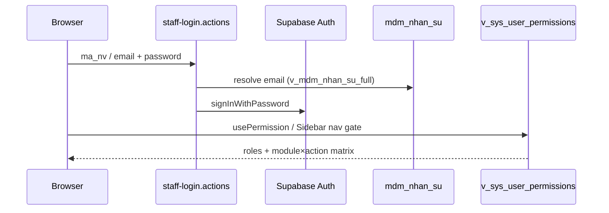
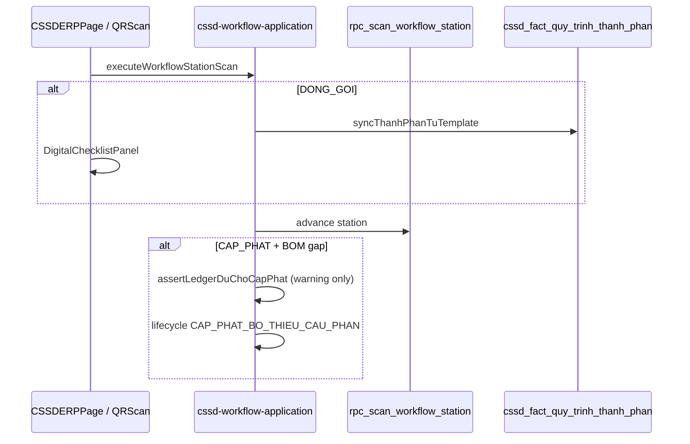

# MA TRẬN TƯƠNG TÁC MODULE — BV103

> **Phiên bản:** 1.0 (30/05/2026)  
> **Trạng thái:** SSOT phụ thuộc giữa bounded contexts  
> **Đồng bộ với:** [system-overview.md](./system-overview.md)

---

## 1. Bảng phụ thuộc module × module

| Nguồn | Đích | Loại | Ghi chú |
|-------|------|------|---------|
| `giam-sat-vst` | `dashboard` | RPC read | `rpc_dashboard_vst_strategic_analytics` |
| `giam-sat-chung` | `dashboard` | RPC read | `rpc_get_compliance_dashboard_v4`, GSC strategic |
| `giam-sat-chung` | `quan-tri-he-thong/bang-kiem` | FK read | `gstt_dm_bang_kiem` |
| `giam-sat-nkbv` | `mdm` | FK read | `mdm_dm_khoa_phong`, lookup NKBV |
| `cssd-erp` | `mdm` (facade) | Server Action | `requestReplenishFromReserveAction` — CSSD_WORKFLOW.edit |
| `cssd-erp` | `cssd-su-co` | Domain event | Sự cố → rollback domino |
| `quan-ly-cong-viec` | `sys` (cron) | DB function | Spawn định kỳ 00:01 VNT |
| `auth` | `sys` RBAC | View read | `v_sys_user_permissions` |
| `quan-tri-he-thong` | `sys` | CRUD | `sys_roles`, `sys_lookup_value`, `mdm_nhan_su` |
| Mọi module | `sys_audit_log` | Trigger | `fn_sys_audit_row` |

---

## 2. Luồng đăng nhập & phân quyền

---

## 3. Luồng CSSD quét trạm (rút gọn)

---

## 4. Ranh giòng cấm (architecture boundaries)

| Cấm | Lý do |
|-----|-------|
| CSSD UI import CRUD MDM trực tiếp | `imports:cssd-mdm` guard |
| App ALTER TABLE trên VIEW | Migration rule 51 |
| Client ghi `fact_*` không qua Server Action | RBAC + audit |
| Pre-aggregation table mới không đo latency | AGENTS.md governance |

---

## 5. View đọc theo module (post Phase 1)

| Module | View SSOT (không dùng alias cũ) |
|--------|----------------------------------|
| VST | `v_gstt_giam_sat_vst_*` |
| GSC | `v_gstt_giam_sat_chung_sessions_full` |
| NKBV | `v_nkbv_su_kien_full` |
| CSSD | `v_cssd_quy_trinh_full`, `v_cssd_*` catalog |
| QLCV | `v_qlcv_cong_viec_full` |
| RBAC | `v_sys_user_permissions`, `v_sys_role_permissions_matrix` |
| MDM | `v_mdm_khoa_phong_full`, `v_mdm_nhan_su_full` |
