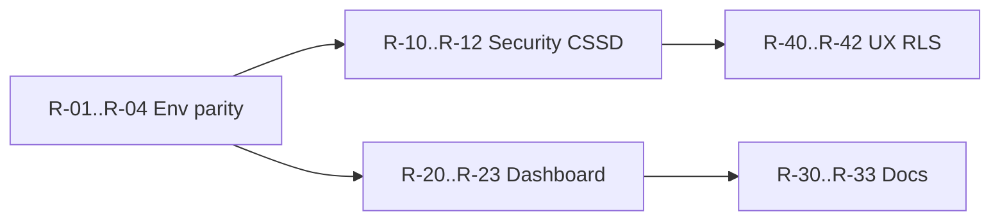

# Kế hoạch cải tạo đồng bộ — sau audit 2026-06-03

> **Nguồn:** [comprehensive-review-20260603.md](../reports/comprehensive-review-20260603.md)  
> **Nguyên tắc:** Một thay đổi schema = một migration + changelog `implementation-mapping` + `verify:engineering`. Không DROP summary/MV không số đo.

## Trạng thái implement (2026-06-03)

| ID | Trạng thái | Ghi chú |
|----|------------|---------|
| R-01 | Done | Local + repo: **30** migrations (`20260603160000` head) |
| R-02 | Done | Staging linked `db push` — `02193500`–`03160000` applied |
| R-03 | Done | `rbac-v-auth-compat-probe.sql` trong SQL_ACTIVE |
| R-04 | Done | `operations-sop.md` § environment matrix |
| R-10 | Done | Auth server: chỉ [`src/proxy.ts`](../../../src/proxy.ts) (Next.js 16 — không `middleware.ts`) |
| R-11 | Done | Ledger hard gate + `cssd-asset-ledger.spec.ts` |
| R-12 | Done | Digital BOM confirm → `persistBomCheckpoint` |
| R-20 | Done | [dashboard-rpc-benchmark-20260603.md](../reports/dashboard-rpc-benchmark-20260603.md); refresh linked khi volume tăng |
| R-21 | Done | [adr-dashboard-kpi-path-20260603.md](./adr-dashboard-kpi-path-20260603.md) (Accepted) |
| R-22 | N/A | Không còn file `strategic-dashboard-v3` |
| R-23 | Done | [bao-cao-tong-hop.md](../../modules/dashboard/bao-cao-tong-hop.md) |
| R-30–33 | Done | mapping changelog, interaction-matrix, view-catalog, module docs |
| R-40 | Done | `layout:drift-check` OK |
| R-41 | Done | Migration `20260603160000` |
| R-42 | Done | [pilot-clinical-checklist-20260603.md](../../modules/nkbv/pilot-clinical-checklist-20260603.md) |
| R-50–53 | **Done (2026-06-04)** | D-07 DROP summary; D-13 legacy RPC; D-QLCV-01 TEXT+CHECK |
| UX-01–07 | **Done (2026-06-04)** | typography codemod 0 hits; gate exit 1 |

---

## Phase 6 — DB cleanup & QLCV (2026-06-04, Done)

| ID | Hạng mục | Migration / artifact | Verify |
|----|----------|----------------------|--------|
| R-50 | QLCV TEXT+CHECK | `20260604120000_qlcv_text_check_codes.sql` | `verify:engineering` |
| R-51 | DROP gstt summary | `20260604100000_drop_gstt_summary_preaggregation.sql` | benchmark + pilot:dashboard:explain |
| R-53 | DROP legacy dashboard RPC | `20260604110000_drop_legacy_dashboard_rpcs.sql` | `rpc-contract-dashboard.spec.ts` |
| UX-04b | Typography codemod | `codemod-typography-min-label.mjs` | `layout:typography-check` |
| R-42 | NKBV UAT checklist | `pilot-clinical-checklist-20260603.md` | spec + manual sign-off |

---

## Phase UX — Design system (2026-06-03, Done)

| ID | Hạng mục | Exit |
|----|----------|------|
| UX-01 | `bv103-design-tokens.ts` + `layout-primitives.md` | Doc + tokens |
| UX-02 | Page headers — RBAC, báo cáo, command center | `KsnkPageHeader` / `Bv103AnalyticsPageFrame` |
| UX-03 | Bỏ `max-w-[1400px]` trong dashboard views | grep 0 |
| UX-04 | `layout:typography-check` | npm script in verify:full |
| UX-05 | Filter — `AnalyticsFilterBar` trên analytics pages | Done |
| UX-06 | MDM table — `AdvancedDataTable` + header chuẩn | GenericDmMasterHeader |
| UX-07 | `cssd-ui-chrome` extends `bv103LayoutChrome` | Done |

---

## Phase 0 — Vận hành & sự thật DB (1 tuần, P0)

| ID | Hạng mục | Owner | Effort | Dependency | Exit criteria | Verify |
|----|----------|-------|--------|------------|---------------|--------|
| R-01 | **Đồng bộ migration local** — `mdm:migrate:local` + document trong onboarding | DBA + Dev | S | — | Local `schema_migrations` = 29 (hoặc = staging) | `psql` count versions |
| R-02 | **Apply staging** `20260603120000`, `20260603140000` + runbook | DBA | M | R-01 | Staging latest ≥ `20260603140000` | `supabase db query --linked` max version |
| R-03 | **Probe RBAC** sau repair — `rbac-v-auth-compat-probe.sql` vào SQL_ACTIVE hoặc archive | DBA | S | R-02 | Probe pass; `repo:hygiene` clean | `npm run repo:hygiene` |
| R-04 | Ghi **environment matrix** vào `operations-sop.md` (local/staging/prod migration parity) | Dev | S | R-01 | Doc 1 bảng | `docs:links:check` |

*Maps finding F-01.*

---

## Phase 1 — An ninh & invariant nghiệp vụ (2–4 tuần, P0–P1)

| ID | Hạng mục | Owner | Effort | Tham chiếu debt cũ | Exit criteria | Verify |
|----|----------|-------|--------|-------------------|---------------|--------|
| R-10 | **Next.js middleware** auth — chặn route protected server-side | Dev | M | D-09 Open | `middleware.ts` redirect unauthenticated; login public | E2E / manual |
| R-11 | **Ledger hard gate** — CAP_PHAT: chưa `KIEM_DEM_BOM` → block (config pilot flag nếu cần) | Dev + KSNK | M | D-02 Revised | Quét trạm 6 fail khi chưa checklist | `verify:cssd` + pilot scenario |
| R-12 | **Digital BOM** — persist `so_luong_thuc_te` tại đóng gói + RPC checkpoint | Dev | M | D-01 Partial | Trạm 3 cập nhật thành phần trước in nhãn | CSSD pilot checklist |

*Maps F-02, F-07.*

---

## Phase 2 — Dashboard & analytics (2–3 tuần, P1)

| ID | Hạng mục | Owner | Effort | Tham chiếu | Exit criteria | Verify |
|----|----------|-------|--------|------------|---------------|--------|
| R-20 | **Benchmark** RPC v4 vs `gstt_fact_*_summary` — `pilot-dashboard-rpc-explain-hybrid.sql` trên staging có data | DBA | M | D-07 | Bảng latency p95 ghi trong report | EXPLAIN ANALYZE output |
| R-21 | Quyết định **single path** KPI (RPC-only hoặc summary-only) — document | KSNK + Dev | S | R-20 | ADR 1 trang | — |
| R-22 | Đồng bộ tên types: `strategic-dashboard-v4.types.ts` only; drop v3 references nếu còn | Dev | S | D-06 | Grep không còn v3 filename mismatch | lint |
| R-23 | **`bao-cao-tong-hop`** — module README + mapping 1 dòng changelog | Dev | S | F-09 | `docs/modules/giam-sat` hoặc dashboard pointer | `docs:links:check` |

*Maps F-03, D-06, D-07.*

---

## Phase 3 — Doc & liên thông (1–2 tuần, P1–P2)

| ID | Hạng mục | Owner | Effort | Exit criteria | Verify |
|----|----------|-------|--------|---------------|--------|
| R-30 | **implementation-mapping** — xóa/đánh dấu DEPRECATED mọi dòng `v_fact_*` / compat `.from` | Dev | M | Không còn compat read path trong doc | peer review |
| R-31 | **interaction-matrix** — thêm GSC lock, NKBV trace, bao-cao-tong-hop | Dev | S | Matrix khớp traceability 20260603 | — |
| R-32 | **database-view-catalog** — 7 sql-only views + RPC callers | DBA | S | Catalog complete | `audit-view-usage.mjs` |
| R-33 | Module README pointers → wiki; tránh duplicate spec | Dev | M | `docs/modules/*` ≤ pointer + pilot checklist | `docs:links:check` |

*Maps F-05.*

---

## Phase 4 — UI & RLS (song song, P2)

| ID | Hạng mục | Owner | Effort | Tham chiếu | Exit criteria | Verify |
|----|----------|-------|--------|------------|---------------|--------|
| R-40 | **Layout drift** — 22 file → `bv103LayoutChrome` / `rounded-2xl` | Dev | M | F-06 | `layout:drift-check` 0 | npm script |
| R-41 | **RLS CSSD** module-scoped policies | DBA | L | D-11 | Non-CSSD role blocked on `cssd_fact_*` via client test | `admin-rbac-probe` |
| R-42 | NKBV clinical forms — coverage checklist CDC pilot | KSNK + Dev | L | D-14 | 4 syndrome paths signed off | UAT |

---

## Phase 5 — Dài hạn (P3, không block pilot)

| ID | Hạng mục | Tham chiếu debt |
|----|----------|----------------|
| R-50 | QLCV TEXT+CHECK thay FK lookup | D-QLCV-01 |
| R-51 | FHIR / LIS thay Excel vi sinh | D-20 |
| R-52 | Spaulding / heat domain engine | D-16 |
| R-53 | DROP RPC legacy trong baseline (sau grep app) | D-13 |

---

## Thứ tự thực thi đề xuất

## Mapping finding → remediation

| Finding | Remediation IDs |
|---------|-----------------|
| F-01 | R-01, R-02, R-04 |
| F-02 | R-10 |
| F-03 | R-20, R-21 |
| F-04 | R-33 (split docs; không refactor big-bang) |
| F-05 | R-30, R-31, R-32 |
| F-06 | R-40 |
| F-07 | R-11, R-12 |
| F-08 | R-32 |
| F-09 | R-23 (document only) |

---

## Pilot DoD cho chu kỳ implement tiếp theo

1. Staging và local cùng migration head — **33 migrations** (`20260604120000`).  
2. `npm run verify` pass trên branch remediation — chạy trước merge.  
3. 3 kịch bản tay: login → VST save; GSC lock ngày; CSSD scan + BOM — **UAT** (R-42 checklist).  
4. Báo cáo tổng hợp in/export đúng CCS công thức (`bao-cao-tong-hop-core`).

**Phase 5 (R-50–53):** **Done 2026-06-04** — migrations `20260604100000`–`04120000`.
