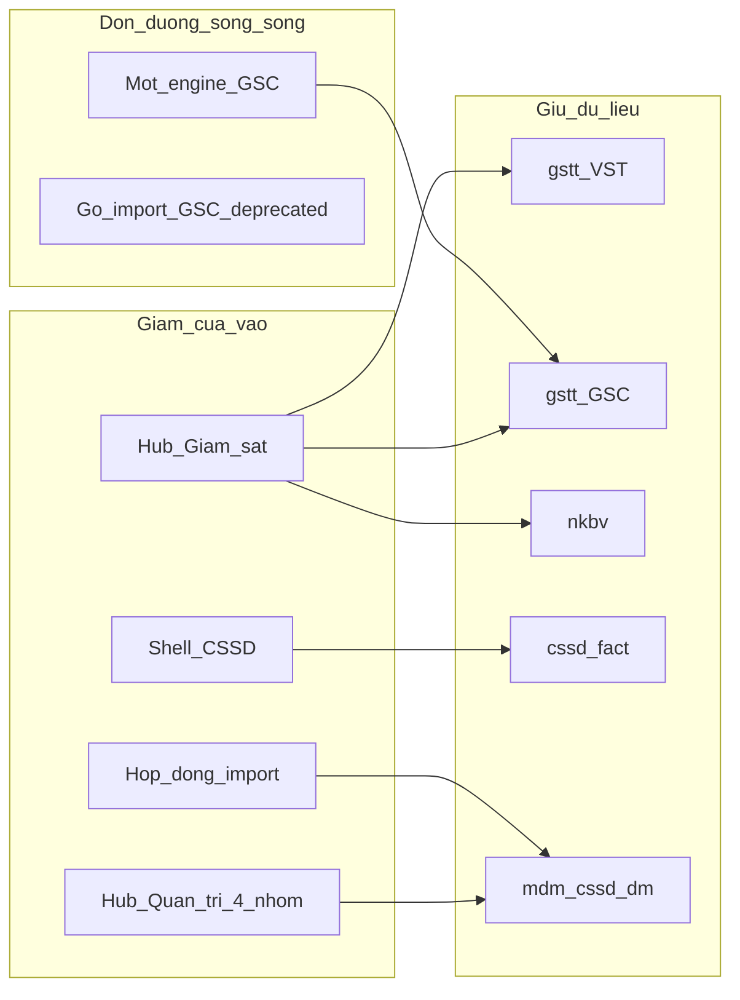

# Chương trình giản hóa kiến trúc vận hành — KSNK BV103

> **Ngày:** 2026-07-26  
> **Môi trường mục tiêu đợt này:** Local only  
> **Phạm vi PO:** A–E + UX + dọn code (không big-bang gộp bảng dữ liệu)  
> **Liên quan:** [MDM hub roadmap](../../modules/mdm/improvement-roadmap-20260717.md) · [debt-register](./debt-register.md) · [domain-specification](../../core/domain-specification.md)

---

## 1. Chẩn đoán (đã khóa)

| Mặt | Kết luận |
|-----|----------|
| Domain dữ liệu (VST / GSC / NKBV / CSSD / MDM) | **Đúng** — giữ nguyên ranh giới bảng |
| Cửa vào UI + lớp code | **Nặng hơn mức cần** so với nhập liệu + tính tỷ lệ |
| Chiến lược | Giảm **khái niệm / cửa vào / đường song song**; không rewrite hệ thống |

**Nguyên tắc thiết kế**

1. Một cổng nhận thức / một việc người dùng — nhiều bảng vẫn tách ở dưới.  
2. Một đường tính / một đường nạp dữ liệu chính; legacy chỉ còn khi DB chưa sẵn sàng gỡ.  
3. Mỗi pha: diff nhỏ, deep-link cũ vẫn sống, verify local, hoàn tác được.  
4. **1 chat = 1 pha** sau khi chương trình này được duyệt.

---

## 2. Bản đồ mục tiêu A–E

| Mã | Mục tiêu nghiệp vụ | Không làm |
|----|-------------------|-----------|
| **A** | Sidebar → Giám sát → chọn loại → nhập / xem tỷ lệ | Gộp bảng VST+GSC+NKBV |
| **B** | Một engine tính điểm GSC (`computeScore`) | Đổi công thức KPI đã chốt khi DB chưa đủ `cach_tinh_diem` |
| **C** | Hub Quản trị 4 nhóm ngôn ngữ viện | Tách repo module 146 file (F-04) |
| **D** | Một hợp đồng UX nạp file (xem trước → xác nhận → lỗi dòng) | Ép LIS vi sinh vào smart-import |
| **E** | CSSD: một vỏ vận hành rõ; sự cố / master RO gắn ngữ cảnh | Gỡ safety gate / RPC mẻ |

---

## 3. Thứ tự pha (bắt buộc)

Thứ tự tối ưu **rủi ro × giá trị nhận thức** (không theo thứ tự chữ cái):

| Pha | Nội dung | Migration? | Verify tối thiểu |
|-----|----------|------------|------------------|
| **P0** | Khóa chương trình này + checklist hoàn tác | Không | — |
| **P1** | **A** — Cổng sidebar Giám sát + tinh chỉnh hub | Không | `verify:quick` |
| **P2** | **E** — Nhóm CSSD trên sidebar / shell ModeNav (deep-link giữ) | Không | `verify:quick` + `verify:cssd` |
| **P3** | **C** — Nhãn/nhóm 4 lớp trên hub Quản trị (bám MDM Lớp 3) | Không | `verify:admin` hoặc `verify:quick` |
| **P4** | **D** — Hợp đồng UX import chung + gỡ/archive import GSC deprecated | Không* | `verify:engineering` |
| **P5** | **B** — Probe DB local `cach_tinh_diem` → bỏ fallback legacy | Không nếu DB sạch; có nếu phải backfill | `verify:engineering` + spec scoring |

\*P4 không đổi schema; soft-delete vẫn opt-in rõ ràng trên UI.

**Cấm trong mọi pha:** đổi RPC KPI đã chốt, gộp fact table, hard-block cấp phát CSSD, đụng Auth provider.

---

## 4. Chi tiết từng pha

### P1 — A: Giám sát hub (LOCAL)

**Hiện trạng:** `/giam-sat` hub đã có; sidebar chỉ còn một mục «Giám sát» (QR vào từ hub; không liệt kê VST/GSC/NKBV trên sidebar).

**Làm**

1. Sidebar nhóm Giám sát: mục «Giám sát» → `/giam-sat`.  
2. Giữ deep-link VST/GSC/NKBV + `/qr` (bookmark vẫn sống; QR không trùng trên sidebar).  
3. Hub: lối «Nhập liệu» / «Xem kết quả» (QR, lịch sử, thống kê).  
4. Gate: hiện hub nếu thấy ít nhất một trong VST/GSC/NKBV.

**Acceptance tay**

1. User có quyền VST+GSC → sidebar vào hub → 2 thẻ nhập hiện → vào form OK.  
2. User chỉ NKBV → hub chỉ hiện NKBV.  
3. Bookmark `/giam-sat-vst` vẫn mở form cũ.

**Files dự kiến:** `sidebar-nav-groups.ts`, có thể `ksnk-nav-gates.ts`, `GiamSatHubPage.tsx`, cập nhật note `docs/wiki/concepts.md` (layout).

---

### P2 — E: Vỏ CSSD nhận thức

**Hiện trạng:** `/cssd-quy-trinh` đã là shell tab; sidebar 5 mục rời; sự cố đứng riêng.

**Làm**

1. Giữ 5 route canonical ([`cssd-routes.ts`](../../../src/lib/cssd-routes.ts)).  
2. Thêm ModeNav / «Bạn đang ở» trên shell CSSD: Quy trình · Sự cố · Tra cứu master (dụng cụ/TB/HC — RO).  
3. Sidebar: có thể gom nhãn rõ «Vận hành» vs «Tra cứu danh mục» (không xóa URL).  
4. Không gộp `cssd-su-co` module vào `cssd-erp` (chỉ UX).

**Acceptance:** từ quy trình ≤2 click tới sự cố; từ sidebar master RO vẫn mở; QR workflow không đổi hành vi.

---

### P3 — C: Hub Quản trị 4 nhóm ngôn ngữ

Bám [improvement-roadmap Lớp 3](../../modules/mdm/improvement-roadmap-20260717.md) — **chỉ nhãn/nhóm**, không tách module.

| Nhóm UI | Nội dung |
|---------|----------|
| Tổ chức & nhân sự | Khoa, NV, lookup chức vụ… |
| Bảng kiểm | Template GSC |
| Master CSSD | Loại–bộ–BOM, TB, HC |
| Hệ thống & quyền | RBAC, tài khoản, governance |

**Acceptance:** tìm «loại dụng cụ» / «chức danh» trên hub ≤2 click từ sidebar «Quản trị hệ thống».

---

### P4 — D: Hợp đồng import

**Làm**

1. Component/dialog dùng chung: chọn file → bảng xem trước (N dòng) → 2 chế độ rõ («Chỉ thêm/cập nhật» vs «Đồng bộ đầy đủ = có thể ẩn bản ghi thiếu») → kết quả lỗi theo dòng.  
2. Smart-import + bảng kiểm dùng cùng shell UX; LIS vi sinh giữ action riêng, chỉ mượn shell nếu khớp.  
3. Gỡ hoặc archive `giam-sat-chung-import` deprecated (không UI).  
4. Cập nhật [`json-import-export.md`](../guides/json-import-export.md).

**Acceptance:** nạp khoa + nạp bảng kiểm cùng pattern xác nhận; hủy ở bước xem trước = không ghi DB.

---

### P5 — B: Một engine scoring GSC

**Điều kiện mở pha:** trên local, mọi `gstt_dm_bang_kiem` active có `cach_tinh_diem` ∈ {TY_LE, TRON_GOI, DAT_KHONG_DAT, NHAT_KY}.

**Làm**

1. Probe SQL local (CLI) — ghi kết quả vào chat/pha.  
2. Nếu thiếu: backfill migration **local** trước (không đoán schema).  
3. `resolveScoringSummary` chỉ `computeScore`; bỏ `calculateScore` fallback sau khi caller = 0.  
4. Preview UI cùng engine; giữ tính lại server-side.

**Acceptance:** 4 kiểu bảng kiểm lưu phiên → điểm khớp preview; spec `giam-sat-scoring` + write helpers pass.

---

## 5. Rủi ro chương trình

1. **Thu gọn sidebar quá sớm** — user quen deep-link than phiền → giữ deep-link + hub song song ít nhất 1 pha.  
2. **Gỡ scoring legacy khi DB thiếu `cach_tinh_diem`** — điểm sai → probe bắt buộc trước P5.  
3. **Import «đồng bộ đầy đủ»** — soft-delete nhầm → UX bắt xác nhận 2 bước + copy cảnh báo rõ.  
4. **Trộn với working tree đang dở** — mỗi pha commit riêng trên local; không amend việc khác.

---

## 6. Cách vận hành với PO

| Bước | Việc |
|------|------|
| Duyệt chương trình | Trả lời **「OK triển khai」** (hoặc OK từng pha) |
| Mỗi pha | Chat `/intake-nv` ngắn + `/implement` riêng nếu cần |
| Xong pha | Báo files + verify + residual risk |
| Không | Big-bang refactor 500+ file trong một PR |

---

## 7. Trạng thái

| Pha | Trạng thái |
|-----|------------|
| P0 Tài liệu chương trình | **Done** |
| P1 A Giám sát hub | **Done** — sidebar + hub bước 1/2 |
| P2 E CSSD shell | **Done** — ModeNav + nhóm sidebar Vận hành/Tra cứu |
| P3 C Quản trị nhóm | **Done** — nhãn 4 nhóm ngôn ngữ viện |
| P4 D Import UX | **Done** — `import-confirm-contract` + stub GSC import |
| P5 B Scoring unify | **Done** — probe 0 missing; write/preview chỉ `computeScore` |
| P5a Persist semantics | **Done → chỉnh song song** — `tong_diem`=% luôn; `dat_tron_goi` cờ phụ TRON_GOI |
| P5b Preview = save | **Done → chỉnh song song** — UI `%` chính + badge bundle |
| Dead code GSC | **Done** — gỡ weight scorer + `gsc-import-results` |
| CSSD action map | **Done** — [`cssd-action-map-20260727.md`](./cssd-action-map-20260727.md) + alias import |
| Smart-import gateway | **Done** — `smartImportMasterTable` (lát khoa phòng) |
