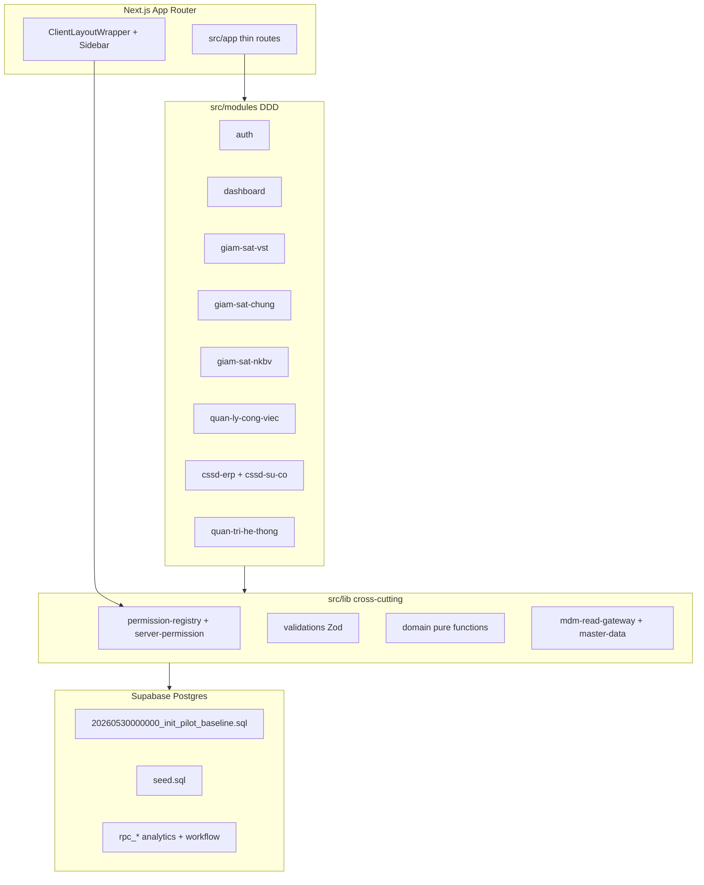

# HỆ THỐNG KIỂM SOÁT NHIỄM KHUẨN (KSNK) — BỆNH VIỆN 103
## TÀI LIỆU TỔNG QUAN KIẾN TRÚC & VẬN HÀNH HỆ THỐNG (SSOT)

> **Phiên bản:** 1.1 (Cập nhật chuẩn hóa theo CSDL thực tế - 30/05/2026)  
> **Trạng thái:** Hoạt động (SSOT Kiến trúc hệ thống)  
> **Tài liệu tham chiếu chính:** [docs/core/implementation-mapping.md](file:///Users/trinhhuunghia/Desktop/ksnk_bv103/docs/core/implementation-mapping.md)

---

## 1. TỔNG QUAN HỆ THỐNG (SYSTEM OVERVIEW)

Hệ thống KSNK BV103 là một giải pháp hoạch định nguồn lực tiệt khuẩn và giám sát lâm sàng (ERP & Surveillance) chuyên sâu, được thiết kế riêng cho Khoa Kiểm soát Nhiễm khuẩn - Bệnh viện 103. 

Hệ thống thực hiện ba nhóm nhiệm vụ chiến lược:
1.  **Giám sát Lâm sàng (Clinical Surveillance):** Vệ sinh tay (VST), Giám sát bảng kiểm động (GSC), Nhiễm khuẩn bệnh viện (NKBV / HAI).
2.  **Hậu cần Tiệt khuẩn Tập trung (CSSD Logistics):** Quản lý chu trình tiệt khuẩn khép kín, kho dụng cụ đã tiệt khuẩn, mẻ hấp sấy, hóa chất diệt khuẩn và sự cố thiết bị.
3.  **Vận hành Nội bộ & Quản trị (Administration & QLCV):** Quản trị danh mục dùng chung (MDM), phân quyền chi tiết (RBAC), nhật ký kiểm toán (Audit Trail) và quản lý giao việc (QLCV).

### Sơ đồ luồng tương tác hệ thống tổng quát

*   **Next.js 16 (App Router) & React 19:** Sử dụng cơ chế Server Actions làm cổng ghi nhận dữ liệu chính, đảm bảo giao tiếp bảo mật tuyệt đối.
*   **Supabase / PostgreSQL 15:** Lưu trữ quan hệ đồng nhất, thắt chặt an ninh bằng cơ chế bảo mật cấp dòng (Row Level Security - RLS).

---

## 2. BẢN ĐỒ MIỀN NGHIỆP VỤ (BOUNDED CONTEXTS)

Hệ thống phân rã thành 8 miền nghiệp vụ (Domain) tách biệt, được thiết kế theo mô hình cô lập dữ liệu và chức năng:

### 2.1 Hệ thống & Quản trị (`auth`, `quan-tri-he-thong`)
*   **Auth nhân sự:** Đăng nhập, quản lý phiên và hồ sơ nhân sự y tế.
*   **RBAC (Role-Based Access Control):** Phân quyền chi tiết dạng ma trận Module × Action (VIEW, CREATE, EDIT, DELETE, IMPORT, EXPORT, APPROVE, QC, LOCK).
*   **MDM Hub (Master Data Management):** Nguồn chân lý duy nhất (SSOT) đồng bộ danh mục nhân sự, khoa phòng, thiết bị, hóa chất và dụng cụ toàn viện.
*   **Bảng kiểm MDM:** Quản lý và khai báo 36 mẫu bảng kiểm (checklist) canonical theo tiêu chuẩn kiểm soát nhiễm khuẩn quốc gia.
*   **Audit Trail:** Ghi nhận và lưu vết 100% các hoạt động thay đổi dữ liệu vào tệp nhật ký `sys_audit_log` (Được truy vấn qua view an toàn `v_sys_audit_log_full`, hỗ trợ phân trang và index tối ưu).

### 2.2 Giám sát Vệ sinh tay (VST - WHO 5 Moments)
*   **Khái niệm:** Giám sát tỷ lệ tuân thủ 5 thời điểm rửa tay của WHO.
*   **Thực thể:** Phiên giám sát (`gstt_fact_vst_sessions`) chứa nhiều lượt quan sát đối tượng (`gstt_fact_vst`).
*   **Luồng:** Người giám sát mang máy tính bảng → Nhập form multi-person thời gian thực → Tính toán tỷ lệ tuân thủ tự động → Đồng bộ trực tiếp lên Command Center.

### 2.3 Giám sát chung - GSC (Checklist động)
*   **Khái niệm:** Giám sát tuân thủ các quy trình kiểm soát nhiễm khuẩn thông qua bảng kiểm động.
*   **Thực thể:** Phiên giám sát GSC (`gstt_fact_chung_sessions`) chứa kết quả tích chọn inline lưu trữ dưới dạng `results_jsonb` giúp loại bỏ hoàn toàn mô hình EAV cồng kềnh trước đây.
*   **Các phân hệ phụ thuộc:** 
    *   `/giam-sat-chung/tuan-thu` (Tuân thủ IPAC).
    *   `/giam-sat-chung/nhat-ky` (Nhật ký vận hành thiết bị).
    *   `/giam-sat-chung/he-thong` (Đánh giá chất lượng hệ thống).

### 2.4 Giám sát Nhiễm khuẩn bệnh viện (NKBV / HAI Surveillance)
*   **Khái niệm:** Phát hiện ca bệnh nhiễm khuẩn phát sinh khi nằm viện theo chuẩn CDC/NHSN.
*   **Đồng bộ dữ liệu:** Nhận kết quả cấy vi sinh dương tính từ khoa Vi sinh → Sàng lọc qua Rules Engine dựa trên quy tắc **"Ngày lịch thứ 3 (Calendar Day 3 Rule)"** $\to$ Kích hoạt phiếu nghi ngờ.
*   **Quy trình Phê duyệt:** Khoa lâm sàng điền Form Xác minh lâm sàng (VAP, BSI, UTI, SSI) $\to$ Khoa KSNK thẩm định và Phê duyệt (`XAC_NHAN`) hoặc bác bỏ (`LOAI_TRU`).

### 2.5 Hậu cần tiệt khuẩn tập trung (CSSD ERP)
Vận hành chuỗi cung ứng tái xử lý dụng cụ y tế qua quy trình trạm vật lý khép kín:
`TIEP_NHAN -> LAM_SACH -> QC -> DONG_GOI -> TIET_KHUAN (thông qua xếp mẻ/batch, không quét lẻ trên trang workflow) -> CAP_PHAT`
*   **Tiếp nhận (TIEP_NHAN):** Nhận bàn giao bộ dụng cụ nhiễm khuẩn từ phòng mổ hoặc các khoa lâm sàng.
*   **Làm sạch (LAM_SACH):** Thực hiện rửa cơ học, ngâm khử khuẩn hóa chất, làm khô.
*   **Kiểm tra chất lượng (QC):** Thẩm định trực quan và chỉ thị để đảm bảo dụng cụ sạch hoàn toàn trước khi chuyển đóng gói.
*   **Đóng gói (DONG_GOI):** Xếp dụng cụ theo danh mục (BOM), dán nhãn QR để định danh duy nhất.
*   **Tiệt khuẩn (TIET_KHUAN):** Xếp dụng cụ vào các mẻ lò hấp sấy (`fact_lo_tiet_khuan`). Bắt buộc lưu kết quả test chỉ thị lý - hóa - sinh. Mẻ hấp lỗi QC sẽ tự động khóa và kích hoạt quy trình rollback thu hồi.
*   **Cấp phát (CAP_PHAT):** Lưu kho sạch và bàn giao dụng cụ sạch về phòng mổ/các khoa lâm sàng thông qua quét mã vạch nhận diện.

### 2.6 Quản lý sự cố CSSD (Incident Rollback)
*   **Khái niệm:** Xử lý các sự cố phát sinh tại các trạm CSSD như rách bao gói, dụng cụ ẩm sau hấp, hoặc lỗi mẻ hấp QC Fail.
*   **Cơ chế:** Khi ghi nhận sự cố, hệ thống tự động khóa trạng thái các bộ dụng cụ liên quan (`cssd_fact_su_co`) và kích hoạt rollback trạng thái buộc quay lại Trạm 1 để đảm bảo an toàn cao nhất. Có hỗ trợ quy trình Trả lui có kiểm soát (`TRA_LUI_VOLUNTARY_ONE_STEP`) ghi nhận kèm lý do y khoa đầy đủ.

### 2.7 Quản lý công việc (QLCV - Track B)
*   **Khái niệm:** Phân công và theo dõi việc vận hành nội bộ khoa KSNK qua 7 trạng thái (`MOI`, `DANG_LAM`, `CHO_DUYET`, `HOAN_THANH`, `TU_CHOI`, `QUA_HAN`, `DA_HUY`).
*   **Spawn định kỳ:** Lập lịch tự động thông qua `pg_cron` (Chạy ngầm lúc 00:01 và 00:05 VNT hằng ngày) sinh việc từ mẫu việc định kỳ (`qlcv_fact_cong_viec_dinh_ky`).

### 2.8 Dashboard Chỉ huy (Command Center)
*   **Khái niệm:** Bảng chỉ huy hợp nhất cung cấp góc nhìn tổng quan cho Trưởng khoa KSNK và Ban Giám đốc Bệnh viện.
*   **Cơ chế:** Đã parallelized dữ liệu VST và GSC bằng `Promise.all` (`useCommandCenterBriefData`), giúp tối ưu hóa hiệu năng tải và loại bỏ hoàn toàn hiện tượng nghẽn cổ chai (waterfall).

---

## 3. CƠ CẤU THƯ MỤC & PHÂN TÁCH LỚP ỨNG DỤNG

Mã nguồn được cấu trúc khoa học theo mô hình DDD Bounded Context dưới thư mục `src/modules/`:

| Tên Module | Vị trí thư mục | Nhiệm vụ chính |
| :--- | :--- | :--- |
| **`auth`** | `src/modules/auth` | Quản lý phiên đăng nhập và định danh tài khoản NVYT. |
| **`cssd-erp`** | `src/modules/cssd-erp` | Toàn bộ logic 6 trạm hấp sấy, kho dụng cụ và mẻ hấp. |
| **`cssd-su-co`** | `src/modules/cssd-su-co` | Quản lý và xử lý sự cố thiết bị / dụng cụ tái xử lý. |
| **`giam-sat-chung`** | `src/modules/giam-sat-chung` | Vận hành bảng kiểm động và tính điểm tuân thủ GSC. |
| **`giam-sat-nkbv`** | `src/modules/giam-sat-nkbv` | Quy trình thẩm định ca bệnh nhiễm khuẩn theo chuẩn CDC. |
| **`giam-sat-vst`** | `src/modules/giam-sat-vst` | Biểu mẫu nhập và thống kê giám sát vệ sinh tay WHO. |
| **`quan-ly-cong-viec`** | `src/modules/quan-ly-cong-viec` | Kanban và động cơ sinh việc định kỳ. |
| **`quan-tri-he-thong`** | `src/modules/quan-tri-he-thong` | Phân quyền RBAC, quản trị danh mục dùng chung (MDM). |
| **`dashboard`** | `src/modules/dashboard` | Gom và cấu trúc dữ liệu Dashboard chỉ huy toàn viện. |

---

## 4. TỔ CHỨC CƠ SỞ DỮ LIỆU (SUPABASE SCHEMA)

Dữ liệu được tổ chức thống nhất theo 4 nhóm tiền tố chính:

### 4.1 Tiền tố Bảng vật lý (Physical Tables)
*   **`sys_` & `rbac_`:** Lịch sử hệ thống, khóa cấu hình, tài khoản phân quyền.
*   **`dm_`:** Các bảng danh mục lõi bệnh viện dùng chung (Master Data).
*   **`gstt_`:** Các bảng giao dịch giám sát lâm sàng (VST, GSC).
*   **`cssd_`:** Bảng ghi nhận quá trình vận hành, kho tàng tiệt khuẩn.
*   **`qlcv_`:** Ghi nhận công việc nội bộ và đánh giá nhân sự.
*   **`nkbv_`:** Ghi nhận ca nhiễm khuẩn bệnh viện lâm sàng.

### 4.2 Lớp View Tương thích (Compatibility Views)
Để tránh ảnh hưởng đến các mã nguồn giao diện hiện có, hệ thống duy trì các view tương thích:
*   `dm_khoa_phong` trỏ tới `mdm_dm_khoa_phong`.
*   `dm_roles` trỏ tới `sys_roles`.
*   `fact_giam_sat_vst_sessions` trỏ tới `gstt_fact_vst_sessions`.
*   `fact_cong_viec` trỏ tới `qlcv_fact_cong_viec`.

---

## 5. LUỒNG VẬN HÀNH VÀ TƯƠNG TÁC (INTERACTION & RUNTIME FLIGHT)

### 5.1 Vòng đời Request tiêu chuẩn
1.  **Client Request:** Người dùng mở trình duyệt truy cập app.
2.  **Auth Gate:** `ClientLayoutWrapper` gọi Supabase API xác thực phiên đăng nhập hiện hữu.
3.  **UI Nav Gate:** Component `Sidebar` gọi hook `usePermission` kiểm tra ma trận quyền truy cập của tài khoản NVYT đó để hiển thị các menu chức năng tương thích.
4.  **Data Processing:** Người dùng thực hiện thao tác (Ví dụ: Báo cáo mẻ hấp QC Pass). Một Server Action tương ứng được gọi dưới module.
5.  **RBAC Gate:** Server Action gọi hàm `verifyPermission` kiểm tra quyền của tài khoản người dùng thực tế từ JWT token trên server. Nếu không có quyền, chặn đứng yêu cầu ngay lập tức để bảo vệ DB.
6.  **Database Commit:** Server Action ghi dữ liệu vào các bảng giao dịch `fact_` của Supabase Postgres.
7.  **Audit Trigger:** Trigger `fn_sys_audit_row` tự động bắt sự thay đổi dữ liệu trên Postgres, ghi một bản ghi lịch sử dạng JSONB vào bảng `sys_audit_log` để làm chứng cứ pháp lý.
8.  **Revalidation:** Server Action phát tín hiệu revalidate cache để cập nhật giao diện Dashboard lập tức.

---

## 6. ẢNH HƯỞNG MIGRATION SQUASH (30/05/2026)

| Trước | Sau (SSOT) |
|-------|------------|
| 90 file migration `20260520*`–`20260529*` | 1 baseline `20260530000000_init_pilot_baseline.sql` |
| Archive | `docs/archive/pilot_chain_20260520_20260529.tar.gz` |
| Seed monolith | `seed.sql` (lookup + 36 bảng kiểm) + `seeds/00-rbac.sql` + `seeds/01-pilot-nhan-su.sql` |
| Remote linked | **Không** `db push` mù — xem [migration-squash-runbook.md](../guides/migration-squash-runbook.md) |

**Entities đã DROP khỏi schema (app không còn workflow):**
- `gstt_fact_rca_ticket`, `gstt_dm_failure_reason`
- Cột Phần 3–4 trên GSC/VST fact (`phieu_phan_tich_jsonb`, VST RCA fields) — migration `20260529160000`

**View alias Step 2 (Phase 1):** App đọc `v_gstt_*`, `v_cssd_*`, `v_qlcv_*`, `v_sys_*`; migration `20260530100000_drop_view_compat_aliases.sql` DROP 24 alias cũ.

---

## 7. MA TRẬN TƯƠNG TÁC (tóm tắt)

Chi tiết: [interaction-matrix.md](./interaction-matrix.md).

| Module nguồn | Module đích | Cơ chế |
|--------------|-------------|--------|
| VST / GSC | Dashboard | RPC strategic analytics + Command Center brief |
| GSC | MDM | `gstt_dm_bang_kiem` template (36 mẫu seed) |
| CSSD workflow | MDM | Facade `requestReplenishFromReserveAction` (CSSD_WORKFLOW → kho lẻ) |
| NKBV | LIS (future) | Rules engine Day 3; chưa FHIR |
| QLCV | pg_cron | `fn_fact_cong_viec_spawn_dinh_ky_hom_nay` |
| Mọi mutation | Audit | Trigger `fn_sys_audit_row` → `sys_audit_log` |

---

## 8. TÀI LIỆU LIÊN QUAN

- [debt-register.md](./debt-register.md) — nợ kỹ thuật D-01..D-20
- [roadmap-2026h2.md](./roadmap-2026h2.md) — Phase 0–5 + Pilot DoD
- [implementation-mapping.md](../../core/implementation-mapping.md) — SSOT bảng/RPC
- [migration-squash-runbook.md](../guides/migration-squash-runbook.md) — repair remote sau squash
