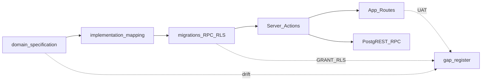

# Rà soát tổng thể hệ thống KSNK BV103 — 2026-07-09

> **Phạm vi:** Chương trình rà soát toàn diện (1B báo cáo trước / 2A Domain→DB→BE→UI→Features)  
> **Repo head:** `1c8e057` · working tree có thay đổi cleanup dead-code (không thuộc audit này)  
> **Phương pháp:** Ground-truth — code + migrations + gate tĩnh. **Không** copy kết luận audit 06/2026.  
> **Evidence:** [audit-evidence-pack-20260709.md](./audit-evidence-pack-20260709.md)  
> **Gap:** [gap-register-20260709.md](./gap-register-20260709.md)

---

## 1. Executive summary

Hệ thống **KSNK BV103** (Next.js 16 / React 19 / Supabase Postgres) sau cải tổ pilot 06–07/2026 đạt **gate engineering/CSSD/pilot PASS**, legacy table guard sạch, **0 unused view**. Debt-register trước đó ghi P0/P1 = 0 — **audit này mở lại một số P0/P1 có bằng chứng mới** (NKBV Day-3 server, QLCV checklist RPC GRANT, CSSD BOM auto-stamp, GSC RPC chưa harden như VST).

**Top findings (có bằng chứng):**

| ID | Mức | Finding |
|----|-----|---------|
| DOM-07 / FEAT-NKBV-01 | **P0** | Import vi sinh: UI tính Day-3 (`isHaiSuspect`) nhưng server tạo `nkbv_fact_su_kien` cho **mọi** dòng — ca POA lọt giám sát HAI |
| BE-RPC-01 | **P0** | `fn_qlcv_update_checklist` SECURITY DEFINER + `GRANT authenticated`, không check quyền trong RPC |
| DOM-04 | **P1** | CSSD Trạm Đóng gói: quét QR tự ghi `bom_kiem_dem_at` không qua checkpoint cấu phần |
| DOM-08 / FEAT-NKBV-02 | **P1** | NKBV UAT lâm sàng 4/5 kịch bản tay chưa ký; trạng thái auto-case `DANG_GHI_NHAN` ≠ checklist `CHO_XAC_MINH` |
| BE-RPC-02 | **P1** | GSC analytics RPC chưa parity harden VST (`fn_require_gstt_analytics_access`) |
| OPS-01 | **P1** | Docker/local golden **Blocked** trong session audit — không xác nhận parity DB live |
| UI-01 | **P2** | `layout:drift-check` 2 adoption (QrCameraModal, IncidentReportModal) |
| BE-ORPHAN-01 | **P3** | 5 file Pilot W3 latent (dead-code WARN) |

**Rubric tổng hợp (1–5):**

| Dimension | Điểm | Ghi chú |
|-----------|------|---------|
| Domain accuracy | **3.5** | VST/GSC/Dashboard tốt; NKBV Day-3 + CSSD BOM yếu |
| Structural clarity | **4** | Module DDD rõ; orphan W3 + dual analytics path nhỏ |
| DB discipline | **3.5** | Prefix SSOT; RLS fact GSTT/CSSD workflow Done; summary/NKBV/GSC RPC residual |
| UI coherence | **4** | Typography OK; 2 panel chrome adoption |
| Operability | **2.5** | Engineering PASS; local Docker blocked session này |
| Security depth | **3** | `proxy.ts` session OK; RPC GRANT authenticated còn lỗ |

---

## 2. Phương pháp & phạm vi

### Thứ bậc nguồn sự thật

1. `src/`, `supabase/migrations/`, `scripts/` trên HEAD  
2. Gate npm (engineering, cssd, pilot, audit:views/rpc, layout)  
3. SSOT docs — chỉ phát hiện **drift**  
4. Live Postgres — **Blocked** (Docker)

### Out of scope (theo plan)

- Không sửa code ứng dụng trong đợt rà soát  
- Không nâng ưu tiên roadmap D-15…D-20 trừ finding mới  
- Không đo perf staging (token/env)

---

## 3. Domain nghiệp vụ

| Context | Điểm | Verdict ngắn |
|---------|------|--------------|
| VST/GSC | 4 | Schema + RPC + routes reform khớp; spec §2.1 còn nhắc trigger summary cũ (DOM-01) |
| CSSD | 3 | 6 trạm OK; BOM auto-stamp (DOM-04); ledger soft-warning khớp spec nhưng lệch changelog hard-gate (DOM-05) |
| QLCV | 4 | Spawn + checklist RPC hoạt động; CHECK còn mã legacy (DOM-10) |
| NKBV | 3 | Rules engine + forms OK; **Day-3 server gap P0**; UAT chưa ký |
| Dashboard | 4 | V4 DROP; strategic RPC; 1 action đọc summary VIEW trực tiếp (DOM-02) |
| MDM/RBAC | 4 | Registry + master-crud OK; auth session qua `proxy.ts` (không cần middleware.ts — Next 16) |

Chi tiết gap: `DOM-*` trong [gap-register-20260709.md](./gap-register-20260709.md).

---

## 4. Database

- **92** migrations · head `20260704120000`  
- Views: 0 unused · 16 sql-only (KEEP; 2 CANDIDATE_REVIEW)  
- RLS: GSTT 3 fact phiên hardened (`20260703100000`); CSSD workflow (`20260603160000`); residual summary views / CSSD kho-bảo trì / NKBV `USING(true)`  
- G-11 trong gap-register-0703 ghi backlog nhưng migration đã apply → **doc drift** (DB-01)  
- Dual naming `fact_*_summary` ↔ `gstt_fact_*_summary` (compat alias) — DB-05  

Chi tiết: `DB-*`.

---

## 5. Backend

- Auth L1: [`src/proxy.ts`](../../../src/proxy.ts) — session JWT trước RSC (đúng Next 16; **không** thiếu middleware)  
- Auth residual: guest path / inactive staff chủ yếu client; prefetch skip `getUser`  
- Mutation actions: không thấy insert/update không guard (đa pattern `verifyPermission` / `verifyCssd*` / `ensureQlcv*`)  
- **P0:** `fn_qlcv_update_checklist` GRANT authenticated không permission check  
- **P1:** GSC + CSSD SECURITY DEFINER RPC còn GRANT rộng so với VST  

Chi tiết: `BE-*`.

---

## 6. UI / UX

| Gate | Kết quả |
|------|---------|
| Typography | PASS |
| Layout drift | FAIL 2 adoption-warn (modal QR + sự cố CSSD) |
| Touch | Form giám sát chính có `h-11` / `touch-manipulation` — chấp nhận pilot |
| Perf | Kế thừa [perf-audit-20260703.md](./perf-audit-20260703.md) — exceljs lazy Done; không regression mới đo được |

Chi tiết: `UI-*`.

---

## 7. Tính năng 7 khối pilot

| Khối | Gate session này | Checklist tay PO |
|------|------------------|------------------|
| MDM / Quản trị | engineering + danh-mục (không re-run full admin) | ☐ |
| GSC + VST | test:pilot + engineering PASS; smoke local **Blocked** | ☐ |
| QLCV | engineering PASS; RPC checklist **P0 risk** | ☐ |
| CSSD | verify:cssd **49 PASS** | ☐ |
| Dashboard | test:pilot **24 PASS** | ☐ |
| NKBV | rules engine (prior); import Day-3 **P0** | ☐ UAT 2–5 |
| Auth/RBAC | proxy + trial auth **Blocked** Docker | ☐ |

Nguồn checklist: [pilot-module-automated-gates-20260703.md](./pilot-module-automated-gates-20260703.md) + NKBV clinical checklist.

---

## 8. Liên thông domain → cấu phần

Điểm gãy chính: **spec/checklist NKBV ↔ import action**; **changelog CSSD hard-gate ↔ code soft**; **VST RPC harden ↔ GSC chưa**; **gap-register G-11 ↔ migration đã Done**.

---

## 9. Verdict

| Câu hỏi | Trả lời |
|---------|---------|
| Rườm rà? | Trung bình — orphan W3 + compat summary alias còn, không chặn pilot |
| Chồng chéo? | Thấp — dual path analytics TGS + QLCV dashboard latent |
| Khoa học / SSOT? | Tốt về prefix + gate; **yếu** ở enforce Day-3 server và RPC GRANT |
| Sẵn go-live? | **Chưa** nếu bật NKBV import LIS production; core GSC/VST/QLCV/CSSD engineering sẵn hơn — cần mở Docker + đóng P0 |

---

## 10. Remediation (tóm tắt)

Xem hàng đợi đầy đủ trong [gap-register-20260709.md](./gap-register-20260709.md) § Hàng đợi implement.

**Ưu tiên chat tiếp theo (1 gap / chat):**

1. `DOM-07` — Day-3 server-side import NKBV  
2. `BE-RPC-01` — revoke/harden `fn_qlcv_update_checklist`  
3. `DOM-04` — bỏ auto `bom_kiem_dem_at` khi quét  
4. `BE-RPC-02` — harden GSC analytics RPC như VST  
5. `OPS-01` — PO mở Docker → re-run golden + cập nhật evidence  

**Không implement trong chat rà soát này** (theo quyết định 1B).
