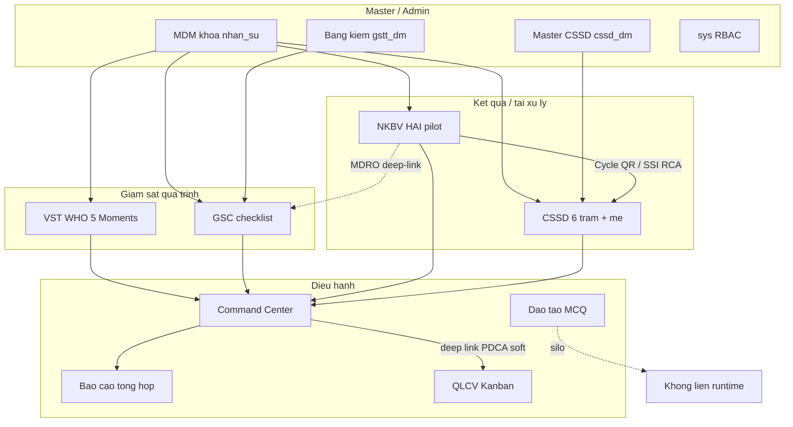

# Rà soát chuyên sâu toàn hệ KSNK BV103 — IPC + Engineering

> **Ngày phân tích:** 2026-08-05  
> **Phạm vi:** Domain · liên thông · FE · BE · UI · CSDL · linh hoạt codebase  
> **Vai trò:** kỹ sư phần mềm + chuyên gia kiểm soát nhiễm khuẩn (IPC)  
> **Phương pháp:** đối chiếu SSOT (`domain-specification`, mapping, module README) + audit sống + khảo sát cấu trúc runtime (`src/app` ~52 page · `src/modules` ~12 package · ~115 server actions · ~118 migrations).  
> **Nguyên tắc:** Không rewrite hệ thống; không sửa `src/` / migration trong đợt rà soát này.  
> **Backlog sống:** [`../architecture/open-backlog-20260731.md`](../architecture/open-backlog-20260731.md)  
> **Tiền thân PO ngắn:** [`full-system-audit-po-20260805.md`](./full-system-audit-po-20260805.md)

---

## Kết luận một câu

Hệ thống **đúng hướng khoa học IPC và có xương sống kiến trúc rõ** (bounded context + prefix DB + gate verify + soft liên thông Dashboard→QLCV). Đây **không phải** hệ “thông minh đóng vòng PDCA/HAI đầy đủ NHSN”, mà là **pilot bệnh viện Việt Nam đã chín về giám sát quá trình + CSSD lot-centric + HAI adjudication bán tự động**, với điểm chặn go-live chủ yếu là **UAT khoa ký + DB local parity**, không phải làm lại kiến trúc.

---

## 1. Bản đồ hệ thống & liên thông

| Liên kết | Mức “thông minh” thực tế | Đánh giá |
|----------|--------------------------|----------|
| CSSD ↔ NKBV (SSI / Cycle QR / RCA) | Case-level, có dữ liệu | **Mạnh nhất** — đúng IPC |
| VST/GSC → RPC → CC/BCTH → QLCV | Deep-link + `analytics_meta` + Δ remeasure | **Mềm** — hỗ trợ PDCA, chưa đóng vòng |
| NKBV MDRO → GSC bảng kiểm | Điều hướng | Nhẹ |
| Đào tạo ↔ gap/BK/HAI | Không | **Silo** |
| HIS/LIS | Excel portal | Đủ pilot; mỏng khi scale |

**Ranh giới đúng (không nên phá):** không gộp fact VST/GSC/NKBV/CSSD; CSSD soft-warn CAP_PHAT là SSOT vận hành; Wave 4 HIS/FHIR khóa đến khi có hợp đồng viện.

**Quy mô runtime (đo tại thời điểm rà soát):** ~52 `page.tsx` · ~12 package trong `src/modules` · ~115 `*.actions.ts` · ~118 file `supabase/migrations/`.

---

## 2. Điểm 8 chiều (cập nhật sau rà soát sâu)

| Chiều | Điểm (1–5) | Nhận xét chuyên sâu |
|-------|:----------:|---------------------|
| 1 Nghiệp vụ / khoa học IPC | **4.0** | Domain tách đúng WHO/JCI/lot-sterile; NKBV NHSN đầy đủ chỉ ở SSOT; LabID/CLIP/SIR Location chưa runtime |
| 2 An toàn dữ liệu | **4.0** | `proxy.ts` + verifyPermission + guest allowlist; surface action lớn vẫn là nợ duy trì |
| 3 Logic vận hành | **3.8** | Soft CAP_PHAT / soft PDCA có chủ đích — linh hoạt vận hành, yếu đảm bảo IPC cứng |
| 4 Cấu trúc FE | **3.8** | 3 dialect Ops/Analytics/Admin + chrome L1; còn nhiều wrapper song song |
| 5 Cấu trúc BE | **3.5** | Module actions rõ; god-files NKBV/QLCV; `src/lib` kitchen-sink |
| 6 CSDL | **3.5*** | Prefix SSOT + RPC analytics tốt; *parity live phụ thuộc Docker (OPS-DB-01) |
| 7 Vận hành / triển khai | **3.2** | Gate mạnh (`verify`, `pilot:ship`); UAT khoa + staging token còn mở |
| 8 UX tối giản | **4.0** | B+3/B+4 Done; form giám sát / density BI đã cải thiện 08-05 |

\*Đo lại khi bật Supabase local.

So với [`full-system-audit-po-20260805.md`](./full-system-audit-po-20260805.md): điểm chiều 3–5 tinh chỉnh xuống nhẹ sau khi soi care-bundle ẩn, soft PDCA, god-files và chrome phân mảnh — không đổi kết luận “không rewrite”.

---

## 3. Phân tích từng domain (ưu / nhược / phù hợp / khiếm khuyết)

### 3.1 Giám sát VST + GSC (quá trình)

**Phù hợp khoa học**

- VST: WHO 5 Moments, mẫu số theo cơ hội, tối đa 3 đối tượng/phiên — khớp pilot IPC.
- GSC: engine thống nhất [`src/lib/domain/giam-sat-scoring.ts`](../../../src/lib/domain/giam-sat-scoring.ts); kết quả `results_jsonb` (không EAV); anti-Hawthorne cơ bản; 36 bảng kiểm metadata-driven.
- Tách form / thống kê / lịch sử (không `?tab=` trên form) — IA rõ.

**Khiếm khuyết / không hợp lý nhẹ**

- Compliance VST = “không bỏ sót”, **không** bắt buộc kỹ thuật/thời gian đúng (WHO indication vs quality).
- Care-bundle (`dat_tron_goi`) và weight/red-flag **có trong model nhưng UI/KPI chủ yếu hiện % tiêu chí** → dễ hiểu nhầm “đạt” khi gói then-chốt fail. Wiki: [`../../wiki/concepts.md#gsc-scoring`](../../wiki/concepts.md#gsc-scoring).
- **Hai hệ ngưỡng:** form ~90/80 vs dashboard 85/70/80 — lệch ngôn ngữ lãnh đạo ↔ hiện trường.
- P×I×S rủi ro bảng kiểm: feasibility [`../../modules/giam-sat/bang-kiem-rui-ro-pis-feasibility-20260731.md`](../../modules/giam-sat/bang-kiem-rui-ro-pis-feasibility-20260731.md), chưa ship.

**Linh hoạt:** cao về template seed/MDM; thấp về tự soạn BK ngoài admin.

### 3.2 CSSD ERP × Master CSSD × MDM

**Phù hợp**

- 6 trạm + mẻ tiệt khuẩn tách khỏi quét shell; CAP_PHAT bắt buộc mẻ ĐẠT; Spaulding/heat SUB; Cycle QR; bảo trì khóa máy — **lõi khoa học tiệt khuẩn đúng**.
- Ranh giới Master CSSD (`cssd_dm_*` tại Quản trị) ≠ MDM tổ chức ≠ ops QR — đúng kiến trúc; gate `imports:cssd-mdm`. SSOT: [`../../modules/cssd/domain-overview.md`](../../modules/cssd/domain-overview.md), [`../../wiki/concepts.md#cssd-vs-mdm`](../../wiki/concepts.md#cssd-vs-mdm).

**Khiếm khuyết (IPC)**

- `LAM_SACH` / `QC` chủ yếu **stamp quét**, thiếu dữ liệu rửa/khử khuẩn/kiểm tra lumen thực tế.
- BOM thiếu chỉ **soft-warn** khi cấp phát — linh hoạt vận hành, **yếu đảm bảo bộ critical vô khuẩn đủ cấu phần** (đúng quyết định PO Q2, không phải bug).
- BI optional; chưa implant-load / HLD pathway; vật tư không-hóa-chất còn BRD mở.
- Trạm 5 trên map nhưng “không quét ở đây” — đúng kỹ thuật, dễ lệch đào tạo hiện trường.

**Liên thông:** CSSD↔SSI là cầu HAI–dụng cụ tốt nhất hệ thống ([`src/lib/cssd-nkbv-trace.ts`](../../../src/lib/cssd-nkbv-trace.ts)).

### 3.3 NKBV (HAI surveillance)

**Phù hợp**

- Một module `/giam-sat-nkbv` cho BSI/UTI/VAE-PNEU/SSI — đúng ADR unified; Shared timeline / Secondary BSI / device registry W1–W2 — kỷ luật scope tốt (không giả vờ NHSN đầy đủ).
- Import LIS/ADT + xác nhận kép trên form diagnostic — an toàn lâm sàng hơn auto-classify.
- Roadmap: [`../../modules/nkbv/implementation-roadmap-ssot-v2-20260804.md`](../../modules/nkbv/implementation-roadmap-ssot-v2-20260804.md) — W3 LabID/CLIP backlog; **W4–W6 tạm dừng**.

**Khiếm khuyết**

- LabID, CLIP, PedVAE, ENDO, AU, Location-mapped SIR/SUR = **SSOT/doc hoặc W3+/paused** — đúng pause, nhưng UI còn ô “SIR thô” dễ over-read.
- MDRO flag ≠ LabID (code thừa nhận) — cần kỷ luật đào tạo IP.
- God components (~1000 dòng form/page) = nút thắt mở rộng hội chứng.
- UAT lâm sàng #2–#5 chưa ký khoa (P1 vận hành).

### 3.4 Dashboard / Analytics / BCTH

**Phù hợp**

- RPC strategic, metric dictionary, decision queue, CCS hạ khỏi bề mặt vận hành — đúng “glance → drill → báo cáo”.
- Cầu QLCV từ gap (VST/GSC/CSSD đỏ/NKBV chờ XN) qua [`src/lib/analytics/decision-queue.ts`](../../../src/lib/analytics/decision-queue.ts), [`qlcv-analytics-deep-link.ts`](../../../src/lib/analytics/qlcv-analytics-deep-link.ts), [`pdca-remeasure.ts`](../../../src/lib/analytics/pdca-remeasure.ts).

**Khiếm khuyết**

- Analytics **hơi dày** so với pilot (nhiều ma trận/dimensions); CCS còn trong payload/types (zombie).
- PDCA = metadata + Δ, không buộc đo lại trước đóng việc.
- Filter/chrome ngoài trục VST/GSC→BCTH từng lệch; nhiều mục FLT-* đã Done 08-03 — cần giữ kỷ luật SSOT ([`supervision-analytics-filter-scorecard-20260803.md`](./supervision-analytics-filter-scorecard-20260803.md)).

### 3.5 QLCV

**Phù hợp:** Kanban 7 trạng thái, checklist RPC, spawn định kỳ, nghiệm thu, scope KSNK-only — chín cho điều hành nội bộ ([`../../modules/qlcv/README.md`](../../modules/qlcv/README.md)).

**Khiếm khuyết:** không auto-spawn từ phiên giám sát/HAI; checklist không gắn ID bảng kiểm; PDCA không hard-close — **đủ task tool, chưa đủ QI loop**.

### 3.6 Đào tạo

**Phù hợp kỹ thuật:** engine MCQ (Bloom, shuffle, snapshot, Excel bank) vững (`src/lib/dao-tao/`, [`../../modules/dao-tao/README.md`](../../modules/dao-tao/README.md)).

**Không phù hợp kỳ vọng “IPC thông minh”:** không gán bài theo gap/BK/ca HAI; không ma trận năng lực theo vai trò — hiện là **sản phẩm thi song song**, không lớp remediation.

### 3.7 MDM / RBAC / Auth

**Phù hợp:** registry phẳng, hub Quản trị, proxy Next 16 (`src/proxy.ts`), permission matrix (`permission-registry.ts`).

**Nợ:** ngôn ngữ “MDM” vẫn dễ bao Master CSSD ở mặt PO; surface admin lớn nhưng đã khóa “không rewrite F-04”.

---

## 4. Frontend · Backend · UI — tách bạch

### Frontend / UI

| Ưu | Nhược |
|----|-------|
| Thin App Router; hub Giám sát / CSSD / Quản trị rõ IA | Nhiều chrome wrapper (Supervision / CSSD / DaoTao / Analytics) → drift nếu bỏ gate |
| Design dialect 3 vai trò + tokens + layout checks | God UI NKBV/QLCV; form giám sát vẫn nặng nhận thức |
| Touch targets giám sát / QR camera / offline hẹp (CSSD+pending GS) | Offline chưa first-class toàn hệ |
| Print/export đã có scorecard và vá 08-05 | Dialect search/filter ngoài GS cần giữ SSOT |

Chrome contract: [`../architecture/page-chrome-contract-20260731.md`](../architecture/page-chrome-contract-20260731.md) · dialect: [`../architecture/design-dialect-matrix-20260731.md`](../architecture/design-dialect-matrix-20260731.md).

### Backend

| Ưu | Nhược |
|----|-------|
| Server Actions theo module + verifyPermission | ~115 action files — Boy Scout, không big-bang tách |
| RPC analytics thay summary tables | Một số SECURITY DEFINER lịch sử từng GRANT rộng (đã harden từng đợt; cần parity khi DB lên) |
| Entity QR hospital-wide + CSSD hub | Hai “não” resolve QR — linh hoạt nhưng cần kỷ luật |
| Facades có chủ đích (`mdm-read-gateway`, deep-link) | Whitelist CSSD↔MDM; lib phụ thuộc module |

### Database

| Ưu | Nhược |
|----|-------|
| Prefix theo bounded context; mapping SSOT | Baseline squash → rủi ro `schema_migrations` linked (D-03 lịch sử) |
| RLS trên fact chính; view live | Residual RLS/summary từng audit; đo lại khi Docker lên |
| Seed RBAC/DAO_TAO đã cập nhật 08-05 | OPS-DB-01 chặn go-live gate local |

Prefix SSOT: [`../../core/implementation-mapping.md`](../../core/implementation-mapping.md) · [`../../wiki/entities.md`](../../wiki/entities.md).

---

## 5. “Linh hoạt · thông minh · khôn” của codebase

| Chiều linh hoạt | Mức | Giải thích |
|-----------------|-----|------------|
| Thêm màn trong module sẵn | **Cao** | Page mỏng + nav gate |
| Thêm bounded context mới | **Trung–cao** | Prefix + registry + docs + verify bắt buộc |
| Đổi luật nghiệp vụ có chủ đích | **Cao có kỷ luật** | Soft vs hard gate ghi rõ PO (CAP_PHAT, CCS demotion, W4 pause) |
| Mở rộng NKBV hội chứng | **Thấp–trung** | Spec sẵn; UI monolith |
| Đóng vòng QI (giám sát→việc→đo lại→học) | **Thấp** | Deep-link, chưa ontology IPC thống nhất |
| Tự chữa / tự gán đào tạo theo rủi ro | **Rất thấp** | Đào tạo silo |

**Khôn của hệ (đúng nghĩa engineering IPC):** biết **dừng** (không FHIR big-bang, không hard-block CAP_PHAT, không gộp fact, tạm dừng SIR Location khi thiếu mẫu số) — đây là dấu hiệu chín hơn “feature đầy đủ giả”.

**Chưa khôn:** metadata scoring (weight/red-flag) không có hành vi; SIR thô trên UI; soft-warn dễ bị bỏ qua dưới áp lực hiện trường.

---

## 6. Phù hợp vs không phù hợp (tóm tắt PO)

**Phù hợp dùng ngay (pilot BV103)**

- VST/GSC nhập liệu + thống kê + BCTH
- CSSD QR 6 trạm + mẻ + cấp phát (kèm đào tạo soft-warn BOM)
- QLCV điều hành KSNK
- NKBV adjudication 4–5 hội chứng pilot + liên CSSD SSI
- Đào tạo thi MCQ nội bộ

**Chưa phù hợp kỳ vọng “chuẩn NHSN / QMS tiệt khuẩn đầy đủ / PDCA tự động”**

- LabID outbreak + CLIP + AU + SIR Location
- CSSD như QMS rửa–QC–BI bắt buộc–hard release
- QLCV như hệ can thiệp toàn viện
- Đào tạo như lớp competency theo gap

---

## 7. Ưu tiên thật (không mở Wave sâu trong đợt này)

Đã khóa bởi open-backlog — **P0 code engineering mở: 0**.

1. **UAT-NKBV / UAT-REFORM** — khoa ký checklist (P1 lâm sàng/vận hành) · gói sẵn [`uat-coordination-pack-20260805.md`](./uat-coordination-pack-20260805.md)
2. **OPS-DB-01** — bật Docker → `pilot:go-live:gate:local` + sync RBAC Đào tạo
3. **Giữ kỷ luật** soft CAP_PHAT, không gộp fact, không FHIR big-bang
4. **Nợ khoa học có chủ đích (sau UAT, từng slice `/intake-nv`):** surface care-bundle; thống nhất ngưỡng form↔dashboard; PDCA remeasure cứng hơn; LabID/CLIP chỉ khi PO mở W3; hardening wash/QC CSSD nếu viện yêu cầu QMS

### Không làm

- Gộp bảng fact VST/GSC/NKBV/CSSD  
- Hard-block cấp phát CSSD  
- Rewrite Auth / rewrite Quản trị (F-04)  
- HIS/LIS FHIR big-bang không hợp đồng viện  
- Một chat “sửa hết” mọi nợ khoa học ở mục 4  

---

## 8. Liên kết nhanh

| Tài liệu | Vai trò |
|----------|---------|
| [`full-system-audit-po-20260805.md`](./full-system-audit-po-20260805.md) | Tổng rà soát PO ngắn (8 chiều + R0–R6) |
| [`../architecture/open-backlog-20260731.md`](../architecture/open-backlog-20260731.md) | Backlog sống |
| [`uat-coordination-pack-20260805.md`](./uat-coordination-pack-20260805.md) | Gói điều phối UAT |
| [`comprehensive-review-20260709.md`](./comprehensive-review-20260709.md) | Audit Domain→DB→BE→UI trước đó |
| [`../../core/domain-specification.md`](../../core/domain-specification.md) | SSOT nghiệp vụ |
| [`../../modules/nkbv/hai-surveillance-domain-ssot-20260804.md`](../../modules/nkbv/hai-surveillance-domain-ssot-20260804.md) | SSOT NHSN (doc) vs pilot runtime |
| [`../../modules/cssd/domain-overview.md`](../../modules/cssd/domain-overview.md) | Domain CSSD chốt PO |

---

## Nguồn evidence chính

- SSOT: [`../../core/domain-specification.md`](../../core/domain-specification.md), [`../../wiki/entities.md`](../../wiki/entities.md), [`../../wiki/concepts.md`](../../wiki/concepts.md)
- Audit sống: [`full-system-audit-po-20260805.md`](./full-system-audit-po-20260805.md), [`../architecture/open-backlog-20260731.md`](../architecture/open-backlog-20260731.md)
- Module: `docs/modules/{giam-sat,cssd,nkbv,dashboard,qlcv,dao-tao,mdm}/`
- Runtime xương sống: `src/modules/*`, `src/lib/{domain,analytics,entity-qr,permission-*}`, `src/proxy.ts`
