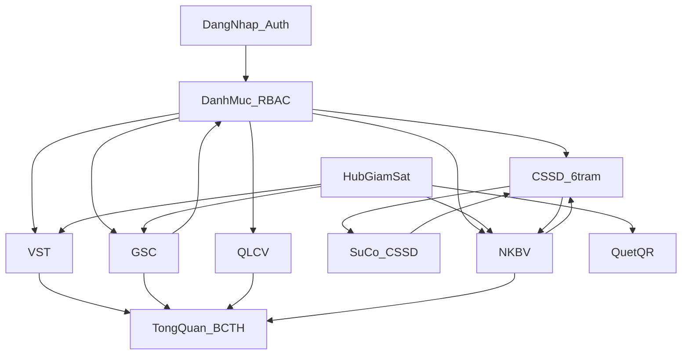

# KSNK BV103 — Tài liệu tổng hợp toàn diện

> **Bản chụp (snapshot):** 24/08/2026  
> **Đối tượng:** Product Owner / lãnh đạo bệnh viện / developer mới  
> **Phạm vi:** Ý tưởng · triết lý · yêu cầu người tạo · mọi miền nghiệp vụ · môi trường · 12 module · frontend · backend · database · codebase · đánh giá  
> **Không thay thế SSOT sống.** Khi lệch tên bảng / quyền / route — tin migration + file core, không tin bản này.

| Việc cần làm | File sống (đọc trước khi sửa code) |
|--------------|-------------------------------------|
| Nghiệp vụ | [`../../core/domain-specification.md`](../../core/domain-specification.md) |
| Ánh xạ bảng / RPC | [`../../core/implementation-mapping.md`](../../core/implementation-mapping.md) |
| Auth / RLS / môi trường | [`../../core/operations-sop.md`](../../core/operations-sop.md) |
| Ship / verify | [`../../core/lean-execution.md`](../../core/lean-execution.md) · [`../../../AGENTS.md`](../../../AGENTS.md) |
| Backlog đang mở | [`../architecture/open-backlog-20260731.md`](../architecture/open-backlog-20260731.md) |
| Audit PO 05/08 | [`full-system-audit-po-20260805.md`](./full-system-audit-po-20260805.md) |

**Kèm thay đổi chưa commit (24/08):** working tree có slice CSSD sự cố (RLS ghi `cssd_fact_su_co`), QLCV, VST/GSC, picker UI. Head migration trên đĩa: `20260824120000_cssd_fact_su_co_write_rls.sql`.

**Cách đọc đánh giá:** dòng ghi *trích audit* = lấy từ báo cáo đã có ngày. Dòng ghi *nhận xét 24/08* = tổng hợp từ các nguồn đó + inventory sống; không phải điểm số mới đo lại trên UI.

---

## Mục lục

- [0. Cách đọc theo đối tượng](#0-cách-đọc-theo-đối-tượng)
- [1. Ý tưởng, sứ mệnh, triết lý, yêu cầu người tạo](#1-ý-tưởng-sứ-mệnh-triết-lý-yêu-cầu-người-tạo)
- [2. Trạng thái dự án và wave go-live](#2-trạng-thái-dự-án-và-wave-go-live)
- [3. Từ điển nghiệp vụ](#3-từ-điển-nghiệp-vụ)
- [4. Bản đồ miền và tương tác](#4-bản-đồ-miền-và-tương-tác)
- [5. Cách phần mềm hoạt động](#5-cách-phần-mềm-hoạt-động)
- [6. Catalog 12 module](#6-catalog-12-module)
- [7. Frontend](#7-frontend)
- [8. Backend](#8-backend)
- [9. Database](#9-database)
- [10. Môi trường](#10-môi-trường)
- [11. Codebase và lệnh verify](#11-codebase-và-lệnh-verify)
- [12. Đánh giá tổng hợp](#12-đánh-giá-tổng-hợp)
- [13. Việc cố ý chưa làm và nợ kỹ thuật](#13-việc-cố-ý-chưa-làm-và-nợ-kỹ-thuật)
- [14. Phụ lục](#14-phụ-lục)

---

## 0. Cách đọc theo đối tượng

### Product Owner / người tạo

Đọc **§1–§6** và **§12**. Bạn cần biết: phần mềm làm gì, ai dùng màn nào, module nào đã chín để đưa khoa dùng, chỗ nào còn chờ ký UAT. Không cần thuộc tên bảng.

### Lãnh đạo / Ban Giám đốc / Chủ nhiệm khoa

Đọc **§1–§2**, bảng chín muồi trong **§6**, rồi **§12**. Kết luận ngắn: hệ **đúng hướng kiểm soát nhiễm khuẩn**, **chưa phải production toàn viện**. Wave 1 (Quản trị + vệ sinh tay + bảng kiểm + công việc nội bộ) là mục tiêu go-live trước. Chặn chính không phải “làm lại phần mềm” mà là **khoa ký kiểm thử tay**.

### Developer mới / kỹ thuật

Đọc **§5**, **§7–§11**, phụ lục route. Cài máy: §10. Mọi ghi dữ liệu đi Server Action + kiểm quyền — không tin form phía trình duyệt.

| Bạn là | Bắt đầu tại | Rồi tới |
|--------|-------------|---------|
| PO | §1, §3, §6 (VST/GSC/QLCV) | §12 |
| Lãnh đạo | §2, §12 | §6 bảng chín muồi |
| Dev | §10, §5, §8–§9 | §11, phụ lục 52 route |

---

## 1. Ý tưởng, sứ mệnh, triết lý, yêu cầu người tạo

### 1.1 Hệ thống là gì

**KSNK BV103** (`ksnk_bv103`, phiên bản package `0.1.0`) là phần mềm **Kiểm soát nhiễm khuẩn** làm riêng cho **Khoa Kiểm soát Nhiễm khuẩn — Bệnh viện 103** (Bệnh viện Quân y 103). Không phải HIS toàn viện, không phải ERP generic.

Ba nhóm nhiệm vụ (trích [`system-overview.md`](../architecture/system-overview.md)):

1. **Giám sát lâm sàng** — vệ sinh tay (VST, chuẩn WHO), bảng kiểm động (GSC), nhiễm khuẩn bệnh viện (NKBV / HAI, hướng CDC/NHSN).
2. **Hậu cần tiệt khuẩn tập trung (CSSD)** — chu trình quét mã QR 6 trạm, mẻ hấp, kho dụng cụ / hóa chất, sự cố và thu hồi.
3. **Vận hành nội bộ và quản trị** — danh mục dùng chung, phân quyền, giao việc khoa KSNK, thi trắc nghiệm.

URL staging / production đã ghi: `https://ksnk-bv103-v2.vercel.app` ([`../../../README.md`](../../../README.md)).

### 1.2 Sứ mệnh sản phẩm

Một nền tảng thống nhất: **quan sát tuân thủ → số liệu điều hành → việc khắc phục → truy vết dụng cụ khi có nhiễm khuẩn liên quan phẫu thuật**. Người dùng chính là nhân viên khoa KSNK, mạng lưới kiểm soát nhiễm khuẩn tại khoa lâm sàng, hội đồng xem báo cáo, và (sau này) kỹ thuật viên CSSD.

Tầm nhìn dài: nối HIS/LIS theo hướng FHIR (`Patient`, `Encounter`, `Observation`) — **chưa làm realtime**. Giặt là, chất thải, giám sát môi trường: **chưa có module** — chờ đặc tả nghiệp vụ (BRD).

### 1.3 Triết lý người tạo (đã khóa trong repo)

| Nguyên tắc | Ý nghĩa nghiệp vụ | Nguồn |
|------------|-------------------|--------|
| **Một cửa vào cho một việc** | Nhiều bảng phía dưới được, nhưng người dùng không phải đoán URL song song | Chương trình tinh giản 26/07/2026 |
| **Giữ ranh giới dữ liệu** | VST / GSC / NKBV / CSSD / công việc / danh mục **không gộp bảng** | [`simplification-program-20260726.md`](../architecture/simplification-program-20260726.md) |
| **Không rewrite để go-live** | Sửa đúng mảnh; deep-link cũ vẫn chạy | Audit PO 05/08 |
| **Không tin trình duyệt** | Mọi ghi dữ liệu kiểm quyền trên máy chủ | [`engineering-guidelines.md`](../../core/engineering-guidelines.md) §1.2 |
| **Boy Scout trong mảnh đang làm** | Dọn đúng file vừa sửa; không “cải tổ cả viện” trong một chat | [`AGENTS.md`](../../../AGENTS.md) |
| **Một chat = một tính năng** | Đổi việc → chat mới; không phình scope | Quy trình PO |
| **Không đoán schema** | Đối chiếu migration / lệnh CLI | Kỷ luật agent |
| **Không đẻ bảng tổng hợp** | Chỉ khi đo được chậm thật và được PO đồng ý | Kỷ luật agent |

**Pilot DoD (một mảnh xong):** người dùng / môi trường rõ; ≥ 3 kịch bản kiểm tay; migration/RPC đã apply nếu đụng CSDL; lệnh verify phù hợp pass.

### 1.4 Yêu cầu vận hành của người tạo (PO)

Người tạo **không rành code**. Quy trình bắt buộc:

1. Mô tả nghiệp vụ tiếng Việt → khóa phạm vi (`/intake-nv`) → duyệt **OK triển khai**.
2. AI sửa code, tự chạy verify, báo pass/fail.
3. Khoa / PO kiểm tay trên màn hình (≥ 3 tình huống).
4. Nghiệm thu mảnh; chỉ commit / PR khi được yêu cầu.

PO cung cấp: module / màn hình, hiện tại → mong muốn, ai dùng, 3 cách kiểm (hoặc để AI đề xuất). PO **không** cần nêu tên file hay migration.

Các **khóa cứng** đã chốt (không mở lại trừ Spec change):

- **MDM tổ chức ≠ Master CSSD** — khoa/nhân sự khác loại–bộ–máy–hóa chất.
- **NKBV = một module**, không tách 4 ứng dụng (BSI / UTI / VAE / SSI).
- **Không REST `/api/v1/proxy`** — ghi qua Server Action + Supabase.
- **Cấp phát CSSD thiếu cấu phần = cảnh báo**, không chặn cứng (quyết định Q2).
- **Không rewrite Auth / không rewrite Quản trị (F-04).**
- Nhật ký audit hệ thống (`sys_audit_log`) **đã gỡ** (02/06/2026) — truy vết bằng dữ liệu nghiệp vụ + khóa module + phân quyền.

Thực thể **cố ý bỏ** (không mô tả quy trình mới): phiếu RCA dạng ticket, kết quả GSC kiểu EAV (một dòng một tiêu chí), phần phân tích Ishikawa trên form giám sát.

### 1.5 Ngăn xếp kỹ thuật (một dòng)

Next.js 16 (App Router) + React 19 + TypeScript + Tailwind v4 + Radix · Server Actions · Supabase (PostgreSQL + Auth + bảo mật theo dòng) · Zod · TanStack Query v5 · triển khai Vercel.

---

## 2. Trạng thái dự án và wave go-live

Hệ **đang pilot**, **chưa phải production toàn bệnh viện**. Triển khai theo sóng; flag môi trường ẩn module chưa ký.

| Wave | Flag | Module mở | Ý nghĩa |
|------|------|-----------|---------|
| **W1 go-live** | `KSNK_PILOT_CORE_MODULES=1` | Quản trị (MDM/RBAC) + VST + GSC + QLCV | Mục tiêu đưa khoa dùng trước |
| **W2 CSSD UAT** | **tắt** flag | + CSSD (6 trạm, hóa chất, thiết bị, cycle QR, sự cố) | Thử trên staging, checklist P3–P5 |
| **W3 mở rộng** | tắt flag | + NKBV + Dashboard / Báo cáo tổng hợp | Sau UAT lâm sàng / điều hành |

**Đào tạo / Thi KSNK:** đã có MVP (29/07/2026), **không nằm bảng W1–W3**. Coi là phụ trợ vận hành.

Khi bật W1: sidebar ẩn Dashboard, Báo cáo tổng hợp, NKBV, toàn bộ CSSD. `src/proxy.ts` trả 404 các route đó. Công việc nội bộ **vẫn mở**. Không bật đồng thời `KSNK_PILOT_FOUR_MODULES=1` nếu cần QLCV (pilot-4 chặn `/quan-ly-cong-viec`).

Chi tiết vận hành: [`../../core/pilot-core-modules-go-live.md`](../../core/pilot-core-modules-go-live.md) · bảng ký: [`../../core/pilot-go-live-signoff-202606.md`](../../core/pilot-go-live-signoff-202606.md).

**Gate tự động vs ký tay (trích tài liệu go-live):** lệnh `pilot:go-live:gate` / `:local` đã được mô tả là có đường pass kỹ thuật; **ô ký UAT khoa** (MDM, GSC/VST, QLCV, CSSD, Dashboard, NKBV) trên sign-off **còn trống** tại thời điểm các audit 07–08/2026. Định nghĩa “dùng luôn”: mỗi module ≥ 5/6 kịch bản tay PASS trên staging; `mdm_email_no_auth = 0`.

---

## 3. Từ điển nghiệp vụ

| Thuật ngữ | Ý nghĩa cho người dùng | Bảng / chỗ thật |
|-----------|------------------------|-----------------|
| **VST** | Giám sát vệ sinh tay theo 5 thời điểm WHO | `gstt_fact_vst_sessions`, `gstt_fact_vst` |
| **GSC** | Giám sát bảng kiểm động; kết quả nằm trong một khối JSON | `gstt_fact_chung_sessions.results_jsonb` |
| **Bảng kiểm** | Mẫu tiêu chí (36 mẫu chuẩn) do Quản trị sửa | `gstt_dm_bang_kiem` |
| **TGS / Tự GS** | Tự giám sát tại khoa vs giám sát chuyên trách | metadata `ap_dung_jsonb` + chỉ số coverage |
| **NKBV / HAI** | Nhiễm khuẩn mắc phải tại viện; một module mọi hội chứng | `nkbv_fact_benh_an`, `nkbv_fact_su_kien`, `nkbv_fact_vi_sinh` |
| **Ngày lịch thứ 3** | Luật sàng lọc ca nghi ngờ từ mốc nuôi cấy | `nkbv-rules-engine.ts` |
| **Xác nhận / Loại trừ** | Khoa KSNK chốt ca là NKBV hay không | trạng thái phiếu |
| **CSSD** | Trung tâm tái xử lý / vô trùng dụng cụ | `cssd_fact_quy_trinh` |
| **Mẻ tiệt khuẩn** | Một lần chạy máy hấp + QC chỉ thị | `cssd_fact_lo_tiet_khuan` |
| **Cycle QR** | Tem theo **vòng** tái xử lý (khác tem bộ vĩnh viễn) | mã cycle trên quy trình |
| **BOM / cấu phần** | Danh mục chi tiết trong bộ dụng cụ | master `cssd_dm_bo_dung_cu_chi_tiet`; lúc vận hành: `metadata.bom_lines` |
| **Sự cố CSSD** | Báo cáo lỗi + có thể khóa / hoàn quy trình | `cssd_fact_su_co` |
| **QLCV** | Công việc nội bộ khoa KSNK, 7 trạng thái | `qlcv_fact_cong_viec` |
| **Đề xuất** | Việc chưa được duyệt (cột Kanban) | phiếu `is_active=false` |
| **MDM tổ chức** | Khoa phòng, nhân sự, lookup dùng chung | `mdm_dm_khoa_phong`, `mdm_nhan_su`, `sys_lookup_value` |
| **Master CSSD** | Định nghĩa loại / bộ / máy / hóa chất — sửa ở Quản trị | `cssd_dm_*` |
| **RBAC** | Quyền theo **module × hành động** (xem, tạo, sửa, xóa, nhập, xuất, duyệt, QC, khóa) | `sys_roles`, `sys_permissions` |
| **BCTH** | Báo cáo tổng hợp chính thức | `/bao-cao-tong-hop` |
| **Command Center** | Tổng quan điều hành | `/` |
| **Phiên** | Một lần đi giám sát (VST hoặc GSC) | bảng `*_sessions` |
| **Đào tạo / Thi KSNK** | Ngân hàng câu + thi thử / thi thật | `dao_tao_*` |

**Không dùng lại trong quy trình mới:** ticket RCA, EAV kết quả GSC, form phần 3–4 Ishikawa, `sys_audit_log`.

Wiki entity chỉ gom 5 khối (CSSD, VST+GSC, NKBV, MDM, QLCV). Dashboard / Auth / Đào tạo nằm ở README module và mapping — xem [`../../wiki/entities.md`](../../wiki/entities.md).

---

## 4. Bản đồ miền và tương tác

### 4.1 Tám miền nghiệp vụ

| # | Miền | Thư mục code | Wave |
|---|------|--------------|------|
| 1 | Xác thực + Quản trị + danh mục | `auth`, `quan-tri-he-thong` | W1 (nền) |
| 2 | Vệ sinh tay | `giam-sat-vst` | W1 |
| 3 | Giám sát bảng kiểm | `giam-sat-chung` + hub `giam-sat-hub` | W1 |
| 4 | Nhiễm khuẩn bệnh viện | `giam-sat-nkbv` | W3 |
| 5 | Vận hành CSSD | `cssd-erp` | W2 |
| 6 | Sự cố CSSD | `cssd-su-co` | W2 |
| 7 | Công việc nội bộ | `quan-ly-cong-viec` | W1 |
| 8 | Điều hành / báo cáo | `dashboard` | W3 (ẩn khi W1 flag) |

Phụ trợ: **Thi KSNK** (`dao-tao`), **quét QR xuyên module** (`entity-qr`).

### 4.2 Sơ đồ phụ thuộc



| Liên kết | Cơ chế | Đánh giá (trích IPC 05/08) |
|----------|--------|----------------------------|
| VST/GSC → Dashboard | RPC thống kê chiến lược, không quét hết bảng fact | Mềm — hỗ trợ PDCA, chưa khép vòng bắt buộc đo lại |
| GSC → Quản trị bảng kiểm | Đọc mẫu qua cổng `mdm-read-gateway` | Ổn định |
| CSSD ↔ NKBV (SSI / cycle QR) | `quy_trinh_id`, mã cycle, panel RCA, deep-link | **Mạnh nhất hệ thống** |
| CSSD → Sự cố | Ghi sự cố có thể rollback / khóa bộ | Domino an toàn |
| QLCV ↔ đồng hồ máy chủ | `pg_cron` sinh việc định kỳ 00:01, quá hạn 00:05 (giờ VN) | Ổn định nội bộ |
| Đào tạo ↔ gap / bảng kiểm / ca HAI | Không gắn bài theo lỗ hổng | **Silo** |
| HIS / LIS | Cổng Excel / dán bảng — không API sống | Đủ pilot, mỏng khi scale |

Ma trận đầy đủ: [`../architecture/interaction-matrix.md`](../architecture/interaction-matrix.md).

### 4.3 Ranh giới CSSD và MDM (dễ lẫn — đọc kỹ)

- **Quản trị** sửa **định nghĩa**: loại dụng cụ, bộ, thành phần, máy, hóa chất.
- **Màn CSSD** (`/cssd-*`) **vận hành**: quét, mẻ, kho, sự cố. Catalog `/cssd-dung-cu` **chỉ đọc**.
- Cấm import CRUD danh mục từ UI CSSD — có cổng kiểm `npm run imports:cssd-mdm`.

---

## 5. Cách phần mềm hoạt động

### 5.1 Ai đăng nhập, vào đâu

1. Mở `/login` — nhập **mã nhân viên** hoặc email + mật khẩu.
2. Máy chủ tra hồ sơ nhân sự còn hiệu lực → đăng nhập Supabase Auth.
3. Sau đăng nhập:
   - Vai **Khách thống kê** → `/thong-ke/vst` (chỉ xem số, không lịch sử).
   - Không được xem Tổng quan → `/giam-sat`.
   - Còn lại → `/` (Tổng quan).
4. Mỗi trang đã đăng nhập: kiểm nhân sự còn active; tự nối tài khoản Auth với hồ sơ nếu thiếu.
5. Menu bên trái **lọc theo quyền**. Thiếu quyền → không thấy mục (trông như “menu trống” — cần admin gán vai).
6. Mọi nút Lưu / Duyệt: Server Action gọi `verifyPermission` — giả lập trình duyệt không vượt được.

Năm vai đang dùng (`sys_roles.name`):

| Vai trò | Việc được làm (nghiệp vụ) |
|---------|---------------------------|
| **ADMIN** | Toàn quyền |
| **NHAN_VIEN_KSNK** | Vận hành khoa + xem điều hành + sửa danh mục theo quyền module |
| **HOI_DONG_KSNK** | **Chỉ xem** |
| **MANG_LUOI_KSNK** | Nhập giám sát, công việc, sự cố; **không** Tổng quan |
| **KHACH_THONG_KE_GSTT** | Chỉ thống kê VST/GSC |

Vai cũ đã ngừng: tổ trưởng mạng lưới, thành viên mạng lưới (tách), Ban QLCL, khoa trang bị.

### 5.2 Một ngày làm việc điển hình

**Mạng lưới tại khoa:** menu Giám sát → chọn Vệ sinh tay hoặc Bảng kiểm → điền phiếu (máy tính bảng) → lưu → in / quét QR mở lại. Có hỗ trợ xếp hàng gửi khi mất mạng (offline sync giám sát).

**Nhân viên KSNK:** xem Tổng quan (nếu được) → lỗ hổng top → bấm sang thống kê cùng bộ lọc ngày/khoa → giao việc trên QLCV → (nếu mở CSSD) theo dõi mẻ / sự cố.

**Điều hành:** `/bao-cao-tong-hop` kỳ này so kỳ trước, in A4.

**IT / admin:** Quản trị — khoa, nhân sự, nối tài khoản, ma trận quyền, bảng kiểm, import Excel (xem trước → An toàn hoặc Đồng bộ đầy đủ).

### 5.3 Menu người dùng (module-first)

Nguồn: [`../../../src/lib/nav/sidebar-nav-groups.ts`](../../../src/lib/nav/sidebar-nav-groups.ts), [`../../../src/lib/nav/sidebar-admin-nav-groups.ts`](../../../src/lib/nav/sidebar-admin-nav-groups.ts).

| Nhóm sidebar | Mục | Đường dẫn |
|--------------|-----|-----------|
| Điều hành KSNK | Tổng quan KSNK | `/` |
| Điều hành KSNK | Báo cáo chính thức | `/bao-cao-tong-hop` |
| Giám sát | Cổng Giám sát | `/giam-sat` |
| Vận hành nội bộ | Công việc | `/quan-ly-cong-viec` |
| Vận hành nội bộ | Thi KSNK | `/dao-tao` |
| CSSD · Vận hành | Quy trình | `/cssd-quy-trinh` |
| CSSD · Vận hành | Sự cố | `/cssd-su-co` |
| CSSD · Tra cứu | Dụng cụ / Thiết bị / Hóa chất | `/cssd-dung-cu`, `/cssd-thiet-bi`, `/cssd-hoa-chat` |
| Quản trị | Quản trị hệ thống | `/quan-tri-he-thong` |

Thống kê và lịch sử VST/GSC **không có mục sidebar riêng** — vào từ hub Giám sát hoặc thanh chế độ trong module.

### 5.4 Vòng đời một lần ghi dữ liệu

```
Trình duyệt
  → src/proxy.ts (kiểm phiên + ẩn route khi flag W1)
  → giao diện (vỏ trang + menu theo quyền)
  → Server Action ("use server")
       1. verifyPermission / kiểm phạm vi khoa
       2. Zod kiểm dữ liệu
       3. client Supabase (user hoặc service role sau khi đã qua cổng quyền)
       4. ghi bảng fact / gọi RPC
  → PostgreSQL (+ RLS nếu bảng đã thắt)
  → làm mới cache trang → UI cập nhật
```

Báo cáo / Tổng quan **đọc qua RPC** (hàm trên CSDL), không kéo cả bảng giao dịch không giới hạn.

---

## 6. Catalog 12 module

Khuôn mỗi khối: mục đích · ai dùng · màn hình · chức năng · luồng · dữ liệu · ưu · nhược · mức chín · việc còn mở.

---

### 6.1 Auth — Đăng nhập nhân viên

| | |
|--|--|
| **Thư mục** | `src/modules/auth` |
| **Mục đích** | Định danh nhân viên y tế, phiên làm việc, đổi / quên mật khẩu |
| **Ai dùng** | Mọi người có tài khoản; IT cấp tài khoản tại Quản trị |
| **Route** | `/login`, `/login/forgot-password`, `/login/reset-password`, `/tai-khoan`, `/tai-khoan/doi-mat-khau` |
| **Chức năng** | Đăng nhập mã NV hoặc email; chặn hồ sơ ngưng; tự nối Auth ↔ hồ sơ |
| **Luồng** | Xem §5.1 |
| **Dữ liệu** | `auth.users` ↔ `mdm_nhan_su.auth_user_id`; quyền đọc `v_sys_user_permissions` |
| **File chính** | `actions/staff-login.actions.ts`, `staff-session.actions.ts`, `staff-password.actions.ts`; cổng biên `src/proxy.ts` |

**Ưu (trích):** cổng `proxy.ts` kiểm phiên trước khi render trang (Next.js 16, không dùng `middleware.ts` cũ); khách thống kê có allowlist riêng; UI tài khoản ~4.0/5 sau chương trình thống nhất giao diện.

**Nhược (trích):** không rewrite Auth (đã khóa); staging từng kẹt token `SUPABASE_ACCESS_TOKEN` (G-13); trước go-live bắt buộc `trial:auth:precheck` — email hồ sơ phải có user Auth (`mdm_email_no_auth = 0`).

**Mức chín:** hạ tầng W1. **Việc mở:** SOP nối tài khoản trên từng môi trường; G-13 nếu staging vẫn 401.

---

### 6.2 Quản trị / MDM

| | |
|--|--|
| **Thư mục** | `src/modules/quan-tri-he-thong` |
| **Mục đích** | Nguồn sự thật danh mục toàn viện + định nghĩa CSSD + bảng kiểm + phân quyền + tài khoản |
| **Ai dùng** | ADMIN, IT; người được quyền từng danh mục |
| **Route** | `/quan-tri-he-thong` (hub tab); `/quan-tri-he-thong/nhan-su`; `/tai-khoan-nhan-su`; `/bang-kiem`; `/danh-muc/khoa-phong`; `/danh-muc/dung-cu` (loại/bộ/BOM); `/danh-muc/thiet-bi`; `/danh-muc/hoa-chat`; `/danh-muc/chuyen-biet/[loai]`; `/phan-quyen` → redirect hub |
| **Chức năng** | CRUD khoa / nhân sự / lookup; import Excel có xem trước; ma trận quyền; khóa ngày báo cáo VST/GSC; tab IT “Bảo vệ liên kết dữ liệu” (`sys_mdm_registry`) |
| **Luồng pilot (5 case)** | Tạo khoa → gán NV → GSC thấy đúng khoa. Sửa bảng kiểm → phiên GSC mới đủ tiêu chí. User thiếu quyền không sửa danh mục. Nối tài khoản → đăng nhập được. Tab bộ dụng cụ → CSSD đọc được. |
| **Dữ liệu** | `mdm_dm_khoa_phong`, `mdm_nhan_su`, `sys_lookup_value` (14+ loại), `gstt_dm_bang_kiem`, `cssd_dm_*`, `sys_roles` / `sys_permissions` |
| **Verify** | `npm run verify:admin` |

Hai lớp danh mục (đừng gọi cả hai là “MDM”):

- **MDM tổ chức:** khoa, nhân sự, chức danh, khu vực giám sát…
- **Master CSSD:** loại–bộ–BOM, thiết bị, hóa chất — **sửa ở đây**, không sửa trên màn quét.

**Ưu (trích):** hub 4 nhóm xong; ngôn ngữ “MDM vs Master CSSD” đã chốt lớp 0; import P4 an toàn / đồng bộ đầy đủ; W1 triển khai tuần 1.

**Nhược (trích):** hub nặng (~146 file lịch sử); lớp 1–3 lộ trình 17/07 (Spaulding khép vận hành…) chưa implement hết; từ PO dễ gọi nhầm master dụng cụ là MDM; **không rewrite F-04**.

**UI:** dialect Admin ~3.8/5 (đạt mục tiêu tối thiểu). **Mức chín:** W1. **Việc mở:** không P0 chức năng; giữ ranh giới khi thêm danh mục.

README: [`../../modules/mdm/README.md`](../../modules/mdm/README.md).

---

### 6.3 Hub Giám sát

| | |
|--|--|
| **Thư mục** | `src/modules/giam-sat-hub` |
| **Mục đích** | Một cửa vào giám sát — chọn loại phiếu, QR, lịch sử |
| **Ai dùng** | Mọi người có ít nhất một quyền giám sát |
| **Route** | `/giam-sat` |
| **Chức năng** | Liên kết VST / GSC / NKBV / QR / lịch sử — ẩn ô không có quyền |
| **Luồng** | Sidebar «Giám sát» → chọn loại → module con |
| **File** | `views/GiamSatHubPage.tsx` |

**Ưu (nhận xét 24/08):** giảm đường vào song song — đúng chương trình tinh giản. **Nhược:** chỉ cổng, không có nghiệp vụ riêng. **Mức chín:** theo các module con.

---

### 6.4 VST — Vệ sinh tay (WHO)

| | |
|--|--|
| **Thư mục** | `src/modules/giam-sat-vst` |
| **Mục đích** | Đo tuân thủ 5 thời điểm vệ sinh tay WHO tại khoa lâm sàng |
| **Ai dùng** | Mạng lưới + NV KSNK (nhập); Hội đồng (xem); Khách (chỉ thống kê) |
| **Route** | Form `/giam-sat-vst` · Lịch sử `/lich-su/vst` · Thống kê `/thong-ke/vst` |
| **Quyền** | `GIAM_SAT_VST` |
| **Chức năng** | Phiên tối đa **3 đối tượng**; bắt buộc khoa + khu vực (danh mục, không gõ tự do); nghề nghiệp bắt buộc; chấm thời điểm; lưu/in; QR; thống kê; đồng bộ offline |
| **Luồng** | Hub hoặc QR → header khoa/khu/vị trí → thêm 1–3 người → chấm Đạt/Không từng thời điểm → lưu → in hoặc mở lại từ lịch sử → xem `/thong-ke/vst` |
| **Luật** | Một cơ hội **tuân thủ** tối đa 2 chỉ định (rửa tay / chà cồn); **bỏ sót** tối đa 1 chỉ định — **không bắt ghi đủ 5 mốc** trên một cơ hội. T1–T5 là nhãn WHO tiếng Việt trên phiếu. |
| **Dữ liệu** | `gstt_fact_vst_sessions`, `gstt_fact_vst`; đọc `v_gstt_giam_sat_vst_*_full`; KPI `rpc_dashboard_vst_strategic_analytics`. Bảng summary vật lý đã DROP — RPC đọc view sống. |
| **File** | `views/VSTFormView.tsx`, `components/VSTForm.tsx`, `actions/vst-write-save-session.actions.ts` |

**Ưu (trích):** đúng WHO 5 moments; tách Form / Thống kê / Lịch sử; scoring đã thống nhất; thống kê VST 7.8/10 (audit UX 17/07); Ops giám sát ~4.2/5; header khoa luôn hiện (UX-GS-HEADER-01 Done).

**Nhược (trích):** “Tuân thủ” = **không bỏ sót**, không chấm kỹ thuật rửa / thời gian chà; **hai hệ ngưỡng** form (~90/80) vs dashboard (85/70/80); UAT reform A–C **chưa ký**.

**Mức chín:** pilot kỹ thuật sẵn — **W1**. **Việc mở:** khoa ký checklist [`../../modules/giam-sat/pilot-checklist-202606.md`](../../modules/giam-sat/pilot-checklist-202606.md).

Không import Excel phiên VST (đã gỡ cố ý).

---

### 6.5 GSC — Giám sát chung (bảng kiểm)

| | |
|--|--|
| **Thư mục** | `src/modules/giam-sat-chung` |
| **Mục đích** | Giám sát tuân thủ quy trình KSNK bằng bảng kiểm động (36 mẫu) |
| **Ai dùng** | Như VST; mẫu do Quản trị sửa |
| **Route** | `/giam-sat-chung` · `/giam-sat-chung/tuan-thu` · `/nhat-ky` · `/he-thong` · `/lich-su/gsc` · `/thong-ke/gsc` (`?loai=` khi vào từ chuyên đề) |
| **Quyền** | `GIAM_SAT_CHUNG` |
| **Chức năng** | Chọn mẫu → chấm tiêu chí (Đạt / Không / Không áp dụng) · tính điểm · khóa ngày báo cáo · in · thống kê đào sâu bảng kiểm · top vi phạm |
| **Loại điểm** | Tỷ lệ tiêu chí; gói chăm sóc (`dat_tron_goi` khi mẫu `TRON_GOI`); nhật ký thiết bị |
| **Luồng** | Hub / route loại → header khoa + loại + mẫu → tải tiêu chí từ cổng danh mục → nhập → engine `giam-sat-scoring.ts` → lưu JSON kết quả → sửa từ lịch sử `?edit=` |
| **Dữ liệu** | `gstt_fact_chung_sessions.results_jsonb` (không EAV); mẫu `gstt_dm_bang_kiem`; khóa `sys_module_locks` |
| **Đã gỡ** | Import Excel phiên (02/08/2026); ticket RCA; lý do Ishikawa |

**Ưu (trích):** một engine chấm; chống Hawthorne cơ bản; thống kê GSC **8.3/10** — sâu nhất về bảng kiểm; Ops ~4.2.

**Nhược (trích):** mô hình trọng số / cờ đỏ / gói chăm sóc **có trong dữ liệu**, UI/KPI chủ yếu % tiêu chí; điểm nguy cơ P×I×S mới có phân tích khả thi — **chưa đưa lên phần mềm**; UAT A–C chờ ký.

**Mức chín:** W1 cùng VST. README: [`../../modules/giam-sat/README.md`](../../modules/giam-sat/README.md).

**Nhận xét giao diện 24/08:** form hiện trường và analytics đã cùng họ chrome; in A4 đã vá ngắt trang (05/08) nhưng **chưa UAT máy in thật**.

---

### 6.6 NKBV — Nhiễm khuẩn bệnh viện

| | |
|--|--|
| **Thư mục** | `src/modules/giam-sat-nkbv` |
| **Mục đích** | Giám sát HAI theo hướng CDC/NHSN, **một module** mọi hội chứng |
| **Hội chứng** | BSI, UTI, VAE–PNEU, SSI, PNEU — form con + lọc, **không** 4 app |
| **Ai dùng** | NV KSNK thẩm định; khoa lâm sàng xác minh; nhập vi sinh / ADT |
| **Route** | `/giam-sat-nkbv` (tab ca, hồ sơ BA, thống kê, vi sinh, mẫu số) |
| **Quyền** | `GIAM_SAT_NKBV` — **404 khi flag W1** |
| **Chức năng** | Hồ sơ nằm viện (stay-centric); import ADT/LIS (Excel/dán); luật Ngày 3 → ca nghi; checklist L1/L2/L3; xác nhận / loại trừ; mẫu số; MDRO census; in phiếu; truy vết CSSD với SSI |
| **Luồng** | Tạo/mở ca → gắn BA + loại → form lâm sàng → engine phân loại → lưu timeline → nhập XN → (SSI) gắn QR bộ / mẻ → thống kê / in |
| **Dữ liệu** | `nkbv_fact_benh_an`, `nkbv_fact_vi_sinh`, `nkbv_fact_su_kien`, `nkbv_fact_mau_so_*`, `nkbv_fact_device_registry`, `nkbv_dm_*` |
| **Không có** | API HIS/LIS sống; LabID / CLIP / PedVAE / ENDO / AU / SIR Location đầy đủ (tạm dừng W4–W6) |

**Ưu (trích):** ADR một module đúng; không tự phân loại mù — có xác nhận kép; harden kỹ thuật W2 xong; cầu CSSD–SSI mạnh nhất hệ.

**Nhược (trích):** UAT lâm sàng #2–#5 chưa ký; ô “SIR thô” dễ đọc quá đà; MDRO ≠ LabID; file giao diện rất lớn; dashboard NKBV **6.5/10** — lệch ngôn ngữ BI so Báo cáo tổng hợp.

**Mức chín:** kỹ thuật sẵn / khoa chưa ký — **W3**. README: [`../../modules/nkbv/README.md`](../../modules/nkbv/README.md).

---

### 6.7 CSSD ERP — Tái xử lý dụng cụ

| | |
|--|--|
| **Thư mục** | `src/modules/cssd-erp` |
| **Mục đích** | Chu trình tái xử lý khép kín: nhận bẩn → sạch → đóng gói → hấp → cấp phát |
| **Ai dùng** | Kỹ thuật viên / điều dưỡng CSSD; khoa nhận ở cấp phát |
| **Quyền** | `CSSD_WORKFLOW`, `CSSD_ME_TIET_KHUAN`, `CSSD_KHO_DUNGCU`, `KSNK_KHO_HOACHAT`, `CSSD_REPORT` |
| **Route** | `/cssd-quy-trinh` (tab quy trình / mẻ / kho / truy vết) · `/cssd-dung-cu` (chỉ đọc) · `/cssd-thiet-bi` · `/cssd-hoa-chat` · `/cssd-erp/batch` · `/cssd-erp/report` · `/thong-ke/cssd` → report |

Sáu trạm (quét **chỉ tiến +1**). **Trạm 5 không quét trên vỏ 6 trạm** — chỉ qua phiếu mẻ:

| Trạm | Việc |
|------|------|
| 1 Tiếp nhận | Quét bộ bẩn / mở vòng mới |
| 2 Làm sạch | Quét chuyển bước |
| 3 QC trạm | Kiểm trước đóng gói (khác QC mẻ) |
| 4 Đóng gói | Đối chiếu cấu phần; thiếu = **cảnh báo**; sinh Cycle QR |
| 5 Tiệt khuẩn | Nạp từ đóng gói → chốt → máy → QC mẻ 3 cấp; implant chờ BI |
| 6 Cấp phát | Giao khoa; **bắt buộc mẻ ĐẠT**; thiếu cấu phần = soft-warning |

Không phải trạm: tab Kho (FEFO), tab Trace (SSI), Thu hồi (về tiếp nhận). Máy: Sẵn sàng / Sửa / Giữ QC; hấp hơi cần thử BD đầu ngày.

**Ưu (trích):** lõi khoa học tiệt khuẩn đúng (mẻ ĐẠT mới cấp phát, tách nhiệt, Cycle QR, khóa máy khi bảo trì); ranh giới master ≠ quét; panel đối chiếu BOM; module lớn nhất (~31 file action). Domain PO chốt 28/07/2026.

**Nhược (trích):** Làm sạch / QC trạm chủ yếu “đóng dấu quét” — ít dữ liệu rửa/lòng ống thật; BI tùy chọn; chưa implant-load / HLD đầy đủ; vật tư không-hóa-chất chờ BRD; bản đồ 6 trạm dễ hiểu nhầm trạm 5; bề mặt action lớn nhất (nợ bảo trì).

**UI:** workstation cảm ứng, nút lớn cố ý; shell ~4.0/5. **Mức chín:** domain chốt — **W2 UAT**. Checklists: [`../../modules/cssd/README.md`](../../modules/cssd/README.md). Domain: [`../../modules/cssd/domain-overview.md`](../../modules/cssd/domain-overview.md).

---

### 6.8 CSSD sự cố

| | |
|--|--|
| **Thư mục** | `src/modules/cssd-su-co` |
| **Mục đích** | Ghi nhận sự cố (rách bao, ẩm, mẻ hỏng…) và kích hoạt khóa / hoàn bước |
| **Ai dùng** | Vận hành CSSD; người xem trách nhiệm |
| **Route** | `/cssd-su-co` |
| **Quyền** | `BAO_SU_CO` (xem, tạo) |
| **Chức năng** | Phân loại 3 lớp (nhóm · bản chất · tình huống); liên kết quy trình/mẻ; in phiếu; hoàn một bước có kiểm soát (`TRA_LUI_VOLUNTARY_ONE_STEP`) |
| **Dữ liệu** | `cssd_fact_su_co.attributes`; `loai_su_co_id` → lookup `LOAI_SU_CO` |
| **24/08** | Migration `20260824120000` — RLS ghi sự cố; vòng báo cáo → lưu → xem |

**Ưu (trích + 24/08):** gắn an toàn với rollback; taxonomy có kiểm thử đơn vị. **Nhược (trích):** in sự cố từng lệch tên file / ngắt trang — đã vá code, chưa UAT máy in. **Mức chín:** W2.

---

### 6.9 QLCV — Quản lý công việc

| | |
|--|--|
| **Thư mục** | `src/modules/quan-ly-cong-viec` |
| **Mục đích** | Giao / theo dõi việc **nội bộ khoa KSNK** (không giao liên khoa) |
| **Ai dùng** | NV KSNK; người được giao phải thuộc KSNK |
| **Route** | `/quan-ly-cong-viec` |
| **Quyền** | `CONG_VIEC` (gồm duyệt) |
| **7 trạng thái** | Mới → Đang làm → Chờ duyệt → Hoàn thành / Từ chối / Quá hạn / Đã hủy |
| **Chức năng** | Kanban + bảng; đề xuất → duyệt; việc định kỳ (tuần/tháng/năm) tự sinh; checklist qua hàm CSDL; import Excel; in phiếu / kế hoạch kỳ; nhiệm vụ (mục tiêu) độc lập |
| **Luồng** | Lọc kỳ → tạo hoặc duyệt đề xuất → làm checklist → chuyển trạng thái → (định kỳ tick 100% → hoàn thành, không nghiệm thu) |
| **Dữ liệu** | `qlcv_fact_cong_viec`, `qlcv_fact_cong_viec_dinh_ky`, `qlcv_fact_nhiem_vu`, nhật ký JSON |
| **Đã gỡ** | KPI tháng; kế hoạch năm / tuần / mốc (02/08/2026) |

Sinh việc: `fn_qlcv_fact_cong_viec_spawn_dinh_ky_hom_nay()` ~ 00:01; quá hạn ~ 00:05 giờ VN.

**Ưu (trích):** ổn định, **không P0**; đủ công cụ điều hành nội bộ; Ops ~4.0.

**Nhược (trích):** không tự đẻ việc từ phiên giám sát / ca HAI; checklist không gắn ID bảng kiểm; PDCA mềm (đủ task, chưa khép vòng chất lượng); “dashboard cổng QLCV” 5.5/10 — **đúng vai trò lọc việc**, không phải BI viện.

**Mức chín:** **W1**. README: [`../../modules/qlcv/README.md`](../../modules/qlcv/README.md).

---

### 6.10 Dashboard / Báo cáo tổng hợp

| | |
|--|--|
| **Thư mục** | `src/modules/dashboard` + `src/lib/analytics` |
| **Mục đích** | Nhìn điều hành + báo cáo chính thức kỳ |
| **Ai dùng** | NV KSNK / ADMIN (Tổng quan + xuất); Hội đồng xem; Mạng lưới **không** Tổng quan |
| **Route** | `/` · `/bao-cao-tong-hop` · thống kê VST/GSC (module giám sát) · CSSD report |
| **Quyền** | `DASHBOARD*` (tách tab / xuất) |
| **Chức năng** | KPI tuân thủ, gap, hàng đợi quyết định, tín hiệu chéo (NKBV chờ, CSSD đỏ, việc quá hạn); BCTH so sánh kỳ, in A4; deep-link giữ ngày/khoa |
| **Dữ liệu** | Chỉ RPC chiến lược — cấm quét fact không giới hạn |
| **Ẩn** | Khi `KSNK_PILOT_CORE_MODULES=1` |

CCS (chỉ số tổng hợp cũ) **đã hạ khỏi mặt vận hành** — luồng: liếc Tổng quan → khoan thống kê → báo cáo chính thức. `ty_le_ccs` không đẩy trên UI thường (31/07/2026).

**Ưu (trích):** BCTH **8.7/10** — mạnh nhất nhóm BI; đọc RPC-only; filter thống nhất.

**Nhược (trích):** analytics hơi dày cho pilot; PDCA không bắt đo lại; **không** một màn “điều hành toàn viện” gom CSSD+QLCV (cố ý); W3.

**Mức chín:** kỹ thuật RPC sẵn — **W3**. README: [`../../modules/dashboard/README.md`](../../modules/dashboard/README.md) · từ điển chỉ số: [`../../modules/dashboard/metric-dictionary.md`](../../modules/dashboard/metric-dictionary.md).

---

### 6.11 Đào tạo / Thi KSNK

| | |
|--|--|
| **Thư mục** | `src/modules/dao-tao` |
| **Mục đích** | Ngân hàng trắc nghiệm + ôn + thi thật |
| **Ai dùng** | Có quyền `DAO_TAO`; thi thật phải được gán khoa/NV trên cấu hình |
| **Route** | `/dao-tao` · `/thi-thu` · `/thi-that` · `/lam-bai/[id]` · `/ket-qua/[id]` · `/admin/ngan-hang` · `/admin/muc-do` · `/admin/ky-thi` · `/admin/ket-qua` |
| **Chức năng** | 4 loại câu; đảo đáp án theo **id phương án** (không lệch vì đổi cột A–D); timer máy chủ; import/export Excel; sổ kết quả |
| **Dữ liệu** | 3 bảng: `dao_tao_cau_hoi`, `dao_tao_cau_hinh`, `dao_tao_lan_thi` |
| **Luồng thi** | Hub → ôn hoặc thi thật → rút đề → làm bài → nộp chấm → xem giải thích |

**Ưu (trích):** engine thi vững; chrome ~4.0; form hẹp cố ý.

**Nhược (trích):** **silo** — không gán bài theo lỗ hổng giám sát / ca HAI; chưa ma trận năng lực theo vai; seed quyền `DAO_TAO` từng chờ đồng bộ DB local (BE-DAO-TAO-01).

**Mức chín:** MVP — **không W1**. README: [`../../modules/dao-tao/README.md`](../../modules/dao-tao/README.md).

---

### 6.12 Entity QR — Quét truy vết

| | |
|--|--|
| **Thư mục** | `src/modules/entity-qr` |
| **Mục đích** | Một ô quét: nhận diện phiếu / tem / vị trí → mở đúng màn |
| **Route** | `/qr` |
| **Chức năng** | Camera hoặc gõ tay; mã `GSC-`, `VST-`, `SC-`, `NKBV-`, `QLCV-`, bộ CSSD, vị trí khoa |
| **File** | `views/EntityQrScanPage.tsx`, `src/lib/entity-qr/entity-qr-core.ts` |

**Ưu (nhận xét 24/08):** đúng tinh thần “một cửa quét”. **Nhược:** phụ thuộc dữ liệu đã sinh QR đúng quy ước. Phân bổ mã: [`../architecture/entity-qr-allocation-20260728.md`](../architecture/entity-qr-allocation-20260728.md).

---

### 6.13 Bảng chín muồi (đối chiếu nhanh)

| Module | Wave | Kỹ thuật | UAT khoa | UI dialect (1–5, scorecard) |
|--------|------|----------|----------|------------------------------|
| Auth | nền W1 | sẵn | precheck Auth | ~4.0 |
| MDM / Quản trị | **W1** | sẵn | 5 case README | Admin ~3.8 |
| VST | **W1** | sẵn | A–C chưa ký | Ops ~4.2 |
| GSC | **W1** | sẵn | A–C chưa ký | Ops ~4.2 |
| Hub giám sát | theo con | sẵn | — | — |
| QLCV | **W1** | sẵn | checklist 06/2026 | Ops ~4.0 |
| CSSD ERP | **W2** | domain chốt | E2E chưa ký | ~4.0 |
| CSSD sự cố | **W2** | vòng 24/08 | in chưa UAT máy | theo CSSD |
| NKBV | **W3** | harden W2 | #2–#5 chưa ký | Ops ~4.0; dash 6.5/10 |
| Dashboard / BCTH | **W3** | RPC sẵn | — | Analytics ~4.0; BCTH 8.7/10 |
| Đào tạo | phụ trợ | MVP | seed/parity | ~4.0 |
| QR | cắt ngang | sẵn | — | — |

---

## 7. Frontend

### 7.1 Kiến trúc giao diện

- **Route mỏng:** `src/app/**/page.tsx` chỉ gắn view module — **52** trang.
- **Nghiệp vụ:** `src/modules/<kebab>/` (views, components, actions, hooks).
- **Dùng chung:** `src/components/shared/`, `src/components/ui/` (nút, hộp thoại…), `src/lib/*`.

Ba **giọng giao diện** đã khóa (không invent giọng thứ 4):

| Giọng | Dùng cho | Đặc trưng |
|-------|----------|-----------|
| **Ops** | Form hiện trường (VST, GSC, CSSD, QLCV) | Chip ngang, bảng, nút chạm lớn, QR nhỏ |
| **Analytics** | Tổng quan, BCTH, thống kê | Một thanh lọc `AnalyticsFilterBar`, biểu đồ |
| **Admin** | Quản trị danh mục | Header hub, bảng master, import |

Hợp đồng khung trang: L0 header ứng dụng → **một** dải L1 (`KsnkPageChrome`: tiêu đề / tab / lọc) → L2 banner tùy chọn → L3 nội dung. Cấm hai thanh tiêu đề dính chồng.

Cổng kiểm lệch giao diện: `layout:drift-check`, `layout:typography-check`, `panel:chrome-check`, `columns:chrome-check`.

### 7.2 Nguyên thủy layout

| Thành phần | File | Vai trò |
|------------|------|---------|
| Token chữ / nút | `src/lib/bv103-design-tokens.ts` | 6 cấp chữ; IN HOA chỉ menu + nút cảm ứng |
| Chrome ô nhập | `src/lib/bv103-layout-chrome.ts` | Ô, panel, nút chính/phụ |
| Vỏ trang | `KsnkPageShell.tsx` | `max-w-7xl` trang đã đăng nhập |
| Dải L1 | `KsnkPageChrome.tsx` | Title → tab → filter |
| Khung thống kê | `Bv103AnalyticsPageFrame.tsx` | CC, BCTH, VST/GSC analytics |
| Banner ngữ cảnh | `KsnkContextBanner.tsx` | Khóa khoa, cảnh báo an toàn |
| In A4 | `PrintLayout.tsx` | Đầu trang BV103, chữ ký |
| Vỏ app | `ClientLayoutWrapper`, `Sidebar`, `Header` | Menu + cổng phiên |

Chrome theo module: `cssd-ui-chrome`, `gsc-form-chrome`, `nkbv-form-chrome`, `qlcv-table-chrome`, `dashboard-chrome`.

Ngôn ngữ thị giác: MIS bệnh viện — trang trọng, ít “poster”. SSOT: [`../guides/bv103-visual-language.md`](../guides/bv103-visual-language.md) · [`../architecture/page-chrome-contract-20260731.md`](../architecture/page-chrome-contract-20260731.md).

### 7.3 Thành phần dùng nhiều

Bảng nâng cao + phân trang máy chủ; chọn có tìm (`SearchableSelect` / `SearchableMultiSelect`); thanh import/export; quét QR (`QrScanInput`, camera); biểu đồ `Bv103ResponsiveChart`; cổng khách thống kê.

### 7.4 In ấn

Mọi phiếu bọc `PrintLayout`. Có view in: VST, GSC, ca NKBV / lưới BA, sự cố CSSD, mẻ CSSD, việc / kế hoạch QLCV, BCTH, QR vị trí khoa.

**Trích scorecard in 03/08:** nhiều lệch ngắt trang / bảng rộng đã vá 05/08; **chưa xác nhận trên máy in thật** với dữ liệu dài.

### 7.5 Đánh giá giao diện (trích)

| Bề mặt | Điểm tài liệu | Ghi chú |
|--------|---------------|---------|
| Ops VST/GSC | ~4.2/5 | Mạnh nhất nhóm form |
| Analytics / BCTH | ~4.0/5 · BCTH 8.7/10 | Flagship báo cáo |
| Admin | ~3.8/5 | Đạt sàn |
| CSSD | ~4.0/5 | Nút lớn giữ chủ đích |
| NKBV ops | ~4.0/5 | Header từng 3/5; dash 6.5/10 |
| QLCV / Auth / Thi | ~4.0/5 | QLCV không phải dashboard KSNK |
| Chương trình B+3/B+4 | Done 02–03/08 | Không mở lại dialect |

**Nhận xét 24/08:** thống nhất 3 vai trò là thắng lợi sản phẩm; chỗ yếu còn lại là **mật độ analytics**, **NKBV/CSSD report chưa cùng “giọng BI”**, và **in thật**. Không thiếu “một theme đẹp” — thiếu xác nhận hiện trường.

---

## 8. Backend

Phần mềm **không có API REST công khai**. “Backend” = Server Actions trong process Next.js + PostgreSQL Supabase.

### 8.1 Server Actions

- File `*.actions.ts`, directive `"use server"`.
- Inventory 24/08: **113** file action trong `src/modules`.
- Mẫu: kiểm quyền → Zod → (phạm vi khoa) → ghi / RPC → `revalidatePath`.
- Ví dụ: `giam-sat-chung-write.actions.ts` (phiên GSC); `cssd-workflow-ops.actions.ts` (quy trình).

Logic **thuần** (không gọi mạng, không React) để ở `src/lib/domain/` — ví dụ luật đóng gói, nghiệm thu QLCV, sự cố dụng cụ.

### 8.2 Cổng biên (`src/proxy.ts`)

Next.js 16: thay middleware cổ điển. Việc: đồng bộ cookie Auth, `getUser()` trước khi render, **404 module ngoài W1**, allowlist khách thống kê.

### 8.3 Phân quyền

| Lớp | Chỗ |
|-----|-----|
| Khai báo module × action | [`../../../src/lib/permission-registry-data.ts`](../../../src/lib/permission-registry-data.ts) |
| Kiểm trên action | `verifyPermission` trong [`../../../src/lib/server-permission.ts`](../../../src/lib/server-permission.ts) — ADMIN đi tắt; cache ~5 phút |
| Bảng | `sys_roles`, `sys_permissions`, `sys_role_permissions`, `sys_user_roles` |
| Đồng bộ registry → DB | `npm run admin:rbac:sync` / `:local` (`scripts/admin-rbac-sync.ts`) |
| Preset 4 vai KSNK | `rbac-ksnk-role-mappings.ts` |

Hành động chuẩn: VIEW, CREATE, EDIT, DELETE, IMPORT, EXPORT, APPROVE, QC, LOCK (tùy module).

Module quyền (mã): `DASHBOARD*`, `DANH_MUC*`, `NHAN_SU`, `BANG_KIEM*`, `CONG_VIEC`, `LOAI_DC`, `BO_DC`, `DC_LE`, `THIET_BI`, `HOA_CHAT`, `KHOA_PHONG`, `CSSD_*`, `KSNK_KHO_HOACHAT`, `GIAM_SAT_VST`, `GIAM_SAT_CHUNG`, `GIAM_SAT_NKBV`, `PHAN_QUYEN`, `BAO_SU_CO`, `DAO_TAO`.

### 8.4 Client dữ liệu và kiểm hợp lệ

- `@supabase/ssr` + `@supabase/supabase-js`.
- `createServerSupabaseUserClient()` — đúng user, chịu RLS.
- `createAdminSupabaseClient()` — service role **bỏ RLS** — chỉ sau khi đã `verifyPermission`.
- TanStack Query v5 phía client; Zod trên form và action.

### 8.5 Đánh giá backend (trích)

Điểm cấu trúc BE **3.5/5** (audit 05/08): mẫu đã cứng nhưng **bề mặt action lớn** (~115 action / ~179 lần gọi admin trong một lần đếm cũ). CSSD + Quản trị chiếm phần lớn. Nợ duy trì, không phải sai hướng.

**Nhận xét 24/08:** 113 file action trên đĩa — cùng bậc với audit; không cần “viết lại backend”, cần giữ cổng quyền và không phình action phòng hờ.

---

## 9. Database

### 9.1 Sự thật schema

**SSOT = thư mục** [`../../../supabase/migrations/`](../../../supabase/migrations/) **+ CSDL đang chạy** — không phải tài liệu tĩnh.

Inventory 24/08: **126** file `.sql`. Baseline `20260530000000_init_pilot_baseline.sql`. Head `20260824120000_cssd_fact_su_co_write_rls.sql`.

Local (`supabase/config.toml`): PostgreSQL **17**, cổng **54322**. Một số tài liệu cũ ghi PG 15 — **lệch tài liệu**, không tự “chuẩn hóa” thành 15.

### 9.2 Ba không (SOP)

1. Không chạy SQL nóng trên staging/production mà không có file migration.
2. Không merge đụng DB khi chưa precheck.
3. Không lấy tài liệu tĩnh làm SSOT schema.

### 9.3 Tiền tố theo miền

| Prefix | Phạm vi | Ví dụ TABLE |
|--------|---------|-------------|
| `sys_` | Lookup, RBAC, khóa module, registry FK | `sys_lookup_value`, `sys_roles`, `sys_module_locks` |
| `mdm_` | Master tổ chức | `mdm_dm_khoa_phong`, `mdm_nhan_su` |
| `gstt_` | VST + GSC | `gstt_fact_vst_sessions`, `gstt_fact_chung_sessions`, `gstt_dm_bang_kiem` |
| `cssd_` | CSSD master + vận hành | `cssd_dm_loai_dung_cu`, `cssd_fact_quy_trinh`, `cssd_fact_lo_tiet_khuan`, `cssd_fact_su_co` |
| `qlcv_` | Công việc | `qlcv_fact_cong_viec`, `qlcv_fact_cong_viec_dinh_ky` |
| `nkbv_` | HAI | `nkbv_fact_benh_an`, `nkbv_fact_su_kien` |
| `dao_tao_` | Thi | 3 bảng lean |

Lookup phẳng 14+ loại **ghi** `sys_lookup_value`. **Loại dụng cụ không phải lookup** — TABLE `cssd_dm_loai_dung_cu`.

Compat `dm_*` / `fact_*` **đã DROP** 02/06/2026. App cấm `.from('dm_*'|'fact_*')` — `npm run legacy:guard`.

### 9.4 Ba tầng đọc

```
TABLE {module}_fact_* / {module}_dm_*
    → VIEW v_{module}_*  (join, dòng đủ)
    → RPC rpc_*          (thống kê, lô, dashboard)
```

Migration **chỉ ALTER TABLE vật lý**. Báo cáo không quét fact không giới hạn.

### 9.5 RLS và Smart DB

- Bảng nhạy (sổ CSSD, MDM, mốc NKBV…): RLS + `fn_sys_has_permission`.
- **Lệch đã thừa nhận:** một số `gstt_fact_*` RLS `USING (true)` — cửa chính GSC/VST là `verifyPermission`. Siết RLS = hạng mục Phase 1, **không chặn W1** (one-pager §4).
- Ưu tiên view `v_*_full`, index trên cột lọc (`khoa_id`, ngày…); hạn chế service role.

Seed local: `seed.sql` (lookup + 36 bảng kiểm) → `seeds/00-rbac.sql` → `seeds/01-pilot-nhan-su.sql`.

### 9.6 Đánh giá CSDL (trích)

Điểm **3/5*** — dấu sao: đo parity phụ thuộc Docker local (OPS-DB-01). RPC legacy tĩnh đã sạch. **Nhận xét 24/08:** 126 migration (audit 05/08 ghi ~115) — schema sống tiếp; README migrations trong repo có thể **lạc head** so với số file.

---

## 10. Môi trường

### 10.1 Ma trận

| Môi trường | Việc | Lệnh / ghi chú |
|------------|------|----------------|
| **Local (Docker)** | Dev, demo “vàng” | `npx supabase start` → migrate local. Reset đủ: `npm run local:golden:reset` rồi `local:golden:verify` (11 probe). Tài khoản: `supabase/seeds/01-pilot-nhan-su.sql` |
| **Linked staging** | Schema = cloud; precheck | `SUPABASE_ACCESS_TOKEN` trong `.env.local`; `npm run mdm:migrate`; `trial:db:precheck`; `trial:auth:precheck`; `smoke:gsc-vst` |
| **Production / pilot** | W1 | Cùng CLI linked; Vercel env `KSNK_PILOT_CORE_MODULES=1`; `pilot:go-live:gate` trước ký |
| **CI GitHub** | Lint, test, build — **không DB thật** | Placeholder key; job security (TruffleHog, npm audit) → verify → e2e tùy secret |

App: `cp .env.example .env.local` · `npm run trial:prep` · `npm run dev`. Staging web: `https://ksnk-bv103-v2.vercel.app`.

Local không lên được cổng 54322 → bật Docker Desktop, `npx supabase start`. Không audit EXPLAIN khi DB tắt.

### 10.2 Biến môi trường (tên, không giá trị)

Bắt buộc: `NEXT_PUBLIC_SUPABASE_URL`, `NEXT_PUBLIC_SUPABASE_ANON_KEY`, `SUPABASE_SERVICE_ROLE_KEY`.

Tùy chọn: `NEXT_PUBLIC_SITE_URL`, `NEXT_PUBLIC_DEBUG_SUPABASE`, `KSNK_PILOT_CORE_MODULES`, `KSNK_PILOT_FOUR_MODULES` (không dùng cùng CORE nếu cần QLCV), `KSNK_MODULE_CSSD` / `QLCV` / `NKBV` / `HIS`, `BV103_DASHBOARD_QUERY_STALE_MS`, `BV103_AUDIT_LOG`, E2E (`E2E_USER_EMAIL`, `E2E_USER_PASSWORD`, `PLAYWRIGHT_BASE_URL`).

CLI only: `SUPABASE_ACCESS_TOKEN` (migrate / parity linked).

### 10.3 Chuỗi local vàng

```bash
npm run local:golden:reset          # reset + migrate + sync quyền
npm run cssd:demo:reset:local       # tùy chọn: dữ liệu demo CSSD
npm run local:golden:verify         # 11 probe
```

---

## 11. Codebase và lệnh verify

### 11.1 Bản đồ thư mục

```
ksnk_bv103/
├── src/app/                 # 52 route mỏng
├── src/modules/             # 12 bounded context
├── src/lib/                 # ~213 file: quyền, domain, analytics, MDM, Zod, chrome
├── src/components/          # shared + ui
├── src/proxy.ts             # auth + flag pilot
├── supabase/migrations/     # 126 SQL — SSOT schema
├── supabase/seed.sql + seeds/
├── scripts/                 # gate, SQL probe, RBAC, import
├── docs/core/               # SSOT ≤15 file
├── docs/modules/            # pointer + checklist
├── docs/reference/          # kiến trúc, báo cáo (file này)
├── docs/wiki/               # entities, concepts
└── .github/workflows/ci.yml
```

`src/lib` đáng nhớ: `permission-registry*.ts`, `server-permission.ts`, `supabase-server.ts`, `mdm-read-gateway.ts`, `validations/`, `domain/`, `analytics/`, `nav/`, `ksnk-pilot-core-modules-scope.ts`, `bv103-*-chrome.ts`.

### 11.2 Lệnh

| Khi | Lệnh |
|-----|------|
| Trước push / PR | `npm run verify` (lint + lệch layout + CSSD + engineering + build) |
| UI nhỏ, không action | `npm run verify:quick` (chỉ build) |
| Action / bảng fact | `npm run verify:engineering` |
| CSSD | + `verify:cssd` |
| Sau migration | `mdm:migrate:local` → `verify:mdm:local` (hoặc linked) |
| Ship DB pilot | `pilot:ship` |
| Ký go-live | `pilot:go-live:gate` / `:local` |

CI **không** chạy `audit:views` (cần Postgres :54322) và precheck linked.

Quy trình schema: [`../../core/governance-pipeline.md`](../../core/governance-pipeline.md). Đổi thực thể SSOT → một dòng changelog [`implementation-mapping.md`](../../core/implementation-mapping.md).

### 11.3 Agent / skill khi sửa

`/intake-nv` (PO) · `@cssd-pilot` · `@giam-sat-pilot` · `@qlcv-pilot` · `@dashboard-pilot` · `@smart-db-bv103`. Catalog: [`../../core/skills-catalog.md`](../../core/skills-catalog.md).

---

## 12. Đánh giá tổng hợp

### 12.1 Tám chiều (trích audit)

| Chiều | PO 05/08 | IPC 05/08 | PO 31/07 |
|-------|:--------:|:---------:|:--------:|
| Nghiệp vụ / khoa học | 4 | 4.0 | 4 |
| An toàn dữ liệu | 4 | 4.0 | 4 |
| Logic vận hành | 4 | 3.8 | 4 |
| Cấu trúc FE | 4 | 3.8 | 4 |
| Cấu trúc BE | 3.5 | 3.5 | 3 |
| CSDL | 3* | 3.5* | 3* |
| Vận hành / triển khai | 3 | 3.2 | 3 |
| UX tối giản | 4 | 4.0 | 4 |

\* Đo lại khi bật Supabase local.

### 12.2 Điểm mạnh hệ (trích)

1. Đúng hướng IPC — không cần rewrite để go-live.  
2. Domain tách prefix đúng; không gộp fact.  
3. Ba giọng UI + dải L1 thống nhất (B+3/B+4 xong).  
4. An toàn: proxy, khách allowlist, master-CRUD, CSSD kiểm quyền trước admin client.  
5. Liên thông CSSD ↔ NKBV (SSI) mạnh nhất.  
6. PDCA mềm: giám sát → Tổng quan → việc.  
7. Engineering P0 code mở: 0 (sau vá 05/08).  
8. Pipeline `verify` / `pilot:go-live:gate` sẵn (tĩnh).

### 12.3 Điểm yếu / chặn (trích)

1. **UAT khoa chưa ký** — reform A–F và NKBV #2–#5.  
2. **OPS-DB-01** — Docker tắt thì không đo parity / gate local.  
3. Seed / sync Đào tạo chờ DB (BE-DAO-TAO-01).  
4. **G-13** token staging 401 (ops).  
5. Chưa NHSN/PDCA đầy đủ (LabID, CLIP, SIR Location tạm dừng).  
6. Bề mặt action lớn — nợ bảo trì.  
7. In ấn chưa UAT máy thật.

### 12.4 Nhận xét tổng hợp 24/08

Phần mềm là **hệ kiểm soát nhiễm khuẩn chuyên khoa**, không phải bộ sưu tập form rời. W1 đủ để khoa KSNK **vào việc giám sát + giao việc + quản trị danh mục**. CSSD và NKBV đã có xương sống khoa học nhưng **chưa nên tuyên bố toàn viện** khi flag W1 đang ẩn và UAT trống.

Điểm BE/CSDL/triển khai thấp hơn nghiệp vụ là **đúng**: nợ vận hành (Docker, token, ký tay), không phải sai mô hình. Working tree 24/08 cho thấy vẫn đóng vòng sự cố CSSD — hướng “an toàn dụng cụ” tiếp tục, không đổi triết lý.

**Một câu (khớp mọi audit đã đọc):** *Đúng hướng; chặn go-live là khoa ký UAT và môi trường đo, không phải làm lại hệ thống.*

---

## 13. Việc cố ý chưa làm và nợ kỹ thuật

### 13.1 Chưa có module / lộ trình

| Hạng mục | Trạng thái |
|----------|------------|
| Giặt là | Backlog — sau BRD + quyền |
| Chất thải y tế | Backlog |
| Giám sát môi trường | Backlog |
| HIS/LIS API + FHIR | Phase 5 roadmap; NKBV nhập tay + Excel |
| REST `/api/v1` | **Không làm** — Server Actions |
| P×I×S trên GSC | Tài liệu khả thi — chưa ship |
| Hard-block cấp phát thiếu BOM | **Cố ý không** (Q2) |
| Rewrite Auth / Quản trị | **Cấm** (F-04) |
| NKBV W4–W6 (PedVAE, ENDO, AU, SIR Location) | Tạm dừng ADR 04/08 |

Backlog sống: [`../architecture/open-backlog-20260731.md`](../architecture/open-backlog-20260731.md). Sổ nợ lịch sử nhiều mục Done: [`../architecture/debt-register.md`](../architecture/debt-register.md) — **đừng** lấy § cũ làm việc đang mở.

### 13.2 Việc mở ưu tiên (trích backlog)

| ID | Mức | Việc |
|----|-----|------|
| UAT-NKBV | P1 | Khoa ký kịch bản lâm sàng #2–#5 |
| UAT-REFORM | P1 | Khoa ký reform A–F (VST/GSC/CSSD) |
| OPS-DB-01 | P1 | Bật Docker, đo parity local |
| BE-DAO-TAO-01 | P1 | Đồng bộ quyền Đào tạo trên DB |
| G-13 | Blocked | Token staging |
| D-15…D-20 | P3 | Flow map, Spaulding engine, HIS… |

---

## 14. Phụ lục

### 14.1 Inventory 52 route

| Route | Module | Ghi chú |
|-------|--------|---------|
| `/` | dashboard | Tổng quan |
| `/bao-cao-tong-hop` | dashboard | Báo cáo chính thức |
| `/giam-sat` | giam-sat-hub | Cổng giám sát |
| `/giam-sat-vst` | giam-sat-vst | Form VST |
| `/giam-sat-chung` | giam-sat-chung | Form GSC |
| `/giam-sat-chung/tuan-thu` | giam-sat-chung | GSC tuân thủ |
| `/giam-sat-chung/nhat-ky` | giam-sat-chung | GSC nhật ký |
| `/giam-sat-chung/he-thong` | giam-sat-chung | GSC hệ thống |
| `/giam-sat-nkbv` | giam-sat-nkbv | NKBV |
| `/lich-su` | giam-sat-vst | → `/lich-su/vst` |
| `/lich-su/vst` | giam-sat-vst | Lịch sử VST |
| `/lich-su/gsc` | giam-sat-chung | Lịch sử GSC |
| `/thong-ke` | giam-sat-vst | → `/thong-ke/vst` |
| `/thong-ke/vst` | giam-sat-vst | Thống kê VST |
| `/thong-ke/gsc` | giam-sat-chung | Thống kê GSC |
| `/thong-ke/cssd` | cssd-erp | → `/cssd-erp/report` |
| `/cssd-quy-trinh` | cssd-erp | 6 trạm + tab |
| `/cssd-dung-cu` | cssd-erp | Catalog chỉ đọc |
| `/cssd-su-co` | cssd-su-co | Sự cố |
| `/cssd-thiet-bi` | cssd-erp | Thiết bị / bảo trì |
| `/cssd-hoa-chat` | cssd-erp | Kho hóa chất |
| `/cssd-erp/batch` | cssd-erp | Deep link mẻ |
| `/cssd-erp/report` | cssd-erp | Báo cáo CSSD |
| `/quan-ly-cong-viec` | quan-ly-cong-viec | Kanban |
| `/dao-tao` | dao-tao | Hub thi |
| `/dao-tao/thi-thu` | dao-tao | Ôn |
| `/dao-tao/thi-that` | dao-tao | Thi thật |
| `/dao-tao/lam-bai/[lanThiId]` | dao-tao | Làm bài |
| `/dao-tao/ket-qua/[lanThiId]` | dao-tao | Kết quả |
| `/dao-tao/admin/ngan-hang` | dao-tao | Ngân hàng |
| `/dao-tao/admin/muc-do` | dao-tao | Mức ôn |
| `/dao-tao/admin/ky-thi` | dao-tao | Kỳ thi |
| `/dao-tao/admin/ket-qua` | dao-tao | Sổ kết quả |
| `/qr` | entity-qr | Quét QR |
| `/quan-tri-he-thong` | quan-tri-he-thong | Hub quản trị |
| `/quan-tri-he-thong/phan-quyen` | quan-tri-he-thong | → hub tab |
| `/quan-tri-he-thong/tai-khoan-nhan-su` | quan-tri-he-thong | Nối Auth |
| `/quan-tri-he-thong/nhan-su` | quan-tri-he-thong | Nhân sự |
| `/quan-tri-he-thong/bang-kiem` | quan-tri-he-thong | 36 mẫu |
| `/quan-tri-he-thong/danh-muc/dung-cu` | quan-tri-he-thong | Master dụng cụ |
| `/quan-tri-he-thong/danh-muc/dung-cu/bo` | quan-tri-he-thong | → tab Bộ |
| `/quan-tri-he-thong/danh-muc/dung-cu/loai` | quan-tri-he-thong | → tab Loại |
| `/quan-tri-he-thong/danh-muc/dung-cu/chi-tiet` | quan-tri-he-thong | → tab Bộ |
| `/quan-tri-he-thong/danh-muc/thiet-bi` | quan-tri-he-thong | Master máy |
| `/quan-tri-he-thong/danh-muc/hoa-chat` | quan-tri-he-thong | Master hóa chất |
| `/quan-tri-he-thong/danh-muc/khoa-phong` | quan-tri-he-thong | MDM khoa |
| `/quan-tri-he-thong/danh-muc/chuyen-biet/[loai]` | quan-tri-he-thong | Lookup generic |
| `/tai-khoan` | auth + quản trị | Hồ sơ cá nhân |
| `/tai-khoan/doi-mat-khau` | auth | Đổi mật khẩu |
| `/login` | auth | Đăng nhập |
| `/login/forgot-password` | auth | Quên mật khẩu |
| `/login/reset-password` | auth | Đặt lại mật khẩu |

Bookmark cũ (nhiều URL CSSD / `?tab=` giám sát) redirect trong `next.config.ts` — không mô tả thành màn mới.

### 14.2 Inventory sống 24/08

| Hạng mục | Số |
|----------|----|
| `src/modules/*` | 12 |
| `src/app/**/page.tsx` | 52 |
| `supabase/migrations/*.sql` | 126 |
| `src/modules/**/*.actions.ts` | 113 |
| File dưới `src/lib` (ước kê glob) | ~213 |

### 14.3 Chỉ mục nguồn

| Chủ đề | Đường dẫn |
|--------|-----------|
| Cổng docs | [`../../README.md`](../../README.md) |
| Domain | [`../../core/domain-specification.md`](../../core/domain-specification.md) |
| Mapping | [`../../core/implementation-mapping.md`](../../core/implementation-mapping.md) |
| Overview KT | [`../architecture/system-overview.md`](../architecture/system-overview.md) |
| One-pager | [`../guides/architecture-one-pager.md`](../guides/architecture-one-pager.md) |
| SOP | [`../../core/operations-sop.md`](../../core/operations-sop.md) |
| Wiki | [`../../wiki/entities.md`](../../wiki/entities.md) · [`../../wiki/concepts.md`](../../wiki/concepts.md) |
| Audit PO | [`full-system-audit-po-20260805.md`](./full-system-audit-po-20260805.md) |
| Audit IPC | [`deep-system-review-ipc-eng-20260805.md`](./deep-system-review-ipc-eng-20260805.md) |
| UI score | [`ui-consistency-scorecard-20260731.md`](./ui-consistency-scorecard-20260731.md) |
| In | [`print-audit-scorecard-20260803.md`](./print-audit-scorecard-20260803.md) |
| UX dashboard | [`../../modules/dashboard/dashboard-ux-audit-20260717.md`](../../modules/dashboard/dashboard-ux-audit-20260717.md) |
| README gốc | [`../../../README.md`](../../../README.md) |

### 14.4 Ba case kiểm tài liệu này

1. Mục lục → **§6.4 VST**: WHO 5 thời điểm, tối đa 3 người/phiên, `/giam-sat-vst` và `/thong-ke/vst`.  
2. **§10**: local = Docker + `trial:prep` / `local:golden:reset`; staging = Vercel + Supabase linked; flag W1 ẩn CSSD/NKBV/BCTH.  
3. **§12**: W1 chín hơn W3; kết luận chặn = UAT khoa, không rewrite.

---

*Hết bản chụp 24/08/2026. Cập nhật file này chỉ khi làm đợt tổng hợp mới — sửa ngày trong tên file; đừng biến thành SSOT thứ hai.*
