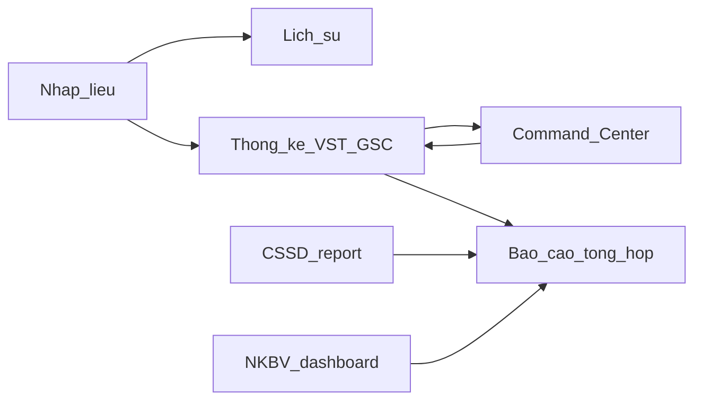

# Scorecard giám sát chiều dọc + thống nhất bộ lọc (2026-08-03)

> **Loại:** báo cáo / contract.  
> **Trạng thái wave:** AN-GAP-01a/b · AN-LABEL-01 · FLT-ANALYTICS-01 · FLT-NKBV-01 · FLT-CONTRACT-01 · FLT-SEARCH-01 · FLT-SELECT-01 · FLT-DATE-01 — **Done code+doc 2026-08-03**.  
> **Đối tượng:** PO.  
> **Tham chiếu:** [`metric-dictionary.md`](../../modules/dashboard/metric-dictionary.md) · [`system-audit-a1-a5-20260731.md`](./system-audit-a1-a5-20260731.md) §A5 · [`open-backlog-20260731.md`](../architecture/open-backlog-20260731.md) · [`page-chrome-contract-20260731.md`](../architecture/page-chrome-contract-20260731.md) · [`giam-sat/README.md`](../../modules/giam-sat/README.md)

---

## 1. Tóm tắt PO

Chuỗi **nhập liệu giám sát → lịch sử → thống kê chuyên sâu → Command Center → báo cáo lãnh đạo** đã đủ tầng và dùng chung RPC strategic VST/GSC; KPI bề mặt là **% VST** và **% GSC** (CCS không còn trên màn điều hành). Thống kê mô tả (4 trụ, so kỳ, hàng đợi quyết định, cầu QLCV) và unify chrome analytics **đã xong**.

Hai khoảng trống còn lại:

1. **Khoa học / đúng nhãn** — Top 10 A5: dictionary thiếu vài công thức, nhãn rút gọn lệch SSOT, CLABSI thiếu mẫu số, seed mục tiêu còn khóa `ty_le_ccs`.
2. **Bộ lọc / tìm kiếm** — VST/GSC/CC/BCTH đã thống nhất `AnalyticsFilterBar`; CSSD report, NKBV dashboard, danh sách Ops (MDM/QLCV/NS) vẫn lệch UI và/hoặc URL — **chưa có SSOT filter project-wide**.

**Khuyến nghị:** làm P0 (dictionary + nhãn) trước; P1 (filter analytics lệch); P2 (search/select Ops). Mỗi ID = một chat implement. Không gộp NKBV vào CCS; không bịa công thức CLABSI; không pre-agg bảng mới không đo.

---

## 2. Chuỗi chiều dọc (baseline)

| Tầng | Route | Vai trò |
|------|-------|---------|
| Nhập liệu | `/giam-sat`, `/giam-sat-vst`, `/giam-sat-chung*`, `/giam-sat-nkbv` | Thu thập phiên / ca |
| Lịch sử | `/lich-su/vst`, `/lich-su/gsc` | Tra cứu phiên |
| Thống kê | `/thong-ke/vst`, `/thong-ke/gsc` | Chuyên viên KSNK |
| Điều hành | `/` | Command Center — 4 trụ + hàng đợi |
| Báo cáo | `/bao-cao-tong-hop` | BGĐ / hội đồng — in A4 |
| Phụ lục ops | `/cssd-erp/report` (`/thong-ke/cssd` redirect), tab NKBV | Outcome / CSSD — **không** vào CCS |

**Invariant (không đàm phán):** surface = `ty_le_vst` / `ty_le_gsc`; nguồn strategic RPC; badge «vs kỳ trước» = Δ 2 tuần ISO (trừ BCTH `ky_truoc` calendar riêng); NKBV / TGS bao phủ / CSSD không gộp CCS.

---

## 3. Ma trận chiều dọc (điểm 1–5)

Thang: **5** = ổn pilot · **4** = nhỏ · **3** = lệch đáng kể · **2** = gây hiểu nhầm · **1** = thiếu tầng.

| Mắt xích | KPI / nguồn chính | Bộ lọc hiện tại | Deep-link | Điểm | Gap |
|----------|-------------------|-----------------|-----------|------|-----|
| **Nhập VST/GSC** | Form → fact phiên | Header form / RegistrySelect | QR LOC → GSC; hub `/giam-sat` | **4** | Form OK; import Excel GSC đã gỡ (D-21) |
| **Nhập / dashboard NKBV** | Aggregate module NKBV | Date + `<select>` khoa **trong body** (`NkbvDashboardPanel`) | `?tab=dashboard&tu=&den=&khoa=` (khác seed analytics) | **3** | Filter không slot chrome; URL lệch `tu_ngay`/`khoa_ids` |
| **Lịch sử VST/GSC** | Danh sách phiên | `AdvancedDataTable` search trong bảng | `?edit=` về form | **4** | Dialect search khác MDM/QLCV |
| **Thống kê VST** | `rpc_dashboard_vst_strategic_analytics` | `AnalyticsFilterBar` + URL sync | `buildAnalyticsDeepLink` → `/thong-ke/vst` | **5** | Baseline giữ |
| **Thống kê GSC** | GSC strategic + BK detail + TGS hits | Cùng bar; `?bk` / `?view` / `?loai` | Deep link BK + loai từ form | **5** | Baseline giữ |
| **Command Center `/`** | Brief 4 trụ + `decision-queue` | `AnalyticsFilterBar` `brief` + scope khóa khoa | Deep → `/thong-ke/*`, QLCV, CSSD | **4** | Nhãn A5 (CCS doc / PDCA / Management Control) |
| **Báo cáo tổng hợp** | Compose VST+GSC+NKBV+CSSD appendix | `AnalyticsFilterBar` `compact` | Deep sang thống kê | **4** | AN-GAP nhãn CSSD/NKBV/CLABSI; score UI ~3.7 |
| **CSSD report** | `cssd-metrics` / report actions | `ReportFilters.tsx` (native select, height riêng) | `/thong-ke/cssd` → report (`from`/`to`) | **3** | Họ filter khác analytics; P1 adapter |

**Điểm trung bình chuỗi Giám sát→BCTH:** ~**4.1** (đủ dùng pilot).  
**Điểm filter project-wide (kể Ops):** ~**3.0** — cần wave FLT-\*.

---

## 4. Metric readiness (A5 Top 10)

| # | Mục | Status hiện tại | Quyết định scorecard | Wave ID |
|---|-----|-----------------|----------------------|---------|
| 1 | BCTH «Không sự cố» | Ambiguous | **UI label** → đầy đủ khớp `ty_le_quy_trinh_khong_su_co` | AN-LABEL-01 |
| 2 | `ti_le_xac_nhan_nkbv` | Missing | **Doc-only** thêm công thức vào metric-dictionary (không đổi app logic nếu đã tính đúng) | AN-GAP-01a |
| 3 | CLABSI /1k Trụ D | Missing | **Ẩn metric** đến khi có mẫu số (catheter-day / patient-day) — **không bịa Rate** | AN-GAP-01b |
| 4 | «Cấp phát kỳ» | Ambiguous | **Doc + UI alias** → `san_luong_cap_phat` | AN-GAP-01a + AN-LABEL-01 |
| 5 | `so_bo_danh_muc` | Missing | **Doc-only** entry dictionary | AN-GAP-01a |
| 6 | «Trạm tốt nhất» / error-rate | Missing | **Doc-only** định nghĩa ranking (sau mới code nếu PO chọn) | AN-GAP-01a |
| 7 | Đỏ / đóng băng (Mgmt Control) | Missing | **Doc-only** khóa nhãn trong dictionary § Management Control | AN-GAP-01a |
| 8 | Seed mục tiêu `ty_le_ccs` | Ambiguous | **Spec change seed**: ưu tiên key `ty_le_vst` / `ty_le_gsc`; `ty_le_ccs` chỉ compat đọc cũ | AN-GAP-01a |
| 9 | Trụ A + brief còn nhắc CCS | Ambiguous | **Doc-only** Trụ A = VST%·GSC% | AN-GAP-01a |
| 10 | PDCA `chi_so` thô | Ambiguous | **UI label map** khóa chỉ số → tiếng Việt nghiệp vụ | AN-LABEL-01 |

**Ổn sẵn (không mở lại):** `ty_le_vst` / `ty_le_gsc`, delta 2 tuần ISO, `ky_truoc`, tên đầy đủ `ty_le_quy_trinh_khong_su_co` trong dictionary, mẻ/QC/máy CSSD.

### Đề xuất thống kê / báo cáo khoa học hơn (ngoài A5, không ship lần này)

| Ý tưởng | Lý do | Rủi ro / điều kiện |
|---------|-------|-------------------|
| Tách rõ «Δ 2 tuần ISO» vs «vs kỳ trước calendar» trên mọi badge | Tránh hiểu nhầm xu hướng | Chỉ copy/UI — đã có trong dictionary |
| Bảng loại trừ comparable TGS×KSNK luôn hiện cạnh gap | Khoa học đối soát | Đã có rule; kiểm UX |
| Không xếp hạng theo `ty_le_avg` / CCS | Tránh trung bình méo | Khóa surface |
| CLABSI / outcome chỉ khi có mẫu số từ HIS hoặc nhập tay chu kỳ | Rate chuẩn | Wave 4 / hợp đồng viện — **không** pilot-only giả |
| Hạn chế pre-agg | Đúng kỷ luật Smart DB | Chỉ khi đo latency cụ thể |

---

## 5. Filter & Search contract (north-star)

> Sau khi PO **Go** wave FLT-CONTRACT-01, contract này là SSOT; lệch mới = bug.

### 5.1 Analytics (kỳ + phạm vi)

| Luật | Chi tiết |
|------|----------|
| **Một bar** | Chỉ `AnalyticsFilterBar` (= `DashboardFilterPanel`) trong slot **Filters** của `KsnkPageChrome` / portal `/thong-ke` |
| **URL seed** | `tu_ngay`, `den_ngay`, `khoa_ids` (comma UUID). Giữ `bk` / `view` / `loai` trên GSC |
| **Control height** | `bv103-control-h` / analytics **`h-9`** |
| **Khoa** | `SearchableMultiSelect`; empty / chọn hết = không gửi ID (`effectiveFilterIds`) |
| **CSSD report** | Thin **adapter**: cùng bar + thêm control «Trạm»; bỏ native select + height `h-11`/`h-14` lệch |
| **NKBV dashboard** | Migrate filter vào slot chrome; URL chuẩn analytics; alias legacy `tu`/`den`/`khoa` đọc tạm rồi normalize |

**Variant policy:** CC = `brief`; BCTH / VST / GSC thống kê = `compact` (advanced collapse); không invent variant thứ 4.

### 5.2 Ops danh sách (tìm kiếm)

| Luật | Chi tiết |
|------|----------|
| **Một dialect** | Ô tìm **trong** `AdvancedDataTable` (`searchValue` / `onSearch`) |
| **Cấm** | `SearchBar` ngoài + `hideSearch` trên cùng trang (MDM Generic DM, QLCV, hub danh mục — migrate P2) |
| **`searchPlacement="header"`** | Hiện **không có consumer** → **deprecate / bỏ API** trong FLT-SEARCH-01 (không half-rollout) |
| **Ngoại lệ** | Màn không dùng ADT (Kanban thuần, form-only) — SearchBar standalone được phép, ghi rõ |

### 5.3 Entity picker

| Luật | Chi tiết |
|------|----------|
| Danh mục **> ~8** option | Bắt buộc `SearchableSelect` / `RegistrySelect` searchable |
| ≤ 8 cố định | Chip / `choiceBtn` hoặc native select ngắn OK |
| Cấm | Native `<select>` cho khoa / NS / danh mục dài |

### 5.4 Date range

Một token height với analytics (`h-9` / `bv103-control-h`). P2 có thể tách primitive `DateRangeField` dùng chung — **không** yêu cầu library mới nếu token + class đủ.

### 5.5 Ngoài contract (có chủ đích)

| Vùng | Ghi chú |
|------|---------|
| Form giám sát header | RegistrySelect / date form — picker nghiệp vụ, không bar analytics |
| Micro-sort chart | Select nhỏ trong chart panel — chấp nhận tạm; chuẩn hóa height khi đụng file |
| Đào tạo admin list ngắn | Chưa bắt buộc SearchBar; khi bank lớn → áp 5.2 |

---

## 6. Lộ trình P0 / P1 / P2

Mỗi dòng = **1 chat** `/intake-nv` → duyệt → `/implement`.

### P0 — Khoa học & đúng nhãn

| ID | Việc | Verify gợi ý | Files dự kiến |
|----|------|--------------|---------------|
| **AN-GAP-01a** | Cập nhật `metric-dictionary`: mục 2,4,5,6,7,8,9; seed mục tiêu ưu tiên VST/GSC | Review doc + (nếu đụng seed) migrate/seed check | `metric-dictionary.md`; seed KPI nếu đổi key |
| **AN-GAP-01b** | CLABSI: ẩn Trụ D / BCTH đến khi có mẫu số; ghi rõ trong dictionary | UI không còn số /1k giả | CC / BCTH pillar D components + dictionary |
| **AN-LABEL-01** | Nhãn BCTH/CC: không sự cố đầy đủ; alias cấp phát; map PDCA `chi_so` | 3 case tay §7 | `bao-cao-tong-hop*`, command-center labels |

### P1 — Thống nhất filter analytics lệch

| ID | Việc | Verify gợi ý | Files dự kiến |
|----|------|--------------|---------------|
| **FLT-ANALYTICS-01** | CSSD `ReportFilters` → adapter trên `AnalyticsFilterBar` (+ trạm) | Kỳ+trạm lọc đúng; height h-9 | `ReportFilters.tsx`, `CSSDReportPage.tsx` |
| **FLT-NKBV-01** | NKBV dashboard → slot chrome + URL `tu_ngay`/`den_ngay`/`khoa_ids` (+ alias legacy) | Deep link BCTH → NKBV giữ kỳ | `NkbvDashboardPanel`, `GiamSatNkbvPage`, deep-link helpers |
| **FLT-CONTRACT-01** | Gắn §5 vào page-chrome / dialect (+ checklist); đóng AN-GAP-01 khi a/b/label xong | Doc sync; mở backlog Done/partial | `page-chrome-contract`, `open-backlog`, optional dialect matrix |

### P2 — Ops list + picker toàn project

| ID | Việc | Verify gợi ý | Files dự kiến |
|----|------|--------------|---------------|
| **FLT-SEARCH-01** | ADT search một placement; migrate MDM/QLCV/NS; deprecate header portal search | Cùng cảm giác tìm trên list | `AdvancedDataTable`, Generic DM, QLCV, NhanSu |
| **FLT-SELECT-01** | Native select danh mục dài → Searchable* | Khoa/NS tìm được bằng gõ chữ | NKBV list, CSSD sheets, charts nếu đụng |
| **FLT-DATE-01** | Token / primitive DateRange dùng chung | Đồng height mọi kỳ lọc | Shared date control; CSSD+NKBV đã P1 |

### Ngoài wave (giữ nguyên backlog hiện có)

- **UAT-NKBV** / **UAT-REFORM** — P1 vận hành ký tay (không lẫn FLT).
- **OPS-DB-01** — parity live khi bật DB local.
- P×I×S risk — chỉ feasibility; HIS/LIS — Wave 4 khóa.

---

## 7. Case kiểm tay (theo wave)

### Sau AN-GAP-01a / AN-LABEL-01 / AN-GAP-01b

1. Mở `/bao-cao-tong-hop` — nhãn KPI CSSD / NKBV khớp dictionary; **không** thấy CLABSI /1k nếu chưa có mẫu số.  
2. Command Center Trụ A — chỉ VST% · GSC%; không nhãn CCS cho người dùng.  
3. Tạo việc từ analytics (PDCA) — `chi_so` hiện tên nghiệp vụ trên can thiệp mở (không raw key khó đọc).

### Sau FLT-ANALYTICS-01

1. `/cssd-erp/report` — đổi kỳ + trạm → số liệu đổi; control cao bằng analytics (`h-9`).  
2. Redirect `/thong-ke/cssd?from=&to=` vẫn seed được kỳ.  
3. So cạnh `/thong-ke/vst` — cùng “họ” filter (multi khoa / date), trừ control trạm.

### Sau FLT-NKBV-01

1. `/giam-sat-nkbv?tab=dashboard&tu_ngay=&den_ngay=&khoa_ids=` — filter trên chrome, payload đúng kỳ.  
2. Alias cũ `tu`/`den`/`khoa` vẫn mở được (một lần normalize).  
3. Deep link từ BCTH sang NKBV — giữ kỳ đã lọc.

### Sau FLT-SEARCH-01 / FLT-SELECT-01 (Ops)

1. Một trang MDM danh mục — chỉ **một** ô tìm (trong ADT).  
2. QLCV — search không double với `hideSearch` + SearchBar ngoài.  
3. Chọn khoa (>8) trên màn đã migrate — gõ được trong SearchableSelect.

---

## 8. Go / No-go từng wave (PO)

| Wave | Go nghĩa là | No-go nếu |
|------|-------------|-----------|
| **AN-GAP-01a** | Duyệt cập nhật dictionary + seed key mục tiêu | Đổi công thức `ty_le_vst`/`gsc` / gộp NKBV vào CCS |
| **AN-GAP-01b** | Duyệt **ẩn** CLABSI đến khi có mẫu số | Buộc hiện /1k không mẫu số |
| **AN-LABEL-01** | Duyệt đổi nhãn UI khớp dictionary | Đổi ý nghĩa số (chỉ nhãn) |
| **FLT-ANALYTICS-01** | Duyệt CSSD report dùng họ AnalyticsFilterBar | Giữ hai họ filter “vì quen” mà không adapter |
| **FLT-NKBV-01** | Duyệt URL chuẩn analytics cho NKBV | Giữ vĩnh viễn `tu`/`den` không alias |
| **FLT-CONTRACT-01** | Duyệt §5 thành SSOT chrome | Scope lan sang redesign Auth/HIS |
| **FLT-SEARCH-01** | Duyệt search trong ADT toàn Ops list nóng | Rewrite Kanban / form giám sát |
| **FLT-SELECT-01** | Duyệt Searchable* cho danh mục dài | Ép mọi native select ≤8 option |
| **FLT-DATE-01** | Duyệt token height / primitive chung | Thêm thư viện date nặng không cần thiết |

**Khuyến nghị thứ tự chat:** `AN-GAP-01a` → `AN-GAP-01b` → `AN-LABEL-01` → `FLT-ANALYTICS-01` → `FLT-NKBV-01` → `FLT-CONTRACT-01` → P2.

---

## 9. Liên kết

| Doc | Vai trò |
|-----|---------|
| [`open-backlog-20260731.md`](../architecture/open-backlog-20260731.md) | ID AN-\* / FLT-\* đăng ký |
| [`ui-consistency-scorecard-20260731.md`](./ui-consistency-scorecard-20260731.md) | Chrome/dialect đã Done — **không** thay scorecard filter này |
| [`descriptive-analytics-roadmap-20260729.md`](../../modules/dashboard/descriptive-analytics-roadmap-20260729.md) | Phases 0–6 Done — nền tảng số |
| [`dashboard-ux-audit-20260717.md`](../../modules/dashboard/dashboard-ux-audit-20260717.md) | UX P0/P1 lịch sử |

**Bằng chứng code (đường dẫn):**

- `src/modules/dashboard/components/DashboardFilterPanel.tsx` · `src/components/shared/AnalyticsFilterBar.tsx`
- `src/lib/analytics/use-analytics-filters.ts` · `filter-helpers.ts` · `supervision-deep-link.ts`
- `src/modules/cssd-erp/components/report/ReportFilters.tsx`
- `src/modules/giam-sat-nkbv/components/NkbvDashboardPanel.tsx`
- `src/components/shared/AdvancedDataTable.tsx` · `SearchBar.tsx` · `SearchableSelect.tsx`
