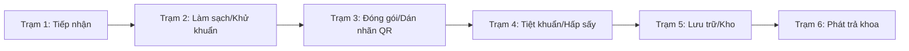

# ĐẶC TẢ NGHIỆP VỤ Y TẾ THỐNG NHẤT — KSNK BV103

> **Phiên bản:** 1.0 (20/05/2026)  
> **Trạng thái:** Hoạt động (SSOT Nghiệp vụ Bounded Context)  
> **Được hợp nhất từ:** Các spec nghiệp vụ cũ (`01-*` đến `09-*` trong `docs/specs/working/`).

---

## 1. Từ điển Thuật ngữ Nghiệp vụ Y tế (Ubiquitous Language)

Để đảm bảo tính thống nhất ngôn ngữ giữa nhân viên y tế (bác sĩ, điều dưỡng khoa KSNK) và đội ngũ phát triển (Dev, AI), hệ thống định nghĩa các thuật ngữ chuẩn sau:

| Thuật ngữ Spec | Ý nghĩa Nghiệp vụ Y tế | Bảng/Thực thể runtime | Ghi chú |
| :--- | :--- | :--- | :--- |
| **VST (Vệ sinh tay)** | Giám sát tuân thủ 5 thời điểm vệ sinh tay của WHO. | `fact_giam_sat_vst_sessions` | Có phân biệt hình thức giám sát (chủ động/chéo). |
| **GSC (Giám sát chung)** | Giám sát tuân thủ theo các checklist động (bảng kiểm y tế). | `fact_giam_sat_chung_sessions` | Ánh xạ qua danh mục bảng kiểm `dm_bang_kiem`. |
| **NKBV (Nhiễm khuẩn BV)** | Giám sát và ghi nhận ca bệnh nhiễm khuẩn bệnh viện (HAI). | `giam_sat_nkbv_ca` | Hiện tại chạy mức MVP nhập liệu lâm sàng. |
| **CSSD (Tái xử lý dụng cụ)** | Quy trình tiệt khuẩn, hấp sấy dụng cụ y tế tập trung tại viện. | `fact_quy_trinh` | Quản lý vòng đời dụng cụ qua nhãn QR. |
| **Mẻ Tiệt Khuẩn** | Một chu trình hấp sấy y tế khép kín bằng thiết bị chuyên dụng. | `fact_lo_tiet_khuan` | Bắt buộc kiểm tra chỉ thị hóa học/sinh học (QC). |
| **QLCV (Quản lý công việc)** | Hệ thống quản lý công việc nội bộ của khoa KSNK. | `fact_cong_viec` | Chạy theo Track B (quy trình 7 trạng thái). |

---

## 2. Các Hành trình Nghiệp vụ (Clinical Journeys)

### 2.1 Giám sát Vệ sinh tay (VST - WHO 5 Moments)
* **Đối tượng giám sát:** Nhân viên y tế (Bác sĩ, Điều dưỡng, Hộ lý, Học viên) tại các khoa lâm sàng.
* **Thời điểm giám sát (WHO 5 Moments):**
  1. Trước khi tiếp xúc người bệnh (T1).
  2. Trước khi làm thủ thuật vô khuẩn (T2).
  3. Sau khi tiếp xúc với dịch tiết cơ thể (T3).
  4. Sau khi tiếp xúc người bệnh (T4).
  5. Sau khi tiếp xúc vật dụng xung quanh người bệnh (T5).
* **Luồng dữ liệu:** Người giám sát tạo phiên → Chọn khoa phòng → Ghi nhận các lượt quan sát (đối tượng, thời điểm, cơ hội tuân thủ, hành động: Rửa tay/Sát khuẩn/Không tuân thủ/Mang găng) → Kết thúc và đồng bộ lên Dashboard chỉ huy KSNK.

### 2.2 Quy trình Tái xử lý Dụng cụ y tế (CSSD Workflow)
Quy trình CSSD là xương sống trong kiểm soát nhiễm khuẩn phòng mổ và thủ thuật, bao gồm 6 trạm vật lý nghiêm ngặt:

* **Trạm 3 (Dán nhãn):** Bộ dụng cụ được kiểm tra, dán nhãn định danh QR duy nhất (`fact_quy_trinh.ma_vach_set`).
* **Trạm 4 (Tiệt khuẩn):** Xếp các bộ vào lò hấp (`fact_lo_tiet_khuan`). Chỉ lò đạt tiêu chuẩn kiểm định vật lý/hóa học (QC Pass) mới cho phép xuất lò. Nếu QC Fail, toàn bộ bộ dụng cụ trong mẻ bị tự động khóa trạng thái (Incident Trigger) và yêu cầu làm sạch lại từ Trạm 1.
* **Xử lý sự cố (Incident Rollback):** Các sự cố rách bao gói, dụng cụ ẩm ướt hoặc rơi vỡ sẽ được ghi nhận tại `fact_su_co` và kích hoạt domino rollback trạng thái để tái xử lý dụng cụ an toàn.

### 2.3 Quản lý Công việc Nội bộ Khoa KSNK (Track B Workflow)
Quản lý công việc vận hành theo quy trình kiểm duyệt chất lượng cao (RACI):
* **Quy trình trạng thái:** `MOI` (Mới) → `DANG_LAM` (Đang làm) → `CHO_DUYET` (Chờ duyệt) → `HOAN_THANH` (Hoàn thành) / `TU_CHOI` (Từ chối) / `QUA_HAN` (Quá hạn) / `DA_HUY` (Đã hủy).
* **Spawn việc định kỳ:** Các mẫu việc định kỳ (`fact_cong_viec_dinh_ky`) sẽ tự động được spawn thành các instance công việc cụ thể hàng ngày/hàng tuần thông qua RPC y tế `fn_fact_cong_viec_spawn_dinh_ky_hom_nay()`.
* **Đóng việc:** Nhân viên y tế báo cáo tiến độ đạt 100% → Trạng thái chuyển sang `CHO_DUYET`. Chỉ khi người giao việc (hoặc lãnh đạo khoa) phê duyệt, công việc mới chính thức khép lại ở trạng thái `HOAN_THANH`.

---

## 3. Ranh giới Hệ thống & Chiến lược Tích hợp

### 3.1 Tích hợp HIS/LIS và Định dạng Dữ liệu Y tế (FHIR Standard)
Mặc dù phân hệ Giám sát NKBV (HAI) hiện tại hoạt động ở mức MVP nhập liệu thủ công lâm sàng, kiến trúc dữ liệu của BV103 được thiết kế hướng tới việc tích hợp sâu rộng trong tương lai:
* **Mã hóa lâm sàng (Terminology mapping):** Các trường chẩn đoán ca bệnh nhiễm khuẩn sẽ được map theo chuẩn phân loại bệnh quốc tế **ICD-10** và mã chuẩn xét nghiệm **LOINC** trong LIS.
* **Khả năng FHIR Ready:** Cấu trúc dữ liệu của bảng `giam_sat_nkbv_ca` được chuẩn bị sẵn các trường định danh tương thích với các Resource FHIR tiêu chuẩn:
  * `Patient` (Ánh xạ thông tin bệnh nhân từ HIS).
  * `Encounter` (Lượt điều trị nội trú/ngoại trú).
  * `Observation` (Các kết quả xét nghiệm vi sinh từ LIS).

### 3.2 Cơ chế Đồng bộ Master Data (MDM)
Hệ thống quản lý dữ liệu danh mục lõi tập trung (Master Data Management - MDM) bao gồm:
* Danh mục khoa phòng bệnh viện (`dm_khoa_phong`) đồng bộ từ danh mục dùng chung của Bệnh viện 103.
* Danh mục nhân sự y tế (`mdm_nhan_su`) liên kết trực tiếp với tài khoản người dùng (`auth.users`).
* Mọi thay đổi dữ liệu danh mục bắt buộc phải đi qua cơ chế kiểm duyệt và lưu vết audit log để đảm bảo tính pháp lý của dữ liệu y tế.
